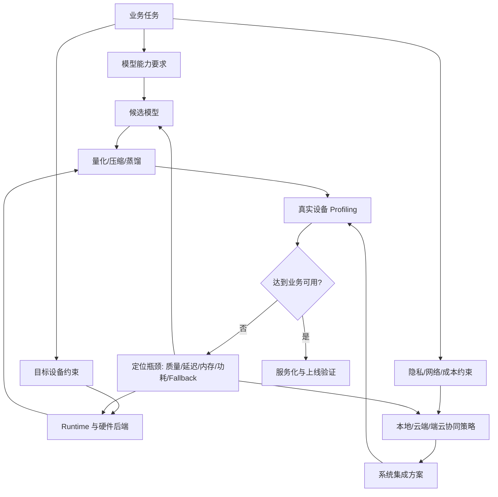
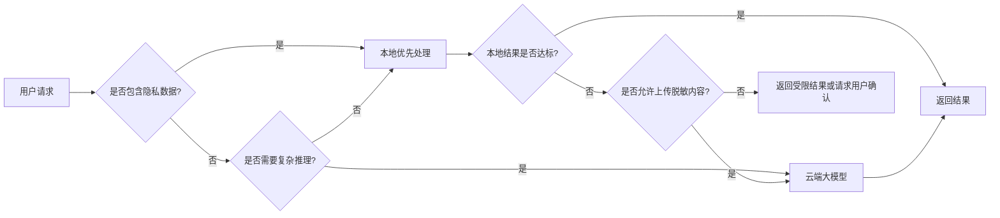

# 端侧部署问题框架

## 建议学时

4 学时。

建议拆成四段：

| 时段 | 内容 | 课堂产出 |
| --- | --- | --- |
| 第 1 学时 | 端侧部署场景、约束和指标 | 端侧任务描述表 |
| 第 2 学时 | 模型、runtime、硬件、网络的联合决策 | 部署决策矩阵 |
| 第 3 学时 | Ubuntu Server、Jetson 与端云协同差异 | 硬件路径选择说明 |
| 第 4 学时 | 项目评估讨论和失败模式复盘 | 项目立项评审清单 |

## 学习目标

- 建立端侧 AI 部署的整体判断框架。
- 区分模型能力、设备资源、runtime、功耗散热、网络环境和产品体验之间的约束关系。
- 明确量化、压缩、蒸馏、推理加速和 runtime 选型分别解决什么问题。
- 能把 Ubuntu Server 和 Jetson 放到同一套评估语言里讨论。
- 能解释什么时候应该本地推理、什么时候应该端云协同、什么时候应该放弃端侧方案。
- 为后续 Qwen 小模型、llama.cpp、Jetson 和服务化实验建立统一的指标表。

## 问题背景

端侧推理重新受到重视，不只是因为设备算力提升。更直接的原因是云端推理在隐私、延迟、弱网、成本和个性化体验上存在天然限制。

手机、PC、车载、IoT、工业终端、摄像头、机器人和边缘网关等场景，都要求模型在受限资源内稳定工作。端侧部署不是把云端模型直接搬到设备上运行，而是要先定义“业务可用”的边界：准确性够不够、首 token 是否能接受、tokens/s 是否稳定、内存峰值是否越界、连续运行是否降频、失败时能否恢复。

本课程把端侧部署看成一个系统决策问题，而不是一个单点优化问题。量化可以让模型更小，推理加速可以让执行更快，runtime 可以让硬件能力被调用起来，端云协同可以把不同风险和不同负载分配到合适的位置。只有这些决策组合起来，端侧模型才可能进入真实产品。

## 端侧部署的核心问题

端侧部署首先要回答四个问题：

1. 任务是否必须在端侧完成。
2. 目标设备是否能承载模型和上下文。
3. 本地推理的体验是否优于云端或端云协同。
4. 部署链路是否能被长期维护。

很多失败项目不是因为模型完全不能跑，而是因为没有把这些问题在立项阶段说清楚。

| 问题 | 典型错误 | 正确做法 |
| --- | --- | --- |
| 为什么要端侧 | 只说“保护隐私”或“降低成本” | 写清楚隐私、延迟、弱网、成本、离线能力中的哪一项是硬约束 |
| 跑什么模型 | 直接选择最大的开源模型 | 先定义任务、上下文长度、输出格式和质量阈值 |
| 跑在哪 | 用开发机结果代表目标设备 | 分开记录 Ubuntu Server、Jetson、移动端或工业设备结果 |
| 怎么评价 | 只看一次 demo 是否成功 | 建立质量、延迟、内存、功耗、稳定性和失败样例记录 |
| 怎么上线 | 把命令行实验直接当服务 | 增加 API、日志、重启、限流、fallback 和版本管理 |

## 图示讲解

端侧部署的第一张图应该是“决策闭环”，不是模型结构图。



端侧部署的第二张图是“本地、云端、端云协同”的路由图。



## 指标体系

端侧指标要同时覆盖模型质量和系统可用性。任何单一指标都不足以支撑部署决策。

| 维度 | 需要回答的问题 | 常见记录项 |
| --- | --- | --- |
| 任务能力 | 模型是否完成核心任务 | accuracy、F1、人工评分、格式正确率、失败样例 |
| 交互体验 | 用户是否觉得可用 | 首 token 延迟、端到端延迟、tokens/s、卡顿点 |
| 资源占用 | 设备是否承受得住 | 模型文件大小、RAM/VRAM 峰值、KV Cache、磁盘占用 |
| 稳定性 | 连续运行是否退化 | 温度、功耗、降频、崩溃、重启、错误率 |
| 工程成本 | 是否能维护和发布 | runtime 复杂度、依赖大小、许可证、更新方式 |
| 安全边界 | 是否会越权或泄露 | 本地数据范围、工具权限、日志脱敏、云端 fallback 规则 |

课程中的所有实验都不编造 benchmark 数字。学习者需要在自己的设备上填写这些表，并解释差异来自哪里。

## 任务分型

端侧部署的决策首先由任务类型决定。

| 任务类型 | 常见端侧形态 | 核心约束 | 适合的第一步实验 |
| --- | --- | --- | --- |
| 传统视觉 | 检测、分类、分割、OCR 前处理 | 分辨率、帧率、功耗、摄像头输入 | ONNX/TensorRT/TFLite baseline |
| 小型 LLM | 摘要、改写、问答、结构化抽取 | 内存、KV Cache、首 token、tokens/s | Qwen GGUF + llama.cpp |
| VLM | 图片问答、OCR 理解、场景描述 | 视觉 token、图像分辨率、projector、LLM | 先拆解视觉侧和文本侧瓶颈 |
| Local Agent | 本地文件整理、轻量工具调用 | 权限、状态、失败恢复、输出格式 | 本地 LLM server + 白名单工具 |
| Hybrid Agent | 端侧隐私处理、云端复杂推理 | routing、脱敏、网络、兜底策略 | 本地/云端双路径设计 |

## 部署决策矩阵

立项时可以先填下面这张矩阵。它不是最终报告，而是判断方案是否值得继续投入的第一版依据。

| 决策项 | 选择 | 需要的证据 | 风险 |
| --- | --- | --- | --- |
| 模型规模 | 待填 | 任务样例、质量基线 | 过大导致无法端侧运行 |
| 量化格式 | 待填 | 质量对比、模型大小、runtime 支持 | 低比特不可用或质量下降 |
| Runtime | 待填 | 硬件后端、API、benchmark | fallback 到 CPU 或 kernel 不匹配 |
| 硬件路径 | 待填 | Ubuntu/Jetson/目标设备信息 | 开发机结果不可迁移 |
| 上下文长度 | 待填 | 真实请求长度分布 | KV Cache 超出内存 |
| 服务形态 | 待填 | CLI、HTTP、OpenAI-compatible API | Demo 无法集成到产品 |
| 端云协同 | 待填 | 隐私规则、网络条件、fallback 策略 | 离线场景不可用或隐私风险 |
| 验收阈值 | 待填 | 产品需求、用户体验标准 | 结果无法判断是否达标 |

## Ubuntu Server 与 Jetson 的差异

Ubuntu Server 和 Jetson 都可以运行 NVIDIA 生态工具，但它们在课程中的定位不同。

| 维度 | Ubuntu Server + NVIDIA GPU | Jetson |
| --- | --- | --- |
| 主要价值 | 快速验证、调参、较高算力、便于构建 | 接近真实边缘设备，能观察功耗和热稳定性 |
| 内存形态 | 独立显存常见 | 统一/共享内存更常见 |
| 监控工具 | `nvidia-smi`、Nsight、系统日志 | `tegrastats`、`nvpmodel`、`jetson_clocks` |
| 构建体验 | 依赖安装和编译更宽松 | 存储、内存、架构和版本更敏感 |
| 主要风险 | GPU offload、driver/CUDA、服务化 | 功耗模式、温度、热降频、存储和内存限制 |
| 课程用途 | 建立 baseline，快速比较量化方案 | 验证边缘约束，训练部署判断 |

课程实作会先在 Ubuntu Server 上建立 baseline，再迁移到 Jetson，观察同一模型在不同硬件约束下的表现。Jetson 的目的不是追求最高速度，而是让学习者理解“端侧约束”本身。

## 端云协同决策

端云协同不是妥协，而是端侧系统常见的正式架构。

| 场景 | 本地处理 | 云端处理 | 路由依据 |
| --- | --- | --- | --- |
| 隐私文本摘要 | 脱敏、摘要草稿、格式化 | 复杂润色或长文推理 | 用户授权、文本敏感级别 |
| 工业视觉告警 | 本地检测和初筛 | 历史趋势分析、跨站点诊断 | 网络可用性、误报成本 |
| 车载/机器人交互 | 唤醒、短指令、状态查询 | 复杂规划、多轮解释 | 实时性、风险等级 |
| 本地文件 Agent | 文件索引、摘要、分类 | 复杂推理、知识补全 | 工具权限、数据是否可上传 |

设计端云协同时，必须把 fallback 写清楚：

- 网络断开时能否继续工作。
- 云端失败时本地是否能返回受限结果。
- 本地模型不确定时是否请求用户确认。
- 上传云端前是否需要脱敏、摘要或结构化过滤。

## 代码/命令示例

建立部署档案时，先记录设备和软件栈，而不是直接调模型。

```bash
uname -a
lscpu
free -h
df -h
nvidia-smi
python3 --version
cmake --version
git --version
```

Jetson 上补充：

```bash
cat /etc/nv_tegra_release
tegrastats
sudo nvpmodel -q
sudo jetson_clocks --show
```

推荐把这些输出保存到实验报告，作为解释后续速度、内存和稳定性差异的证据。

## 配套实作

对应实作章节：

- [Ubuntu Server 与 NVIDIA GPU 环境](/docs/lab-ubuntu-nvidia)
- [Jetson 环境与 Qwen 迁移](/docs/lab-jetson-setup)
- [Profiling 与结果记录](/docs/lab-profiling)
- [本地 OpenAI-compatible 服务](/docs/lab-local-service)

本章实作任务是建立“部署基线”：

| 任务 | Ubuntu Server | Jetson |
| --- | --- | --- |
| 设备信息 | OS、CPU、RAM、GPU、driver、CUDA | JetPack、Jetson Linux、内存、功耗模式 |
| 模型来源 | Qwen GGUF 或课程指定模型 | 同一模型或更小模型 |
| Runtime | llama.cpp baseline | llama.cpp / TensorRT 路径评估 |
| 监控 | `nvidia-smi`、日志、benchmark | `tegrastats`、温度、功耗模式 |
| 报告 | baseline 表 | 迁移差异表 |

## 验收结果

完成本章后应得到：

| 产物 | 验收标准 |
| --- | --- |
| 端侧任务描述表 | 能说明任务、输入、输出、质量阈值和实时性要求 |
| 部署决策矩阵 | 能解释模型、量化、runtime、硬件和端云协同选择 |
| 设备信息表 | 能说明后续实验跑在哪台机器上 |
| GPU/Jetson 状态记录 | `nvidia-smi` 或 `tegrastats` 输出可追溯 |
| 风险清单 | 至少覆盖质量、延迟、内存、功耗、温度、许可证和维护 |

## 案例模板

```markdown
## 项目名称

- 任务：
- 目标用户：
- 端侧必要性：
- 输入类型：
- 输出类型：
- 目标设备：
- 网络条件：
- 隐私约束：

## 候选方案

| 方案 | 模型 | 量化 | Runtime | 硬件 | 风险 |
| --- | --- | --- | --- | --- | --- |
| A | 待填 | 待填 | 待填 | 待填 | 待填 |
| B | 待填 | 待填 | 待填 | 待填 | 待填 |

## 验收指标

| 指标 | 阈值 | 测量方法 | 当前结果 |
| --- | --- | --- | --- |
| 质量 | 待填 | 待填 | 待填 |
| 首 token | 待填 | 待填 | 待填 |
| tokens/s | 待填 | 待填 | 待填 |
| 峰值内存 | 待填 | 待填 | 待填 |
| 温度/功耗 | 待填 | 待填 | 待填 |
```

## 复盘问题

- 端侧部署的硬约束是什么，哪些只是优化目标？
- 如果模型质量不够，是换模型、做 QAT、做 prompt 约束，还是改系统架构？
- 如果速度不够，是量化、GPU offload、runtime、batch、上下文长度还是硬件问题？
- 如果 Jetson 上变慢，是否能从功耗模式、温度、内存和 kernel 支持解释？
- 如果必须端云协同，哪些数据可以上传，哪些数据只能留在本地？

## 常见问题

- **只看模型文件大小**：文件变小不代表推理更快，低比特 kernel 和 runtime 支持更关键。
- **只看平均延迟**：交互式 LLM 还要单独看首 token 延迟和 tokens/s。
- **忽略热稳定性**：端侧设备短跑结果可能很好，连续运行后会因温度和功耗限制变慢。
- **混淆开发机与目标设备**：在服务器上跑通不等于 Jetson、车机或嵌入式设备可用。
- **把端云协同当成失败**：真实产品中，本地和云端的分工往往比单一路径更稳定。

## 参考资料

- [40/52 学时教学安排](/docs/course-hours)
- [资料对比与课程取舍](/docs/source-comparison)
- [The Machine Learning Systems Book](https://www.mlsysbook.ai/)
- [MIT 6.5940 TinyML and Efficient Deep Learning Computing](https://hanlab.mit.edu/courses/2024-fall-65940)
- [Ubuntu Server NVIDIA driver guide](https://ubuntu.com/server/docs/how-to/graphics/install-nvidia-drivers/)
- [NVIDIA CUDA Installation Guide for Linux](https://docs.nvidia.com/cuda/cuda-installation-guide-linux/)
- [NVIDIA Jetson documentation](https://docs.nvidia.com/jetson/)
- [NVIDIA Container Toolkit Install Guide](https://docs.nvidia.com/datacenter/cloud-native/container-toolkit/latest/install-guide.html)
