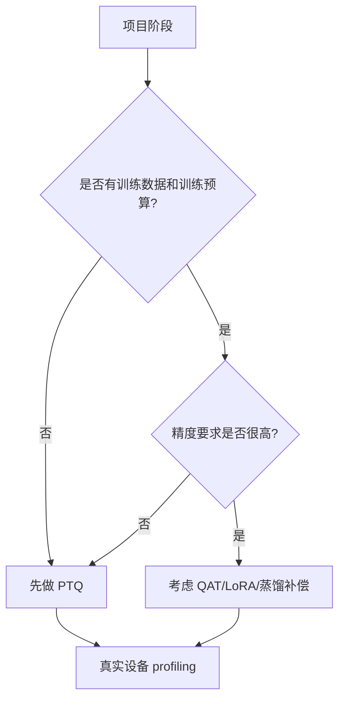

# 量化基础与 PTQ/QAT

## 学习目标

- 掌握权重、激活、KV Cache 等对象为什么可以低精度表示。
- 理解 FP32、FP16、BF16、INT8、INT4、NF4、FP8 的工程差异。
- 区分 per-tensor、per-channel、per-group、symmetric、asymmetric、static、dynamic quantization。
- 判断什么时候优先用 PTQ，什么时候需要 QAT 或后续补偿。

## 问题背景

量化的目标不是“把数字变小”，而是在可接受误差内减少存储、内存带宽和计算压力。传统视觉模型、Transformer、LLM 和 VLM 对量化误差的敏感位置不同，所以同一个 bit-width 在不同模型上可能得到完全不同的效果。

PTQ 适合快速验证和已有模型部署；QAT 在训练过程中模拟量化误差，通常更稳，但需要训练数据、训练资源和更高工程投入。

## 图示讲解




## 核心概念

| 概念 | 解释 | 工程关注点 |
| --- | --- | --- |
| Weight-only | 只量化权重，激活仍保持较高精度 | LLM 常见，文件和显存下降明显 |
| W8A8 | 权重和激活都量化到 8 bit | 需要 runtime/kernel 支持，校准质量重要 |
| Per-channel | 每个输出通道单独 scale | 精度通常更好，metadata 更多 |
| Per-group | 按 group 量化 | LLM 低比特量化常见，group size 影响精度和速度 |
| Static PTQ | 预先用校准集估计激活范围 | 对校准数据分布敏感 |
| Dynamic quantization | 运行时动态估计范围 | 简化校准，但 runtime 开销和支持度要验证 |

## 方法路线

PTQ 和 QAT 可以按项目阶段理解：

| 阶段 | 推荐动作 | 证据来源 |
| --- | --- | --- |
| 快速可行性验证 | 先做 PTQ 或直接使用已有 GGUF/INT8 权重 | 文件大小、首轮质量、基础性能 |
| 质量风险评估 | 构建固定校准集和评估集 | baseline 对比、失败样例 |
| 低 bit 深入优化 | 调整 group size、mixed precision、敏感层策略 | per-layer 或 per-case 误差 |
| 仍不达标 | 考虑 QAT、LoRA、蒸馏或换模型 | 训练预算、数据质量、业务阈值 |

在传统视觉模型中，ONNX Runtime、TensorFlow Lite、TensorRT 等工具链通常会提供 PTQ/QAT 或 INT8 校准流程；在 LLM 中，常见路线更多是 weight-only、AWQ/GPTQ/GGUF 等低比特权重量化，再结合 runtime 支持判断真实收益。

## 代码/命令示例

一个最小的线性量化示意，用来理解 scale 和 clipping，不用于生产部署：

```python
import numpy as np

x = np.array([-1.8, -0.2, 0.0, 0.7, 1.4], dtype=np.float32)
qmin, qmax = -128, 127
scale = max(abs(x.min()), abs(x.max())) / qmax
qx = np.clip(np.round(x / scale), qmin, qmax).astype(np.int8)
x_hat = qx.astype(np.float32) * scale

print("scale:", scale)
print("quantized:", qx)
print("restored:", x_hat)
print("abs error:", np.abs(x - x_hat))
```

## 配套实作

对应实作章节：[Qwen GGUF 量化对比实验](/docs/lab-qwen-quantization)。

实验会把抽象的 bit-width 和 group 策略落到 Qwen GGUF 文件上，观察 Q8、Q5、Q4 等模型变体在文件大小、显存、首 token 和 tokens/s 上的差异。

## 验收结果

| 产物 | 验收标准 |
| --- | --- |
| 量化术语表 | 能解释权重、激活、KV Cache 的量化差异 |
| PTQ/QAT 判断表 | 能说明为什么当前实作优先 PTQ |
| Qwen 量化对比表 | 至少记录 3 个 GGUF 变体的文件大小和运行结果 |

## 常见问题

- **把 bit-width 当成唯一变量**：group size、校准集、kernel 和上下文长度都会影响结果。
- **忽略反量化成本**：量化模型如果在 runtime 内频繁反量化，速度收益可能消失。
- **校准集太随意**：PTQ 的统计范围来自数据，校准样本不代表真实输入时精度风险会放大。
- **QAT 过早介入**：如果还没有稳定 baseline，先做 QAT 往往会掩盖真实问题来源。

## 参考资料

- [PyTorch Quantization](https://pytorch.org/docs/stable/quantization.html)
- [ONNX Runtime Quantization](https://onnxruntime.ai/docs/performance/model-optimizations/quantization.html)
- [TensorFlow Lite post-training quantization](https://www.tensorflow.org/lite/performance/post_training_quantization)
- [Hugging Face Transformers quantization](https://huggingface.co/docs/transformers/quantization/overview)
- [GPTQ: Accurate Post-Training Quantization for Generative Pre-trained Transformers](https://arxiv.org/abs/2210.17323)
- [SmoothQuant: Accurate and Efficient Post-Training Quantization for Large Language Models](https://arxiv.org/abs/2211.10438)
- [LLM.int8(): 8-bit Matrix Multiplication for Transformers at Scale](https://arxiv.org/abs/2208.07339)
