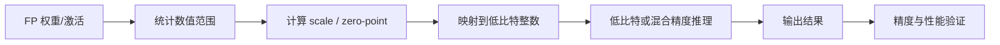
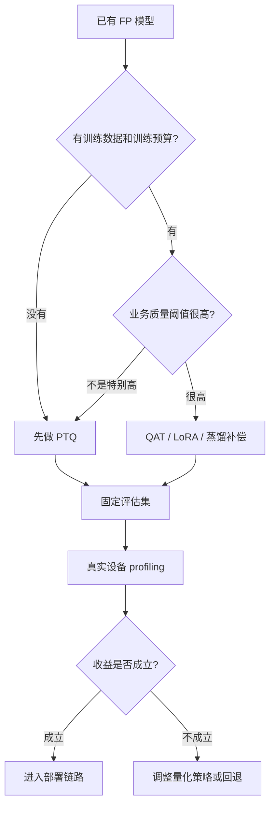
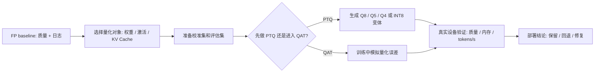

# 量化基础与 PTQ/QAT

## 建议学时

4 学时。

前 2 学时讲量化表示、scale/zero-point、粒度和校准集。

第 3 学时讲 PTQ/QAT 流程、outlier 和工程边界。

第 4 学时结合 Qwen GGUF、Ubuntu Server 和 Jetson 做实验设计。

## 学习目标

- 掌握权重、激活、KV Cache 为什么可以低精度表示，也知道哪些位置不适合盲目低比特。
- 理解 FP32、FP16、BF16、INT8、INT4、NF4、FP8 在训练、推理、文件大小和硬件支持上的差异。
- 区分 per-tensor、per-channel、per-group、symmetric、asymmetric、static、dynamic quantization。
- 能设计一个可复现的校准集，而不是随便抽几条样本。
- 能判断什么时候优先 PTQ，什么时候需要 QAT、混合精度、蒸馏或换模型。
- 能说明量化和推理加速之间的关系：低比特不是自动加速，必须看 runtime 和硬件 kernel。

## 章节定位

本章解决的是“量化到底在改什么”。

后续大模型章节会继续展开 GPTQ、AWQ、SmoothQuant、LLM.int8()、GGUF 和 KV Cache。

精度修复章节会讨论量化后质量下降时如何定位问题。

压缩与蒸馏章节会把量化放进更大的模型压缩体系中。

## 问题背景

端侧部署最常遇到的约束有三类：

- 模型文件太大，无法方便分发或加载。
- 设备内存、显存或统一内存不够。
- 推理延迟、功耗、温度不满足业务要求。

量化的目标不是“把数字变小”。

更准确地说，量化是在可接受误差内，用更少 bit 表示模型计算中的数值，从而降低存储、内存带宽和部分计算压力。

但是量化收益不会自动转化为端到端收益。

如果 runtime 没有低比特 kernel，或者设备把低比特权重先反量化到高精度再计算，速度可能没有明显改善。

如果校准集不代表真实输入，模型质量可能快速下降。

如果业务是长上下文对话，权重量化之后 KV Cache 仍可能成为主要内存压力。

## 图示讲解

量化的基本流程可以抽象为“统计范围、映射、执行、验证”。



PTQ 和 QAT 的选择通常由数据、训练预算和质量要求共同决定。



## 公开资料怎么转成本章内容

PyTorch、ONNX Runtime、TFLite、TensorRT、Transformers、Qwen 和 llama.cpp 的公开资料里都有很有价值的流程图、API 示例和对比表。

本课程不复制这些图表，而是把它们改写成一个部署导向的问题：从 FP baseline 出发，如何决定量化对象、校准样本、PTQ/QAT 路线、低比特变体和真实设备验证。



| 外部资料中的经典内容 | 本章吸收什么 | 课程里的落点 |
| --- | --- | --- |
| PyTorch Quantization | observer、fake quant、PTQ/QAT 生命周期 | 用于解释校准、QAT 和 STE，不逐项讲 API |
| ONNX Runtime Quantization | static/dynamic quantization、`CalibrationDataReader` | 用于把传统模型 PTQ 写成显式校准流程 |
| TFLite Model Optimization | post-training quantization、representative dataset、移动端约束 | 用于说明端侧部署必须同时看格式、设备和输入分布 |
| TensorRT | calibration、precision、engine/kernel 路线 | 用于提醒低精度必须由 runtime 和硬件 kernel 承接 |
| Transformers quantization、Qwen 和 llama.cpp | LLM 量化入口、GGUF、Q8/Q5/Q4 变体 | 收束到同一 Qwen 小模型的固定 prompt 对比 |
| GPTQ、AWQ、SmoothQuant、LLM.int8() | outlier、重要权重、激活敏感性 | 用于解释 PTQ 失败后的修复方向和回退判断 |

所以，本章每个量化决策最后都要产出三样东西：校准/评估集说明、量化变体列表、真实设备证据。

## 数值格式与工程含义

不同精度格式的意义不只是 bit 数不同。

它们还对应不同硬件支持、kernel 实现、累加方式和误差形态。

| 格式 | 常见用途 | 工程关注点 |
| --- | --- | --- |
| FP32 | 训练、基准对照、数值敏感计算 | 最稳但资源占用高 |
| FP16 | GPU 推理和训练常用 | 速度快，动态范围较 FP32 小 |
| BF16 | 训练和部分推理常用 | 动态范围接近 FP32，精度位更少 |
| FP8 | 新一代 GPU/推理框架方向 | 依赖硬件和框架支持，迁移成本高 |
| INT8 | 传统模型和部分 LLM 推理 | 工具链成熟，但激活 outlier 需处理 |
| INT4 | LLM weight-only 常见 | 文件和显存下降明显，质量风险更高 |
| NF4 | 训练/微调生态中常见 | 适合特定分布假设和框架路线 |

课堂中要避免把这些格式当成单纯的大小排序。

一个 INT4 模型在某个 runtime 上可能比 FP16 慢。

一个 INT8 模型如果校准失败，可能比 FP16 明显差。

## 线性量化的基本公式

本课程统一采用 `scale = real_range / integer_range`，与 [公式与符号约定](/docs/math-conventions) 保持一致。

最常见的线性量化可以用三个量理解：

- `scale`：浮点值和整数值之间的比例。
- `zero_point`：浮点零点映射到整数空间的位置。
- `qmin/qmax`：低比特整数能表示的范围。

非对称（affine）量化的映射和反映射是：

$$
q = \mathrm{clamp}\left(\mathrm{round}\left(\frac{x}{s}\right) + z,\; q_{\min},\; q_{\max}\right), \qquad \hat{x} = s\,(q - z)
$$

其中 scale 和 zero-point 由数值范围决定：

$$
s = \frac{x_{\max} - x_{\min}}{q_{\max} - q_{\min}}, \qquad z = \mathrm{round}\left(q_{\min} - \frac{x_{\min}}{s}\right)
$$

对称量化取 $z = 0$，scale 用最大绝对值：

$$
s = \frac{\max|x|}{2^{b-1} - 1}
$$

$b$ 是 bit 数。clipping 范围内，舍入最多把每个值移动半个格点，即 $|x - \hat{x}| \le s/2$。把舍入误差近似看成均匀分布噪声，方差是：

$$
\sigma^2 = \frac{s^2}{12}
$$

这组公式解释了量化的基本矛盾：数值范围（$s$ 的分子）越大，每个格点越粗，所有普通值的噪声方差按 $s^2$ 放大——这正是 outlier 危险的数学原因。

对称量化常用于权重。

它让零点固定在 0 附近，实现简单，很多 kernel 也更友好。

非对称量化常用于激活。

它能更好覆盖偏移分布，但 metadata 和实现复杂度更高。

一个教学用的线性量化示例：

```python
import numpy as np

x = np.array([-1.8, -0.2, 0.0, 0.7, 1.4], dtype=np.float32)
qmin, qmax = -128, 127

scale = max(abs(x.min()), abs(x.max())) / qmax
qx = np.clip(np.round(x / scale), qmin, qmax).astype(np.int8)
x_hat = qx.astype(np.float32) * scale

print("scale:", scale)
print("quantized:", qx)
print("restored:", x_hat)
print("abs error:", np.abs(x - x_hat))
```

这段代码只用于理解概念。

真实部署还要考虑矩阵乘 kernel、累加精度、分组 scale、内存布局和硬件指令。

## 量化粒度

量化粒度决定一个 scale 覆盖多少数值。

覆盖范围越粗，metadata 越少，但误差可能更大。

覆盖范围越细，精度通常更好，但实现和存储开销会上升。

| 粒度 | 含义 | 优点 | 风险 |
| --- | --- | --- | --- |
| Per-tensor | 整个 tensor 共用一组 scale | 简单，metadata 少 | 容易被 outlier 拉大范围 |
| Per-channel | 每个输出通道一组 scale | 常见于卷积/线性层权重量化 | kernel 和格式需支持 |
| Per-group | 每组权重一组 scale | LLM 低比特权重量化常见 | group size 影响质量和速度 |
| Per-token | 每个 token 或动态输入局部估计 | 适合部分激活动态量化 | 运行时开销和实现复杂 |
| Mixed precision | 不同层/模块使用不同精度 | 保护敏感层 | 调参成本高，部署格式更复杂 |

## 静态量化与动态量化

静态量化会在部署前使用校准集统计激活范围。

动态量化会在运行时根据输入计算范围。

| 类型 | 典型对象 | 适合场景 | 注意事项 |
| --- | --- | --- | --- |
| Static PTQ | 权重和激活 | 输入分布稳定、可准备校准集 | 校准集质量决定上限 |
| Dynamic quantization | 激活或部分矩阵乘 | 快速试验、输入变化较大 | 运行时开销需测量 |
| Weight-only | LLM 权重 | 大模型文件和显存压力 | 激活/KV Cache 仍需单独评估 |
| QAT | 权重和激活 | 高质量要求或低 bit 场景 | 需要训练数据、训练时间和稳定 pipeline |

## 方法选择决策树

```text
只是想快速部署？
-> 优先使用现成 GGUF Q8/Q5/Q4。

有校准数据，想做权重量化？
-> 考虑 GPTQ/AWQ。

激活 outlier 明显？
-> 理解 SmoothQuant / LLM.int8。

任务精度下降明显，而且有训练资源？
-> 考虑 QAT 或微调后再量化。

端侧设备内存极小？
-> 先考虑更小模型，不要盲目压到 Q2/Q3。
```

不要做：

- 不要只比较模型文件大小。
- 不要只跑一个 prompt 就判断质量。
- 不要把论文 benchmark 当成自己设备上的结论。
- 不要默认低比特一定更快。

## 校准集设计

校准集不是评估集的替代品。

校准集用于估计量化范围。

评估集用于判断模型是否还能完成任务。

两者可以有重叠，但角色不同。

一个合格校准集应满足以下条件：

- 覆盖真实输入长度，例如短问答、长文档、多轮对话。
- 覆盖真实语言分布，例如中文、英文、代码、表格、术语。
- 覆盖高风险输入，例如极长数字、特殊符号、JSON、Markdown、工具调用格式。
- 保持预处理和部署时一致，例如 tokenizer、chat template、图片缩放、归一化。
- 数量足够稳定，但不追求无限大；重点是代表性和可复现。

校准集记录建议使用 JSONL。

```json
{"id":"calib_001","type":"short_qa","prompt":"用三句话解释端侧模型量化。"}
{"id":"calib_002","type":"json_output","prompt":"输出 JSON，字段包括 method、risk、metric。"}
{"id":"calib_003","type":"long_context","prompt":"阅读以下长文本后总结部署风险：..."}
```

校准集常见问题：

- 只用随机文本，和真实业务没有关系。
- 只覆盖短输入，忽略长上下文和多轮对话。
- 忽略输出格式任务，导致 JSON、表格和工具调用退化。
- 校准时用一种 prompt 模板，部署时换成另一种模板。
- 把评估结果不好直接归因于量化算法，没有先检查校准样本。

## PTQ 工作流

PTQ 适合课程中的第一轮端侧验证。

它不需要重新训练模型，能快速判断模型大小、内存占用和初步质量是否可接受。

推荐流程：

1. 建立 FP16 或原始 GGUF baseline。
2. 固定测试 prompt、采样参数、上下文长度和 runtime 版本。
3. 准备校准集或选择已有量化模型。
4. 生成或下载不同量化变体。
5. 记录文件大小、加载时间、峰值内存、首 token 延迟和 tokens/s。
6. 用固定评估集记录质量退化。
7. 根据失败样例决定是否调整量化格式、group size 或回退精度。

llama.cpp 生态中，已有 GGUF 文件通常是最适合教学的入口。

如果从 FP16 GGUF 自己量化，可以使用类似命令：

```bash
./build/bin/llama-quantize \
  models/qwen/qwen2.5-1.5b-instruct-f16.gguf \
  models/qwen/qwen2.5-1.5b-instruct-q4_k_m.gguf \
  Q4_K_M
```

量化完成后，不要只看文件是否生成。

还要在同一 prompt、同一上下文长度、同一设备上执行对比。

```bash
./build/bin/llama-cli \
  -m models/qwen/qwen2.5-1.5b-instruct-q4_k_m.gguf \
  -p "用三句话解释 PTQ 和 QAT 的区别。" \
  -n 128 \
  --ctx-size 2048 \
  -ngl 99
```

传统模型（CNN、encoder 类）路线常用 ONNX Runtime 的静态量化接口。它的价值在于让“校准集”从概念变成代码里显式存在的对象：

```python
from onnxruntime.quantization import CalibrationDataReader, QuantType, quantize_static

class Reader(CalibrationDataReader):
    def __init__(self, samples):
        self.samples = iter(samples)  # 每条形如 {"input": np.ndarray}

    def get_next(self):
        return next(self.samples, None)

quantize_static(
    "model-fp32.onnx",
    "model-int8.onnx",
    calibration_data_reader=Reader(samples),
    weight_type=QuantType.QInt8,
)
```

校准样本走不到的输入模式，量化范围就没有覆盖——这与上一节校准集设计的要求一一对应。

## QAT 工作流

QAT 会在训练阶段模拟量化误差。

它通常使用 fake quantization：前向传播中模拟低比特量化，反向传播仍借助浮点梯度更新。

fake quantization 的前向传播是：

$$
\tilde{x} = s \cdot \mathrm{clamp}\left(\mathrm{round}\left(\frac{x}{s}\right),\; q_{\min},\; q_{\max}\right)
$$

问题在于 round 的导数几乎处处为 0，梯度无法穿过量化节点。QAT 用 straight-through estimator（STE）近似：反向传播时把 round 当作恒等函数，

$$
\frac{\partial L}{\partial x} \approx \frac{\partial L}{\partial \tilde{x}} \cdot \mathbf{1}_{\,q_{\min} \le x/s \le q_{\max}}
$$

即 clipping 范围内梯度原样通过，范围外梯度为 0。STE 在数学上是一个有偏近似，但它让模型在训练中“带着量化噪声”更新参数。

QAT 的价值在于让模型参数提前适应量化噪声。

但它不适合作为所有项目的默认第一步。

适合考虑 QAT 的场景：

- PTQ 后质量下降稳定且明显。
- 业务有明确的固定任务和高质量阈值。
- 有足够训练数据、验证数据和训练预算。
- 目标 runtime 支持对应量化格式。
- 项目已经完成 baseline、PTQ 和误差定位。

不适合过早使用 QAT 的场景：

- 还没有可靠 FP baseline。
- 数据管线和评估指标不稳定。
- 目标设备上的低比特 kernel 不可用。
- 只是为了追求更低 bit-width，但业务收益不明确。

## Outlier 与 clipping

量化误差经常被 outlier 放大。

如果一个 tensor 中大多数数值集中在很小范围，少数极端值会迫使 scale 覆盖更大区间。

这样大多数普通值被压到更少的整数格点里，误差会增加。

处理 outlier 的常见思路：

- 使用 per-channel 或 per-group 缩小 scale 覆盖范围。
- 对激活使用 percentile clipping，而不是直接使用最大最小值。
- 对敏感层保持更高精度。
- 使用 SmoothQuant 等方法迁移激活 outlier 压力。
- 在 LLM 中用 LLM.int8()、AWQ、GPTQ 等更专门的方法。

clip 阈值的选择可以形式化。给定候选阈值 $t$，把数值截断到 $[-t, t]$ 再做 $b$ bit 量化，总误差由两部分组成：

$$
E(t) = \underbrace{\mathbb{E}\big[(x - \hat{x})^2 \cdot \mathbf{1}_{|x| \le t}\big]}_{\text{舍入误差}} + \underbrace{\mathbb{E}\big[(|x| - t)^2 \cdot \mathbf{1}_{|x| > t}\big]}_{\text{截断误差}}
$$

$t$ 越大，scale 越粗、舍入误差越大，但截断误差越小。MSE 校准就是在候选阈值上最小化 $E(t)$；另一类做法是最小化量化前后分布的 KL 散度（TensorRT 的 entropy calibration）。两类目标都要用校准数据估计分布——这就是“校准集质量”直接进入数学目标的位置。

教学时可以用一个简单检查脚本观察分布：

```python
import numpy as np

x = np.load("activation_sample.npy")
print("min/max:", x.min(), x.max())
print("p99:", np.percentile(x, 99))
print("p99.9:", np.percentile(x, 99.9))
print("mean/std:", x.mean(), x.std())
```

如果 `max` 远大于 `p99.9`，就要警惕 outlier 对 scale 的影响。

下面这个对比实验可以直接运行，观察 max 校准和 percentile 校准的误差差异：

```python
import numpy as np

rng = np.random.default_rng(0)
x = np.concatenate([rng.normal(0.0, 0.1, 100000), [4.0]])  # 主体分布 + 一个 outlier

def quant_mse(x, t):
    s = t / 127
    q = np.clip(np.round(np.clip(x, -t, t) / s), -128, 127)
    return np.mean((x - q * s) ** 2)

t_max = np.abs(x).max()
t_clip = np.percentile(np.abs(x), 99.9)
print("max 校准 MSE:", quant_mse(x, t_max))
print("p99.9 校准 MSE:", quant_mse(x, t_clip))
```

把脚本保存为 `~/edge-ai-lab/quant/calib_compare.py` 运行。改变 outlier 的大小和数量，可以直观看到 clipping 在“牺牲一个值”和“保护整个主体”之间的交换。

## 量化与推理加速的关系

量化可能带来三种收益。

但三种收益不能混为一谈。

| 收益类型 | 表现 | 验证方式 |
| --- | --- | --- |
| 文件压缩 | 模型文件变小 | `ls -lh` 或模型仓库文件大小 |
| 内存下降 | 加载后 RAM/VRAM/统一内存下降 | `nvidia-smi`、`tegrastats`、系统监控 |
| 速度提升 | 首 token 或 tokens/s 改善 | 固定 prompt 和上下文长度的 benchmark |

低比特模型可能只实现第一种收益。

例如某些路径会把 INT4 权重加载后反量化到 FP16 计算。

这时文件变小了，但计算不一定更快。

在 Ubuntu Server 上，需要观察 CUDA offload、GPU kernel 和 VRAM。

在 Jetson 上，还要观察功耗模式、温度、频率和统一内存压力。

## 工程风险清单

| 风险 | 现象 | 排查方法 |
| --- | --- | --- |
| Runtime 不支持 | 模型无法加载或自动 fallback | 查看启动日志和编译选项 |
| Kernel 不匹配 | 文件变小但速度不变 | 对比 CPU/GPU offload 和 tokens/s |
| 校准集不代表真实输入 | 某些任务质量明显退化 | 重构校准集并复测 |
| Tokenizer/template 不一致 | 输出风格异常或拒答增多 | 固定 chat template |
| 低比特过激 | 格式错误、重复、事实性下降 | 回退 Q5/Q8 或 mixed precision |
| 只测单条 prompt | 结果不可复现 | 使用固定评估集和多轮记录 |
| Jetson 温度/功耗限制 | 长时间运行变慢 | 记录 `tegrastats` 和功耗模式 |

## 配套实作

本章对应以下实作：

- [Qwen 基线推理](/docs/lab-qwen-baseline)
- [Qwen GGUF 量化对比实验](/docs/lab-qwen-quantization)
- [推理加速实验](/docs/lab-inference-acceleration)
- [Jetson 环境与 Qwen 迁移](/docs/lab-jetson-setup)
- [Profiling 与结果记录](/docs/lab-profiling)

Ubuntu Server 实作重点：

- 使用同一 Qwen 小模型，比较 Q8、Q5、Q4 等 GGUF 变体。
- 用 `nvidia-smi` 记录 VRAM。
- 用固定 prompt 记录首 token 延迟、tokens/s 和质量备注。

Jetson 实作重点：

- 确认 JetPack、CUDA、llama.cpp CUDA 编译路径。
- 用 `tegrastats` 记录 RAM、GPU、温度和功耗状态。
- 比较同一模型在服务器 GPU 和 Jetson 上的差异。

## 课堂练习

练习 1：校准集审查。

给出一组业务 prompt，让学习者判断它们是否覆盖短问答、长上下文、格式输出和边界输入。

练习 2：PTQ 决策。

给出一个“Q4 速度提升但 JSON 错误率上升”的实验记录，让学习者决定是否回退到 Q5/Q8、修复 prompt、还是进入 QAT/蒸馏。

练习 3：收益拆解。

让学习者把一次量化实验拆成文件大小收益、内存收益、速度收益和质量风险四部分，不允许只写“变快”或“变小”。

## 验收结果

| 产物 | 验收标准 |
| --- | --- |
| 量化术语表 | 能解释权重、激活、KV Cache、scale、zero-point、group size |
| PTQ/QAT 判断表 | 能说明为什么当前实作优先 PTQ，何时才进入 QAT |
| 校准集草案 | 至少覆盖短问答、格式输出、长上下文和领域输入 |
| Qwen 量化对比表 | 至少记录 3 个 GGUF 变体的文件大小、内存、速度和质量备注 |
| Jetson 记录 | 至少包含 `tegrastats` 输出或等价的设备状态记录 |

## 常见问题

**是不是 bit 越低越好？**

不是。低 bit 会降低文件和内存压力，但也可能损害质量，甚至因为 kernel 不支持而没有速度收益。

**PTQ 是不是总比 QAT 差？**

不是。很多部署项目中，PTQ 已经足够。QAT 的优势要用额外训练成本换来，必须有明确质量目标。

**校准集越大越好吗？**

不是。校准集的代表性和可复现性更重要。大量无关文本可能不能改善真实任务表现。

**为什么同一个 Q4 模型在不同机器上速度差很多？**

因为 CPU、GPU、内存带宽、CUDA offload、线程数、功耗模式和 runtime 编译选项都会影响结果。

**量化后质量下降，应该马上蒸馏吗？**

不应该。先确认 baseline、prompt/template、评估集、runtime 和量化格式，再考虑训练式补偿。

## 作业

### 阅读题

1. 阅读 PyTorch Quantization 文档中 QAT 相关部分，说明 observer 和 fake-quant 模块各自的职责。
2. 阅读 ONNX Runtime 量化文档，整理静态量化和动态量化在 API 与适用场景上的差异。

### 检查题

1. 写出对称 INT8 量化的 scale 公式，并解释为什么对称量化常用于权重、非对称量化常用于激活。
2. 一个 tensor 的数值主体在 $[-0.5, 0.5]$，但个别值达到 8.0。用舍入噪声方差 $\sigma^2 = s^2/12$ 估算 max 校准相对“按 0.5 截断校准”把主体噪声方差放大了多少倍。
3. 判断并说明理由：QAT 训练完成后，部署时就不再需要量化 runtime 的支持。

### 实验题

1. 运行本章 max vs percentile 校准对比脚本，改变 outlier 的大小和数量，记录两种校准的 MSE 变化，总结你观察到的规律。
2. 用 `llama-quantize` 从同一份 F16 GGUF 生成 Q4_K_M，在相同 prompt 下对比 Q4 与 F16 的输出质量和速度，把结果填入本章 Qwen 量化对比表。

### 讨论题

1. 校准集和评估集都来自真实业务数据，为什么仍然必须分开维护、分开汇报？
2. STE 在数学上是有偏的梯度近似，为什么 QAT 在实践中仍然有效？

## 参考资料

本章吸收方式：

- **知识点**：从 PyTorch、ONNX Runtime、TFLite、TensorRT、Transformers 和 Qwen/llama.cpp 中提取 PTQ/QAT、校准、量化对象和部署格式。
- **图解**：把框架教程中的流程重画为“原模型 -> 校准/训练 -> 量化模型 -> 部署验证”的课程图。
- **实验**：把外部方法收束到 Qwen GGUF 三组对比、校准集审查和 Jetson 记录。
- **取舍**：不按框架 API 逐项讲解，也不默认低 bit 一定更快。

- [PyTorch Quantization](https://pytorch.org/docs/stable/quantization.html)
- [ONNX Runtime Quantization](https://onnxruntime.ai/docs/performance/model-optimizations/quantization.html)
- [TensorFlow Lite post-training quantization](https://www.tensorflow.org/lite/performance/post_training_quantization)
- [NVIDIA TensorRT Developer Guide](https://docs.nvidia.com/deeplearning/tensorrt/developer-guide/index.html)
- [Hugging Face Transformers quantization](https://huggingface.co/docs/transformers/quantization/overview)
- [Qwen llama.cpp 量化指南](https://qwen.readthedocs.io/en/v2.5/quantization/llama.cpp.html)
- [llama.cpp quantize README](https://github.com/ggml-org/llama.cpp/blob/master/tools/quantize/README.md)
- [GPTQ: Accurate Post-Training Quantization for Generative Pre-trained Transformers](https://arxiv.org/abs/2210.17323)
- [SmoothQuant: Accurate and Efficient Post-Training Quantization for Large Language Models](https://arxiv.org/abs/2211.10438)
- [LLM.int8(): 8-bit Matrix Multiplication for Transformers at Scale](https://arxiv.org/abs/2208.07339)
- [Estimating or Propagating Gradients Through Stochastic Neurons（STE 出处）](https://arxiv.org/abs/1308.3432)
