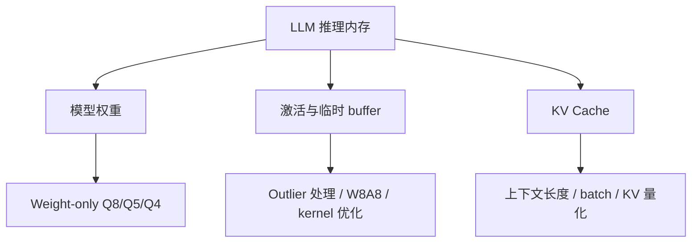
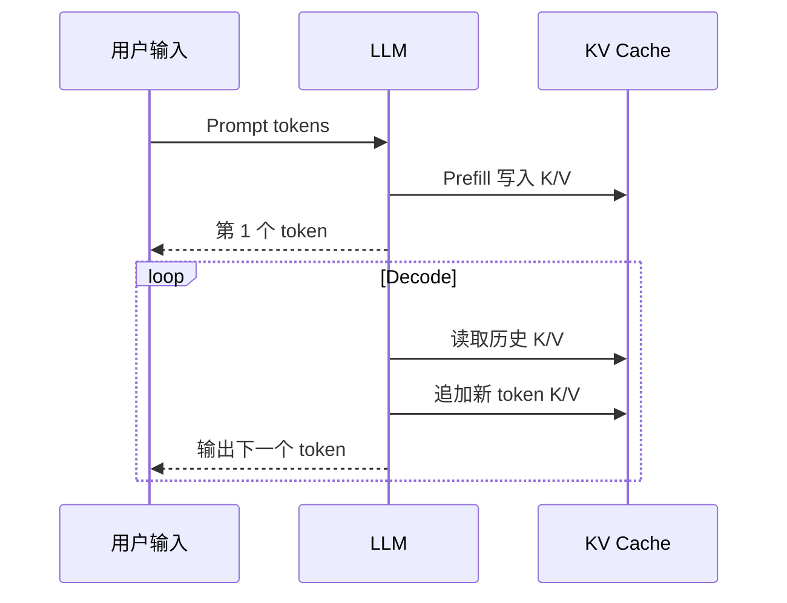
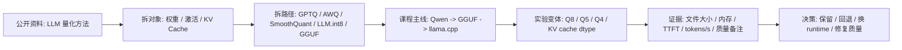

# 大模型量化与 KV Cache

## 建议学时

4 学时。

第 1 学时讲 LLM/VLM 量化和传统 CNN/Transformer 量化的差异。

第 2 学时讲 GPTQ、AWQ、SmoothQuant、LLM.int8() 和 GGUF 量化。

第 3 学时讲 KV Cache、上下文长度、batch/并发和显存增长。

第 4 学时设计 Qwen 小模型在 Ubuntu Server 与 Jetson 上的量化对比实验。

## 学习目标

- 理解 LLM/VLM 为什么不能简单套用传统 INT8 PTQ/QAT 经验。
- 掌握 GPTQ、AWQ、SmoothQuant、LLM.int8()、GGUF 量化的核心思想和适用边界。
- 能解释 weight-only quantization、activation outlier、group size、上下文长度和 runtime 支持之间的关系。
- 能把 KV Cache 和权重显存分开分析，避免只看模型文件大小。
- 能设计 Qwen 小模型的 Q8/Q5/Q4 对比实验，并记录质量、速度、内存和失败样例。
- 能说明 Jetson 统一内存、功耗模式和温度对长上下文推理的影响。

## 章节定位

上一章讲的是通用量化基础。

本章把量化问题收敛到大模型部署。

这里的“大模型”主要指 Transformer decoder LLM，也包括带 vision encoder 和 projector 的 VLM。

课程实作以 Qwen 小模型和 llama.cpp/GGUF 为主，因为这条路线适合在 Ubuntu Server、桌面 GPU 和 Jetson 上做统一实验。

## 问题背景

LLM 端侧部署的资源压力主要来自四个部分：

- 权重文件和加载后的权重内存。
- prefill 阶段的激活、临时 buffer 和矩阵计算。
- decode 阶段持续增长的 KV Cache。
- 服务化时 batch、并发、多会话带来的额外状态。

传统模型量化通常关注权重和激活。

LLM 量化则经常从 weight-only 开始，因为权重体量巨大，且重新训练成本高。

但是 weight-only 不等于完整解决部署问题。

当上下文变长、并发增加或模型用于 RAG/Agent 时，KV Cache 会成为新的主变量。

## 图示讲解

LLM 推理内存可以拆成三块。



推理过程也要分 prefill 和 decode。



在 profiling 中，prefill 更受输入长度和矩阵吞吐影响。

decode 更受单 token 循环、KV Cache 访问、内存带宽和调度影响。

## 公开资料怎么转成本章内容

GPTQ、AWQ、SmoothQuant、LLM.int8()、Transformers quantization、Qwen 和 llama.cpp 资料里经常会出现方法结构图、benchmark 表和格式说明。本章不搬运这些图表，而是把它们合并成一条本课程能实测的证据链：先固定 Qwen baseline，再区分权重、激活和 KV Cache，最后用 GGUF Q8/Q5/Q4 在真实设备上验证。



| 外部资料中的经典内容 | 本章吸收什么 | 课程里的落点 |
| --- | --- | --- |
| GPTQ 论文 | 逐层 weight-only PTQ、校准输入和二阶近似 | 解释为什么低比特 LLM 仍要有校准样本 |
| AWQ 论文 | activation-aware、salient channel、VLM/端侧动机 | 解释为什么只看权重大小不足以判断敏感性 |
| SmoothQuant 论文 | 把激活 outlier 压力迁移到权重侧 | 说明 W8A8 路线和 GGUF weight-only 路线的差异 |
| LLM.int8() 论文和 bitsandbytes 文档 | outlier 单独处理、8-bit/4-bit 加载生态 | 作为 Transformers 路线对照，不替代 llama.cpp 主线 |
| Qwen 与 llama.cpp 文档 | HF 权重转 GGUF、`llama-quantize`、imatrix、server 路线 | 作为 Q8/Q5/Q4 实验和本地 API 的实际入口 |
| KV Cache / PagedAttention 资料 | prefill/decode、上下文长度、cache 增长 | 用于把权重量化收益和长上下文内存压力分开记录 |

本章的底线是：论文方法只提供假设，课程结论必须来自同一模型、同一 prompt、同一 runtime 和同一设备上的日志。

## LLM 量化为什么更难

LLM 的量化困难来自多个方面。

| 难点 | 表现 | 工程影响 |
| --- | --- | --- |
| 参数规模大 | 单个模型文件很大 | 文件分发、加载、内存压力高 |
| 层数深 | 误差会跨层累积 | 低 bit 质量风险更高 |
| 激活 outlier 明显 | 少数大值影响 scale | W8A8 和激活量化更难 |
| 任务开放 | 输出没有唯一答案 | 评估不能只看单个准确率 |
| prompt/template 敏感 | 模板差异影响输出 | 实验必须固定 chat template |
| KV Cache 增长 | 长上下文内存持续上升 | 只量化权重不够 |
| Runtime 生态分散 | GGUF、GPTQ、AWQ、TensorRT-LLM、vLLM 等路径不同 | 模型格式和设备支持要一起看 |

因此，大模型量化课程不能只讲公式。

必须把算法、格式、runtime、硬件和评估放在同一个表里判断。

## 核心概念

### 形式化记号

本章用统一记号描述量化，详细推导见[量化数学基础](/docs/quantization-math-basics)和[公式与符号约定](/docs/math-conventions)：

$$
q = \mathrm{clamp}\left(\mathrm{round}\left(\frac{x}{s}\right) + z,\; q_{\min},\; q_{\max}\right), \qquad \hat{x} = s\,(q - z)
$$

其中 $x$ 是原始浮点值，$s$ 是 scale，$z$ 是 zero-point，$q$ 是整数表示，$\hat{x}$ 是反量化近似值。对称量化取 $z = 0$、$s = \max|x| / (2^{b-1} - 1)$，$b$ 是 bit 数。

后面每个方法的差异，本质上都是在不同约束下回答同一个问题：离散等级有限时，如何选择 $s$、$z$ 和分组方式，让模型输出受到的影响最小。

### Weight-only quantization

Weight-only 只压缩模型权重。

激活通常保持 FP16/BF16 或由 runtime 决定。

这条路线在 LLM 本地部署中非常常见，因为它能直接降低模型文件和加载后的权重内存。

风险是：

- 激活和 KV Cache 没有一起变小。
- 低比特权重可能需要反量化再计算。
- 速度收益依赖 kernel 和硬件。
- 生成质量可能在复杂推理、格式输出、长上下文时退化。

### Group size

LLM 低比特量化通常按 group 保存 scale。

group size 越小，scale 越精细，质量通常更好，但 metadata 和计算开销可能增加。

group size 越大，压缩和实现更简单，但误差可能更明显。

课程里不要求学生记住某个固定最优 group size。

更重要的是让他们知道：量化格式名相同，不代表 group、scale、metadata 和质量完全相同。

### Activation outlier

LLM 的激活中可能有少数特别大的值。

如果直接做普通 INT8 激活量化，outlier 会拉大量化范围，导致大多数普通值分辨率下降。

这就是 LLM.int8()、SmoothQuant、AWQ 等方法关注 outlier 的原因。

### KV Cache

KV Cache 保存每层 attention 的 key/value。

它会随上下文长度、batch size、并发会话数增长。

在长上下文或多轮对话中，即使模型权重已经是 Q4，KV Cache 仍可能让内存压力上升。

### GGUF

GGUF 是 llama.cpp 生态常用模型文件格式。

它不是单一量化算法。

一个 GGUF 文件可能使用 Q8、Q5、Q4 等不同量化类型。

教学中要把“文件格式”和“量化策略”分开讲。

## 方法对比

| 方法 | 主要对象 | 核心思想 | 适用场景 | 主要风险 |
| --- | --- | --- | --- | --- |
| GPTQ | 权重 | 逐层量化并用近似二阶信息补偿误差 | 低比特 weight-only LLM | 格式/runtime 支持和校准样本质量 |
| AWQ | 权重，结合激活统计 | 保护对激活更敏感的权重通道 | 追求低比特质量的 LLM/VLM | 需要校准，转换链路要稳定 |
| SmoothQuant | 权重和激活范围 | 把激活 outlier 压力平滑迁移到权重侧 | W8A8、服务端推理框架 | 依赖框架和 kernel 支持 |
| LLM.int8() | 矩阵乘和 outlier | 对 outlier 单独处理，保持 8-bit 效率 | 较保守的低风险压缩 | 压缩率不如 INT4，生态路径不同 |
| GGUF Q8/Q5/Q4 | llama.cpp 模型文件 | 按 llama.cpp 量化类型保存权重 | 本地 CPU/GPU/Jetson 实验 | 质量和速度取决于具体量化类型与设备 |
| KV Cache 量化 | K/V 缓存 | 降低长上下文和并发 cache 占用 | 多轮对话、RAG、长上下文 | 可能影响生成质量和 attention 稳定性 |

这张表不是排名。

课堂上要强调：方法选择必须从目标设备、目标 runtime 和业务质量阈值倒推。

## GPTQ

GPTQ 是典型的 post-training weight-only quantization 方法。

它的核心目标是在不重新训练完整模型的情况下，把权重压到较低 bit，并尽量补偿量化误差。

教学中可以这样理解：

- 按层处理模型权重。
- 用校准样本观察该层输入分布。
- 量化权重时考虑误差对输出的影响。
- 通过近似二阶信息帮助决定误差补偿。

用公式表达，GPTQ 逐层求解的目标是：

$$
\arg\min_{\widehat{W}} \; \left\| WX - \widehat{W}X \right\|_F^2
$$

其中 $W$ 是该层原始权重，$\widehat{W}$ 是量化后权重，$X$ 是校准样本到达该层的输入。注意目标不是让 $\widehat{W}$ 逐元素接近 $W$，而是让该层输出尽量不变。

这个目标的二阶信息由 Hessian 矩阵刻画：

$$
H = 2XX^\top
$$

GPTQ 按列量化权重：每量化一列，就用 $H^{-1}$ 把这一列产生的输出误差按比例补偿到尚未量化的列上（Optimal Brain Surgeon 思想的逐层近似）。实现上用 Cholesky 分解避免反复求逆，这是它能处理数十亿参数模型的工程关键。

从公式可以直接读出两个工程结论：

- $H$ 只依赖输入 $X$，不依赖权重本身。校准数据的分布决定补偿方向，校准集质量直接影响量化质量。
- 误差补偿只在层内进行，跨层累积误差仍然存在，层数越深、bit 越低，风险越高。

工程边界：

- 需要校准样本。
- 量化过程比普通 round-to-nearest 更复杂。
- 输出格式和推理 runtime 必须匹配。
- 不同实现之间的默认参数可能不同。

最小工程示例（GPTQModel 是 AutoGPTQ 的后继项目，API 以当前版本文档为准）：

```python
from gptqmodel import GPTQModel, QuantizeConfig

calibration = ["端侧部署要同时看延迟、内存和质量。", "..."]  # 几百条有代表性的文本

quant_config = QuantizeConfig(bits=4, group_size=128)
model = GPTQModel.load("Qwen/Qwen2.5-0.5B-Instruct", quant_config)
model.quantize(calibration)
model.save("qwen2.5-0.5b-gptq-int4")
```

产物是 safetensors 加 `quantize_config.json`，走 Transformers/vLLM 等 runtime 路径。它不是 GGUF，不能直接交给 llama.cpp 加载。

适合课堂讨论的问题：

- 为什么 GPTQ 不需要完整训练，却仍需要校准数据？
- 为什么同样是 4-bit，不同 GPTQ 模型质量会不同？
- 如果目标 runtime 只支持 GGUF，GPTQ 文件是否能直接使用？

## AWQ

AWQ 的出发点是：不是所有权重同等重要。

一些权重通道对模型输出影响更大，尤其和激活分布结合后更敏感。

AWQ 会利用校准数据识别关键权重，并在量化时保护它们。

教学中可以把 AWQ 解释成“保护关键通道的低比特权重量化”。

AWQ 的保护手段不是把关键通道留在高精度，而是给每个通道找一个缩放系数 $s$，在量化前放大重要权重：

$$
\min_{s} \; \left\| Q\big(W \cdot \mathrm{diag}(s)\big)\big(\mathrm{diag}(s)^{-1} X\big) - WX \right\|
$$

其中 $Q(\cdot)$ 是固定的量化函数。缩放在数学上是恒等变换（权重乘 $s$、激活除以 $s$），但被放大的权重在量化网格上获得了更高的相对分辨率。AWQ 用激活幅值的幂次直接构造 $s$：

$$
s_j = \max\left(|X_j|\right)^{\alpha}, \qquad \alpha \in [0, 1]
$$

$\alpha$ 在小网格上搜索（例如从 0 到 1 间隔 0.05），取层输出误差最小的值。论文的关键观察是：只有约 1% 的权重通道对输出影响显著，而且这些通道可以由激活幅值直接识别，不需要任何反向传播。

工程边界：

- 需要代表性校准数据。
- 适合 weight-only 低比特路线。
- VLM/多模态模型中，vision projector 等模块的敏感性要单独验证。
- 模型转换到目标 runtime 时要确认格式支持。

最小工程示例（AutoAWQ，API 以当前版本文档为准）：

```python
from awq import AutoAWQForCausalLM
from transformers import AutoTokenizer

model_path = "Qwen/Qwen2.5-0.5B-Instruct"
model = AutoAWQForCausalLM.from_pretrained(model_path)
tokenizer = AutoTokenizer.from_pretrained(model_path)

model.quantize(tokenizer, quant_config={
    "w_bit": 4,
    "q_group_size": 128,
    "zero_point": True,
})
model.save_quantized("qwen2.5-0.5b-awq-int4")
```

课堂讨论：

- “保护少数重要权重”和“所有层一起回退到高精度”有什么不同？
- AWQ 适合解决哪些低比特质量问题？
- 为什么 AWQ 仍然不能替代评估集？

## SmoothQuant

SmoothQuant 关注的是激活 outlier。

普通 W8A8 量化中，激活 outlier 会让激活量化变难。

SmoothQuant 的思想是把一部分量化难度从激活侧迁移到权重侧，让激活更容易被量化。

教学中可以用一句话概括：

SmoothQuant 不是简单压权重，而是在权重和激活之间重新分配量化压力。

这个“重新分配”在数学上是一次恒等变换：

$$
Y = XW = \big(X\,\mathrm{diag}(s)^{-1}\big)\big(\mathrm{diag}(s)\,W\big)
$$

激活按通道除以 $s_j$，权重按通道乘以 $s_j$，输出完全不变。缩放系数用迁移强度 $\alpha$ 控制难度在两侧的分配：

$$
s_j = \frac{\max|X_j|^{\alpha}}{\max|W_j|^{1-\alpha}}
$$

$\alpha = 0.5$ 表示激活和权重均摊量化难度；激活 outlier 越严重的模型取更大的 $\alpha$。变换后激活的动态范围被压平，普通 INT8 激活量化才变得可行，这就是它服务 W8A8 路线的原因。

工程边界：

- 更适合有 W8A8 kernel 和部署框架支持的场景。
- 需要校准数据观察激活分布。
- 对本课程的 llama.cpp/GGUF 实作而言，它主要作为方法理解和对比，不作为第一轮实验主线。

## LLM.int8()

LLM.int8() 关注 8-bit 矩阵乘中的 outlier 处理。

它是一条相对保守的量化路线。

相比 INT4，它压缩率较低，但质量风险通常更容易控制。

教学中可以把它作为“低风险压缩”和“激活 outlier 特殊处理”的代表。

它的做法是把矩阵乘按激活幅值拆成两部分：

$$
XW \approx X_{\text{out}}\,W_{\text{out}} + \mathrm{dequant}\big(Q(X_{\text{reg}})\;Q(W_{\text{reg}})\big)
$$

激活幅值超过阈值（论文取 6.0）的少数 outlier 列保持 FP16 原样计算；其余通常超过 99% 的列用 INT8 做 vector-wise 量化计算，最后把两部分结果合并。outlier 不再污染整体 scale，普通值保住了分辨率。

工程边界：

- 依赖对应库和推理路径。
- 对端侧 llama.cpp/GGUF 路线不是直接替代。
- 如果设备资源足够，8-bit 可能是比 4-bit 更稳的上线选择。

最小工程示例（bitsandbytes 通过 Transformers 集成）：

```python
from transformers import AutoModelForCausalLM, BitsAndBytesConfig

bnb_config = BitsAndBytesConfig(load_in_8bit=True)  # LLM.int8() 路径
model = AutoModelForCausalLM.from_pretrained(
    "Qwen/Qwen2.5-0.5B-Instruct",
    quantization_config=bnb_config,
    device_map="auto",
)
```

同一个 `BitsAndBytesConfig` 换成 `load_in_4bit=True` 加 NF4 配置，就是 [QLoRA 微调](/docs/finetuning-lora)的加载路径。这条 8-bit/4-bit 加载路线主要服务训练和服务器侧推理，与 GGUF 端侧路线并行存在。

## GGUF 量化

GGUF 是本课程实作中的核心格式。

选择 GGUF 的原因：

- 适合 llama.cpp 本地推理。
- 同一套实验可以覆盖 CPU、CUDA GPU 和 Jetson。
- Qwen 提供了 llama.cpp 本地运行和量化相关资料。
- 文件大小、上下文长度、GPU offload、tokens/s 都容易在课堂中观察。

常见实验变体包括 Q8、Q5、Q4 等。

不同变体的目标不是证明某个格式“绝对最好”，而是训练学生形成证据链：

- 文件是否变小。
- 加载后内存是否下降。
- 首 token 延迟是否变化。
- tokens/s 是否变化。
- 输出质量是否可接受。
- 在 Jetson 上是否稳定运行。

### 自己量化一个 GGUF

不要只下载现成的量化文件。从 Hugging Face 权重得到不同档位的 GGUF 是两步链路，学生至少要完整走一遍：

```bash
mkdir -p ~/edge-ai-lab/quant/logs

# 第一步：HF safetensors -> F16 GGUF
python llama.cpp/convert_hf_to_gguf.py \
  ~/models/Qwen2.5-1.5B-Instruct \
  --outfile models/qwen/qwen2.5-1.5b-instruct-f16.gguf \
  --outtype f16 \
  2>&1 | tee ~/edge-ai-lab/quant/logs/convert-f16.log

# 第二步：F16 GGUF -> 低比特 GGUF
./build/bin/llama-quantize \
  models/qwen/qwen2.5-1.5b-instruct-f16.gguf \
  models/qwen/qwen2.5-1.5b-instruct-q4_k_m.gguf \
  Q4_K_M \
  2>&1 | tee ~/edge-ai-lab/quant/logs/quantize-q4km.log
```

检查点：

```bash
test -f models/qwen/qwen2.5-1.5b-instruct-q4_k_m.gguf
tail -n 5 ~/edge-ai-lab/quant/logs/quantize-q4km.log
```

量化日志会逐层打印量化类型和整体 bits/weight（bpw）。常用类型的大致定位：

| 量化类型 | bits/weight 量级 | 课程定位 |
| --- | --- | --- |
| Q8_0 | 约 8.5 | 接近无损的对照基线 |
| Q5_K_M | 约 5.7 | 质量与体积的折中档 |
| Q4_K_M | 约 4.8 | 课程默认低比特档 |
| IQ4_XS | 约 4.3 | 更激进，建议配合 imatrix |

bpw 大于名义 bit 数，是因为每个 group 还要存 scale 等 metadata。准确数字以 `llama-quantize` 日志输出为准。

低比特档位可以用重要性矩阵（imatrix）改善质量。它和 GPTQ/AWQ 的校准思想同源：用代表性文本统计哪些权重更重要。

```bash
./build/bin/llama-imatrix \
  -m models/qwen/qwen2.5-1.5b-instruct-f16.gguf \
  -f ~/edge-ai-lab/quant/calibration.txt \
  -o models/qwen/qwen2.5-1.5b.imatrix \
  2>&1 | tee ~/edge-ai-lab/quant/logs/imatrix.log

./build/bin/llama-quantize \
  --imatrix models/qwen/qwen2.5-1.5b.imatrix \
  models/qwen/qwen2.5-1.5b-instruct-f16.gguf \
  models/qwen/qwen2.5-1.5b-instruct-iq4_xs.gguf \
  IQ4_XS \
  2>&1 | tee ~/edge-ai-lab/quant/logs/quantize-iq4xs.log
```

校准文本应该接近真实业务输入（课程场景下用中文技术问答文本），不要随便用一段英文 wiki 凑数。

示例命令：

```bash
./build/bin/llama-cli \
  -m models/qwen/qwen2.5-1.5b-instruct-q4_k_m.gguf \
  -p "用三句话解释端侧模型量化的价值。" \
  -n 128 \
  -ngl 99 \
  --ctx-size 2048
```

如果要观察 CPU 与 GPU offload 差异，可以固定模型和 prompt，只改变 `-ngl`。

```bash
./build/bin/llama-cli \
  -m models/qwen/qwen2.5-1.5b-instruct-q4_k_m.gguf \
  -p "列出量化部署的三个风险。" \
  -n 128 \
  -ngl 0 \
  --ctx-size 2048

./build/bin/llama-cli \
  -m models/qwen/qwen2.5-1.5b-instruct-q4_k_m.gguf \
  -p "列出量化部署的三个风险。" \
  -n 128 \
  -ngl 99 \
  --ctx-size 2048
```

## KV Cache 专题

KV Cache 是 LLM 推理中最容易被初学者忽略的部分。

权重量化主要降低模型权重占用。

KV Cache 主要随运行时上下文增长。

影响 KV Cache 的因素包括：

- 层数。
- hidden size。
- attention head 或 KV head 数。
- 上下文长度。
- batch size。
- 并发会话数。
- KV cache 数据类型。

课堂中不需要学生手算所有模型的精确占用，但需要他们能用下面的公式做数量级估算：

$$
\text{KV bytes} = 2 \times n_{layer} \times n_{kv} \times d_{head} \times L_{ctx} \times B \times \text{bytes/elem}
$$

其中系数 2 对应 K 和 V 两份缓存，$n_{layer}$ 是层数，$n_{kv}$ 是 KV head 数（GQA 模型小于 attention head 数），$d_{head}$ 是每个 head 的维度，$L_{ctx}$ 是上下文长度，$B$ 是 batch 或并发会话数，bytes/elem 由 cache 数据类型决定：f16 为 2，q8_0 约 1，q4_0 约 0.5。

以 Qwen2.5-1.5B-Instruct 为例（28 层、2 个 KV head、head 维度 128，准确参数以模型 `config.json` 为准），f16 cache、单会话、上下文 4096：

$$
2 \times 28 \times 2 \times 128 \times 4096 \times 1 \times 2 \;\text{B} \approx 112\;\text{MB}
$$

这个公式还能直接读出 GQA 的价值：如果 KV head 和 attention head 一样是 12 个，同样上下文的占用是 6 倍。也能读出本章的核心结论：

- KV Cache 占用随上下文长度和并发线性增加。
- 权重量化不会自动降低 KV Cache 压力，两者要分开分析。

KV Cache 本身也可以量化。llama.cpp 中用 `--cache-type-k` 和 `--cache-type-v` 控制（V cache 量化需要同时启用 flash attention，flag 细节以当前版本 `--help` 为准）：

```bash
./build/bin/llama-cli \
  -m models/qwen/qwen2.5-1.5b-instruct-q4_k_m.gguf \
  -p "用三句话解释 KV Cache 为什么随上下文增长。" \
  -n 128 \
  -ngl 99 \
  --ctx-size 8192 \
  -fa \
  --cache-type-k q8_0 \
  --cache-type-v q8_0
```

启动日志中的 `KV buffer size` 行可以直接和上面的估算公式对照：同一 ctx-size 下，f16 与 q8_0 的 buffer 大小应该接近 2:1。

长上下文实验不要只看能不能跑起来。

还要观察：

- 首 token 延迟是否增加。
- decode tokens/s 是否变化。
- VRAM 或 Jetson RAM 是否持续增长。
- 是否出现 OOM、被系统杀进程、温度降频或响应变慢。
- KV cache 量化后生成质量是否有可感知退化（长文档问答任务更敏感）。

## Ubuntu Server 与 Jetson 差异

Ubuntu Server + NVIDIA GPU 的观察重点：

- `nvidia-smi` 中的 VRAM。
- GPU utilization。
- CUDA offload 是否成功。
- tokens/s 和首 token 延迟。
- llama.cpp 启动日志中的 GPU layer 信息。

Jetson 的观察重点：

- `tegrastats` 中 RAM、GR3D、温度和功耗。
- JetPack/CUDA 版本。
- `nvpmodel` 功耗模式。
- `jetson_clocks` 是否启用。
- 长时间运行是否因温度或内存压力变慢。

两条硬件路径的实验记录字段不完全一样。

但核心问题一致：同一个量化策略是否真的让目标设备可用。

## 实验设计

实验 1：量化格式对比。

固定 prompt、上下文长度、输出 token 数和采样参数，对比 Q8、Q5、Q4。

```bash
PROMPT="用三句话解释 GPTQ、AWQ 和 SmoothQuant 的区别。"

./build/bin/llama-cli \
  -m models/qwen/qwen2.5-1.5b-instruct-q8_0.gguf \
  -p "$PROMPT" \
  -n 160 \
  --ctx-size 2048 \
  -ngl 99
```

实验 2：上下文长度对比。

固定模型和 prompt，改变 `--ctx-size`。

```bash
./build/bin/llama-cli \
  -m models/qwen/qwen2.5-1.5b-instruct-q4_k_m.gguf \
  -p "$PROMPT" \
  -n 160 \
  --ctx-size 1024 \
  -ngl 99

./build/bin/llama-cli \
  -m models/qwen/qwen2.5-1.5b-instruct-q4_k_m.gguf \
  -p "$PROMPT" \
  -n 160 \
  --ctx-size 4096 \
  -ngl 99
```

实验 3：Jetson 稳定性观察。

```bash
tegrastats --interval 1000 --logfile logs/jetson-qwen-q4.log
```

同时运行 Qwen 推理，记录温度、RAM、GPU 活动和是否降速。

实验 4：困惑度对比。

人工读输出只能发现明显退化，困惑度（PPL，定义见[量化精度修复](/docs/accuracy-repair)）给出可比的数值证据。用同一份文本对比不同量化档：

```bash
./build/bin/llama-perplexity \
  -m models/qwen/qwen2.5-1.5b-instruct-q4_k_m.gguf \
  -f ~/edge-ai-lab/quant/eval-zh.txt \
  --chunks 32 \
  2>&1 | tee ~/edge-ai-lab/quant/logs/ppl-q4km.log
```

对 Q8_0 重复同样命令，记录两个 PPL 值之差。需要任务级评估（如 C-Eval/CMMLU 选择题）时，用 lm-evaluation-harness，命令和中文任务选择见[量化精度修复](/docs/accuracy-repair)。

## 结果记录模板

不要预填性能数字。

所有数字必须来自学生自己的设备实验。

| 设备 | 模型文件 | 量化格式 | ctx-size | 文件大小 | 峰值内存 | 首 token 延迟 | tokens/s | 质量备注 |
| --- | --- | --- | --- | --- | --- | --- | --- | --- |
| Ubuntu GPU | Qwen | Q8 | 2048 | 待记录 | 待记录 | 待记录 | 待记录 | 待记录 |
| Ubuntu GPU | Qwen | Q5 | 2048 | 待记录 | 待记录 | 待记录 | 待记录 | 待记录 |
| Ubuntu GPU | Qwen | Q4 | 2048 | 待记录 | 待记录 | 待记录 | 待记录 | 待记录 |
| Jetson | Qwen | Q8 | 2048 | 待记录 | 待记录 | 待记录 | 待记录 | 待记录 |
| Jetson | Qwen | Q5 | 2048 | 待记录 | 待记录 | 待记录 | 待记录 | 待记录 |
| Jetson | Qwen | Q4 | 2048 | 待记录 | 待记录 | 待记录 | 待记录 | 待记录 |

质量备注建议包含：

- 是否准确解释概念。
- 是否遵守格式要求。
- 是否出现重复输出。
- 是否出现明显事实错误。
- 是否在中文技术表达上退化。

## 课堂练习

练习 1：方法选择。

给定一个部署需求：“Jetson 上运行本地知识库问答，单用户，中文为主，要求输出 JSON”，让学习者选择优先测试 Q8、Q5 还是 Q4，并说明原因。

练习 2：KV Cache 风险判断。

给定同一个 Q4 模型在 `ctx-size 2048` 可用、`ctx-size 8192` 不稳定的记录，让学习者判断问题是否来自权重文件。

练习 3：格式与算法区分。

让学习者解释 GGUF、GPTQ、AWQ 三者的层级关系：哪些是文件/生态路径，哪些是量化方法，哪些需要 runtime 支持。

## 配套实作

对应实作章节：

- [Qwen 基线推理](/docs/lab-qwen-baseline)
- [Qwen GGUF 量化对比实验](/docs/lab-qwen-quantization)
- [推理加速实验](/docs/lab-inference-acceleration)
- [Jetson 环境与 Qwen 迁移](/docs/lab-jetson-setup)
- [Profiling 与结果记录](/docs/lab-profiling)

实作需要验证四件事：

- 量化文件变小是否真的降低加载内存。
- 低比特模型的回答质量是否还能满足任务。
- 上下文长度变化是否明显影响 KV Cache 与首 token 延迟。
- Jetson 上是否出现服务器 GPU 上不明显的内存、温度或功耗限制。

## 验收结果

| 产物 | 验收标准 |
| --- | --- |
| 方法对照表 | 能说明 GPTQ、AWQ、SmoothQuant、LLM.int8()、GGUF、KV Cache 的差异 |
| Qwen 量化实验记录 | 同一 prompt、同一上下文、同一 runtime 下完成 Q8/Q5/Q4 对比 |
| KV Cache 观察 | 至少完成两个 ctx-size 的内存和延迟记录 |
| Jetson 运行记录 | 至少包含 JetPack 信息、`tegrastats` 片段和模型启动日志 |
| 质量备注 | 不只记录速度，也记录格式错误、事实性、重复、拒答等表现 |

## 常见问题

**GGUF 是不是等于量化算法？**

不是。GGUF 是文件格式和生态路径。具体质量取决于模型、量化类型、转换工具和 runtime。

**Q4 一定比 Q8 快吗？**

不一定。速度取决于 kernel、硬件、offload、内存带宽和反量化开销。

**只要权重量化了，长上下文就没问题吗？**

不是。长上下文主要增加 KV Cache 和 prefill 开销，权重量化不能完全解决。

**为什么同一个模型在服务器 GPU 可用，在 Jetson 上不稳定？**

Jetson 的内存、功耗、温度和频率策略不同，统一内存压力也更明显。

**能不能只用聊天体验判断质量？**

不能。聊天体验可以作为补充，但必须有固定 prompt、固定参数和可复查记录。

## 作业

### 阅读题

1. 阅读 GPTQ 论文（arXiv 2210.17323）第 3 节，说明 Hessian $H = 2XX^\top$ 中为什么不出现权重 $W$，这对校准数据提出了什么要求。
2. 阅读 AWQ 论文（arXiv 2306.00978）关于 salient channel 的部分，总结作者如何论证“按激活幅值选通道”优于“按权重大小选通道”。

### 检查题

1. weight-only INT4、group size 128、每组一个 f16 scale 的格式，近似 bits/weight 是多少？解释为什么大于 4。
2. 用本章 KV Cache 公式估算 Qwen2.5-1.5B 在 ctx-size 8192、f16 cache、单会话下的占用，并说明换成 q8_0 后的变化。
3. 判断并说明理由：GPTQ 量化得到的模型文件可以直接被 llama.cpp 加载。

### 实验题

1. 用 `convert_hf_to_gguf.py` 和 `llama-quantize` 从同一份 F16 GGUF 量化出 Q8_0 和 Q4_K_M，记录两个文件大小、量化日志中的 bpw 和日志路径，对照 bits/weight 解释文件大小差异。
2. 固定模型和 prompt，分别用 f16 和 q8_0 的 KV cache 运行 ctx-size 8192，对比启动日志中的 KV buffer size 和峰值显存，把结果填入本章结果记录模板。

### 讨论题

1. GPTQ 的 Hessian 只依赖输入 $X$，AWQ 的 scaling 也来自激活统计。两者都“看激活”，目标函数和保护方式有什么本质区别？
2. SmoothQuant 与 AWQ 都对通道做缩放，为什么一个主要服务 W8A8，另一个主要服务 weight-only INT4？

## 参考资料

本章吸收方式：

- **知识点**：从 Qwen、llama.cpp、KV cache 文档和 GPTQ/AWQ/SmoothQuant/LLM.int8 中提取 GGUF、weight-only、outlier、imatrix 和 KV Cache 的边界。
- **图解**：把论文和工具文档重画成 LLM 量化路径图、内存拆分图和质量风险表。
- **实验**：所有方法都落到 Q8/Q5/Q4、固定 prompt、日志路径、质量备注和可回退决策。
- **取舍**：不追逐全部量化格式和排行榜，只保留能解释本课程实验结果的路线。

- [Qwen llama.cpp 本地运行指南](https://qwen.readthedocs.io/en/v2.5/run_locally/llama.cpp.html)
- [Qwen llama.cpp 量化指南](https://qwen.readthedocs.io/en/v2.5/quantization/llama.cpp.html)
- [llama.cpp quantize README](https://github.com/ggml-org/llama.cpp/blob/master/tools/quantize/README.md)
- [Hugging Face Transformers KV cache](https://huggingface.co/docs/transformers/kv_cache)
- [vLLM PagedAttention paper](https://arxiv.org/abs/2309.06180)
- [GPTQ paper](https://arxiv.org/abs/2210.17323)
- [AWQ paper](https://arxiv.org/abs/2306.00978)
- [SmoothQuant paper](https://arxiv.org/abs/2211.10438)
- [LLM.int8 paper](https://arxiv.org/abs/2208.07339)
- [Hugging Face Transformers quantization overview](https://huggingface.co/docs/transformers/quantization/overview)
- [GPTQModel](https://github.com/ModelCloud/GPTQModel)
- [AutoAWQ](https://github.com/casper-hansen/AutoAWQ)
- [Transformers bitsandbytes 集成](https://huggingface.co/docs/transformers/quantization/bitsandbytes)
- [llama.cpp imatrix README](https://github.com/ggml-org/llama.cpp/blob/master/tools/imatrix/README.md)
