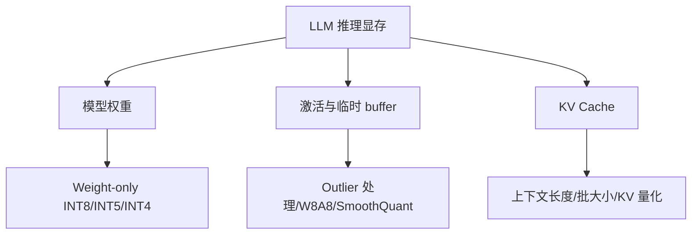

# 大模型量化与 KV Cache

## 学习目标

- 理解 LLM/VLM 为什么不能简单套用传统 INT8 PTQ/QAT 思路。
- 掌握 GPTQ、AWQ、SmoothQuant、LLM.int8() 和 KV Cache 量化的基本思想。
- 能把 weight-only quantization、activation outlier、group size、上下文长度和 runtime 支持联系起来判断。
- 能设计 Qwen 小模型的低比特对比实验。

## 问题背景

LLM 参数规模大、Transformer 层数深、激活 outlier 明显，完整重新训练成本高。VLM 还增加了 vision encoder、projector 和多模态对齐链路。低比特量化不是单纯降低 bit-width，而是模型结构、校准样本、敏感权重、激活分布、上下文长度和推理框架共同作用的结果。

大模型端侧部署还有一个容易被低估的瓶颈：KV Cache。即使权重被压到 4 bit，长上下文和多轮对话仍可能让显存持续增长。

## 图示讲解




## 核心概念

| 方法 | 基本思想 | 适用判断 |
| --- | --- | --- |
| GPTQ | 逐层量化并用近似二阶信息补偿误差 | 适合 weight-only 低比特权重量化 |
| AWQ | 根据激活分布识别关键权重并保护 | 适合关注推理质量的低比特 LLM/VLM |
| SmoothQuant | 把激活异常值平滑迁移到权重侧 | 常用于 W8A8 方向，依赖框架支持 |
| LLM.int8() | 对 outlier 做特殊处理的 8-bit 矩阵乘 | 适合保持较高精度的低风险压缩 |
| KV Cache 量化 | 降低长上下文生成时 cache 占用 | 适合多轮对话、长文本、RAG 场景 |

## 方法对比

| 维度 | GPTQ | AWQ | SmoothQuant | LLM.int8() | GGUF 量化 |
| --- | --- | --- | --- | --- | --- |
| 主要对象 | 权重 | 权重，结合激活敏感性 | 权重和激活范围迁移 | 矩阵乘和 outlier | llama.cpp 生态模型文件 |
| 常见目标 | 低比特 weight-only | 低比特且尽量保质量 | W8A8 部署 | 8-bit 推理 | 本地 CPU/GPU 推理 |
| 需要校准数据 | 通常需要 | 通常需要 | 需要 | 依实现而定 | 使用已有文件时不需要 |
| 课程实作位置 | 方法理解 | 方法理解 | 方法理解 | 方法理解 | Qwen/llama.cpp 实作 |

这张表不是为了给出绝对排名，而是提醒学习者：量化方法要和目标 runtime 绑定。论文里的方法成立，不代表目标设备上的 kernel、显存和服务化路径已经准备好。

## KV Cache 专题

LLM 推理的显存可以粗略拆成三块：

- 模型权重：低比特 weight-only 主要压缩这一块。
- 临时激活和 buffer：和实现、batch、kernel、图优化有关。
- KV Cache：和层数、hidden size、上下文长度、batch/并发相关。

当业务从单轮短问答变成长上下文、多轮对话或 RAG，KV Cache 会快速变成核心变量。后续 profiling 时要单独做 ctx-size 对比实验，不能只比较模型文件大小。

## 代码/命令示例

使用 llama.cpp 跑同一个 prompt，先让不同量化模型的测试条件保持一致：

```bash
./build/bin/llama-cli \
  -m models/qwen/qwen2.5-1.5b-instruct-q4_k_m.gguf \
  -p "用三句话解释端侧模型量化的价值。" \
  -n 128 \
  -ngl 99 \
  --ctx-size 2048
```

记录表格不要预填性能数字，保留给真实设备实验：

| 模型文件 | 量化格式 | 文件大小 | 峰值 VRAM | 首 token 延迟 | tokens/s | 质量备注 |
| --- | --- | --- | --- | --- | --- | --- |
| Qwen GGUF | Q8 | 待记录 | 待记录 | 待记录 | 待记录 | 待记录 |
| Qwen GGUF | Q5 | 待记录 | 待记录 | 待记录 | 待记录 | 待记录 |
| Qwen GGUF | Q4 | 待记录 | 待记录 | 待记录 | 待记录 | 待记录 |

## 配套实作

对应实作章节：

- [Qwen 基线推理](/docs/lab-qwen-baseline)
- [Qwen GGUF 量化对比实验](/docs/lab-qwen-quantization)
- [Profiling 与结果记录](/docs/lab-profiling)

实作要验证三件事：

- 量化文件变小是否真的降低显存。
- 低比特模型的回答质量是否还能满足任务。
- 上下文长度变化是否明显影响 KV Cache 与首 token 延迟。

## 验收结果

| 产物 | 验收标准 |
| --- | --- |
| 量化方法对照表 | 能说明 GPTQ/AWQ/SmoothQuant/LLM.int8/KV Cache 的差异 |
| Qwen 量化实验记录 | 同一 prompt、同一上下文、同一 runtime 下完成对比 |
| 质量备注 | 不只记录速度，也记录格式错误、事实性、重复、拒答等表现 |

## 常见问题

- **只看权重显存**：长上下文场景下 KV Cache 可能成为主要增量。
- **用不同 prompt 比较模型**：prompt 不一致时无法判断差异来自量化还是输入。
- **忽略 tokenizer/template**：聊天模型需要正确的 chat template，否则质量会明显失真。
- **把 GGUF 格式等同于算法**：GGUF 是文件格式，具体质量还取决于量化类型和模型来源。

## 参考资料

- [Qwen llama.cpp 本地运行指南](https://qwen.readthedocs.io/en/v2.5/run_locally/llama.cpp.html)
- [Qwen llama.cpp 量化指南](https://qwen.readthedocs.io/en/v2.5/quantization/llama.cpp.html)
- [llama.cpp quantize README](https://github.com/ggml-org/llama.cpp/blob/master/tools/quantize/README.md)
- [Hugging Face Transformers KV cache](https://huggingface.co/docs/transformers/kv_cache)
- [vLLM PagedAttention paper](https://arxiv.org/abs/2309.06180)
- [GPTQ paper](https://arxiv.org/abs/2210.17323)
- [AWQ paper](https://arxiv.org/abs/2306.00978)
- [SmoothQuant paper](https://arxiv.org/abs/2211.10438)
- [LLM.int8 paper](https://arxiv.org/abs/2208.07339)
