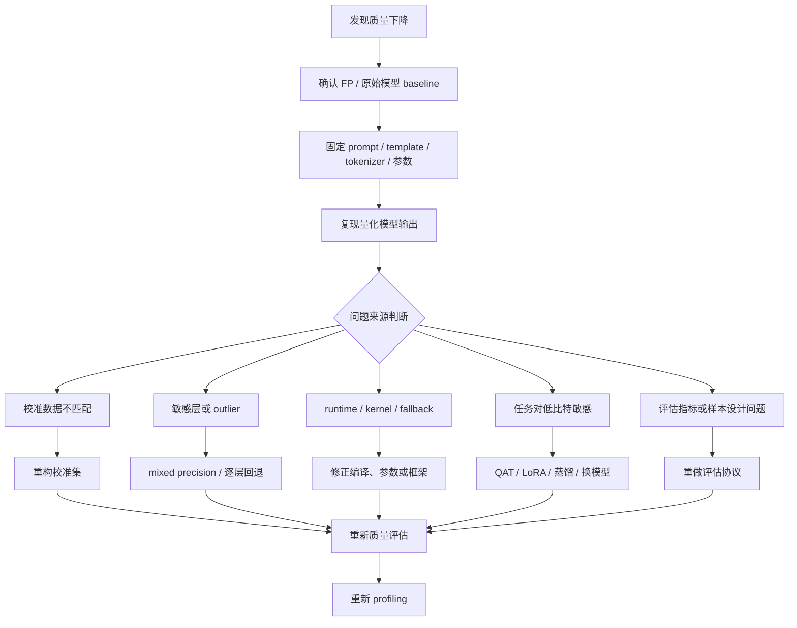
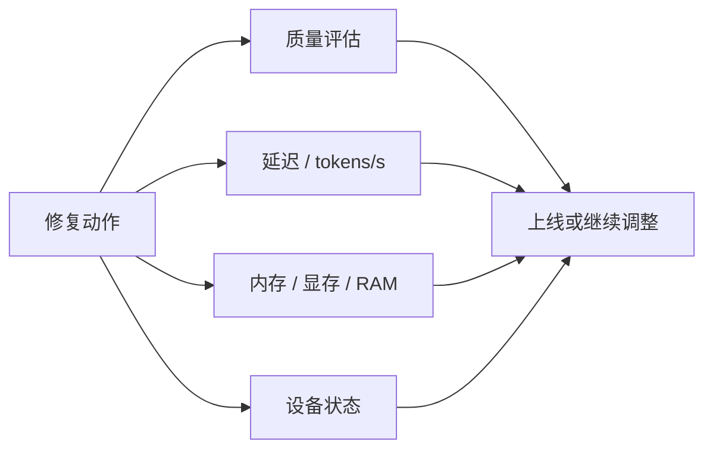

# 量化精度修复

## 建议学时

4 学时。

第 1 学时建立量化后质量下降的排查流程。

第 2 学时讲校准集、评估集、outlier、敏感层和 mixed precision。

第 3 学时讲 LLM 输出质量评估、误差归因和失败样例分析。

第 4 学时结合 Qwen GGUF、Ubuntu Server 与 Jetson 的实验记录做修复决策。

## 学习目标

- 建立量化后精度下降的系统排查流程。
- 区分算法问题、数据问题、导出问题、runtime 行为差异和评估指标问题。
- 掌握校准集重构、敏感层分析、mixed precision、逐层回退、outlier 处理和蒸馏补偿的适用场景。
- 能把速度收益、内存收益和质量损失放在同一张实验表里决策。
- 能为 Qwen 小模型设计固定质量检查集，避免只凭主观聊天体验判断。
- 能说明 Ubuntu Server 与 Jetson 上的质量问题是否真的来自量化，而不是设备状态或运行参数。

## 章节定位

前两章讲量化方法。

本章讲量化失败之后怎么办。

精度修复不是看到效果差就盲目换模型，也不是直接进入蒸馏。

正确顺序是：

1. 确认 baseline 可靠。
2. 固定输入、模板、采样参数和评估指标。
3. 复现实验问题。
4. 定位问题来源。
5. 选择成本最低的修复手段。
6. 同时复测质量和性能。

## 问题背景

量化后质量下降不一定来自量化算法本身。

常见来源包括：

- FP baseline 本身不稳定。
- prompt 或 chat template 不一致。
- tokenizer、预处理或后处理不一致。
- 校准集不代表真实输入。
- 评估集太小或指标不合适。
- runtime 走了不同 kernel 或 fallback。
- 采样参数不同，例如 temperature、top-p、seed。
- 上下文长度变化导致 KV Cache 和截断行为变化。
- Jetson 上温度、功耗或内存压力导致运行状态不稳定。

所以，本章的核心不是罗列修复技巧，而是建立一个证据链。

## 图示讲解

量化精度排查流程如下。



质量、性能和资源必须一起复测。



## 先确认 baseline

没有可靠 baseline，就无法判断量化是否造成了质量下降。

baseline 至少包括：

- 原始模型或较高精度模型输出。
- 固定 prompt 集合。
- 固定 chat template。
- 固定采样参数。
- 固定 runtime 版本。
- 固定上下文长度。
- 固定设备或明确记录设备差异。

对于 Qwen/llama.cpp 实作，建议先建立两个 baseline：

- Q8 或 FP16 GGUF：作为质量参考。
- Q4/Q5 GGUF：作为端侧压缩候选。

如果 Q8 在某个 prompt 上已经答错，不能把 Q4 的错误直接归因于量化。

## 质量评估集

LLM 的输出不是单一分类标签。

因此评估集要覆盖不同能力维度。

本课程建议最小质量检查集包括：

| 类型 | 目标 | 示例 |
| --- | --- | --- |
| 概念解释 | 检查技术概念是否准确 | 解释 PTQ 与 QAT 区别 |
| 格式输出 | 检查 JSON/表格/结构化输出 | 输出字段 method、risk、metric |
| 长上下文 | 检查上下文保持和总结能力 | 阅读部署日志后归纳问题 |
| 中英混合 | 检查术语和中文表达 | 解释 KV Cache 与 prefill/decode |
| 边界输入 | 检查异常格式和极端长度 | 包含代码块、数字、路径、报错 |
| 领域任务 | 检查课程相关业务能力 | 分析 Jetson 部署失败原因 |

一个简单 JSONL 样例：

```json
{"id":"qa_ptq_qat","type":"concept","prompt":"用三句话解释 PTQ 和 QAT 的区别。","must_include":["校准","训练","量化误差"]}
{"id":"json_runtime","type":"format","prompt":"请输出 JSON，字段为 method、risk、metric。","must_include":["method","risk","metric"]}
{"id":"jetson_log","type":"diagnosis","prompt":"根据以下 tegrastats 片段判断部署风险：<待填日志>","must_include":["内存","温度","功耗"]}
```

不要把这个最小集合当成完整评测。

它的作用是课堂 smoke test，用于快速暴露明显退化。

## 评估指标

不同任务需要不同指标。

| 任务 | 可用指标 | 注意事项 |
| --- | --- | --- |
| 分类 | accuracy、F1、混淆矩阵 | 需要标签和稳定数据集 |
| 检测 | mAP、召回率、误检率 | 后处理阈值必须一致 |
| 生成问答 | 规则检查、人工评分、LLM-as-judge、任务成功率 | 采样参数必须固定 |
| JSON/工具调用 | schema 通过率、字段完整率 | 不要只看自然语言质量 |
| RAG | 命中证据、引用正确率、答案完整性 | 检索结果也要固定 |
| Agent | 任务完成率、步骤数、失败类型 | 环境状态要可复现 |

课程实验以生成模型为主。

所以至少记录：

- 是否回答主题。
- 是否包含关键概念。
- 是否遵守格式。
- 是否出现重复、幻觉、拒答或中断。
- 是否在低比特模型中更频繁失败。

规则检查之外，还有两个可以自动计算的退化指标。

第一个是困惑度（perplexity）。给定评估文本的 token 序列 $x_1, \dots, x_N$：

$$
\mathrm{PPL} = \exp\left(-\frac{1}{N}\sum_{i=1}^{N} \log p\left(x_i \mid x_{<i}\right)\right)
$$

PPL 衡量模型对真实文本的“惊讶程度”，越低越好。量化前后的 PPL 差值是低比特退化最常用的数值证据。PPL 对评估文本敏感，对比时必须用同一份文本和同一上下文长度。

第二个是输出分布对比。对同一输入，比较原模型分布 $p$ 和量化模型分布 $q$ 的 KL 散度：

$$
D_{KL}(p \,\|\, q) = \sum_{v \in V} p(v)\,\log\frac{p(v)}{q(v)}
$$

KL 散度不需要参考答案，能在没有标注的情况下度量“量化让模型偏离原模型多少”。它的逐层版本就是敏感层分析的数学基础。

llama.cpp 中测 PPL 的命令：

```bash
mkdir -p ~/edge-ai-lab/quality/logs

./build/bin/llama-perplexity \
  -m models/qwen/qwen2.5-1.5b-instruct-q4_k_m.gguf \
  -f ~/edge-ai-lab/quality/eval-zh.txt \
  --chunks 32 \
  -ngl 99 \
  2>&1 | tee ~/edge-ai-lab/quality/logs/ppl-q4km.log
```

`-f` 指定评估文本，`--chunks` 控制评估块数，块数越多越稳定也越慢。对 Q8_0 和 F16 重复同样命令，记录三个 PPL 值。

任务级评估用 lm-evaluation-harness。中文场景优先选择题型任务，它用 logits 比较选项，不受采样随机性影响：

```bash
lm_eval --model hf \
  --model_args pretrained=Qwen/Qwen2.5-1.5B-Instruct \
  --tasks ceval-valid,cmmlu \
  --batch_size 8 \
  2>&1 | tee ~/edge-ai-lab/quality/logs/lm-eval-base.log
```

`--model hf` 走 Transformers 路线，可以直接评估 GPTQ/AWQ/bitsandbytes 产物。GGUF 模型可以通过 lm-eval 的 OpenAI-compatible 后端连本地 `llama-server` 评估，或者直接用上面的 `llama-perplexity` 做对比。

## 误差归因表

量化后失败样例要归类，而不是只写“效果不好”。

| 失败表现 | 可能来源 | 下一步 |
| --- | --- | --- |
| Q8 和 Q4 都答错 | baseline 或 prompt 问题 | 修改任务、换模型或修 prompt |
| Q8 正确，Q4 漏关键概念 | 低比特质量下降 | 尝试 Q5/Q8 或敏感层保护 |
| 只在长上下文失败 | KV Cache、截断或上下文长度 | 调整 ctx-size，记录内存 |
| JSON 格式失败 | 量化后指令遵循下降或采样参数不稳 | 降低 temperature，换 Q5/Q8 |
| Jetson 上失败，服务器正常 | 设备内存、温度、编译或参数差异 | 查看 `tegrastats` 和启动日志 |
| 速度很慢但质量正常 | kernel/offload 问题 | 检查 `-ngl`、CUDA 编译和 fallback |
| 单次失败不可复现 | 采样随机性 | 固定 seed 或多次运行统计 |

## 校准集重构

如果 PTQ 路线需要校准数据，校准集不匹配会导致系统性质量问题。

重构校准集时，先回答几个问题：

- 实际输入是短问答还是长文档？
- 是否包含代码、表格、路径、日志、数字？
- 是否要求输出 JSON 或工具调用？
- 是否主要是中文，还是中英混合？
- 是否有领域术语，例如量化、KV Cache、TensorRT、Jetson？
- 校准时是否使用了同一个 tokenizer 和 chat template？

重构前后要保留版本。

```text
calibration-v1.jsonl  随机短问答
calibration-v2.jsonl  加入长上下文、JSON、部署日志和课程术语
```

不要只把样本数量加大。

如果分布仍不匹配，更多样本可能只是更稳定地得到错误统计。

GGUF 路线中，校准集重构有一个直接的工程落点：重要性矩阵（imatrix）。用重构后的校准文本重新统计，再用它重新量化：

```bash
./build/bin/llama-imatrix \
  -m models/qwen/qwen2.5-1.5b-instruct-f16.gguf \
  -f ~/edge-ai-lab/quality/calibration-v2.txt \
  -o models/qwen/qwen2.5-1.5b-v2.imatrix \
  2>&1 | tee ~/edge-ai-lab/quality/logs/imatrix-v2.log

./build/bin/llama-quantize \
  --imatrix models/qwen/qwen2.5-1.5b-v2.imatrix \
  models/qwen/qwen2.5-1.5b-instruct-f16.gguf \
  models/qwen/qwen2.5-1.5b-instruct-q4km-v2.gguf \
  Q4_K_M \
  2>&1 | tee ~/edge-ai-lab/quality/logs/quantize-v2.log
```

对比 v1/v2 两个量化文件在同一评估集上的 PPL 和失败样例，“校准集重构是否有效”就有了数值证据，而不是主观感觉。

## 敏感层分析

敏感层分析的目标是找到“哪些层不适合低比特”。

在完整工程中，可以逐层回退或逐层替换进行对比。

课程中可以用简化思路教学：

1. 先比较 Q8、Q5、Q4 的整体质量。
2. 找出 Q4 明显失败但 Q8 成功的样例。
3. 观察失败是否集中在格式输出、长上下文、推理题或领域术语。
4. 如果工具支持，尝试不同量化类型或部分层更高精度。
5. 记录质量改善是否值得内存和速度成本。

逐层误差可以形式化。对同一校准输入，记第 $l$ 层在原模型的输出为 $h_l$、量化模型的输出为 $\hat{h}_l$：

$$
e_l = \frac{\big\|h_l - \hat{h}_l\big\|_2^2}{\big\|h_l\big\|_2^2} \qquad \text{或} \qquad \cos\big(h_l,\, \hat{h}_l\big)
$$

相对误差突然增大、或余弦相似度突然下降的层，就是敏感层候选。

敏感层修复常用方法：

- mixed precision：关键层保留 FP16/INT8。
- per-channel 或 per-group 更细粒度量化。
- 调整 group size。
- 对 embedding、lm_head、norm、attention 或 MLP 中敏感模块采用不同策略。
- 直接回退到更高量化等级，例如 Q4 到 Q5 或 Q8。

llama.cpp 路线中，“部分张量回退”有现成开关：

```bash
./build/bin/llama-quantize \
  --output-tensor-type f16 \
  --token-embedding-type f16 \
  models/qwen/qwen2.5-1.5b-instruct-f16.gguf \
  models/qwen/qwen2.5-1.5b-instruct-q4km-protect.gguf \
  Q4_K_M \
  2>&1 | tee ~/edge-ai-lab/quality/logs/quantize-protect.log
```

这条命令把输出头和 embedding 保留在 f16，其余张量仍用 Q4_K_M，是 mixed precision 最容易上手的版本。对比 protect 变体和普通 Q4_K_M 的 PPL、文件大小和速度，就是一次最小的敏感层实验。

## Outlier 处理

Outlier 处理是 LLM 精度修复的重要主题。

常见策略：

- clipping：限制极端值影响，但可能损失重要信息。
- percentile range：用分位数估计范围，而不是直接 min/max。
- SmoothQuant：把激活 outlier 压力迁移到权重侧。
- LLM.int8()：对 outlier 做特殊处理。
- AWQ：保护对激活敏感的重要权重。
- mixed precision：对特别敏感的模块保留更高精度。

工程上不要把 outlier 处理当成万能修复。

如果失败来自 prompt/template 或 runtime fallback，outlier 方法不会解决根因。

## Mixed precision 与逐层回退

Mixed precision 是精度修复中常见的折中。

它保留量化带来的大部分资源收益，同时让关键模块使用更高精度。

典型策略：

- 大部分权重使用 Q4，少数层回退 Q8/FP16。
- attention 或 MLP 中敏感部分保留更高精度。
- embedding、输出头或 norm 层不做激进量化。

成本：

- 模型文件和内存会增加。
- 转换和部署格式更复杂。
- runtime 需要支持混合格式。
- 需要重新 profiling。

课堂上应把 mixed precision 作为“有证据的局部回退”，而不是默认把所有层都回退。

## Runtime 与导出问题

质量问题有时来自 runtime 或导出链路。

常见例子：

- 导出 ONNX 时算子行为变化。
- TensorRT 构建时某些层被 fallback。
- llama.cpp 编译未启用 CUDA，却以为在跑 GPU。
- 模型文件和 tokenizer/template 不匹配。
- 不同版本 runtime 对同一量化格式支持不同。
- Jetson 上 CUDA/JetPack/编译参数和服务器不同。

排查建议：

```bash
./build/bin/llama-cli --version
./build/bin/llama-cli -m models/qwen/model.gguf -p "hello" -n 16 -ngl 99
```

观察启动日志中是否有：

- GPU offload 层数。
- 使用的 backend。
- context size。
- 模型 metadata。
- tokenizer 或 chat template 信息。

在 Ubuntu Server 上记录：

```bash
nvidia-smi
```

在 Jetson 上记录：

```bash
cat /etc/nv_tegra_release
tegrastats --interval 1000 --logfile logs/jetson-accuracy-check.log
```

## 修复手段选择

| 修复手段 | 解决的问题 | 成本 | 何时优先 |
| --- | --- | --- | --- |
| 修 prompt/template | 格式错误、指令不清 | 低 | Q8/Q4 都有同类问题 |
| 固定采样参数 | 输出波动大 | 低 | 失败不可复现 |
| 重构校准集 | PTQ 范围不匹配 | 中 | 多数失败集中于真实业务分布 |
| 换量化类型 | 某个低比特格式退化 | 低到中 | Q4 失败，Q5/Q8 正常 |
| 调整 group size | 低比特误差过大 | 中 | 工具链支持不同 group 配置 |
| mixed precision | 少数层敏感 | 中 | 可以定位敏感模块 |
| QAT/LoRA | 需要训练补偿 | 高 | PTQ 调整后仍不达标 |
| 蒸馏 | 小模型或量化模型能力不足 | 高 | 有教师模型和任务数据 |
| 换模型 | 原模型不适合端侧 | 中到高 | 压缩收益不足或质量不可接受 |

## Qwen 质量检查脚本示意

课程可以准备一个很小的本地检查脚本，用来调用 OpenAI-compatible API。

这里只给出章节内示意，完整脚本放在 labs 中维护。

```python
from openai import OpenAI

client = OpenAI(base_url="http://127.0.0.1:8080/v1", api_key="local")

tests = [
    {
        "id": "concept",
        "prompt": "用三句话解释 PTQ 和 QAT 的区别。",
        "must_include": ["校准", "训练", "量化"],
    },
    {
        "id": "json",
        "prompt": "请输出 JSON，字段为 method、risk、metric。",
        "must_include": ["method", "risk", "metric"],
    },
]

for test in tests:
    resp = client.chat.completions.create(
        model="local",
        messages=[{"role": "user", "content": test["prompt"]}],
        temperature=0,
    )
    text = resp.choices[0].message.content or ""
    ok = all(keyword in text for keyword in test["must_include"])
    print(test["id"], ok, text[:120])
```

这不是完整评测系统。

它的价值是让课堂实验有最小可复查记录。

## 实验记录模板

| id | 设备 | 模型 | 量化 | prompt 类型 | 是否通过 | 失败类型 | 速度收益 | 内存收益 | 修复建议 |
| --- | --- | --- | --- | --- | --- | --- | --- | --- | --- |
| qa_ptq_qat | Ubuntu GPU | Qwen | Q8 | 概念解释 | 待填 | 待填 | 待填 | 待填 | 待填 |
| qa_ptq_qat | Ubuntu GPU | Qwen | Q4 | 概念解释 | 待填 | 待填 | 待填 | 待填 | 待填 |
| json_runtime | Jetson | Qwen | Q4 | JSON 输出 | 待填 | 待填 | 待填 | 待填 | 待填 |

失败类型建议使用固定枚举：

- `baseline_fail`
- `format_error`
- `missing_key_concept`
- `repetition`
- `hallucination`
- `runtime_fallback`
- `oom_or_device_instability`
- `sampling_variance`

固定枚举的好处是便于课后汇总。

## Ubuntu/Qwen 实作对应

在 Ubuntu Server 上，本章对应的实验动作：

1. 启动 Q8、Q5、Q4 三个 GGUF 模型。
2. 固定 prompt、`temperature=0`、`ctx-size` 和输出长度。
3. 记录每个模型的质量检查结果。
4. 用 `nvidia-smi` 记录 VRAM。
5. 根据失败样例判断是否需要回退量化等级。

示例命令：

```bash
./build/bin/llama-server \
  -m models/qwen/qwen2.5-1.5b-instruct-q4_k_m.gguf \
  --host 127.0.0.1 \
  --port 8080 \
  -ngl 99 \
  --ctx-size 2048
```

## Jetson 实作对应

在 Jetson 上，本章额外关注设备状态。

如果低比特模型输出异常，先不要马上判定为量化质量问题。

要同时检查：

- 是否内存接近上限。
- 是否温度升高导致频率下降。
- 是否功耗模式限制。
- 是否 llama.cpp 编译选项不同。
- 是否 ctx-size 比服务器实验更大。

记录命令：

```bash
cat /etc/nv_tegra_release
nvpmodel -q
tegrastats --interval 1000 --logfile logs/jetson-qwen-quality.log
```

## 课堂练习

练习 1：失败归因。

给出三条输出：

- Q8 正确，Q4 缺少关键概念。
- Q8 和 Q4 都没有遵守 JSON。
- Ubuntu Q4 正常，Jetson Q4 长时间运行后变慢。

让学习者分别判断下一步应该做什么。

练习 2：校准集修复。

给出一个只包含英文短问答的校准集，让学习者改造成适合中文端侧部署课程问答的校准集。

练习 3：修复成本排序。

让学习者按成本从低到高排列：修 prompt、换 Q5、调整 ctx-size、mixed precision、LoRA、蒸馏、换模型。

## 验收结果

| 产物 | 验收标准 |
| --- | --- |
| 质量检查集 | 至少包含概念解释、格式输出、长上下文、Jetson 日志诊断 |
| baseline 记录 | Q8 或 FP16 结果可复查，参数固定 |
| 问题定位表 | 每个失败样例能归入数据、量化、runtime、设备或任务敏感性 |
| 修复建议 | 每个建议都说明质量收益、资源成本和重新测试项 |
| Ubuntu/Jetson 对比 | 能区分模型质量问题和设备运行状态问题 |

## 常见问题

**没有 FP baseline，可以直接修 Q4 吗？**

不建议。没有 baseline 就不知道 Q4 的失败是不是原模型已有问题。

**主观觉得回答变差，算不算质量下降？**

可以作为线索，但不能作为唯一证据。至少要用固定 prompt 和固定参数复现。

**为什么要记录速度和内存？本章不是精度修复吗？**

因为很多修复手段会增加资源占用。质量修好了但端侧跑不动，部署目标仍然失败。

**Jetson 上输出异常，一定是模型低比特导致吗？**

不一定。设备内存、温度、功耗模式、编译选项和上下文长度都可能导致差异。

**是不是直接用更大模型就能解决？**

不一定。更大模型会增加内存、延迟、功耗和分发成本。应该先确认小模型问题来源。

## 作业

### 阅读题

1. 阅读 lm-evaluation-harness 文档，说明为什么选择题任务比自由生成任务更适合量化前后对比。
2. 阅读 llama.cpp quantize README 中关于 `--output-tensor-type`、`--token-embedding-type` 等开关的说明，列出可以单独控制精度的张量类型。

### 检查题

1. 写出 PPL 的定义式，并解释为什么对比量化前后 PPL 时必须固定评估文本和上下文长度。
2. KL 散度对比和 `must_include` 规则检查各自能发现什么问题、各自会漏掉什么问题？
3. 判断并说明理由：Q4 模型在 Jetson 上输出异常而在服务器上正常，说明 Q4 的量化质量不达标。

### 实验题

1. 用 `llama-perplexity` 测 F16、Q8_0、Q4_K_M 三个档位的 PPL，记录差值并与文件大小放在同一张表里，判断哪一档是质量与体积的最优折中。
2. 生成“保护 embedding 和输出头”的 Q4_K_M 变体，对比普通 Q4_K_M 的 PPL、文件大小和 tokens/s，把结果填入本章实验记录模板。

### 讨论题

1. 修复手段选择表中，“重构校准集”为什么排在“QAT/LoRA”之前？什么证据会让你直接跳到训练式补偿？

## 参考资料

本章吸收方式：

- **知识点**：从 AWQ、SmoothQuant、LLM.int8、GPTQ 和评测工具中吸收“误差来源、敏感层、outlier、质量回归”的定位方法。
- **图解**：把方法论文的动机重画为质量问题归因图和修复决策表。
- **实验**：要求保留失败样例、固定 prompt、原模型对照和量化版本回退证据。
- **取舍**：不把单一指标当成质量结论，也不把所有质量问题都归因到量化。

- [AWQ paper](https://arxiv.org/abs/2306.00978)
- [SmoothQuant paper](https://arxiv.org/abs/2211.10438)
- [LLM.int8 paper](https://arxiv.org/abs/2208.07339)
- [GPTQ paper](https://arxiv.org/abs/2210.17323)
- [Qwen llama.cpp 量化指南](https://qwen.readthedocs.io/en/v2.5/quantization/llama.cpp.html)
- [Hugging Face Evaluate](https://huggingface.co/docs/evaluate/index)
- [OpenAI Evals](https://github.com/openai/evals)
- [lm-evaluation-harness](https://github.com/EleutherAI/lm-evaluation-harness)
- [llama.cpp perplexity 工具](https://github.com/ggml-org/llama.cpp/tree/master/tools/perplexity)
