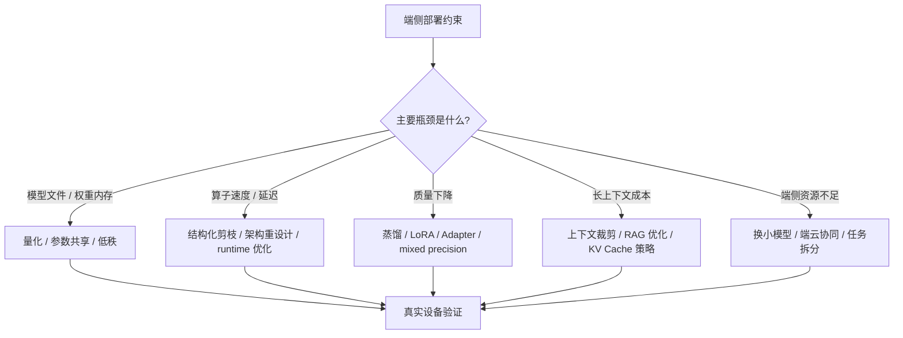
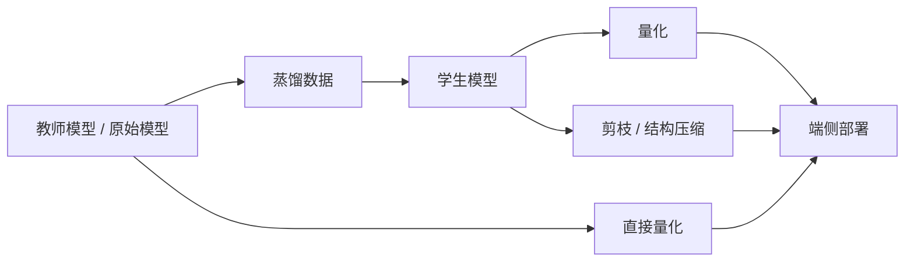
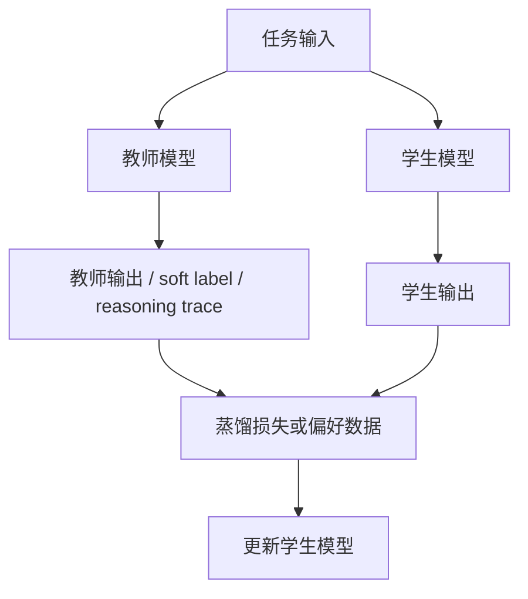

# 压缩与蒸馏

## 建议学时

4 学时。

第 1 学时把量化放入完整模型压缩体系中。

第 2 学时讲剪枝、结构化压缩、低秩分解和架构选择。

第 3 学时讲知识蒸馏、数据构造、教师/学生模型和量化后补偿。

第 4 学时结合 Qwen 小模型、Ubuntu Server 与 Jetson 实作，讨论“继续压缩、蒸馏还是换模型”。

## 学习目标

- 把量化放入完整模型压缩体系中理解，而不是把端侧优化等同于 INT4。
- 区分剪枝、低秩分解、参数共享、蒸馏、小模型训练和架构重设计的作用。
- 判断什么时候压缩现有模型，什么时候换更端侧友好的模型。
- 理解蒸馏如何用于能力迁移和量化后补偿。
- 能解释非结构化剪枝为什么参数少了但不一定更快。
- 能为 Ubuntu Server 和 Jetson 设计压缩路线选择表。

## 章节定位

前面章节讨论了量化和精度修复。

本章回答一个更大的问题：

如果量化仍不够，下一步怎么办？

选择包括：

- 继续做更激进量化。
- 回退到更高精度但换小模型。
- 做剪枝或结构压缩。
- 做低秩近似。
- 用教师模型蒸馏学生模型。
- 重新设计模型或任务拆分。
- 端云协同，而不是所有任务都放在端侧。

课程不会把训练式蒸馏作为第一轮实作主线。

但学习者需要知道它在工程路线图中的位置。

## 问题背景

量化解决的是数值表示问题。

但端侧部署瓶颈不一定都来自数值表示。

例如：

- 模型架构本身太大。
- 算子不适合目标硬件。
- attention 的上下文成本过高。
- vision encoder 成本高于语言模型本体。
- runtime 不能利用稀疏结构。
- Jetson 上功耗和温度限制比显存更关键。
- 业务任务不需要大模型的全部能力。

这时继续降低 bit-width 可能不是最优方案。

如果 Q4 已经质量明显下降，再压到更低 bit 通常不是稳妥路线。

如果模型结构不适合目标设备，换一个端侧友好的模型可能比压缩原模型更有效。

## 图示讲解

压缩路线选择可以从瓶颈出发。



量化、剪枝和蒸馏的关系可以这样理解。



## 压缩方法总览

| 方法 | 主要目标 | 是否通常需要训练 | 端侧收益 | 主要风险 |
| --- | --- | --- | --- | --- |
| 量化 | 降低数值 bit-width | PTQ 不需要，QAT 需要 | 文件、内存、可能速度 | 质量下降，kernel 不支持 |
| 非结构化剪枝 | 删除单个权重 | 通常需要 fine-tuning | 参数量下降 | 通用硬件未必加速 |
| 结构化剪枝 | 删除通道、head、层或模块 | 通常需要 fine-tuning | 更可能真实加速 | 质量损失和架构改动 |
| 低秩分解 | 用低秩矩阵近似大矩阵 | 通常需要校正或训练 | 降低矩阵计算和参数 | 误差累积 |
| 参数共享 | 多处共享参数或码本 | 视方法而定 | 文件变小 | runtime 支持有限 |
| 知识蒸馏 | 大模型教小模型 | 需要训练数据和训练过程 | 小模型质量提升 | 数据和评估成本高 |
| 架构重设计 | 选择更端侧友好的模型 | 可能需要训练 | 从源头降低成本 | 周期更长 |
| 端云协同 | 端侧处理轻任务，云端处理重任务 | 不一定 | 降低端侧压力 | 网络、隐私和系统复杂度 |

## 剪枝

剪枝的基本思想是移除“不重要”的参数或结构。

“不重要”需要一个可计算的评分。最简单的是幅值准则：移除 $\lvert w \rvert$ 最小的权重。更精确的是一阶泰勒准则，直接估计移除某个权重对损失的影响：

$$
\Delta L(w) \approx \left| w \cdot \frac{\partial L}{\partial w} \right|
$$

幅值小但梯度大的权重，按泰勒准则不应该删——两个准则的差异正是“重要性”定义的差异。LLM 时代的代表方法（如 Wanda）用权重幅值乘对应输入激活范数（$\lvert w \rvert \cdot \lVert x \rVert$）评分，无需梯度，思想与 AWQ 的“按激活找重要权重”同源。

剪枝分为非结构化和结构化两类。

### 非结构化剪枝

非结构化剪枝删除单个权重。

它可以让模型矩阵变稀疏。

但稀疏不等于快。

如果目标硬件和 runtime 不能高效利用稀疏矩阵，实际推理可能没有变快，甚至因为稀疏索引开销变慢。

适合教学强调的点：

- 参数量减少不等于延迟减少。
- 稀疏格式需要 kernel 支持。
- 端侧设备更关注真实 latency、功耗和内存，而不是论文中的稀疏率。

PyTorch 自带的剪枝接口可以直接做最小演示：

```python
import torch
import torch.nn.utils.prune as prune

layer = torch.nn.Linear(896, 896)
prune.l1_unstructured(layer, name="weight", amount=0.5)  # 按幅值剪掉 50%

sparsity = (layer.weight == 0).float().mean()
print(f"sparsity: {sparsity:.2%}")
```

运行后用同样输入对比剪枝前后的耗时。在普通 CPU/GPU 上通常观察不到加速——权重只是被置零，矩阵形状没有变。这正是“非结构化稀疏需要专用 kernel 才能兑现速度”的最直接证据。

### 结构化剪枝

结构化剪枝删除更规则的结构，例如：

- 卷积通道。
- attention head。
- MLP hidden dimension。
- Transformer 层。
- vision encoder block。

结构化剪枝更可能带来真实速度收益，因为它改变的是硬件容易执行的规则形状。

但它也更容易伤害模型能力，需要 fine-tuning 或蒸馏补偿。

LLM 中常见讨论包括：

- 减少层数。
- 减少 hidden size。
- 减少 attention head 或 KV head。
- 使用小模型替代大模型。

课程实作不要求学生训练剪枝模型。

重点是让学生能判断：某个剪枝方案是否会被目标 runtime 真正利用。

## 低秩分解

低秩分解把一个大矩阵近似成两个或多个较小矩阵的乘积。

直觉上，如果权重矩阵中有冗余结构，就可以用更低维表示近似。

数学工具是奇异值分解（SVD）。任何矩阵 $W \in \mathbb{R}^{d \times k}$ 都可以分解为 $W = U\Sigma V^\top$，按奇异值大小取前 $r$ 个截断：

$$
W \approx U_r \Sigma_r V_r^\top, \qquad \text{参数量从 } dk \text{ 降为 } r(d + k)
$$

Eckart-Young 定理保证这是所有秩 $r$ 近似中 Frobenius 误差最小的，误差等于被丢弃奇异值的平方和开根号。奇异值衰减快的矩阵适合低秩近似，衰减慢的不适合——对一层权重算一次奇异值谱（`torch.linalg.svdvals`），就能判断这条路线在该层是否可行。

适用位置：

- 大线性层。
- 某些卷积层。
- Adapter 或 LoRA 风格的增量参数。

工程风险：

- 低秩近似误差可能跨层累积。
- 替换矩阵结构后，runtime 是否更快需要实测。
- 小 batch 或端侧设备上，额外算子拆分可能抵消理论收益。
- 训练或校正数据仍然重要。

教学中可以把低秩分解和 LoRA 联系起来。

LoRA 常用于微调，不等同于模型压缩。

但它说明了“低秩增量”可以用较少参数表达任务适配能力。

## 参数共享与权重聚类

参数共享通过让多个权重共享同一个值或码本来减少存储。

权重聚类、码本量化、product quantization 都属于这一类思想的延伸。

这类方法可能显著降低文件大小。

但在端侧部署中要问：

- runtime 是否支持对应格式？
- 是否需要解码成普通矩阵再计算？
- 解码开销是否抵消收益？
- 模型更新和分发是否更复杂？

因此，在本课程主线中，它们作为扩展知识，不作为第一轮实作。

## 知识蒸馏

知识蒸馏的基本结构是教师模型和学生模型。

教师模型通常更大、更强、更慢。

学生模型通常更小、更快、更适合端侧。

蒸馏的目标是让学生模型学习教师模型的行为。



经典的 logit 蒸馏损失是两项加权：

$$
L = (1-\lambda)\,CE\big(y,\, p_s\big) + \lambda\, T^2\, KL\big(p_t^{(T)} \,\|\, p_s^{(T)}\big)
$$

其中 $CE$ 是学生对真实标签 $y$ 的交叉熵，$KL$ 是教师分布 $p_t$ 和学生分布 $p_s$ 在温度 $T$ 下软化后的散度，$\lambda$ 平衡两项。软化分布的定义是：

$$
p_i^{(T)} = \frac{\exp(z_i / T)}{\sum_j \exp(z_j / T)}
$$

$T > 1$ 放大非最大类的概率，迫使学生学习教师“次优选项之间的相对关系”——这是蒸馏比硬标签训练多出来的信息。$T^2$ 因子补偿温度软化造成的梯度缩小。

LLM 蒸馏经常不走 logit 路线，而是直接拿教师生成的文本做 SFT（sequence-level 蒸馏），此时上面的公式退化为普通交叉熵。两条路线的共同前提不变：教师输出质量决定学生上限。

蒸馏可以用于：

- 大模型到小模型的能力迁移。
- 量化后模型的质量补偿。
- 特定领域任务适配。
- 输出格式和工具调用能力增强。
- 视觉语言任务中的多模态对齐补偿。

但蒸馏不是免费午餐。

它需要：

- 明确任务分布。
- 高质量输入样本。
- 可靠教师输出。
- 训练和验证管线。
- 防止学生学习教师错误。
- 明确许可证和数据合规。

## 蒸馏数据设计

蒸馏数据不是越多越好。

对于端侧部署课程，蒸馏数据应围绕目标任务构造。

一个蒸馏样例可以包含：

```json
{
  "id": "distill_quant_001",
  "prompt": "解释 INT4 weight-only quantization 的适用场景。",
  "teacher_response": "待填入教师模型输出",
  "student_response": "待填入学生或量化模型输出",
  "judge_note": "待记录差异",
  "tags": ["quantization", "edge-deployment", "format-free"]
}
```

如果目标是工具调用或 JSON 输出，样例应包含 schema。

```json
{
  "id": "distill_json_001",
  "prompt": "输出 JSON，字段为 device、risk、mitigation。",
  "schema": {
    "type": "object",
    "required": ["device", "risk", "mitigation"]
  },
  "teacher_response": "待填入",
  "student_response": "待填入",
  "judge_note": "待记录"
}
```

蒸馏数据应覆盖：

- 正常任务。
- 边界任务。
- 格式任务。
- 长上下文任务。
- 部署日志诊断。
- 设备差异分析。

## 蒸馏与量化的组合

蒸馏和量化有多种组合顺序。

| 路线 | 说明 | 适用情况 |
| --- | --- | --- |
| 先蒸馏后量化 | 先训练一个更小学生模型，再做 PTQ | 目标是从源头减小模型 |
| 先量化后补偿 | 量化后发现质量下降，再用 LoRA/蒸馏修复 | 已有模型和明确失败样例 |
| QAT + 蒸馏 | 训练中同时考虑量化误差和教师监督 | 高质量要求、预算充足 |
| 换小模型 + 少量适配 | 不压缩原模型，改用端侧模型 | 原模型不适合目标设备 |

课堂中优先让学生理解路线选择。

不要求学生在第一阶段完成完整训练式蒸馏。

## 什么时候直接换模型

端侧工程中，换模型常常比压缩模型更务实。

应该考虑换模型的情况：

- Q4/Q5 仍无法满足内存或速度要求。
- Q8/Q5/Q4 质量都不稳定。
- 原模型 license 或分发限制不适合产品。
- 原模型架构不适合目标 runtime。
- Jetson 上长时间运行因功耗/温度不稳定。
- 业务只需要窄任务，小模型足以完成。
- VLM 的 vision encoder 成本过高，可以改任务或换更轻架构。

不要把换模型理解成失败。

它是部署决策的一部分。

## 端云协同

并不是所有能力都必须放在端侧。

端云协同可以让端侧处理低延迟、隐私敏感、离线可用的任务，把重任务交给云端。

常见拆分：

- 端侧做唤醒词、简单分类、OCR 初筛。
- 端侧做小模型问答或缓存回答。
- 云端做复杂推理、长文档总结、多模态大模型。
- 端侧保留安全策略和降级路径。

端云协同的风险：

- 网络不可用时的降级行为。
- 隐私和合规。
- 云端成本。
- 用户体验不一致。
- 系统复杂度上升。

本课程聚焦端侧部署，但需要让学习者知道这条工程边界。

## Ubuntu/Qwen 实作对应

本课程第一阶段不做训练式剪枝或蒸馏。

但会通过实验表做压缩路线判断。

Ubuntu Server 上要回答：

- Q8/Q5/Q4 中哪个满足质量阈值？
- 低比特带来的速度收益是否真实存在？
- 如果 Q4 质量不可接受，Q5 是否足够？
- 如果 Q5 也不可接受，是不是模型尺寸、prompt 或任务本身不合适？
- 是否需要进入 LoRA/蒸馏作为第二阶段？

示例记录：

| 方案 | 文件大小 | 峰值 VRAM | tokens/s | 质量通过率 | 是否进入下一步 |
| --- | --- | --- | --- | --- | --- |
| Qwen Q8 | 待记录 | 待记录 | 待记录 | 待记录 | 待判断 |
| Qwen Q5 | 待记录 | 待记录 | 待记录 | 待记录 | 待判断 |
| Qwen Q4 | 待记录 | 待记录 | 待记录 | 待记录 | 待判断 |
| 更小模型 | 待记录 | 待记录 | 待记录 | 待记录 | 待判断 |
| 蒸馏/LoRA | 待设计 | 待设计 | 待设计 | 待设计 | 第二阶段 |

## Jetson 实作对应

Jetson 上的压缩决策要额外考虑长期稳定性。

例如：

- Q4 可以运行，但长时间推理后温度升高、tokens/s 下降。
- Q8 质量更好，但内存压力过高。
- Q5 在质量和资源之间更均衡。
- 更小模型虽然能力稍弱，但稳定性更好。

Jetson 记录建议：

```bash
cat /etc/nv_tegra_release
nvpmodel -q
tegrastats --interval 1000 --logfile logs/jetson-compression-choice.log
```

记录表：

| 模型/压缩路线 | 量化 | ctx-size | RAM | GPU/GR3D | 温度 | 质量备注 | 结论 |
| --- | --- | --- | --- | --- | --- | --- | --- |
| Qwen 小模型 | Q8 | 2048 | 待记录 | 待记录 | 待记录 | 待记录 | 待判断 |
| Qwen 小模型 | Q5 | 2048 | 待记录 | 待记录 | 待记录 | 待记录 | 待判断 |
| Qwen 小模型 | Q4 | 2048 | 待记录 | 待记录 | 待记录 | 待记录 | 待判断 |
| 更小模型 | 待定 | 2048 | 待记录 | 待记录 | 待记录 | 待记录 | 待判断 |

## 路线决策框架

压缩路线决策可以按下面顺序：

1. 先建立原始或高精度 baseline。
2. 做 Q8/Q5/Q4 量化对比。
3. 如果 Q4 满足质量和性能，优先采用简单路线。
4. 如果 Q4 质量差但 Q5 可接受，选择 Q5 或 mixed precision。
5. 如果量化无法满足资源限制，评估更小模型。
6. 如果小模型能力不足但任务固定，考虑蒸馏。
7. 如果 runtime 无法利用压缩结构，避免投入复杂剪枝。
8. 如果端侧硬件始终不满足，考虑任务拆分或端云协同。

决策表：

| 观察结果 | 推荐方向 |
| --- | --- |
| Q4 质量和性能都达标 | 采用 Q4，保留 Q5/Q8 回退 |
| Q4 快但质量差，Q5 可接受 | 采用 Q5 或局部高精度 |
| Q5/Q8 仍慢 | 推理加速、换 runtime、换模型 |
| 所有量化都质量差 | 检查 baseline、prompt、任务，再考虑蒸馏 |
| Jetson 上不稳定 | 降低 ctx-size、换小模型、检查功耗/温度 |
| 剪枝后参数少但不快 | 检查 runtime 是否利用结构稀疏 |
| 任务固定且数据可构造 | 进入蒸馏/LoRA 第二阶段 |

## 课堂练习

练习 1：参数少不等于快。

给出一个非结构化剪枝 50% 的模型，但 Jetson 上 tokens/s 没变，让学习者解释原因。

练习 2：蒸馏数据设计。

让学习者为“Jetson 本地部署故障诊断助手”设计 10 条蒸馏样例类型，不要求写完整答案，但要写任务标签和验收标准。

练习 3：换模型决策。

给出 Qwen Q4/Q5/Q8 的实验记录，让学习者判断是继续修 Q4、选择 Q5、换小模型，还是进入蒸馏。

练习 4：端云协同边界。

让学习者把一个 VLM 巡检任务拆成端侧必须完成、端侧可缓存、云端处理三类。

## 配套实作

对应实作章节：

- [Qwen GGUF 量化对比实验](/docs/lab-qwen-quantization)
- [推理加速实验](/docs/lab-inference-acceleration)
- [Jetson 环境与 Qwen 迁移](/docs/lab-jetson-setup)
- [Profiling 与结果记录](/docs/lab-profiling)

本章对应的实作产物不是训练好的蒸馏模型，而是一份路线选择报告。

报告应回答：

- 当前瓶颈是文件、内存、速度、质量还是设备稳定性？
- 量化是否已经足够？
- 如果不够，是继续调量化、换模型、做蒸馏，还是端云协同？
- 选择路线后，下一轮实验如何验证？

## 验收结果

| 产物 | 验收标准 |
| --- | --- |
| 压缩路线选择表 | 能说明为什么先量化、先剪枝、先蒸馏或直接换模型 |
| 剪枝风险说明 | 能解释非结构化剪枝为什么未必带来真实端侧加速 |
| 蒸馏样例格式 | 能保存 prompt、教师输出、学生输出、评价备注和任务标签 |
| Ubuntu/Jetson 对比 | 能把资源、质量和设备稳定性放入同一张表 |
| 第二阶段计划 | 能说明是否真的需要训练式补偿，以及需要什么数据 |

## 常见问题

**剪枝后参数量少了，为什么速度没变？**

因为通用硬件和 runtime 可能仍按稠密矩阵执行，或者稀疏索引开销抵消了收益。

**蒸馏是不是一定能恢复量化损失？**

不是。蒸馏依赖数据、教师质量、学生容量和训练策略。它也可能学习教师错误。

**为什么不直接训练一个小模型？**

可以，但训练成本、数据质量、许可证和评估都要考虑。课程第一阶段先建立部署证据链。

**量化和蒸馏应该谁先做？**

取决于瓶颈。如果目标是从源头减小模型，先蒸馏后量化；如果已有模型只是在低比特下退化，先量化后补偿也可行。

**Jetson 上应该优先剪枝还是量化？**

第一轮通常先量化和换小模型，因为验证成本更低。剪枝是否值得做，要看 runtime 是否能利用结构变化。

**端云协同会不会偏离端侧部署主题？**

不会。端侧部署的工程目标是满足业务约束，不是把所有计算强行放在设备上。

## 作业

### 阅读题

1. 阅读 Distilling the Knowledge in a Neural Network（arXiv 1503.02531），说明温度 $T$ 和 $T^2$ 因子各自的作用。

### 检查题

1. 一个 $896 \times 896$ 的线性层做秩 64 的 SVD 截断，参数量变为原来的多少？这个近似在什么条件下质量可以接受？
2. 幅值剪枝和一阶泰勒剪枝可能给出相反的结论吗？用一个两参数的例子说明。
3. 判断并说明理由：非结构化剪枝 50% 后，模型在 llama.cpp 上推理速度会提高约一倍。

### 实验题

1. 运行本章 torch prune 演示，对比剪枝前后同一输入的输出差异和耗时，解释为什么没有加速。
2. 对任意一个开源模型的某层权重计算奇异值谱（`torch.linalg.svdvals`），观察衰减曲线，判断该层是否适合低秩近似。

### 讨论题

1. “先蒸馏后量化”和“先量化后蒸馏补偿”的成本结构有什么不同？课程场景下哪个更现实？

## 参考资料

本章吸收方式：

- **知识点**：从 EfficientML、蒸馏论文、剪枝教程和 TensorRT 稀疏性资料中提取模型侧压缩、teacher/student、结构稀疏和 runtime 可利用性的边界。
- **图解**：把压缩方法重画为“减少参数、减少计算、保持质量、需要 runtime 支持”的四类判断图。
- **实验**：本章只把剪枝/蒸馏作为路线判断和报告讨论，主实验仍回到 Qwen GGUF 与部署评估。
- **取舍**：不新增完整蒸馏训练项目，除非后续课程单独扩展。

- [Qwen llama.cpp 本地运行指南](https://qwen.readthedocs.io/en/v2.5/run_locally/llama.cpp.html)
- [llama.cpp 项目](https://github.com/ggml-org/llama.cpp)
- [Distilling the Knowledge in a Neural Network](https://arxiv.org/abs/1503.02531)
- [TinyBERT](https://arxiv.org/abs/1909.10351)
- [MobileBERT](https://arxiv.org/abs/2004.02984)
- [The Lottery Ticket Hypothesis](https://arxiv.org/abs/1803.03635)
- [PyTorch Pruning Tutorial](https://pytorch.org/tutorials/intermediate/pruning_tutorial.html)
- [NVIDIA TensorRT Sparsity](https://docs.nvidia.com/deeplearning/tensorrt/developer-guide/index.html#structured-sparsity)
