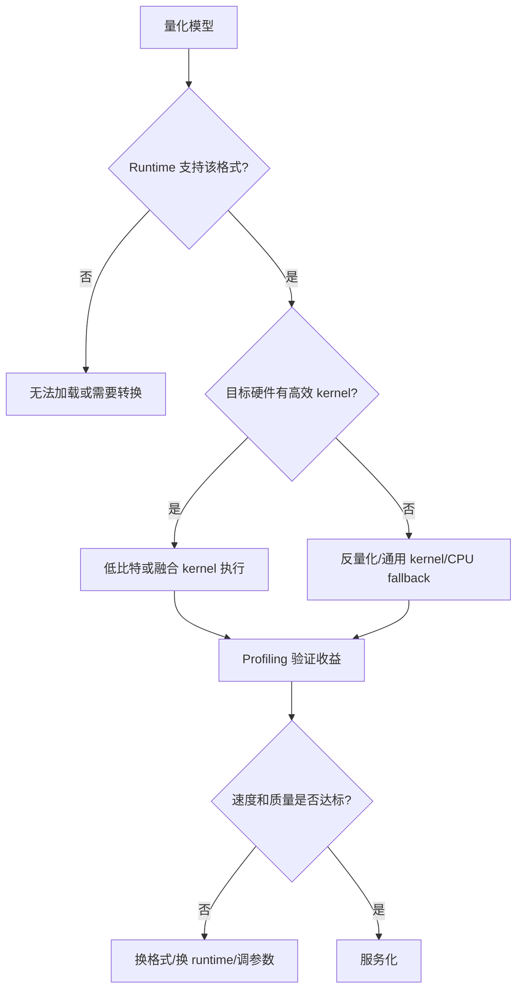
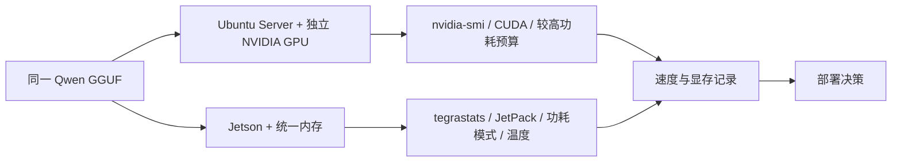

# 推理框架与部署链路

## 建议学时

4 学时。

建议安排：

| 课时 | 内容 | 课堂产出 |
| --- | --- | --- |
| 1 | 端侧部署链路：模型、格式、runtime、设备 | 部署链路检查表 |
| 2 | Runtime 选型：llama.cpp、ONNX Runtime、TensorRT、TFLite 等 | Runtime 选型矩阵 |
| 3 | llama.cpp CUDA 构建、Qwen GGUF CLI 推理、server 启动 | 可复查运行日志 |
| 4 | fallback、unsupported op、低比特 kernel 和 Jetson 差异 | 问题定位记录 |

本章对应实验章节：

- [Ubuntu Server 与 NVIDIA GPU 环境](/docs/lab-ubuntu-nvidia)
- [Qwen 基线推理](/docs/lab-qwen-baseline)
- [本地 OpenAI-compatible 服务](/docs/lab-local-service)
- [Jetson 环境与 Qwen 迁移](/docs/lab-jetson-setup)
- [推理加速实验](/docs/lab-inference-acceleration)

## 学习目标

完成本章后，学习者应能：

- 描述模型从训练或下载到端侧运行的完整部署链路。
- 解释模型格式、tokenizer、chat template、runtime、kernel 和设备之间的关系。
- 使用 llama.cpp 在 Ubuntu Server + NVIDIA GPU 上完成 CUDA 构建、Qwen GGUF 推理和本地服务。
- 识别 unsupported op、CPU fallback、低比特 kernel 缺失、dynamic shape、KV Cache 过大等常见性能陷阱。
- 判断普通 Ubuntu Server 与 NVIDIA Jetson 在 runtime、监控、功耗和内存上的差异。
- 建立“先跑通、再记录、再优化、最后服务化”的部署习惯。

## 问题背景

模型转换成功不代表部署成功。

部署成功至少包含四层含义：

1. 模型能被目标 runtime 正确加载。
2. 推理输出在业务任务上可用。
3. 延迟、吞吐、显存、内存、功耗和温度可接受。
4. 能通过稳定接口被应用调用。

量化能否真正带来收益，最终取决于目标设备、runtime、算子覆盖、低比特 kernel、fallback 行为和 profiling 结果。

对小型 LLM 来说，本课程选择 llama.cpp 作为主线 runtime，因为它支持 GGUF、本地 CLI、CPU/GPU 混合执行、`llama-bench` 和 OpenAI-compatible server，适合作为可运行教学基线。

这不意味着其他 runtime 不重要。

课程会把 ONNX Runtime、TensorRT、TensorRT-LLM、TFLite、NCNN、MNN、Core ML、ExecuTorch、MLC LLM 等放入选型地图中，用来解释不同设备和模型类型的部署取舍。

## 图示讲解

### 部署链路总览


### Runtime 加速与 fallback



### Ubuntu Server 与 Jetson 的部署差异



## 核心概念

### 部署链路中的关键对象

| 对象 | 作用 | 常见问题 |
| --- | --- | --- |
| 模型权重 | 保存参数 | 文件过大、格式不匹配、版本不明 |
| Tokenizer | 文本和 token 的转换 | chat template 不匹配、特殊 token 错误 |
| 模型格式 | GGUF、ONNX、TensorRT engine、TFLite 等 | 转换失败、信息丢失、版本不兼容 |
| Runtime | 执行模型的推理框架 | kernel 不支持、fallback、参数不透明 |
| Backend | CUDA、CPU、Metal、Vulkan、TensorRT 等 | 没有启用、驱动不匹配 |
| 监控工具 | `nvidia-smi`、`tegrastats`、日志 | 只看输出不看资源 |
| 服务接口 | CLI、HTTP API、SDK | 可跑但不可集成、超时、并发不稳 |

### Runtime 选型地图

| Runtime | 更适合 | 优点 | 风险 | 本课程定位 |
| --- | --- | --- | --- | --- |
| llama.cpp | GGUF、本地 LLM、CPU/GPU 混合 | 简单、跨平台、server 方便 | 高级 serving 能力有限 | 实作主线 |
| ONNX Runtime | 通用深度学习模型、传统模型、部分 Transformer | 生态成熟、跨平台 | LLM 端侧低比特路径需验证 | 理解通用部署链路 |
| TensorRT | NVIDIA GPU 上视觉/语音/传统模型高性能推理 | 图优化和 kernel 强 | engine 构建和动态 shape 较复杂 | NVIDIA 加速路线 |
| TensorRT-LLM | NVIDIA GPU 上 LLM 服务优化 | 面向 LLM 的高性能路径 | 工程复杂度更高 | 进阶路线 |
| TFLite | 移动端和嵌入式传统模型 | 移动生态成熟 | 大模型支持有限 | 端侧传统路线 |
| NCNN/MNN | 移动端视觉模型 | 轻量、移动端友好 | LLM 主线不如 GGUF/专用框架 | 补充理解 |
| Core ML | Apple 设备 | 系统集成好 | 生态绑定 Apple | 横向比较 |
| ExecuTorch | PyTorch 端侧部署 | PyTorch 生态衔接 | 设备与算子覆盖需验证 | PyTorch 端侧路线 |
| MLC LLM | 跨平台 LLM 编译部署 | 后端多、覆盖广 | 调试复杂度较高 | 扩展路线 |
| Jetson TensorRT | Jetson 上视觉和部分模型加速 | 与 JetPack/NVIDIA 生态贴合 | LLM 路径需谨慎验证 | 边缘设备加速路线 |

选型时不要先问“哪个框架最快”。

更合理的问题是：

- 目标设备是什么？
- 模型类型是什么？
- 可接受的转换成本是多少？
- 是否需要低比特量化？
- 是否需要服务接口？
- 失败时能否定位问题？
- 团队是否能维护这条部署链路？

### 部署阶段

| 阶段 | 主要目标 | 产物 |
| --- | --- | --- |
| 环境基线 | 确认 OS、驱动、CUDA、工具链 | 环境检查日志 |
| Runtime 构建 | 确认后端启用 | 构建日志 |
| 模型准备 | 放置 GGUF 或转换模型 | 模型清单 |
| CLI baseline | 验证模型输出和速度 | baseline 日志 |
| Profiling | 记录速度、内存、GPU 使用 | profiling 表 |
| 服务化 | 暴露 API | server 日志和 smoke test |
| 复盘 | 解释瓶颈与取舍 | 实验结论 |

## 代码/命令示例

### 目录约定

课程仓库只保存教材、脚本和模板。

模型文件、第三方仓库和构建产物放在实验目录：

```bash
mkdir -p ~/edge-ai-lab/{models/qwen,src,logs,results}
cd ~/edge-ai-lab
```

不要把以下内容提交到 Git：

- `.gguf`、`.safetensors`、`.bin`、`.onnx`、TensorRT engine。
- `llama.cpp` 第三方源码副本。
- `build/` 构建目录。
- 大型日志和 profiling 原始数据。

### llama.cpp CUDA 构建

```bash
cd ~/edge-ai-lab/src
git clone https://github.com/ggml-org/llama.cpp.git
cd llama.cpp
cmake -B build -DGGML_CUDA=ON
cmake --build build --config Release -j
```

构建后检查：

```bash
./build/bin/llama-cli --help | head
./build/bin/llama-bench --help | head
./build/bin/llama-server --help | head
```

### Qwen GGUF CLI 推理

```bash
./build/bin/llama-cli \
  -m ~/edge-ai-lab/models/qwen/qwen2.5-1.5b-instruct-q4_k_m.gguf \
  -p "用三句话解释端侧模型部署为什么需要 profiling。" \
  -n 128 \
  --ctx-size 2048 \
  -ngl 99 \
  2>&1 | tee ~/edge-ai-lab/logs/runtime-qwen-cli.txt
```

### 本地 OpenAI-compatible 服务

```bash
./build/bin/llama-server \
  -m ~/edge-ai-lab/models/qwen/qwen2.5-1.5b-instruct-q4_k_m.gguf \
  -ngl 99 \
  --ctx-size 2048 \
  --host 0.0.0.0 \
  --port 8080 \
  2>&1 | tee ~/edge-ai-lab/logs/llama-server.txt
```

另开终端验证：

```bash
curl http://localhost:8080/v1/chat/completions \
  -H "Content-Type: application/json" \
  -d '{
    "model": "qwen-local",
    "messages": [
      {"role": "user", "content": "用三句话解释端侧模型量化。"}
    ],
    "temperature": 0.2,
    "max_tokens": 128
  }'
```

## 配套实作

本章建议按以下顺序完成。

### Step 1：建立环境基线

完成 [Ubuntu Server 与 NVIDIA GPU 环境](/docs/lab-ubuntu-nvidia)。

产物：

- `env-check.txt`
- `nvidia-smi` 输出
- 实验目录结构截图或文本记录

### Step 2：构建 runtime

完成 llama.cpp CUDA 构建。

产物：

- 构建命令记录
- 构建日志
- `llama-cli`、`llama-bench`、`llama-server` 可执行文件检查结果

### Step 3：运行 Qwen baseline

完成 [Qwen 基线推理](/docs/lab-qwen-baseline)。

产物：

- 固定 prompt 输出
- 速度统计
- GPU 监控记录

### Step 4：做加速与量化对比

完成：

- [Qwen GGUF 量化对比实验](/docs/lab-qwen-quantization)
- [推理加速实验](/docs/lab-inference-acceleration)
- [Profiling 与结果记录](/docs/lab-profiling)

### Step 5：服务化

完成 [本地 OpenAI-compatible 服务](/docs/lab-local-service)。

产物：

- server 日志
- `curl` 响应
- Python smoke test 输出

### Step 6：迁移到 Jetson

完成 [Jetson 环境与 Qwen 迁移](/docs/lab-jetson-setup)。

产物：

- JetPack/Jetson Linux 版本记录
- `tegrastats` 日志
- Ubuntu Server 与 Jetson 对比表

## 验收结果

| 产物 | 验收标准 |
| --- | --- |
| 部署链路图 | 能从模型文件讲到 API 服务 |
| Runtime 选型表 | 能说明为什么课程先用 llama.cpp |
| 构建日志 | 能看出是否启用 CUDA |
| CLI 推理日志 | 固定 prompt 能稳定输出 |
| 监控日志 | Ubuntu 有 `nvidia-smi`，Jetson 有 `tegrastats` |
| 服务 smoke test | `/v1/chat/completions` 能返回 JSON |
| 问题复盘 | 能指出 fallback、KV Cache、GPU offload 或功耗限制中的至少一种风险 |

## 常见问题

### 构建成功但没有 GPU 加速

检查：

- CMake 是否使用 `-DGGML_CUDA=ON`。
- 构建日志是否出现 CUDA 后端相关信息。
- 运行时是否使用 `-ngl`。
- `nvidia-smi` 或 `tegrastats` 是否能看到资源变化。

### server 可启动但回答异常

检查：

- 模型是否是 instruction/chat 版本。
- tokenizer 和 chat template 是否匹配。
- prompt 是否过短或含糊。
- 采样参数是否过高导致输出发散。

### CLI 很快但 API 很慢

检查：

- 请求是否走远程网络而不是本机。
- server 是否复用了已加载模型。
- 是否有并发排队。
- 客户端是否等待完整响应而非流式响应。

### Jetson 上可运行但不稳定

检查：

- 电源适配器是否可靠。
- 功耗模式是否合适。
- 温度是否触发降频。
- 系统内存是否被其他进程占用。

### 低比特模型输出质量明显下降

处理方式：

- 回退到 Q5 或 Q8。
- 缩短上下文或降低生成长度进行排查。
- 固定 prompt 后重新比较。
- 不要只用速度决定部署方案。

## 课堂讨论

讨论以下问题：

1. 如果 Q4 速度最快但回答质量明显下降，是否应该部署？
2. 如果 Q8 质量最好但 Jetson 内存不足，应该先换模型、换量化格式还是换 runtime？
3. 如果 `-ngl 99` 比 `-ngl 0` 只快一点，可能有哪些原因？
4. 如果 server API 的响应慢于 CLI，应该如何设计实验定位问题？

## 参考资料

- [推理加速基础](/docs/inference-acceleration)
- [Jetson 部署基础](/docs/jetson-deployment)
- [llama.cpp server documentation](https://www.mintlify.com/ggml-org/llama.cpp/inference/server)
- [llama.cpp llama-bench documentation](https://www.mintlify.com/ggml-org/llama.cpp/api/tools/llama-bench)
- [Qwen llama.cpp 本地运行指南](https://qwen.readthedocs.io/en/v2.5/run_locally/llama.cpp.html)
- [NVIDIA CUDA Installation Guide for Linux](https://docs.nvidia.com/cuda/cuda-installation-guide-linux/)
- [ONNX Runtime documentation](https://onnxruntime.ai/docs/)
- [TensorRT documentation](https://docs.nvidia.com/deeplearning/tensorrt/latest/)
- [TensorRT-LLM documentation](https://nvidia.github.io/TensorRT-LLM/)
- [ExecuTorch documentation](https://pytorch.org/executorch/stable/)
- [MLC LLM documentation](https://llm.mlc.ai/docs/)
