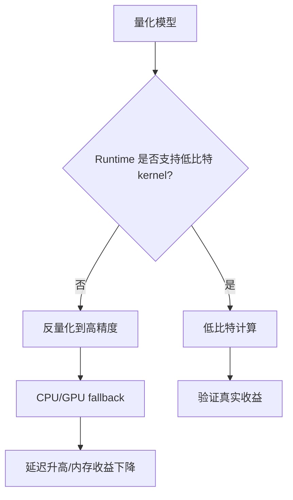

# 推理框架与部署链路

## 学习目标

- 理解模型从训练环境走向端侧设备的完整部署链路。
- 掌握 ONNX Runtime、TensorRT、TFLite、NCNN、MNN、Core ML、llama.cpp、ExecuTorch 和厂商 NPU SDK 的选型维度。
- 识别 unsupported op、CPU fallback、低比特 kernel 缺失、dynamic shape 等性能陷阱。
- 能用 llama.cpp 在 Ubuntu/NVIDIA 环境中完成本地推理和服务化验证。

## 问题背景

模型转换成功不代表性能达标。量化能否真正带来速度和内存收益，最终取决于目标设备、runtime、算子覆盖、低比特 kernel、fallback 行为和 profiling 结果。

对小型 LLM 来说，本课程选择 llama.cpp 作为实作 runtime，因为它对 GGUF、CPU/GPU 混合执行、本地 server 和多种量化格式支持成熟，适合作为课程中的可运行基线。

## 图示讲解




## 核心概念

| 环节 | 关键问题 | 检查方式 |
| --- | --- | --- |
| 模型格式 | runtime 是否能直接加载 | 文件格式、tokenizer、chat template |
| 量化格式 | 目标后端是否有 kernel | runtime 文档、启动日志、性能对比 |
| 图优化 | 算子是否融合或改写 | profiling、debug log |
| GPU offload | 有多少层放到 GPU | `-ngl`、VRAM 变化 |
| 服务化 | API 是否稳定可调用 | local server、HTTP smoke test |

## Runtime 选型地图

| Runtime | 更适合 | 课程中的定位 |
| --- | --- | --- |
| llama.cpp | GGUF、本地 LLM、CPU/GPU 混合、本地 server | 本课程实作主线 |
| ONNX Runtime | 跨平台传统模型和部分 Transformer 部署 | 理解通用部署链路 |
| TensorRT | NVIDIA GPU 上高性能推理 | 深入 NVIDIA 部署优化 |
| TensorRT-LLM | NVIDIA GPU 上 LLM 服务化优化 | 后续高级路线 |
| TensorFlow Lite | 移动端和嵌入式模型 | 传统端侧路线 |
| ExecuTorch | PyTorch 模型端侧部署 | PyTorch 生态端侧路线 |
| Core ML | Apple 设备 | iOS/macOS 部署 |
| MLC LLM | 跨平台 LLM 编译部署 | 移动端/浏览器/多后端探索 |

选型时不要先问“哪个框架最快”，而要先问目标设备、模型类型、低比特格式、算子覆盖、调试能力和团队维护成本。

## 代码/命令示例

llama.cpp 当前推荐使用 CMake 构建。NVIDIA GPU 路径可开启 CUDA 后端：

```bash
git clone https://github.com/ggml-org/llama.cpp.git
cd llama.cpp
cmake -B build -DGGML_CUDA=ON
cmake --build build --config Release -j
```

启动本地 OpenAI-compatible server：

```bash
./build/bin/llama-server \
  -m models/qwen/qwen2.5-1.5b-instruct-q4_k_m.gguf \
  -ngl 99 \
  --ctx-size 2048 \
  --host 0.0.0.0 \
  --port 8080
```

## 配套实作

对应实作章节：

- [Qwen 基线推理](/docs/lab-qwen-baseline)
- [本地 OpenAI-compatible 服务](/docs/lab-local-service)

实作重点不是追求最高速度，而是把 runtime 行为解释清楚：模型是否加载成功、GPU 是否参与、服务是否可调、日志是否显示异常 fallback。

## 验收结果

| 产物 | 验收标准 |
| --- | --- |
| llama.cpp 构建记录 | 能说明是否启用 CUDA |
| CLI 推理输出 | 同一 prompt 能稳定生成 |
| server smoke test | HTTP 请求能返回模型输出 |
| fallback 检查 | 启动日志没有明显 unsupported/fallback 问题 |

## 常见问题

- **构建成功但没有 GPU 加速**：需要确认 CMake 选项、驱动、CUDA runtime 和 `-ngl`。
- **server 可启动但回答异常**：优先检查模型是否匹配 chat template。
- **只看单次输出速度**：profiling 要至少区分 prefill、decode、首 token 和稳定 tokens/s。
- **忽略 API 层开销**：本地服务还要看并发、超时、请求体大小和错误恢复。

## 参考资料

- [llama.cpp build docs](https://github.com/ggml-org/llama.cpp/blob/master/docs/build.md)
- [Qwen llama.cpp 本地运行指南](https://qwen.readthedocs.io/en/v2.5/run_locally/llama.cpp.html)
- [NVIDIA CUDA Installation Guide for Linux](https://docs.nvidia.com/cuda/cuda-installation-guide-linux/)
- [ONNX Runtime documentation](https://onnxruntime.ai/docs/)
- [TensorRT documentation](https://docs.nvidia.com/deeplearning/tensorrt/latest/)
- [TensorRT-LLM documentation](https://nvidia.github.io/TensorRT-LLM/)
- [ExecuTorch documentation](https://pytorch.org/executorch/stable/)
- [MLC LLM documentation](https://llm.mlc.ai/docs/)
