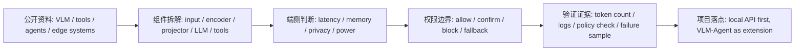
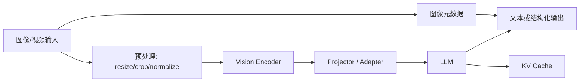
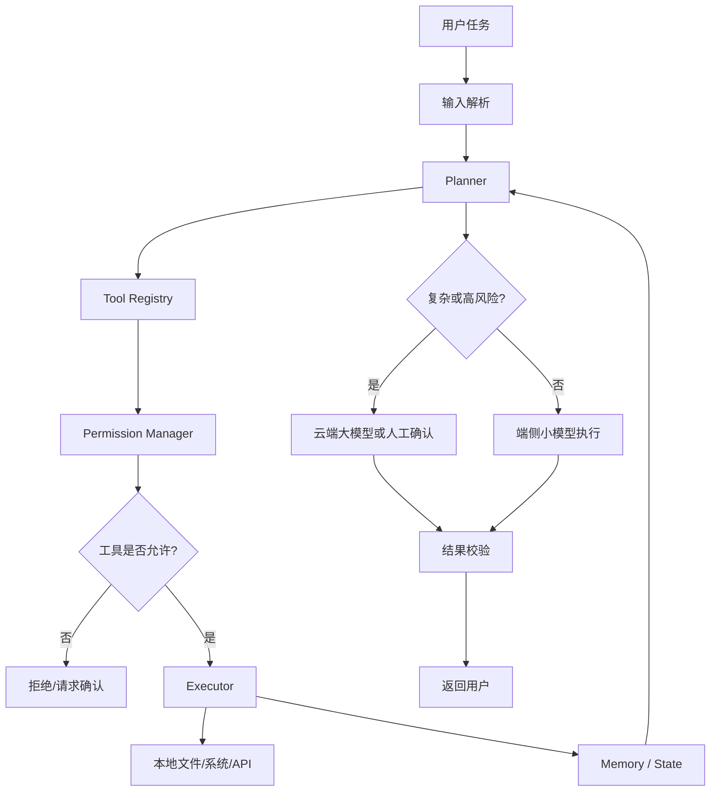
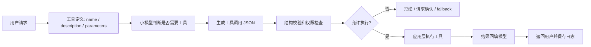
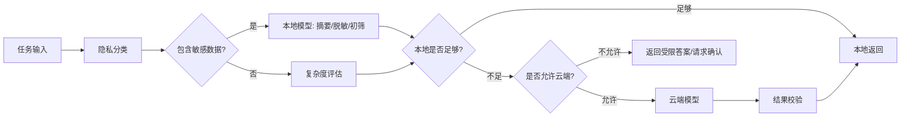

# VLM 与 Agent 端侧形态

## 建议学时

4 学时。

建议拆成四段：

| 时段 | 内容 | 课堂产出 |
| --- | --- | --- |
| 第 1 学时 | VLM 推理链路和端侧瓶颈 | VLM 组件拆解图 |
| 第 2 学时 | Local Agent 的规划、工具和权限 | Agent 权限边界表 |
| 第 3 学时 | 端云协同、多模型路由和 fallback | 端云协同架构草图 |
| 第 4 学时 | VLM/Agent 案例评审 | 系统级风险清单 |

## 学习目标

- 区分 VLM 的感知理解链路和 Agent 的规划执行链路。
- 理解 VLM 端侧瓶颈不只在 LLM，还包括图像分辨率、视觉 token、vision encoder、projector 和多模态对齐。
- 理解 Agent 的关键问题包括工具权限、状态管理、失败恢复、本地数据边界和端云协同。
- 能把单模型优化扩展到系统级部署判断。
- 能判断哪些 VLM/Agent 能端侧化，哪些只能局部端侧化。
- 能为最终项目报告写出 VLM/Agent 扩展路线，而不是只给概念性描述。

## 问题背景

VLM 与 Agent 的端侧部署已经从单模型优化扩展到系统架构优化。

VLM 要处理图像预处理、vision encoder、projector、LLM、tokenizer、多轮上下文和输出后处理。Agent 则包含 planner、tool registry、executor、memory、permission manager、safety policy 和交互循环。任何一个组件不稳定，系统就可能表现为“模型不好用”，但真实原因可能是输入、工具、权限、状态或 fallback 设计有问题。

因此，端侧 VLM/Agent 的瓶颈不只是模型大小，还包括输入管线、工具链稳定性、权限边界、本地上下文、失败恢复和端云协同策略。

本章不要求学生从零训练 VLM 或完整 Agent。课程目标是建立系统设计能力：看见组件、识别瓶颈、定义边界、设计可验证的端侧路径。

## 公开资料怎么转成本章内容

Hugging Face 多模态任务页、Transformers 文档、OpenAI Function Calling、OpenAI Agents SDK、Jetson AI Lab 和 ML Systems Book 都能补强本章。但这些资料更新快、框架差异大，本章只吸收稳定的系统概念：VLM 拆成输入、vision encoder、projector、LLM 和后处理；Agent 拆成 planner、tool registry、permission manager、executor、state 和 fallback。



| 外部资料中的经典内容 | 本章吸收什么 | 课程里的落点 |
| --- | --- | --- |
| Hugging Face image-text-to-text / Transformers | VLM 输入输出、processor、多模态模型形态 | VLM 链路图、视觉 token 估算和组件风险表 |
| Qwen / llama.cpp 多模态路线 | GGUF + mmproj 的本地 VLM 形态 | `llama-mtmd-cli` smoke test 和 projector 谨慎量化提醒 |
| OpenAI Function Calling | 工具 schema、参数边界和调用结果校验 | Agent 权限边界表和工具白名单 |
| OpenAI Agents SDK | agent、tool、handoff、guardrail、tracing 等系统概念 | 作为架构参考，不要求学生改用云端 SDK |
| Jetson AI Lab / Jetson docs | 边缘视觉、功耗、温度和节点分工 | Jetson 作为采集、预处理、小模型和权限节点 |
| ML Systems Book | 可靠性、状态、失败恢复和系统复盘 | 端云协同、状态管理和最终项目风险清单 |

下面这张原图来自 [microsoft/edgeai-for-beginners](https://github.com/microsoft/edgeai-for-beginners)，许可为 MIT。它适合作为 Local-first Agent 系统参考：本地 SLM、工具编排、人类确认、多模态输出和 observability 不是单一模型能力，而是一组系统组件。


Microsoft 课程还提供了一张 Agent workflow 插图。图内个别英文只作为原课程视觉参考，本课程的工程判断仍以下面的权限表、状态表和失败恢复流程为准。


把 Local-first Agent 原图贴进章节后，需要立刻落到三张课程表：组件表、权限表和证据表。这样学生看到的是系统边界，而不是把 Agent 当成一个“会自动做事”的模型。

| 原图组件 | 本章吸收成 | 学生需要能说明 |
| --- | --- | --- |
| Local SLM | 本地低风险 planner、formatter、summarizer | 哪些任务必须本地，哪些任务本地能力不足 |
| Tools / function calling | 静态白名单、schema、应用层执行 | 工具参数如何校验，模型能否绕过权限 |
| Human in the loop | 高风险动作确认点 | 哪些操作必须确认，确认记录保存在哪里 |
| Multimodal input/output | VLM 输入、图像预处理、文本输出 | 图像大小、视觉 token、projector 是否成为瓶颈 |
| Observability | 日志、trace、失败样例 | 保存哪些请求、工具结果和拒绝原因 |
| Cloud fallback | 脱敏后复杂推理或知识补全 | 什么时候允许云端，断网时如何退化 |

| 外部 VLM/Agent 资料 | 可以直接贴入的字段 | 本章转成的检查项 |
| --- | --- | --- |
| HF 多模态任务页 | input type、processor、image size、generated text | VLM 组件拆解和视觉 token 估算 |
| Qwen-VL / llama.cpp mtmd 文档 | language model、mmproj、image flag、backend | VLM smoke test 命令和 projector 风险 |
| OpenAI tools / function calling | tool name、description、JSON schema、tool result | Agent 工具契约和 policy validator |
| OpenAI Agents / tracing 概念 | agent、handoff、guardrail、trace | 本章只吸收系统概念，不改成云端 SDK 实验 |
| Microsoft EdgeAI | local-first、SLM/LLM 分工、人工确认 | 端云协同路由和权限边界 |

OpenAI Function Calling 和 Agents SDK 文档里的概念可以直接转成 Agent 安全记录表。本课程不要求使用云端 SDK，但要吸收这些系统字段：

| 官方文档概念 | 本章吸收什么 | 本地/端侧记录字段 |
| --- | --- | --- |
| Function tools | 工具必须有名称、schema、参数和返回值 | tool name、JSON schema、参数校验、返回摘要 |
| Strict / structured output | 输出格式应先被机器校验，再进入执行 | schema validator、失败重试、拒绝执行记录 |
| Handoffs / agents as tools | 复杂任务可以委托给更合适的模型或子流程 | handoff 条件、目标 agent、回退策略 |
| Guardrails | 输入输出都要有安全和策略检查 | blocked tools、confirm_required、policy result |
| Human in the loop | 高风险动作不应直接自动执行 | 人工确认点、确认内容、超时策略 |
| Sessions / memory | 状态会影响后续工具调用 | session id、可保存字段、敏感字段清理 |
| Tracing | Agent 结论要能回放每一步 | trace id、tool call log、错误和恢复路径 |

所以，本章不是“搭一个完整 Agent demo”，而是让学生能判断：哪些组件适合本地，哪些需要云端或人工确认，哪些风险必须先写进报告。

## VLM 端侧链路

VLM 的一次推理通常比纯文本 LLM 多出视觉侧处理。



每个环节都有端侧部署问题：

| 环节 | 端侧风险 | 需要记录 |
| --- | --- | --- |
| 图像输入 | 分辨率过高、帧率过高、摄像头延迟 | 输入尺寸、帧率、预处理耗时 |
| 预处理 | CPU 占用、内存复制、格式转换 | resize/crop 策略、数据格式 |
| Vision Encoder | 算子支持、显存/内存占用 | 模型大小、runtime、推理耗时 |
| Projector | 多模态对齐、精度敏感 | 是否量化、输出质量变化 |
| LLM | KV Cache、低比特、首 token | ctx-size、tokens/s、质量样例 |
| 输出后处理 | 格式不稳定、幻觉、坐标错误 | JSON 合法性、人工检查、失败样例 |

## VLM 的端侧部署形态

VLM 不一定要完整放在端侧。常见形态如下：

| 形态 | 端侧运行 | 云端运行 | 适用场景 |
| --- | --- | --- | --- |
| 纯端侧 VLM | 视觉侧 + LLM | 无 | 隐私强、输入规模小、任务简单 |
| 视觉端侧 + 云端 LLM | 图像预处理、视觉特征、OCR 初筛 | 复杂语言推理 | 图片含隐私但可上传脱敏文本 |
| 端侧小 VLM + 云端兜底 | 快速识别、低风险问题 | 高难问题、长上下文 | 交互产品、巡检助手 |
| 端侧检测 + LLM 解释 | 传统视觉模型 | 语言总结、原因分析 | 工业视觉、安防、设备巡检 |

课程建议先从“拆分组件”开始，而不是直接追求完整本地 VLM。对很多产品来说，端侧视觉前处理和本地隐私过滤已经能产生价值。

## VLM 量化与加速关注点

VLM 量化不能只看语言模型部分。

| 优化对象 | 常见方法 | 风险 |
| --- | --- | --- |
| Vision Encoder | INT8、TensorRT、ONNX、分辨率控制 | 小目标、OCR、空间关系下降 |
| Projector | 保持高精度或谨慎量化 | 对齐质量下降，错误难以定位 |
| LLM | GGUF、AWQ、GPTQ、KV Cache 控制 | 文本质量、长上下文、格式稳定性 |
| 输入管线 | resize、batch、缓存、零拷贝 | 图像质量损失或工程复杂度上升 |
| 输出约束 | JSON schema、规则校验、重试 | 延迟增加，错误恢复复杂 |

如果 VLM 任务涉及 OCR、小目标、图表理解或空间关系，低比特量化后的质量下降可能比纯文本任务更难通过主观观察发现。课程要求保留失败样例。

视觉输入的成本可以量化。图像经过 vision encoder 后变成视觉 token 拼进上下文，数量近似为：

$$
n_{vis} \approx \frac{H \times W}{p^2 \times m}
$$

$H \times W$ 是输入分辨率，$p$ 是 patch 大小，$m$ 是 projector 的 token 合并因子（例如 Qwen2-VL 把每 2×2 个 patch 合并成 1 个 token，$m = 4$）。一张 1024×1024 的图按 $p = 14$、$m = 4$ 计算约 1300 个 token——相当于一篇短文的 prefill 成本，而且全部进入 KV Cache。

这个公式解释了两个工程现象：分辨率是 VLM 延迟最直接的旋钮；多图或视频输入会很快撑爆端侧的上下文和内存预算。

## Agent 系统链路

Agent 的端侧部署更像一个受控系统，而不是一个单模型推理任务。



Agent 端侧化的关键不是“模型会不会调用工具”，而是“工具调用是否可控、可回滚、可审计”。

## Function Calling 工作流

Microsoft EdgeAI for Beginners 的 Function Calling 模块把工具调用拆成：工具定义、意图识别、参数抽取、JSON 输出、外部执行、结果回填。本课程采用同样的系统边界，但只要求学生实现可验证的本地白名单流程。



| 阶段 | 最容易出错的点 | 本课程最低检查 |
| --- | --- | --- |
| 工具定义 | 描述太宽泛，参数类型不明确 | 每个参数有类型、范围和默认值说明 |
| 意图识别 | 小模型误判需要调用高风险工具 | 高风险工具不直接暴露给模型 |
| JSON 输出 | 格式合法但字段冲突或缺必填参数 | 先跑 schema / policy validator |
| 外部执行 | 模型输出被当成可信命令直接执行 | 应用层二次校验，不让模型绕过权限 |
| 结果回填 | 工具失败被模型编造成成功 | 工具返回必须带 status/error |
| 日志记录 | 保存了敏感路径或原始隐私数据 | 日志脱敏，并保留失败原因 |

这个流程解释了为什么本课程的 Agent 实验只让模型生成策略草案，不让它直接操作系统。Function calling 的安全边界在应用层，不在模型文本里。

## Agent 权限边界

端侧 Agent 接近真实系统操作，必须先定义工具权限。

```json
{
  "allowed_tools": ["read_local_note", "summarize_text", "search_local_index"],
  "confirm_required": ["rename_file", "move_file", "send_request"],
  "blocked_tools": ["delete_file", "send_email", "run_shell"],
  "fallback": "cloud_model_when_task_requires_complex_reasoning"
}
```

推荐把工具分成四类：

| 类别 | 示例 | 默认策略 |
| --- | --- | --- |
| 只读工具 | 读取笔记、查询本地索引、查看图片元数据 | 可允许，但要限制路径和范围 |
| 可逆写入 | 新建草稿、生成报告、标记分类 | 可执行，但要保留日志 |
| 高风险操作 | 删除、发送、支付、设备控制 | 默认禁止或必须确认 |
| 外部联网 | 云端检索、远程 API、模型 fallback | 需要隐私和网络策略 |

## 端侧 Agent 的状态管理

Agent 经常失败在状态，而不是单次推理。

| 状态 | 风险 | 处理建议 |
| --- | --- | --- |
| 对话历史 | 上下文膨胀、隐私泄露 | 摘要、截断、分级保存 |
| 工具结果 | 旧结果被误用 | 给每次工具结果加时间和来源 |
| 用户偏好 | 过度个性化或错误记忆 | 可查看、可删除、可关闭 |
| 任务进度 | 中断后重复执行 | 使用步骤状态和确认点 |
| 错误日志 | 泄露路径或敏感内容 | 脱敏后保存 |

端侧 Agent 的“记忆”不应该默认永久保存。课程建议先实现短期状态和显式项目记录，再讨论长期记忆。

## 端云协同 Agent

本地小模型适合处理隐私、低延迟和格式化任务；云端大模型适合复杂推理、长上下文和知识密集任务。

Microsoft EdgeAI 课程强调 SLM 更适合高频、结构化、工具型工作流，LLM 更适合开放式复杂推理。本课程把它落成下面这张路由表：

| 任务类型 | 本地 SLM 优先 | 云端/大模型优先 | 路由证据 |
| --- | --- | --- | --- |
| 固定格式抽取 | 是 | 否 | 输出 schema 通过率、tokens/s、失败样例 |
| 本地日志摘要 | 是 | 只在脱敏后兜底 | 日志敏感级别、摘要质量、是否离线 |
| 工具参数生成 | 是，但必须校验 | 高风险任务需人工确认 | policy validator 结果 |
| 长文复杂推理 | 只做摘要或预筛 | 是 | 上下文长度、质量备注、超时记录 |
| 创意开放问答 | 不作为主路径 | 是 | 质量要求和用户体验 |
| 设备控制 | 只读或建议 | 仍需应用层权限 | 工具等级、确认记录、回滚能力 |



端云协同需要明确三种规则：

- 隐私规则：哪些内容只能本地处理。
- 能力规则：哪些任务本地模型不应硬做。
- 失败规则：本地失败、云端失败、网络失败时如何退化。

## Jetson 上的 VLM/Agent 形态

Jetson 在 VLM/Agent 中更适合作为边缘节点，而不是所有能力的唯一承载点。

| 形态 | Jetson 职责 | 其他组件 | 适用场景 |
| --- | --- | --- | --- |
| 摄像头 + 视觉模型 | 图像采集、检测、告警 | 云端报表或人工复核 | 工业巡检、安防 |
| Jetson + 小 LLM | 本地问答、状态解释、轻量总结 | 云端知识库或大模型 | 设备运维助手 |
| Jetson + VLM 初筛 | 低分辨率理解、隐私过滤 | 云端复杂视觉问答 | 机器人、现场助手 |
| Jetson Agent 节点 | 本地工具调用、传感器状态、权限控制 | 云端 planner | 边缘自动化 |

评估 Jetson 方案时要记录温度、功耗模式和长时间运行稳定性。VLM/Agent 通常比单次 LLM 推理更容易暴露系统问题。

## 代码/命令示例

本地服务是 VLM/Agent 的基础组件。先确认 OpenAI-compatible API 可被调用。

```python
from openai import OpenAI

client = OpenAI(
    base_url="http://127.0.0.1:8080/v1",
    api_key="local-no-key",
)

response = client.chat.completions.create(
    model="local-model",
    messages=[
        {"role": "system", "content": "你是一个只处理低风险本地任务的助手。"},
        {"role": "user", "content": "把这段日志总结成三条问题。"},
    ],
)

print(response.choices[0].message.content)
```

llama.cpp 的多模态入口是 mtmd 工具。VLM 的 GGUF 由两个文件组成：语言模型主体和 mmproj（vision encoder 加 projector）：

```bash
mkdir -p ~/edge-ai-lab/vlm ~/edge-ai-lab/logs

./build/bin/llama-mtmd-cli \
  -m models/qwen/Qwen2-VL-2B-Instruct-Q4_K_M.gguf \
  --mmproj models/qwen/mmproj-Qwen2-VL-2B-Instruct-f16.gguf \
  --image ~/edge-ai-lab/vlm/test-chart.png \
  -p "用三句话描述这张图表的主要结论。" \
  -ngl 99 \
  2>&1 | tee ~/edge-ai-lab/logs/vlm-smoke.txt
```

注意 mmproj 文件通常保持 f16，这正是“projector 谨慎量化”在工具链里的体现。多模态工具名和 flag 随版本变化较快（旧版本叫 llama-llava-cli），以当前版本 `--help` 为准。

Agent 工具注册建议先用静态白名单：

```yaml
tools:
  read_local_note:
    mode: read_only
    path_scope: ./workspace/notes
  summarize_text:
    mode: transform
    network: false
  run_shell:
    mode: blocked
    reason: requires explicit human approval
```

实跑记录：

- [final agent review run](https://github.com/neardws/edge-ai-deployment-course-runs/tree/main/runs/2026-06-29-final-agent-review)

本地小模型可以生成工具策略草案，但不能直接执行。实跑中模型两次返回了合法 JSON，却把同一个工具同时放进 `allowed_tools` 和 `blocked_tools`。因此 Agent 输出至少要经过结构和权限校验。

课程提供一个最小校验脚本：

```bash
python3 labs/scripts/validate_agent_policy.py agent-policy.json
```

它只检查三件事：必需字段存在、三个工具集合互斥、高风险工具不能直接允许。更复杂的业务权限应在应用层继续加规则。

## 配套实作

对应实作章节：[本地 OpenAI-compatible 服务](/docs/lab-local-service)。

本课程第一阶段不直接部署完整 VLM 或完整 Agent，而是先完成本地 LLM 服务化。它是后续 VLM/Agent 的基础组件：

- VLM 可以把 LLM server 作为文本推理模块。
- Agent 可以把本地小模型作为低风险任务 planner、summarizer 或 formatter。
- 端云协同可以把本地 server 作为隐私优先路径。
- Jetson 可以作为边缘节点承载采集、预处理、小模型推理和权限控制。

## 验收结果

| 产物 | 验收标准 |
| --- | --- |
| VLM 链路图 | 能指出 vision encoder、projector、LLM、输入管线各自可能的瓶颈 |
| Agent 权限表 | 能区分允许、确认、拒绝、需要云端兜底的工具 |
| 端云协同图 | 能说明本地、云端、fallback 和隐私边界 |
| 服务化基线 | 本地 LLM server 可被后续 VLM/Agent 组件调用 |
| 风险清单 | 至少覆盖权限、状态、输出格式、网络和日志脱敏 |

## 案例模板：VLM

```markdown
## VLM 任务

- 输入类型：
- 图像分辨率：
- 输出类型：
- 是否涉及隐私：
- 是否需要实时：

## 组件拆解

| 组件 | 模型/工具 | 是否端侧运行 | 风险 |
| --- | --- | --- | --- |
| 预处理 | 待填 | 待填 | 待填 |
| Vision Encoder | 待填 | 待填 | 待填 |
| Projector | 待填 | 待填 | 待填 |
| LLM | 待填 | 待填 | 待填 |
| 后处理 | 待填 | 待填 | 待填 |

## 质量样例

- 成功样例：
- 失败样例：
- 需要人工复核的样例：
```

## 案例模板：Agent

```markdown
## Agent 任务

- 用户目标：
- 本地数据范围：
- 可用工具：
- 禁止工具：
- 是否允许云端兜底：

## 工具权限表

| 工具 | 权限级别 | 是否需要确认 | 日志要求 |
| --- | --- | --- | --- |
| 待填 | 待填 | 待填 | 待填 |

## 失败恢复

- 本地模型输出格式错误：
- 工具调用失败：
- 网络不可用：
- 用户拒绝授权：
```

## 复盘问题

- VLM 任务失败时，如何判断问题来自图像侧、projector、LLM 还是后处理？
- 对 OCR、小目标和空间关系任务，为什么不能只看普通文本问答质量？
- Agent 端侧运行时，哪些工具必须默认禁止？
- 本地小模型不够聪明时，是换模型、降低任务复杂度，还是引入云端 fallback？
- Jetson 作为边缘节点时，哪些组件应本地运行，哪些组件应放到云端？
- 如何在日志里保留足够证据，同时避免泄露本地路径和敏感内容？

## 常见问题

- **只压缩 LLM**：VLM 的图像侧、projector 和输入管线也可能是瓶颈。
- **忽略工具权限**：Agent 端侧运行更接近真实系统操作，权限边界必须先定义。
- **只检查 JSON 合法**：合法 JSON 不代表权限策略安全，仍需检查集合冲突和高风险工具。
- **把端侧当成全离线**：很多产品更适合端云协同，而不是强行全端侧。
- **没有失败恢复**：工具调用失败、网络失败、输出格式错误都需要恢复策略。
- **把 demo 当产品**：一次成功调用不能证明权限、状态和日志策略可用。

## 作业

### 阅读题

1. 查阅 Qwen2-VL 或同类开源 VLM 的模型卡，找出它的 patch 大小和视觉 token 合并方式，验证本章公式的参数取值。

### 检查题

1. 用视觉 token 公式估算 512×512 和 1024×1024 输入的 token 数，说明分辨率对 prefill 成本的影响是几倍量级。
2. VLM 三个组件（vision encoder、projector、LLM）中，为什么 projector 最不建议激进量化？
3. Agent 工具白名单中 `run_shell` 被设为 blocked。从权限边界角度说明理由，并给出允许它的最小安全条件。

### 实验题

1. 用 `llama-mtmd-cli` 跑通一次本地 VLM 推理，从启动日志记录视觉 token 数、首 token 延迟和总耗时，与等长纯文本 prompt 对比。
2. 用案例模板拆解一个你身边的 VLM 或 Agent 场景，标注端侧/云端分工、延迟预算和工具权限表。

## 参考资料

本章吸收方式：

- **知识点**：从 HF 多模态任务、Transformers、OpenAI Function Calling、Microsoft EdgeAI、Jetson AI Lab 和 ML Systems Book 吸收 VLM 组件、工具权限、端云协同和失败恢复。
- **图解**：直接嵌入 Microsoft MIT 许可的 local-first agent 架构图和 workflow 插图，再把多模态和 Agent 资料重画为 VLM 推理链路、工具权限表和端云协同图。
- **实验**：VLM/Agent 任务必须记录视觉 token、延迟、工具白名单、确认策略和失败恢复。
- **取舍**：不追逐快速变化的框架接口，也不把 demo 成功等同于产品可用。

- [Qwen llama.cpp 本地运行指南](https://qwen.readthedocs.io/en/v2.5/run_locally/llama.cpp.html)
- [llama.cpp 项目](https://github.com/ggml-org/llama.cpp)
- [Hugging Face Transformers documentation](https://huggingface.co/docs/transformers/index)
- [Hugging Face Vision-Language Models task guide](https://huggingface.co/tasks/image-text-to-text)
- [OpenAI Function Calling guide](https://platform.openai.com/docs/guides/function-calling)
- [OpenAI Agents SDK documentation](https://openai.github.io/openai-agents-python/)
- [microsoft/edgeai-for-beginners](https://github.com/microsoft/edgeai-for-beginners)
- [NVIDIA Jetson AI Lab](https://www.jetson-ai-lab.com/)
- [The Machine Learning Systems Book](https://www.mlsysbook.ai/)
