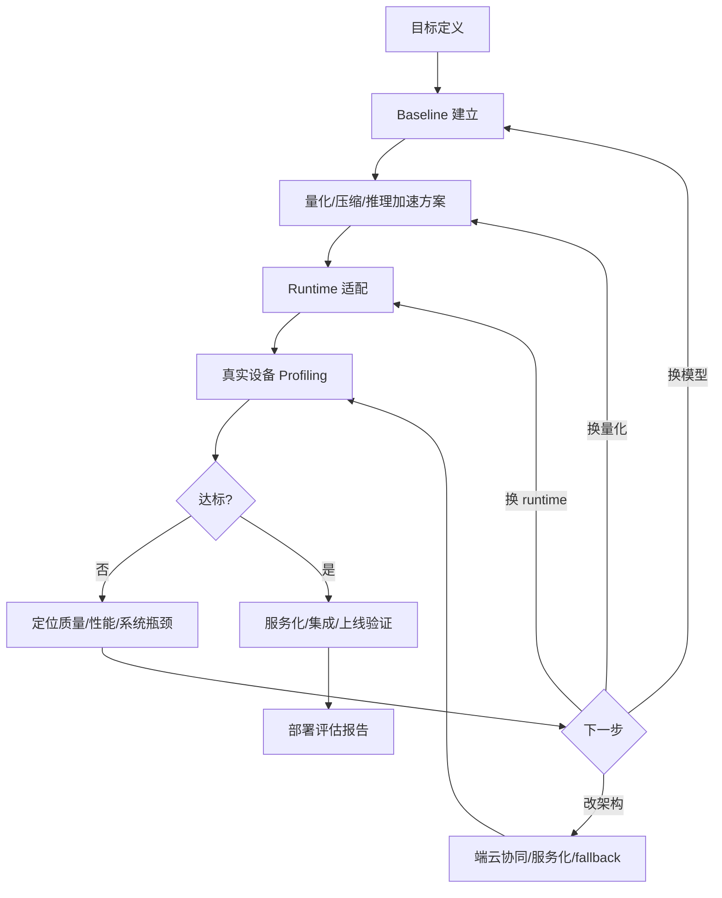

# 案例串联与复盘

## 建议学时

4 学时。

建议拆成四段：

| 时段 | 内容 | 课堂产出 |
| --- | --- | --- |
| 第 1 学时 | 传统视觉模型案例 | 视觉部署评审表 |
| 第 2 学时 | 小型 LLM 案例 | Qwen 部署复盘表 |
| 第 3 学时 | VLM/Agent 与端云协同案例 | 系统架构复盘图 |
| 第 4 学时 | 最终项目报告展示与答辩 | 端侧部署评估报告 |

## 学习目标

- 把端侧部署问题框架、量化、精度修复、压缩蒸馏、推理加速、runtime 和系统架构串成完整工程路径。
- 能复盘传统视觉模型、小型 LLM、VLM 和 Hybrid Agent 的不同优化路线。
- 能输出一份可执行、可评审的端侧部署方案。
- 能比较 Ubuntu Server 和 Jetson 两条部署路径的收益与限制。
- 能把失败样例、异常日志和未达标原因写入报告，而不是只展示最好结果。
- 能判断一个 40+ 学时课程最终项目的体量是否足够支撑真实学习成果。

## 问题背景

课程最后不再只做 Q&A，而是用案例把全书内容串起来。不同模型形态的优化路径不同，不能用同一套指标粗暴套用。

传统视觉模型更关注 INT8 PTQ/QAT、结构化剪枝、TensorRT/TFLite/ONNX Runtime 和真实设备延迟；小型 LLM 更关注 GGUF、AWQ/GPTQ、INT4/INT5、group size、KV Cache、首 token、tokens/s 和本地 runtime；VLM 和 Hybrid Agent 还需要系统级架构设计。

本章的重点是“复盘能力”。学习者需要解释：为什么这样选模型，为什么这样选量化，为什么这样选 runtime，为什么这个结果可以或不可以上线。

## 总体复盘闭环



这个闭环要求每一步都有证据。没有证据的“感觉更快”“好像质量还可以”不能作为课程项目结论。

## 案例一：传统视觉模型

传统视觉模型是端侧部署最成熟的路径之一。它适合讲清楚量化、runtime 和硬件加速之间的关系。

| 项目 | 复盘问题 | 常见证据 |
| --- | --- | --- |
| 模型选择 | 模型是否适合目标输入和设备 | 模型结构、输入尺寸、参数量、任务指标 |
| 量化方式 | PTQ 是否足够，是否需要 QAT | 校准数据、精度对比、失败样例 |
| Runtime | TensorRT、ONNX Runtime、TFLite 是否适配 | 导出日志、算子支持、推理日志 |
| 设备 | Ubuntu GPU、Jetson、移动端差异 | `nvidia-smi`、`tegrastats`、设备信息 |
| 稳定性 | 长时间运行是否降频或内存泄漏 | 连续运行日志、温度记录 |

视觉模型案例不要求本课程每个学生完整训练模型，但要能读懂一个视觉部署方案的关键风险。

## 案例二：Qwen 小型 LLM

本课程主线项目围绕 Qwen 小模型、本地量化和 llama.cpp 展开。

| 阶段 | 任务 | 产出 |
| --- | --- | --- |
| Baseline | 跑通 FP16 或指定 GGUF 模型 | 加载日志、基础响应样例 |
| 量化对比 | 比较 Q8/Q5/Q4 等格式 | 结果表，不编造数字 |
| KV Cache | 改变 ctx-size 观察内存和速度 | 上下文长度记录 |
| Runtime | 调整 GPU offload、threads、server | 命令和日志 |
| 服务化 | 暴露 OpenAI-compatible API | Python smoke test |
| 复盘 | 写部署评估报告 | 结论、风险、下一步 |

LLM 案例的复盘必须同时看“能否回答”和“能否稳定服务”。如果只展示一次问答成功，不能算完成部署。

## 案例三：Jetson 迁移

Jetson 迁移案例用于验证学习者是否理解端侧硬件约束。

| 对比项 | Ubuntu Server | Jetson | 需要解释 |
| --- | --- | --- | --- |
| 模型加载 | 待填 | 待填 | 文件大小、内存、runtime |
| 首 token | 待填 | 待填 | prefill、GPU offload、上下文 |
| tokens/s | 待填 | 待填 | decode、kernel、功耗模式 |
| 内存峰值 | 待填 | 待填 | 显存/共享内存、KV Cache |
| 温度/功耗 | 通常非主线 | 待填 | 热稳定性、功耗模式 |
| 失败日志 | 待填 | 待填 | 依赖、编译、OOM、fallback |

Jetson 的目标不是证明它比服务器更快，而是证明方案是否能迁移到边缘约束下运行，并能解释差异。

## 案例四：VLM 与 Hybrid Agent

VLM 和 Hybrid Agent 用于把课程从单模型部署扩展到系统架构。

| 案例 | 端侧部分 | 云端部分 | 复盘重点 |
| --- | --- | --- | --- |
| 图片问答 | 预处理、小模型初筛 | 复杂 VLM 问答 | 隐私、图像质量、fallback |
| 工业巡检 | Jetson 采集、检测、告警 | 趋势分析、报告生成 | 实时性、误报、稳定性 |
| 本地文件助手 | 本地索引、摘要、权限控制 | 高级推理或知识补全 | 工具权限、数据边界 |
| 设备运维 Agent | 本地状态读取和规则处理 | 云端 planner 或专家模型 | 安全边界、人工确认 |

这类案例的复盘不能只写“使用 Agent”。必须画出组件、数据流、权限边界和失败路径。

## 核心概念回收

| 课程模块 | 在复盘中如何体现 |
| --- | --- |
| 前置知识 | 能解释 tokenizer、prefill/decode、KV Cache、memory footprint |
| 端侧框架 | 能说明任务、硬件、runtime、端云协同的选择 |
| 量化压缩 | 能比较不同量化格式和质量风险 |
| 推理加速 | 能区分模型变小、算子加速、runtime 调优和硬件加速 |
| Ubuntu/Jetson 实作 | 能把同一方案放到两类硬件上比较 |
| Profiling | 能记录并解释延迟、tokens/s、内存、温度和失败日志 |
| VLM/Agent | 能从单模型走向系统设计 |

## 最终项目要求

最终项目建议以“端侧 Qwen 小模型部署评估报告”为主线，也可以扩展到视觉、VLM 或 Agent 场景。

必须包含：

| 模块 | 最低要求 |
| --- | --- |
| 项目背景 | 说明任务、目标用户、端侧必要性和约束 |
| 模型选择 | 说明模型来源、尺寸、许可证和选择理由 |
| 环境记录 | Ubuntu Server 或 Jetson 的设备信息和软件栈 |
| Baseline | 原始运行命令、日志和输出样例 |
| 量化对比 | 至少两种量化格式或参数设置，不编造数字 |
| 推理加速 | 至少一次 runtime 参数或硬件路径对比 |
| Profiling | 延迟、tokens/s、内存、温度/功耗或 CPU/GPU 使用记录 |
| 服务化 | 如果做 LLM，建议提供本地 API smoke test |
| 风险复盘 | 质量、性能、内存、许可证、维护和安全边界 |
| 结论 | 当前是否可用，下一步如何优化 |

加分项：

- Ubuntu Server 与 Jetson 双路径对比。
- VLM 或 Agent 的端云协同设计。
- 失败样例分类和质量修复建议。
- 自动化记录脚本或 profiling 模板。

## 最终报告模板

```markdown
# 端侧模型部署评估报告

## 1. 项目背景

- 任务：
- 目标用户：
- 为什么需要端侧：
- 隐私/网络/成本/实时性约束：

## 2. 方案概览

| 项目 | 选择 | 理由 |
| --- | --- | --- |
| 模型 | 待填 | 待填 |
| 量化格式 | 待填 | 待填 |
| Runtime | 待填 | 待填 |
| 硬件 | 待填 | 待填 |
| 服务形态 | 待填 | 待填 |

## 3. 实验结果

| 实验 | 命令/参数 | 结果 | 证据 |
| --- | --- | --- | --- |
| Baseline | 待填 | 待填 | 日志 |
| 量化对比 | 待填 | 待填 | 表格 |
| 推理加速 | 待填 | 待填 | 日志 |
| Jetson 迁移 | 待填 | 待填 | tegrastats |

## 4. 失败样例

| 样例 | 现象 | 可能原因 | 下一步 |
| --- | --- | --- | --- |
| 待填 | 待填 | 待填 | 待填 |

## 5. 结论

- 当前是否达到业务可用：
- 最大瓶颈：
- 下一步建议：
```

## 课堂答辩问题

教师或同学可以用下面的问题检查项目质量：

- 这个任务为什么必须端侧部署，云端方案有什么不足？
- 当前模型选择是否过大或过小，有没有替代方案？
- 量化后质量是否下降，证据是什么？
- 低比特模型是否真的更快，还是只是更小？
- Runtime 是否真正使用了目标硬件后端？
- 上下文长度变化时，KV Cache 如何影响内存和速度？
- Jetson 上是否记录了功耗模式和温度？
- 服务化后如何处理并发、超时、日志和重启？
- 如果本地模型失败，端云协同或人工确认如何介入？
- 当前方案最大的上线风险是什么？

## 评分建议

| 维度 | 比例 | 评价重点 |
| --- | --- | --- |
| 问题定义 | 15% | 任务、约束、端侧必要性是否清楚 |
| 技术路线 | 20% | 模型、量化、runtime、硬件选择是否有理由 |
| 实验记录 | 25% | 命令、日志、表格和失败样例是否完整 |
| 系统设计 | 20% | 服务化、端云协同、权限和 fallback 是否考虑 |
| 复盘表达 | 20% | 能否解释瓶颈、风险和下一步 |

评分不应鼓励“跑出最高数字”，而应鼓励可复现、可解释、可改进的工程报告。

## 代码/命令示例

部署评审清单可以以 Markdown 表格保存，作为每个项目的复盘模板：

```markdown
| 项目 | 当前结论 | 证据 | 下一步 |
| --- | --- | --- | --- |
| Baseline | 待填 | 待填 | 待填 |
| 量化格式 | 待填 | 待填 | 待填 |
| Runtime | 待填 | 待填 | 待填 |
| 首 token | 待填 | 待填 | 待填 |
| tokens/s | 待填 | 待填 | 待填 |
| 峰值显存/内存 | 待填 | 待填 | 待填 |
| 温度/功耗 | 待填 | 待填 | 待填 |
| 质量风险 | 待填 | 待填 | 待填 |
```

## 配套实作

对应实作章节：

- [Qwen GGUF 量化对比实验](/docs/lab-qwen-quantization)
- [推理加速实验](/docs/lab-inference-acceleration)
- [Profiling 与结果记录](/docs/lab-profiling)
- [Jetson 环境与 Qwen 迁移](/docs/lab-jetson-setup)
- [本地 OpenAI-compatible 服务](/docs/lab-local-service)

最终实作复盘应回答：

- 当前 Qwen 小模型是否达到课程定义的“业务可用”。
- 如果没有，是质量、速度、内存、runtime、硬件还是服务化问题。
- 下一轮应该换量化类型、换模型尺寸、调 runtime 参数，还是改变系统架构。
- 如果迁移到 Jetson，主要差异来自性能、内存、功耗、温度还是模型质量。
- 如果扩展到 VLM/Agent，哪些组件应端侧运行，哪些组件应云端兜底。

## 验收结果

| 产物 | 验收标准 |
| --- | --- |
| 小型 LLM 复盘表 | 从目标、baseline、量化、runtime、profiling 到结论完整记录 |
| 风险清单 | 至少覆盖质量、延迟、显存/内存、许可证、模型来源和部署维护 |
| 后续路线 | 能明确下一步是继续优化、换模型、换 runtime 还是端云协同 |
| Ubuntu vs Jetson 对比 | 能说明两个硬件路径各自适合的部署场景 |
| 最终项目报告 | 能被别人按命令和表格复现实验过程 |

## 常见问题

- **只汇报最好结果**：复盘需要保留失败样例和参数，才能指导下一轮。
- **把模型问题和系统问题混在一起**：输出差、速度慢、服务不稳要分开定位。
- **没有验收阈值**：没有阈值就无法判断“是否达标”。
- **忽略上线后的环境差异**：开发机、测试机和目标设备的驱动、温度、并发和网络都可能不同。
- **把报告写成命令集合**：命令只是证据，报告还必须解释决策和风险。

## 作业

### 复盘题

1. 把四个案例中的任意一个换成你自己的业务场景，重写“部署判断”，说明哪些结论可以直接迁移、哪些必须重新实验。
2. 从你的全部实验记录中挑出一个失败样例（OOM、质量退化、降频或服务超时），按“现象、证据、归因、下一步”四段写一份复盘。

### 报告题

1. 按最终报告模板完成部署评估报告初稿，并用[自学与实作粒度标准](/docs/self-study-granularity)的学生自查清单逐项自查。
2. 互评：与同学交换报告，用本章评分建议表打分，并写出三条可执行的改进意见。

## 参考资料

本章吸收方式：

- **知识点**：从 llama.cpp、Qwen、Jetson、Nsight、MLPerf 和 ML Systems Book 吸收案例复盘、系统指标和报告证据链。
- **图解**：把外部 benchmark 和系统课程思路重画为项目复盘表、风险清单和评分建议。
- **实验**：最终复盘必须串起 baseline、量化、runtime、profiling、Jetson、服务化和失败样例。
- **取舍**：不奖励最高单项数字，优先评估可复现、可解释、可改进的工程报告。

- [llama.cpp 项目](https://github.com/ggml-org/llama.cpp)
- [Qwen llama.cpp 本地运行指南](https://qwen.readthedocs.io/en/v2.5/run_locally/llama.cpp.html)
- [NVIDIA Container Toolkit Install Guide](https://docs.nvidia.com/datacenter/cloud-native/container-toolkit/latest/install-guide.html)
- [NVIDIA Jetson documentation](https://docs.nvidia.com/jetson/)
- [NVIDIA Nsight Systems](https://developer.nvidia.com/nsight-systems)
- [MLPerf Inference](https://mlcommons.org/benchmarks/inference/)
- [The Machine Learning Systems Book](https://www.mlsysbook.ai/)
