# 40/60 学时教学安排

## 本页目标

本课程按正式课程体量设计，而不是一次性的专题分享。完整版本为 **60 学时**，可以裁剪为 **40 学时基础版**。这里的“学时”按 45-50 分钟理解，包含讲授、演示、实验、讨论、作业说明和项目复盘。

课程的主线是：从端侧部署问题框架出发，循序渐进学习量化压缩、模型微调、runtime 与推理加速，再在 Ubuntu Server、NVIDIA Jetson 和移动端路线图三类视角下完成 Qwen 小模型部署评估。

## 60 学时完整版

| 部分 | 内容 | 学时 | 产出 |
| --- | --- | ---: | --- |
| 导读 | 课程定位、资料取舍、项目主线、学习路径 | 2 | 学习路线图 |
| Part I 前置知识与工具链 | ML 推理、Transformer/LLM、量化数学、Linux/GPU/Jetson 工具链 | 6 | 基础概念检查表 |
| Part II 端侧部署问题框架 | 场景、指标、端云协同、硬件约束、项目评估 | 6 | 端侧部署评估模板 |
| Part III 量化与压缩 | PTQ/QAT、INT8/INT4、LLM 量化、KV Cache、精度修复、蒸馏压缩 | 12 | 量化路线选择表 |
| Part IV 模型微调与数据适配 | 是否微调、instruction 数据、chat template、LoRA/QLoRA、adapter、再量化和部署回归 | 10 | 微调决策表和输出对比 |
| Part V Runtime 与推理加速 | 图优化、算子融合、TensorRT、TensorRT-LLM、llama.cpp、vLLM、MLC、fallback | 9 | Runtime 选型矩阵 |
| Part VI Ubuntu / Jetson / 移动端实作 | Ubuntu Server、Jetson Orin、Qwen GGUF、profiling、API 服务、移动端路线图 | 8 | 实验日志和性能对比 |
| Part VII VLM、Agent 与最终复盘 | 视觉、小型 LLM、VLM、Agent、最终项目报告 | 7 | 端侧部署评估报告 |
| **合计** |  | **60** |  |

Part IV 单独用于模型微调闭环：判断是否需要微调、准备 instruction 数据、检查 chat template、运行 Qwen LoRA/QLoRA smoke test、对比基座和 adapter 输出，并判断是否进入合并、量化和端侧 profiling。

## 40 学时裁剪版

40 学时版本保留课程主线，但减少横向框架比较和高级推理服务内容：

| 裁剪项 | 处理方式 | 节省学时 |
| --- | --- | ---: |
| 前置知识中的部分数学推导 | 保留 scale/zero-point/outlier，减少推导练习 | 2 |
| 量化论文细节 | 保留方法动机和适用边界，减少论文实验讨论 | 3 |
| 模型微调长训练 | 保留 LoRA smoke test、数据检查和输出对比，不做大规模训练 | 4 |
| Runtime 横向比较 | 保留 llama.cpp、TensorRT、ONNX Runtime，其他作为阅读 | 3 |
| Jetson 与移动端深入优化 | 保留环境、`tegrastats` 和移动端路线图，减少 DLA/power mode 与 Android 实作深入 | 2 |
| VLM/Agent 案例 | 保留系统图和风险点，减少案例讨论 | 2 |
| 课堂项目展示轮次 | 保留报告提交，减少现场展示和互评 | 6 |
| **合计节省** |  | **20** |

## 理论、实验、项目比例

| 类型 | 60 学时 | 40 学时 | 说明 |
| --- | ---: | ---: | --- |
| 理论讲授 | 27 | 19 | 前置知识、量化、微调、runtime 原理 |
| 演示与讨论 | 9 | 6 | 框架选型、案例分析、日志阅读、移动端路线图 |
| 实验 | 17 | 11 | Ubuntu / Jetson / Qwen / 微调 / profiling |
| 项目与复盘 | 7 | 4 | 最终报告、风险清单、方案评审 |

## 贯穿项目

最终项目是 **端侧 Qwen 小模型部署评估报告**。报告至少包含：

- 目标硬件：Ubuntu Server 或 Jetson。
- 模型与 runtime：Qwen GGUF、llama.cpp、可选 TensorRT/ONNX Runtime 演示。
- 可选微调：Qwen LoRA/QLoRA smoke test、adapter 输出对比、是否进入部署链路的判断。
- 量化对比：至少 Q8/Q5/Q4 或同类低比特变体。
- 推理加速实验：GPU offload、ctx-size、threads、batch 或 FlashAttention 相关参数。
- Profiling 结果：首 token、tokens/s、峰值内存、功耗/温度、失败日志。
- 移动端扩展：说明 Android/on-device 路线的模型格式、runtime 和不做完整实验的原因。
- 结论：推荐部署方案、不推荐方案、风险和下一步。

详细要求见 [最终项目与验收标准](/docs/final-project)。

## 每部分产出清单

| 部分 | 技术理解产出 | 工程实作产出 |
| --- | --- | --- |
| 导读 | 学习路线、资料取舍、项目说明 | 报告目录草案 |
| Part I 前置知识与工具链 | 推理指标、LLM 流程、量化数学、工具链概念检查表 | 环境基线字段和日志阅读笔记 |
| Part II 部署框架 | 指标和约束表、端云协同决策图 | 目标设备和验收指标说明 |
| Part III 量化与压缩 | 量化路线选择表、误差分析方法、压缩边界 | Qwen GGUF 量化实验设计 |
| Part IV 模型微调与数据适配 | 微调必要性判断、数据和 chat template 检查、LoRA/QLoRA 策略 | Qwen LoRA smoke test 和输出对比 |
| Part V Runtime 与推理加速 | Runtime 选型矩阵、瓶颈定位表、服务化开销判断 | 推理加速和 profiling 实验设计 |
| Part VI Ubuntu / Jetson / 移动端实作 | Ubuntu、Jetson、移动端路线差异 | 真实运行日志、设备对比表、API smoke test |
| Part VII VLM、Agent 与最终复盘 | VLM/Agent 系统图、权限和风险清单 | 最终部署评估报告 |

## 学时安排图

```mermaid
gantt
  title 60 学时课程结构
  dateFormat X
  axisFormat %s
  导读 :0, 2
  Part I 前置知识与工具链 :2, 6
  Part II 部署框架 :8, 6
  Part III 量化与压缩 :14, 12
  Part IV 微调与数据适配 :26, 10
  Part V Runtime 与加速 :36, 9
  Part VI 设备实作 :45, 8
  Part VII 复盘 :53, 7
```

## 课后作业形态

- 阅读题：每个 Part 选 2-3 个官方资料或论文摘要。
- 检查题：概念解释、方法选择、日志判断。
- 实验题：运行命令、保存日志、填表。
- 项目题：把实验结果写成可评审的部署报告。

## 取舍说明

本课程不是论文精读课，也不是某个框架的 API 手册。课程体量虽然达到 40+ 学时，但主线仍然聚焦端侧量化部署：能解释方法，能跑实验，能读懂日志，能给出工程判断。
