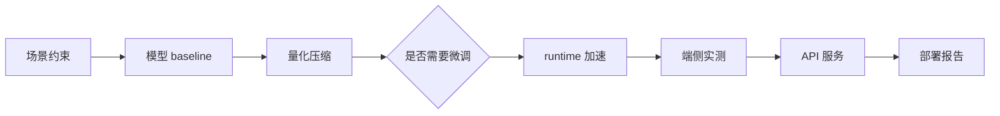
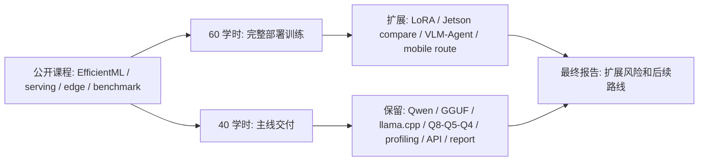

# 40/60 学时教学安排

## 本页目标

本课程按正式课程体量设计，而不是一次性的专题分享。完整版本为 **60 学时**，可以裁剪为 **40 学时基础版**。这里的“学时”按 45-50 分钟理解，包含讲授、演示、实验、讨论、作业说明和项目复盘。

课程的主线是：从端侧部署问题框架出发，循序渐进学习量化压缩、模型微调、runtime 与推理加速，再在 Ubuntu Server、NVIDIA Jetson 和移动端路线图三类视角下完成 Qwen 小模型部署评估。

## 路径卡片

| 路径 | 适合 | 必做 | 不强制 |
| --- | --- | --- | --- |
| 40 学时基础版 | 课程教学、培训、快速掌握端侧部署主线 | Qwen、GGUF、llama.cpp、Q8/Q5/Q4、profiling、local API、final report；目标设备可选 Ubuntu Server + NVIDIA GPU 或 Jetson | Jetson 对照、LoRA 训练、VLM/Agent、vLLM、TensorRT-LLM、Android 实机 |
| 60 学时完整版 | 研究生专题、企业训练营、项目制课程 | 40 学时全部内容，加 LoRA/QLoRA smoke test、Jetson 对照、VLM/Agent 复盘、更多 runtime 和移动端路线 | 云端集群 serving、完整 Android App、逐层 bit-width 搜索 |

## 必做边界

| 内容 | 40 学时必做 | 40 学时选做 | 60 学时新增 |
| --- | --- | --- | --- |
| 目标设备 | Ubuntu Server + NVIDIA GPU 或 Jetson 任选其一 | 第二台设备对照 | Ubuntu 与 Jetson 对照、功耗/温度/稳定性分析 |
| 模型主线 | Qwen 小模型、GGUF、llama.cpp | 同尺寸其他模型 | 对照模型或 VLM 场景 |
| 量化 | Q8/Q5/Q4 或同类三组版本 | KV Cache 量化 | 更多低比特格式和极端量化讨论 |
| 微调 | 判断是否需要微调，检查数据和 chat template，记录理由 | 无 | LoRA/QLoRA smoke test、adapter 输出对比和部署去留 |
| Runtime | llama.cpp CLI、llama-bench、local API | ONNX Runtime 或 TensorRT 概览 | vLLM serving、MLC/LiteRT 路线和更多 runtime 对比 |
| 最终报告 | 9 节部署评估报告 | 附加失败样例 | 加设备对照、扩展路线和系统复盘 |

评分默认按 40 学时主线；60 学时扩展只有教师明确布置时才计入必做。

主线图：

## 公开资料怎么转成本页安排

公开课程通常比本课范围更宽：MIT/EfficientML 偏高效深度学习体系，DeepLearning.AI 课程偏量化和 serving，Jetson/Edge AI 资料偏设备生态，MLPerf/Nsight/llama-bench 偏评估方法。本页只吸收它们的学时分配逻辑，把内容压成 40 学时可交付主线和 60 学时扩展路线。

| 外部资料中的经典内容 | 本页吸收什么 | 学时安排里的落点 |
| --- | --- | --- |
| MIT 6.5940 / EfficientML | 高效深度学习、压缩、量化和硬件感知优化的课程骨架 | 60 学时完整结构和 Part III/Part V 比重 |
| DeepLearning.AI 量化与 serving 课程 | 量化后继续 benchmark、serving、API 和项目化验收 | 40 学时必须保留 profiling、local API 和 final report |
| Qwen / llama.cpp | 统一模型和 runtime，减少变量 | 40 学时主线必做内容 |
| Jetson / Edge AI 资料 | 边缘功耗、温度、共享内存和迁移风险 | 60 学时设备对照；40 学时可选目标设备 |
| vLLM / TensorRT-LLM / MLC / LiteRT | 横向 runtime 和移动端路线 | 60 学时扩展或阅读，不进入 40 学时必做 |
| MLPerf / Nsight / llama-bench | 评估要有指标、条件和日志 | 项目里程碑、最终报告和评分边界 |

所以，40 学时不是“删掉实验”，而是删掉横向铺开；保留能完成部署报告的最短证据链。

## 项目里程碑

| 里程碑 | 时间点 | 交付物 | 最低证据 |
| --- | --- | --- | --- |
| M0 | 第 1 次课后 | 环境记录表 | `results/env-check.txt` 或等价环境日志 |
| M1 | Part I 结束 | 推理指标小测和 baseline plan | 固定 prompt、模型文件、目标设备和指标口径 |
| M2 | Part III 结束 | Q8/Q5/Q4 量化对比表 | 至少三组量化/模型变体的日志路径和记录表 |
| M3 | Part V 结束 | runtime/profiling 对比表 | `llama-bench`、offload 或 ctx-size 对比证据 |
| M4 | Part VI 结束 | local API smoke test 和服务日志 | 请求记录、响应 JSON、HTTP 状态、elapsed/meta、是否超时、server 日志异常检查、模型 hash 和 server 参数 |
| M5 | 课程结束 | 端侧部署评估报告 | 9 节报告、推荐方案、不推荐方案和附录日志 |

## 60 学时完整版

| 部分 | 内容 | 学时 | 产出 |
| --- | --- | ---: | --- |
| 导读 | 课程定位、资料取舍、项目主线、学习路径 | 2 | 学习路线图 |
| Part I 前置知识与工具链 | ML 推理、Transformer/LLM、量化数学、Linux/GPU/Jetson 工具链 | 6 | 基础概念检查表 |
| Part II 端侧部署问题框架 | 场景、指标、端云协同、硬件约束、项目评估 | 6 | 端侧部署评估模板 |
| Part III 量化与压缩 | PTQ/QAT、INT8/INT4、LLM 量化、KV Cache、精度修复、蒸馏压缩 | 12 | 量化路线选择表 |
| Part IV 模型微调与数据适配 | 是否微调、instruction 数据、chat template、LoRA/QLoRA、adapter、再量化和部署回归 | 10 | 微调决策表和输出对比 |
| Part V Runtime 与推理加速 | 图优化、算子融合、TensorRT、TensorRT-LLM、llama.cpp、vLLM、MLC、fallback | 9 | Runtime 选型矩阵 |
| Part VI Ubuntu / Jetson / 移动端实作 | Ubuntu Server、Jetson Orin、Qwen GGUF、profiling、API 服务、移动端路线图 | 8 | 实验日志和性能对比 |
| Part VII VLM、Agent 与最终复盘 | 视觉、小型 LLM、VLM、Agent、最终项目报告 | 7 | 端侧部署评估报告 |
| **合计** |  | **60** |  |

Part IV 单独用于模型微调闭环：判断是否需要微调、准备 instruction 数据、检查 chat template、运行 Qwen LoRA/QLoRA smoke test、对比基座和 adapter 输出，并判断是否进入合并、量化和端侧 profiling。

60 学时版本可以加入更多外部资料转化内容：vLLM serving 与评估、Android/MLC/LiteRT 移动端路线、Arm 风格极端量化和逐层 bit-width 选做实验。这些内容作为扩展，不改变 Qwen/GGUF/llama.cpp/Jetson/profiling 主线。

## 40 学时裁剪版

40 学时版本保留课程主线，但减少横向框架比较和高级推理服务内容：

| 裁剪项 | 处理方式 | 节省学时 |
| --- | --- | ---: |
| 前置知识中的部分数学推导 | 保留 scale/zero-point/outlier，减少推导练习 | 2 |
| 量化论文细节 | 保留方法动机和适用边界，减少论文实验讨论 | 3 |
| 模型微调长训练 | 40 学时只保留“是否需要微调”的判断和数据检查；LoRA smoke test 放到 60 学时 | 4 |
| Runtime 横向比较 | 保留 llama.cpp、TensorRT、ONNX Runtime，其他作为阅读 | 3 |
| Jetson 与移动端深入优化 | 保留环境、`tegrastats` 和移动端路线图，减少 DLA/power mode 与 Android 实作深入 | 2 |
| VLM/Agent 案例 | 保留系统图和风险点，减少案例讨论 | 2 |
| 课堂项目展示轮次 | 保留报告提交，减少现场展示和互评 | 6 |
| **合计节省** |  | **20** |

40 学时版本必须保留 Qwen、GGUF、llama.cpp、目标设备实测、profiling、本地 API smoke test 和最终报告。目标设备可以是 Ubuntu Server + NVIDIA GPU，也可以是 Jetson；双设备对照、vLLM serving、Android 实机、MLC/LiteRT、极端量化和逐层 bit-width 搜索作为阅读或选做，不放入必做链路。

## 理论、实验、项目比例

| 类型 | 60 学时 | 40 学时 | 说明 |
| --- | ---: | ---: | --- |
| 理论讲授 | 27 | 19 | 前置知识、量化、微调、runtime 原理 |
| 演示与讨论 | 9 | 6 | 框架选型、案例分析、日志阅读、移动端路线图 |
| 实验 | 17 | 11 | Ubuntu / Jetson / Qwen / 微调 / profiling |
| 项目与复盘 | 7 | 4 | 最终报告、风险清单、方案评审 |

## 贯穿项目

最终项目是 **端侧 Qwen 小模型部署评估报告**。报告至少包含：

- 目标硬件：Ubuntu Server 或 Jetson。
- 模型与 runtime：Qwen GGUF、llama.cpp、可选 TensorRT/ONNX Runtime 演示。
- 微调判断：说明是否需要微调；60 学时可加入 Qwen LoRA/QLoRA smoke test、adapter 输出对比和部署去留判断。
- 量化对比：至少 Q8/Q5/Q4 或同类低比特变体。
- 推理加速实验：GPU offload、ctx-size、threads、batch 或 FlashAttention 相关参数。
- Profiling 结果：首 token、tokens/s、峰值内存或显存、失败日志；功耗/温度属于 Jetson 或 60 学时扩展。
- API / serving / benchmark：本地 API smoke test 证据、`llama-bench` 或等价 benchmark 记录，并说明 CLI 结果进入服务化时新增的成本和风险。
- 移动端扩展：60 学时或选做说明 Android/on-device 路线的模型格式、runtime 和不做完整实验的原因。
- 结论：推荐部署方案、不推荐方案、风险和下一步。

详细要求见 [最终项目与验收标准](/docs/final-project)。

## 每部分产出清单

| 部分 | 技术理解产出 | 工程实作产出 |
| --- | --- | --- |
| 导读 | 学习路线、资料取舍、项目说明 | 报告目录草案 |
| Part I 前置知识与工具链 | 推理指标、LLM 流程、量化数学、工具链概念检查表 | 环境基线字段和日志阅读笔记 |
| Part II 部署框架 | 指标和约束表、端云协同决策图 | 目标设备和验收指标说明 |
| Part III 量化与压缩 | 量化路线选择表、误差分析方法、压缩边界 | Qwen GGUF 量化实验设计 |
| Part IV 模型微调与数据适配 | 微调必要性判断、数据和 chat template 检查、LoRA/QLoRA 策略 | 40 学时完成微调判断；60 学时可加入 Qwen LoRA smoke test 和输出对比 |
| Part V Runtime 与推理加速 | Runtime 选型矩阵、瓶颈定位表、服务化开销判断 | 推理加速和 profiling 实验设计 |
| Part VI Ubuntu / Jetson / 移动端实作 | Ubuntu、Jetson、移动端路线差异 | 真实运行日志、设备对比表、API smoke test |
| Part VII VLM、Agent 与最终复盘 | VLM/Agent 系统图、权限和风险清单 | 最终部署评估报告 |

## 学时安排图

```mermaid
gantt
  title 60 学时课程结构
  dateFormat X
  axisFormat %s
  导读 :0, 2
  Part I 前置知识与工具链 :2, 6
  Part II 部署框架 :8, 6
  Part III 量化与压缩 :14, 12
  Part IV 微调与数据适配 :26, 10
  Part V Runtime 与加速 :36, 9
  Part VI 设备实作 :45, 8
  Part VII 复盘 :53, 7
```

## 课后作业形态

- 阅读题：每个 Part 选 2-3 个官方资料或论文摘要。
- 检查题：概念解释、方法选择、日志判断。
- 实验题：运行命令、保存日志、填表。
- 项目题：把实验结果写成可评审的部署报告。

## 取舍说明

本课程不是论文精读课，也不是某个框架的 API 手册。课程体量虽然达到 40+ 学时，但主线仍然聚焦端侧量化部署：能解释方法，能跑实验，能读懂日志，能给出工程判断。

## 阶段学习路线

| 阶段 | 内容 | 实验 | 项目交付 |
| --- | --- | --- | --- |
| 第 1 阶段 | 推理指标和环境 | Ubuntu + GPU 检查 | 环境记录 |
| 第 2 阶段 | Qwen baseline | llama.cpp baseline | baseline log |
| 第 3 阶段 | 量化压缩 | Q8/Q5/Q4 对比 | quant table |
| 第 4 阶段 | runtime 加速 | offload、ctx、threads、llama-bench | profiling table |
| 第 5 阶段 | API 服务 | local API smoke test | API 证据包 |
| 第 6 阶段 | 复盘 | final report | 部署评估报告 |

## 参考资料

本章吸收方式：

- **知识点**：从高效 AI、量化 serving、Jetson、runtime 和 benchmark 资料中吸收学时分配和裁剪边界。
- **图解**：把外部课程体量重画为 40 学时主线和 60 学时扩展的安排图。
- **实验**：40 学时仍保留 Qwen baseline、Q8/Q5/Q4、profiling、local API 和最终报告。
- **取舍**：不把 vLLM、TensorRT-LLM、Android、完整 VLM/Agent 写进基础必做链路。

- [类似教材与教程参考](/docs/similar-courses)
- [参考资料地图](/docs/reference-map)
- [MIT 6.5940 TinyML and Efficient Deep Learning Computing](https://hanlab.mit.edu/courses/2024-fall-65940)
- [DeepLearning.AI Efficiently Serving LLMs](https://www.deeplearning.ai/courses/efficiently-serving-llms/)
- [Qwen llama.cpp 本地运行指南](https://qwen.readthedocs.io/en/v2.5/run_locally/llama.cpp.html)
- [NVIDIA Jetson documentation](https://docs.nvidia.com/jetson/)
- [MLPerf Inference](https://mlcommons.org/benchmarks/inference/)
