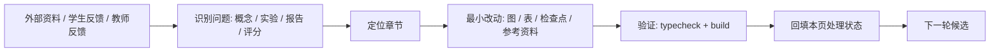

# 课程迭代反馈记录

本页记录课程体系审阅反馈和处理状态，避免建议只停留在对话中。每轮优先处理能降低学习门槛、统一交付口径、且不需要新增复杂实验代码的问题。

## 2026-06-29 第一轮

### 初学者视角

| 反馈 | 处理状态 |
| --- | --- |
| Start Here 过早出现 Qwen、GGUF、llama.cpp、Q8/Q5/Q4、profiling，零基础不知道这些词是什么。 | 已在 [Start Here](/docs/start-here) 增加主线术语速查。 |
| 零基础不知道应该先补哪些前置知识，容易在 Part I 里迷路。 | 已在 [Start Here](/docs/start-here) 增加最小补课路径。 |
| Qwen GGUF baseline 没说明如何选择模型文件。 | 已在 [Qwen 基线推理](/docs/lab-qwen-baseline) 补充模型文件选择标准。 |
| 量化数学公式跨度偏陡，不知道哪些必须先掌握。 | 已在 [量化数学基础](/docs/quantization-math-basics) 增加首次阅读重点。 |
| 实验产出和最终报告节号容易对不上。 | 已统一到 [最终报告模板](/docs/report-template) 的 9 节结构。 |

### 教师视角

| 反馈 | 处理状态 |
| --- | --- |
| 40/60 学时必做边界不一致，LoRA、Jetson、移动端、VLM/Agent 的状态不清晰。 | 已在 [40/60 学时教学安排](/docs/course-hours) 增加必做边界表。 |
| 最终项目、模板、样例报告结构不一致。 | 已统一 [最终项目与验收标准](/docs/final-project)、[最终报告模板](/docs/report-template) 和 [完成版报告样例](/docs/example-final-report)。 |
| Part IV 容易被理解为必经训练步骤。 | 已改为微调决策门：40 学时判断，60 学时可跑 smoke test。 |
| 里程碑缺少最低证据。 | 已在 [40/60 学时教学安排](/docs/course-hours) 和 [最终项目与验收标准](/docs/final-project) 补最低证据。 |
| 资料地图和资料对比容易让学生过早发散。 | 已在 [Start Here](/docs/start-here)、[资料对比与课程取舍](/docs/source-comparison) 和 [参考资料地图](/docs/reference-map) 标明阅读时机。 |

### 下一轮候选

- 检查每个实验页是否都明确写了“结果填入报告哪一节”。
- 检查 Part I 理论页是否都有“第一次只读重点”和“跑完实验再回看”提示。
- 检查 `sample-logs` 与各实验页的日志字段是否一致。

## 2026-06-29 第二轮

### 初学者视角

| 反馈 | 处理状态 |
| --- | --- |
| 不知道 `prompt eval`、`eval`、`total time`、API `elapsed` 分别填到报告哪一格。 | 已在 [样例日志与结果表](/docs/sample-logs) 增加日志字段到报告栏位映射。 |
| 不知道 40 学时产物哪些进正文、哪些放附录。 | 已在 [最终报告模板](/docs/report-template) 增加实验产物到报告章节和附录证据的索引表。 |
| 不知道哪些结果能直接比较。 | 已在 [推理加速实验](/docs/lab-inference-acceleration) 增加单变量可比性提醒和第 5 节回填表。 |
| 缺模型、缺 GPU、缺 Jetson 或实验失败时不知道怎么写。 | 已在 [最终报告模板](/docs/report-template) 增加缺失和失败项写法。 |
| API 服务化结果不知道放第 6、7、8 哪一节。 | 已在 [本地 OpenAI-compatible 服务](/docs/lab-local-service) 增加 API 记录到报告位置表。 |

### 教师视角

| 反馈 | 处理状态 |
| --- | --- |
| 第 1 节场景与设备约束缺少对应实验产物。 | 已在 [最终报告模板](/docs/report-template) 增加场景约束卡，并在 [最终项目与验收标准](/docs/final-project) 同步 M0/M1 证据。 |
| 量化实验“两组可通过”和最终报告“三组最低要求”冲突。 | 已在 [Qwen GGUF 量化对比实验](/docs/lab-qwen-quantization) 改为三组才满足最终报告，两组只算阶段性草稿。 |
| 第 5 节 runtime 表和加速实验字段不完全一致。 | 已在 [推理加速实验](/docs/lab-inference-acceleration) 增加第 5 节回填表。 |
| 第 7、8 节风险和最终建议缺少证据桥。 | 已在 [Profiling 与结果记录](/docs/lab-profiling) 增加风险登记和部署建议表。 |

### 下一轮候选

- 检查环境实验页是否完整覆盖报告第 2 节的 OS、CPU、RAM、Python、模型许可证等字段。
- 检查每个实验页的“最低通过标准”是否与最终报告最低验收一致。
- 检查 `troubleshooting-index` 是否能把失败类型回填到第 7 节风险表。

## 2026-06-29 第三轮

### 初学者视角

| 反馈 | 处理状态 |
| --- | --- |
| 不知道 `Driver / CUDA / JetPack` 分别该填什么。 | 已在 [环境与版本矩阵](/docs/environment-matrix) 增加报告第 2 节填写小抄。 |
| 未使用 Jetson 时不知道 `GPU / Jetson` 怎么写。 | 已在 [环境与版本矩阵](/docs/environment-matrix) 和 [Ubuntu Server 与 NVIDIA GPU 环境](/docs/lab-ubuntu-nvidia) 说明写“不适用（未测）”。 |
| 容易把课程仓库 commit 当成 `llama.cpp commit`。 | 已在 [Qwen 基线推理](/docs/lab-qwen-baseline) 明确从 `~/edge-ai-lab/src/llama.cpp` 取 commit。 |
| `模型来源` 和 `模型许可证` 不知道会进入报告第几节。 | 已在 [Qwen 基线推理](/docs/lab-qwen-baseline) 模型信息表标明报告第 2 节。 |
| 模型许可证没有采集字段。 | 已在 [Qwen 基线推理](/docs/lab-qwen-baseline) 和 [Jetson 环境与 Qwen 迁移](/docs/lab-jetson-setup) 增加许可证字段。 |

### 教师视角

| 反馈 | 处理状态 |
| --- | --- |
| 环境快照文件名不一致，模板写 `prereq-env.txt`，实验写 `env-check.txt`。 | 已在 [最终报告模板](/docs/report-template) 统一为 `results/env-check.txt` 或同等环境日志。 |
| 模型证据缺少文件指纹。 | 已在 [最终报告模板](/docs/report-template)、[Qwen 基线推理](/docs/lab-qwen-baseline) 和 [Jetson 环境与 Qwen 迁移](/docs/lab-jetson-setup) 增加 SHA256。 |
| GPU 峰值显存证据不可复查。 | 已将 baseline 的 `watch nvidia-smi` 改为可保存的 CSV 采样日志。 |
| Jetson `tegrastats` 日志和具体 Qwen 运行缺少时间对齐。 | 已将 Jetson 监控日志改为 `jetson-tegrastats-baseline.txt`，并要求记录 start/end 时间。 |
| API smoke test 证据太摘要化。 | 已在 [最终报告模板](/docs/report-template) 和 [样例日志与结果表](/docs/sample-logs) 补 server log、请求、模型 hash 和客户端环境字段。 |

### 下一轮候选

- 检查各实验页的失败排查是否都能回填到第 7 节风险登记表。
- 检查 `troubleshooting-index` 是否应该增加“报告写法”列。
- 检查课程是否需要一页“助教批改清单”，避免评分只依赖最终项目页。

## 2026-06-29 第四轮

### 初学者视角

| 反馈 | 处理状态 |
| --- | --- |
| OOM、`ctx-size` 和 KV Cache 不知道该写内存风险还是长上下文风险。 | 已在 [最终报告模板](/docs/report-template) 第 7 节增加失败现象到风险项的写法，并在 [排障索引](/docs/troubleshooting-index) 映射到内存/显存和长上下文风险。 |
| `-ngl 99` 失败或无提升，不知道算环境、runtime 还是参数问题。 | 已在 [排障索引](/docs/troubleshooting-index) 映射到第 5 节加速实验和第 7 节 runtime/GPU offload 风险。 |
| API 慢、超时或连接失败，不知道写第 6 节还是第 7 节。 | 已在 [排障索引](/docs/troubleshooting-index) 区分 API 无响应、API 慢/超时和第 7 节并发/超时风险。 |
| Q4 输出变差、乱码、重复，不知道算量化结果还是部署风险。 | 已在 [排障索引](/docs/troubleshooting-index) 增加量化后质量下降行，并映射到输出质量风险。 |
| Jetson 越跑越慢，不知道写温度、功耗还是内存。 | 已在 [排障索引](/docs/troubleshooting-index) 映射到温度/功耗风险，RAM 接近上限时补内存风险。 |

### 教师视角

| 反馈 | 处理状态 |
| --- | --- |
| 报告模板第 7 节不是可批改的风险登记表。 | 已在 [最终报告模板](/docs/report-template) 将第 7 节改为风险登记表。 |
| 排障索引没有告诉学生哪些故障写进第 7 节。 | 已在 [排障索引](/docs/troubleshooting-index) 增加“报告位置 / 第 7 节风险项”列。 |
| 并发和端云 fallback 在排障索引中没有入口。 | 已补 API 慢/超时、端云 fallback 未验证等行。 |
| 许可证、安全日志缺少排障入口。 | 已补模型许可证未记录、服务端口暴露、日志含敏感输入等行。 |
| 输出质量风险被写得太窄。 | 已补量化后质量下降、重复、不满足固定 prompt 的排障行。 |

### 下一轮候选

- 检查是否需要一页“助教批改清单”，把第 1-9 节和评分维度压成一页。
- 检查 `example-final-report` 是否需要同步第 7 节风险登记表格式。
- 检查最终项目页的评分表是否要直接引用风险登记表。

## 2026-06-29 第五轮

### 初学者视角

| 反馈 | 处理状态 |
| --- | --- |
| 完成版样例仍有旧环境字段，学生容易漏填 CPU、RAM、Python、许可证和 SHA256。 | 已在 [完成版报告样例](/docs/example-final-report) 同步第 2 节字段，并注明 `llama.cpp commit` 不是课程仓库 commit。 |
| 样例报告数字带“示例”，但没有提交前自查，学生可能照抄。 | 已在样例报告开头增加提交前自查表。 |
| API 测试样例只写请求和响应，缺 server 日志、HTTP 状态、请求记录和模型 hash。 | 已在样例报告第 6、9 节补齐最小证据字段。 |
| 样例报告直接给出“推荐 Q5_K_M”，学生可能照抄结论。 | 已改成条件句写法，要求用第 4、6、7 节证据支撑推荐。 |
| 模板没有说明日志里的哪一行对应哪个指标。 | 已在 [最终报告模板](/docs/report-template) 增加日志字段映射表。 |
| 输出质量太主观，缺 prompt ID 和输出摘录证据。 | 已在模板和样例报告增加“prompt 编号 + 输出日志路径 + 一句话差异”的质量证据要求。 |

### 教师视角

| 反馈 | 处理状态 |
| --- | --- |
| 评分表只有权重，没有助教批改锚点。 | 已在 [教师使用指南](/docs/instructor-guide) 增加助教评分锚点。 |
| 最低验收把“量化格式或参数配置”并列，学生可能用 runtime 参数替代量化对比。 | 已在 [最终项目与验收标准](/docs/final-project) 和 [40/60 学时教学安排](/docs/course-hours) 明确三组量化/模型变体要求。 |
| API smoke test 对客户端要求不一致。 | 已统一为 curl 或 Python 客户端任选其一，重点看 HTTP 状态、请求、响应和 server 日志。 |
| LoRA 在 40 学时里像主线又像选做。 | 已统一为 40 学时只做微调判断和数据/chat template 检查，LoRA smoke test 放到 60 学时或自选扩展。 |
| 40 学时报告被功耗/温度和移动端路线抬高要求。 | 已把功耗/温度标为 Jetson 或 60 学时扩展，移动端路线标为 60 学时或选做。 |

### 下一轮候选

- 检查是否需要独立的“助教批改清单”页；如果教师指南已够用，就不新增页面。
- 检查更多实验页是否也需要拆成“课堂完整实验通过标准”和“最终报告最低要求”。

## 2026-06-29 第六轮

### 初学者视角

| 反馈 | 处理状态 |
| --- | --- |
| API 响应证据没有统一字段，模板和样例报告只写请求路径。 | 已在 [最终报告模板](/docs/report-template) 和 [完成版报告样例](/docs/example-final-report) 增加响应 JSON 路径。 |
| HTTP 状态和 elapsed 要求填写，但 curl 示例没有采集。 | 已在 [本地 OpenAI-compatible 服务](/docs/lab-local-service) 将 curl 示例改为同时保存请求、响应和 meta。 |
| API 证据不清楚 curl 和 Python 是任选还是都交。 | 已统一为最终报告最低验收 curl 或 Python 任选其一；课堂 2 学时建议两种都试。 |

### 教师视角

| 反馈 | 处理状态 |
| --- | --- |
| 量化实验页残留“参数配置”可算第三组的旧口径。 | 已在 [Qwen GGUF 量化对比实验](/docs/lab-qwen-quantization) 改成三组量化版本或模型变体，runtime 参数不能替代量化对比。 |
| 推理加速实验页的完整实验要求容易被误读成最终项目最低要求。 | 已改为“本章完整实验通过标准”，并补充最终报告至少保留一类可解释的 runtime/profiling 对比。 |
| API 实验允许失败日志进入本章记录，但最终项目要求成功请求。 | 已在 [本地 OpenAI-compatible 服务](/docs/lab-local-service) 拆分课堂记录标准和最终项目最低验收。 |

### 下一轮候选

- 检查 baseline、profiling、Jetson 实验页是否也需要分层写“课堂记录”和“最终验收”。
- 检查 `report-template` 第 6 节和 `sample-logs` API 最小记录块是否还需要字段顺序统一。

## 2026-06-29 第七轮

### 初学者视角

| 反馈 | 处理状态 |
| --- | --- |
| baseline 失败日志和最终项目最低验收容易混在一起。 | 已在 [Qwen 基线推理](/docs/lab-qwen-baseline) 明确：失败日志可作阶段记录，但最终报告必须至少有一次成功本地推理。 |
| profiling 页的“三类实验结果”容易被误读成最终报告最低要求。 | 已在 [Profiling 与结果记录](/docs/lab-profiling) 改成完整记录标准，并说明最终报告最低需要可追溯指标和至少一类 runtime/profiling 对比证据。 |
| “错误日志”容易被理解成必须制造一个错误。 | 已在 [最终项目与验收标准](/docs/final-project) 改成错误/异常检查结果；没有错误也要注明并保留原始日志。 |

### 教师视角

| 反馈 | 处理状态 |
| --- | --- |
| Jetson 页看起来像 40 学时必做，和“目标设备任选其一”不一致。 | 已在 [Jetson 环境与 Qwen 迁移](/docs/lab-jetson-setup) 明确：只有选择 Jetson 或教师布置 60 学时扩展时才按本章验收。 |
| 课堂实验完整记录和最终项目最低验收需要分层。 | 已在 baseline、profiling、Jetson 三页增加边界说明。 |
| profiling 表可能用 baseline + offload + ctx-size 绕过量化对比。 | 已要求 profiling 表至少包含 baseline、量化对比和一类 runtime/profiling 对比。 |
| baseline 页验收未覆盖最终项目要求的 TTFT、峰值内存和异常检查。 | 已在 [Qwen 基线推理](/docs/lab-qwen-baseline) 验收中补充 TTFT 口径、峰值内存/显存和异常检查结果。 |
| Jetson 页把 Ubuntu vs Jetson 对比写得像 40 学时必交。 | 已改成 60 学时或已有 Ubuntu baseline 时填写；40 学时 Jetson-only 路线只需 Jetson 环境、`tegrastats`、Qwen baseline 和下一步判断。 |

### 下一轮候选

- 检查报告模板和样例报告是否需要增加“未测 Jetson/未做 60 学时扩展”的标准写法。
- 检查 `troubleshooting-index` 的失败类型是否覆盖 baseline 阶段的模型缺失、baseline 失败和 API 请求失败。

## 2026-06-29 第八轮

### 初学者视角

| 反馈 | 处理状态 |
| --- | --- |
| 60 学时扩展没做时，学生知道不是必做，但不知道报告里放哪一句。 | 已在 [最终报告模板](/docs/report-template) 增加“未做 60 学时扩展”的标准写法。 |
| 移动端路线没做时，不清楚写第 7 节、第 8 节还是不写。 | 已在 [最终报告模板](/docs/report-template) 和 [最终项目与验收标准](/docs/final-project) 补“未做移动端路线”的写法。 |
| 样例报告缺 40 学时基础版的范围声明。 | 已在 [完成版报告样例](/docs/example-final-report) 第 8 节补 40 学时口径说明。 |

### 教师视角

| 反馈 | 处理状态 |
| --- | --- |
| 排障索引对 baseline 阶段模型缺失不够直达。 | 已将“模型文件缺失或加载失败”合并为直达 [Qwen 基线推理](/docs/lab-qwen-baseline) 的入口。 |
| 排障索引缺少 baseline 命令执行失败总入口。 | 已新增 baseline 命令执行失败行，并映射到第 3 节和第 7 节风险登记。 |
| API 非 200 或非 JSON 没有显式入口。 | 已新增 API 返回非 200 或非 JSON 行，要求保留 meta、response 和 server 日志。 |

### 下一轮候选

- 检查 `sample-logs` 与报告模板第 6 节字段顺序是否还需要完全一致。
- 检查首页和 Start Here 是否已经能把新增的报告模板、样例报告、排障索引串起来。

## 2026-06-29 第九轮

### 初学者视角

| 反馈 | 处理状态 |
| --- | --- |
| 学生需要一个入口快速找到最终报告模板、完成版样例、样例日志、排障索引和最终项目要求。 | 已在 [Start Here](/docs/start-here) 增加交付资料速查表。 |
| 首页没有直接暴露所有交付资料。 | 暂不增加首页按钮；Start Here 已作为主页“选择学习路径”的集中入口，避免首页按钮过多。 |
| 侧边栏资料分散在多个 Part。 | 暂不重复挂载侧边栏条目；Start Here 速查表已提供集中索引。 |

### 教师视角

| 反馈 | 处理状态 |
| --- | --- |
| 教师入口页缺少授课边界、最终验收、排障和反馈记录的集中入口。 | 已在 [教师使用指南](/docs/instructor-guide) 增加教师速查表。 |
| 反馈记录中第八轮排在第七轮前。 | 已按轮次顺序修正。 |
| 助教评分锚点可能被误当成完整验收标准。 | 已在 [教师使用指南](/docs/instructor-guide) 说明最终是否通过以最终项目最低验收为准。 |

### 下一轮候选

- 检查 `sample-logs` 与报告模板第 6 节字段顺序是否需要统一。
- 检查是否可以结束当前迭代或进入提交前整体复查。

## 2026-06-29 第十轮

### 初学者视角

| 反馈 | 处理状态 |
| --- | --- |
| 报告模板第 6 节字段很多，但没有区分最低必填和建议补充。 | 已在 [最终报告模板](/docs/report-template) 将 API 服务测试改成字段表，并标出最低必填/建议补充。 |
| 样例日志的 API 最小记录块和报告模板字段顺序不一致。 | 已在 [样例日志与结果表](/docs/sample-logs) 按模板顺序重排 API 最小记录块。 |
| 最终项目 M4 没有明确要求 `elapsed`、是否超时和请求/响应保存路径。 | 已在 [最终项目与验收标准](/docs/final-project) 补齐 M4 最低证据口径。 |

### 教师视角

| 反馈 | 处理状态 |
| --- | --- |
| benchmark 的日志路径弱于 API 证据路径。 | 已在报告模板第 5 节增加日志路径列，并在完成版样例的 `llama-bench` 行加入示例日志路径。 |
| 完成版样例第 6 节没有显式写是否超时和 server 日志异常。 | 已在 [完成版报告样例](/docs/example-final-report) 第 6 节补齐。 |
| 评分表没有点名 `llama-bench` 证据。 | 已在最终项目评分维度的 Profiling 质量证据中加入 `llama-bench`。 |

### 暂停点

- 用户要求本轮改完先结束；后续如继续，可进入提交前整体复查。

## 2026-06-29 第十一轮

### 初学者视角

| 反馈 | 处理状态 |
| --- | --- |
| 提交前整体复查没有发现阻断学生完成课程或最终报告的入口问题。 | 不做额外改动。 |

### 教师视角

| 反馈 | 处理状态 |
| --- | --- |
| API smoke test 最低证据在 `final-project`、`course-hours` 和 `instructor-guide` 中口径不完全一致。 | 已同步为请求记录、响应 JSON、HTTP 状态、elapsed/meta、是否超时、server 日志异常检查、模型 hash 和 server 参数。 |
| `final-project` 内部 M4 和最低验收要求对 API 证据要求不一致。 | 已在最低验收要求中补齐 API 请求、响应、meta、异常检查和参数证据。 |
| `course-hours` 的最终报告最低内容漏掉 API / serving / benchmark。 | 已补 API / serving / benchmark 条目。 |
| `report-template` 顶部证据索引低于第 6 节最低必填。 | 已把 API smoke test 附录证据同步为请求记录、响应 JSON、HTTP 状态、elapsed/meta、是否超时、server 日志异常检查、模型 hash 和 server 参数。 |

### 下一轮候选

- 如果继续迭代，建议只做提交前链接/构建复查，不再扩展课程结构。

## 2026-06-29 第十二轮

### 导航与链接复查

| 检查 | 结论 |
| --- | --- |
| 首页、Start Here、侧边栏、最终报告模板、样例日志、最终项目和排障索引入口 | 未发现阻断性导航问题；关键资料都有入口，下一步链路能继续走。 |
| Docusaurus 构建链接检查 | 通过。 |

### 暂停点

- 本轮未做内容改写；后续可进入提交前最终差异复查。

## 公开资料怎么转成本页反馈

外部课程、官方文档和工具项目进入课程后，不能只停留在“加了链接”或“补了术语”。本页把吸收结果转成可追踪的课程迭代：先记录学习者或教师的具体困惑，再回到对应章节、实验、报告模板或排障入口做最小修改。

| 反馈来源 | 本页吸收什么 | 课程落点 |
| --- | --- | --- |
| 公开课程和教材 | 哪些讲解顺序、图表思路和项目结构值得借鉴 | Start Here、课程导读、Part 细纲 |
| 官方文档和工具项目 | 哪些术语、命令、日志字段和失败模式需要统一 | 实验页、样例日志、排障索引 |
| benchmark / profiling 资料 | 哪些指标、条件和证据必须进入验收 | final project、report template、instructor guide |
| 学生反馈 | 哪些入口、字段和概念最容易卡住 | 本页初学者视角 |
| 教师反馈 | 哪些边界、评分和助教口径需要收紧 | 本页教师视角 |

反馈记录只处理能服务主线的改动：Qwen 小模型、GGUF、llama.cpp、Q8/Q5/Q4、profiling、local API 和部署报告。不能落到这条主线的建议，先放入候选，不直接扩写成新章节。

## 参考资料

本章吸收方式：

- **知识点**：从公开课程、官方文档、benchmark 资料和课程实跑反馈中吸收可改进的概念、边界和验收口径。
- **图解**：重画为“资料/反馈 -> 问题分类 -> 章节改动 -> 验证 -> 下一轮候选”的 Mermaid 图。
- **实验**：每轮反馈都要求回到 Qwen GGUF、Q8/Q5/Q4、profiling、local API、报告模板或排障记录。
- **取舍**：不把反馈页变成需求池；只记录已经处理或明确进入下一轮候选的课程改动。

- [Start Here：我该怎么学这门课](/docs/start-here)
- [教师使用指南](/docs/instructor-guide)
- [资料对比与课程取舍](/docs/source-comparison)
- [参考资料地图](/docs/reference-map)
- [类似教材与教程参考](/docs/similar-courses)
- [最终报告模板](/docs/report-template)
- [最终项目与验收标准](/docs/final-project)
- [样例日志与结果表](/docs/sample-logs)
- [排障索引](/docs/troubleshooting-index)
- [Qwen llama.cpp 本地运行指南](https://qwen.readthedocs.io/en/v2.5/run_locally/llama.cpp.html)
- [llama.cpp 项目](https://github.com/ggml-org/llama.cpp)
- [MLPerf Inference](https://mlcommons.org/benchmarks/inference/)
