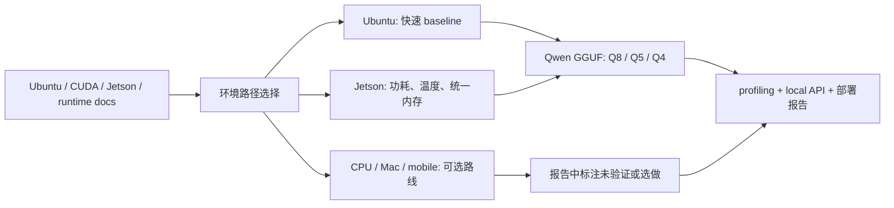

# 环境与版本矩阵

本页用于回答“我的机器能不能学这门课”。课程主线不绑定某一块固定硬件，但每次实验都必须记录实际版本。

## 路径选择

| 路径 | 推荐用途 | 必做实验 | 可选实验 |
| --- | --- | --- | --- |
| Ubuntu Server + NVIDIA GPU | 40 学时主线 | 环境检查、Qwen baseline、Q8/Q5/Q4、profiling、local API | vLLM、TensorRT、长稳测试 |
| Jetson | 60 学时或项目扩展 | JetPack 记录、Qwen 迁移、`tegrastats`、功耗/温度 | TensorRT Edge-LLM、engine build |
| CPU-only | 入门和报告结构训练 | CPU baseline、API smoke test、日志记录 | 小模型对比 |
| Mac | 补充本地体验 | llama.cpp 或 MLC 路线阅读 | 移动端路线调研 |
| Android / iOS | 扩展路线 | 阅读 MLC LLM、LiteRT、ExecuTorch | 选做 demo |

## 公开资料怎么转成本页矩阵

外部资料里的环境说明通常分散在系统文档、runtime README、Jetson 教程和 benchmark 规范里。本页只吸收它们的记录方法：先能复现环境，再做 Qwen GGUF 和 Q8/Q5/Q4 对比，最后把 profiling、local API 和报告字段串起来。



| 资料类型 | 本页吸收什么 | 转成哪个字段或规则 |
| --- | --- | --- |
| Ubuntu / NVIDIA 驱动文档 | OS、driver、CUDA 和工具链版本要可追溯 | OS、Driver、CUDA、Python、CMake |
| Qwen / llama.cpp 文档 | 模型、GGUF 文件和 runtime commit 影响实验可复现性 | Qwen 模型、llama.cpp commit、模型 SHA256 |
| Jetson / JetPack 文档 | Jetson 要记录 L4T、功耗模式、统一内存和散热状态 | JetPack / L4T、`nvpmodel`、`jetson_clocks`、`tegrastats` |
| MLPerf / Nsight / llama-bench | benchmark 结果必须写清硬件、输入和运行条件 | 报告第 2 节环境字段、profiling 附录 |
| MLC / LiteRT / ExecuTorch / Core ML | 移动端是扩展路线，不进入 40 学时必做 | Android / iOS 标为阅读或选做 |

移动端和 CPU-only 路线也要写清“未做什么”，避免报告默认承诺跨平台可用：

| 路线 | 参考资料 | 报告里的最低写法 |
| --- | --- | --- |
| CPU-only | llama.cpp CPU、BitNet/bitnet.cpp | 写明没有 GPU offload，速度结论只代表 CPU |
| Mac | llama.cpp Metal、MLC LLM、Core ML | 写明是否使用 Metal/Core ML，不能套用 CUDA 结果 |
| Android | LiteRT、ExecuTorch、MLC LLM | 写成路线图或选做 demo，未实测就标“未验证” |
| iOS/macOS app | Core ML Tools、MLC LLM | 记录转换格式和 compute units；未做实机就不写推荐 |
| 浏览器/WebGPU | MLC LLM | 记录浏览器、backend 和模型限制；不代替本地 API 结论 |

### 外部路线原图参考

下面几张图直接展示了不同部署路线的形态：Jetson 设备族、LiteRT Android 架构、ExecuTorch 移动/端侧栈、MLC LLM 的编译与运行流程。本课程不把它们都变成必做实验，只把它们放进环境矩阵，提醒学习者报告里要写清“做了哪条路线、没做哪条路线”。


| 原图重点 | 本页吸收什么 | 矩阵字段 |
| --- | --- | --- |
| Jetson 设备族 | Jetson 不是单一硬件，型号、内存和功耗模式会改变结论 | Jetson 型号、JetPack/L4T、`nvpmodel`、`tegrastats` |
| LiteRT architecture | Android 路线要写清 app、runtime、delegate 和硬件加速边界 | model format、delegate、CPU/GPU/NPU、未验证项 |
| ExecuTorch stack | 移动端部署需要导出、lowering、runtime 和设备后端 | Android/iOS 路线标为扩展，不套用 Ubuntu 结论 |
| MLC LLM workflow | 模型要经过编译/打包后进入不同前端或 runtime | Mac、浏览器、移动端字段必须写 backend 与未验证边界 |

这页不替学习者判断“哪台机器最快”。它只要求把环境差异记录清楚，避免把 Ubuntu Server 上的结论直接套到 Jetson、CPU 或移动端。

## 已测试环境记录模板

课程不预置性能数字。教师或学员应把自己的环境填到下面这张表。

| 项目 | Ubuntu Server | Jetson | 备注 |
| --- | --- | --- | --- |
| OS | 待填 | 待填 | 例如 Ubuntu 22.04 |
| CPU | 待填 | 待填 | 记录型号和核心数 |
| RAM | 待填 | 待填 | Jetson 记录统一内存 |
| GPU | 待填 | 待填 | NVIDIA GPU 或 Jetson SoC |
| Driver | 待填 | 不适用或待填 | `nvidia-smi` |
| CUDA | 待填 | JetPack 内置 | `nvcc --version` 或说明未安装 |
| JetPack / L4T | 不适用 | 待填 | `cat /etc/nv_tegra_release` |
| Python | 待填 | 待填 | `python3 --version` |
| CMake | 待填 | 待填 | `cmake --version` |
| llama.cpp commit | 待填 | 待填 | `git rev-parse --short HEAD` |
| Qwen 模型 | 待填 | 待填 | 模型名、量化格式、来源 |

## 报告第 2 节填写小抄

| 字段 | Ubuntu Server + NVIDIA GPU | Jetson |
| --- | --- | --- |
| `GPU / Jetson` | 写实际 NVIDIA GPU 型号；未测 Jetson 时写“不适用（未测）” | 写 Jetson 型号和 SoC |
| `Driver / CUDA / JetPack` | 写 NVIDIA Driver、`nvidia-smi` 显示的 CUDA Version、`nvcc` 是否存在 | 写 JetPack/L4T；Driver 可写“不适用”或“未单独记录” |
| `llama.cpp commit` | 在 `~/edge-ai-lab/src/llama.cpp` 执行 `git rev-parse --short HEAD` | 同 Ubuntu |
| `模型来源` | 教师提供、Hugging Face repo 或离线包编号 | 同 Ubuntu |
| `模型许可证` | 从模型卡或教师说明填写；查不到写“未记录” | 同 Ubuntu |
| `模型 SHA256` | `sha256sum *.gguf` | 同 Ubuntu |

## 环境快照命令

Ubuntu Server：

```bash
{
  date
  uname -a
  lscpu | head -n 30
  free -h
  df -h
  python3 --version
  git --version
  cmake --version
  nvidia-smi || true
  nvcc --version || true
} | tee ~/edge-ai-lab/env/ubuntu-env.txt
```

Jetson：

```bash
{
  date
  uname -a
  cat /etc/nv_tegra_release
  free -h
  df -h
  python3 --version
  git --version
  cmake --version
  sudo nvpmodel -q
  sudo jetson_clocks --show
} | tee ~/edge-ai-lab/env/jetson-env.txt
```

## 常见边界

| 情况 | 能否继续 | 处理 |
| --- | --- | --- |
| 没有 Jetson | 可以 | 用 Ubuntu 主线完成 40 学时版本，在报告中说明 Jetson 未测 |
| 没有 NVIDIA GPU | 可以部分继续 | 只做 CPU baseline、API 和报告结构，GPU offload 标为未验证 |
| `nvcc` 不存在 | 可能可以继续 | 先看 llama.cpp 是否能用 CUDA 构建；有些环境只装 runtime |
| Jetson 存储不足 | 可以继续但要调整 | 使用 NVMe 或外部存储，不把模型放课程仓库 |
| 网络无法下载模型 | 可以继续 | 使用教师离线包，记录来源和 hash |

## 版本记录规则

- 不把 `.gguf`、checkpoint、adapter 和大日志提交到课程仓库。
- 每次换模型、runtime 或驱动后，都要更新报告里的环境字段。
- 服务器结果不能直接代表 Jetson 结果。
- Jetson engine、TensorRT engine 等硬件相关产物通常需要在目标设备或匹配环境中生成。

## 参考资料

本章吸收方式：

- **知识点**：从 Ubuntu/CUDA、Jetson、Qwen、llama.cpp 和 benchmark 资料中提取环境可复现字段。
- **图解**：参考 Jetson、LiteRT、ExecuTorch 和 MLC LLM 的原图，把路线重画为“环境路径 -> Qwen GGUF 实验 -> profiling/API/report”的 Mermaid 图。
- **实验**：把外部环境要求落到 `nvidia-smi`、JetPack/L4T、llama.cpp commit、模型 hash 和报告字段。
- **取舍**：只嵌入外部原图作为路线参考，不引用外部 benchmark 数字作为本课程结论。

- [类似教材与教程参考](/docs/similar-courses)
- [参考资料地图](/docs/reference-map)
- [课程来源对照与取舍](/docs/source-comparison)
- [Ubuntu Server NVIDIA driver guide](https://ubuntu.com/server/docs/how-to/graphics/install-nvidia-drivers/)
- [Qwen llama.cpp 本地运行指南](https://qwen.readthedocs.io/en/v2.5/run_locally/llama.cpp.html)
- [llama.cpp](https://github.com/ggml-org/llama.cpp)
- [NVIDIA Jetson documentation](https://docs.nvidia.com/jetson/)
- [NVIDIA JetPack SDK](https://developer.nvidia.com/embedded/jetpack)
- [Jetson AI Lab](https://www.jetson-ai-lab.com/)
- [NVIDIA Nsight Systems](https://developer.nvidia.com/nsight-systems)
- [MLPerf Inference](https://mlcommons.org/benchmarks/inference/)
- [LiteRT](https://developers.google.com/edge/litert)
- [ExecuTorch](https://docs.pytorch.org/executorch/stable/index.html)
- [Core ML Tools optimization](https://apple.github.io/coremltools/docs-guides/source/opt-overview.html)
- [MLC LLM](https://llm.mlc.ai/docs/)
