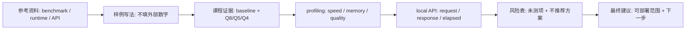

# 完成版报告样例

本页是格式样例，不代表标准性能数字。数字用“示例”占位，避免学生照抄。

提交前自查：

| 检查 | 要求 |
| --- | --- |
| 示例值 | 正式提交不得残留“示例”或“待填”。 |
| 数字 | 每个数字必须能追溯到日志路径。 |
| 结论 | 推荐和不推荐方案必须来自自己的量化、runtime、API 和风险证据。 |

## 公开资料怎么转成本样例

MLPerf、llama-bench、Qwen/llama.cpp 和 OpenAI-compatible API 资料在本页只用于示范报告结构，不用于给出标准性能数字。样例里的每个“示例”都代表学生需要用自己的日志替换：baseline 证明模型能跑，Q8/Q5/Q4 证明量化取舍，profiling 证明瓶颈，local API 证明服务化入口，风险表证明哪些结论还不能上线承诺。

| 外部资料中的经典内容 | 本样例吸收什么 | 样例里的落点 |
| --- | --- | --- |
| MLPerf Inference | 报告要同时写指标、负载和条件 | 自查表和第 3-5 节的日志路径要求 |
| llama.cpp llama-bench | 标准化记录 prompt processing / token generation | 第 5 节的 `llama-bench` 行，并说明与业务 prompt 分开解释 |
| Qwen / llama.cpp | Qwen GGUF、runtime commit、量化格式和模型来源 | 第 2-4 节的环境、baseline 和量化对比 |
| llama.cpp server / OpenAI-compatible API | 请求、响应、HTTP 状态和端到端 elapsed | 第 6 节 API 服务测试 |
| Profiling 与 Jetson 资料 | 温度、功耗、显存、未测平台不能被忽略 | 第 7 节风险表和第 8 节下一步 |
| 课程实跑记录 | 脱敏日志路径和未测说明的写法 | 第 9 节附录和“示例不得照抄”的提醒 |

### 外部报告原图参考

下面几张图提醒学生：报告样例不是“抄结论”，而是把模型来源、benchmark 条件、质量评估和失败日志写成可复查证据。

| 原图重点 | 本样例吸收什么 | 报告章节 |
| --- | --- | --- |
| model card | 模型来源、许可证、文件和 hash 必须写清 | 第 2、9 节 |
| vLLM metrics | TTFT、tokens/s、throughput、latency 分开解释 | 第 3、5、6 节 |
| benchmarking lab | benchmark 需要固定 workload、硬件和参数 | 第 4、5 节 |
| model evaluation | 质量结论要有任务和样例证据 | 第 4、7、8 节 |

因此，本页不是参考答案，而是报告骨架示范：学生必须把“示例”替换成自己的证据，再写推荐和不推荐方案。

## 1. 场景与设备约束

- 应用场景：本地课程助教，回答端侧部署常见问题。
- 目标设备：Ubuntu Server + NVIDIA GPU，Jetson 作为后续验证。
- 端侧必要性：课堂弱网时仍可演示，日志和数据不上传云端。
- 不可接受风险：回答严重跑题、API 不稳定、显存 OOM。

## 2. 实验环境

| 项目 | 记录 |
| --- | --- |
| OS | 示例 Ubuntu 22.04 |
| CPU | 示例 8 vCPU |
| RAM | 示例 32 GB |
| GPU / Jetson | 示例 NVIDIA GPU；Jetson 不适用（未测） |
| Driver / CUDA / JetPack | 示例 Driver / CUDA；JetPack 不适用 |
| Python | 示例 3.11 |
| llama.cpp commit | 示例 commit，来自 `~/edge-ai-lab/src/llama.cpp`，不是课程仓库 |
| 模型来源 | Qwen 小模型 GGUF |
| 模型许可证 | 示例许可证，来自模型卡 |
| 模型 SHA256 | 示例 hash |
| 环境日志路径 | `results/env-check.txt` |

## 3. Baseline 结果

| 指标 | 结果 | 说明 |
| --- | --- | --- |
| 模型 | Qwen 示例模型 | 文件来源已记录 |
| prompt | 三句话解释端侧量化 | 后续实验固定 |
| `ctx-size` | 2048 | 量化对比保持一致 |
| `-ngl` | 99 | 尽量 GPU offload |
| 首 token / prefill | 示例 | 来自 baseline log |
| tokens/s | 示例 | 来自 eval 统计 |
| 峰值显存 | 示例 | 来自 `nvidia-smi` |
| 质量观察 | 能回答问题，格式基本稳定 | `prompt-01`，`logs/q8-prompt-01.txt`，作为量化对照 |

## 4. 量化版本对比

| 版本 | 文件大小 | TTFT / prefill | tokens/s | 峰值内存 | 质量观察 | 质量证据 | 判断 |
| --- | ---: | ---: | ---: | ---: | --- | --- | --- |
| Q8 | 示例 | 示例 | 示例 | 示例 | 输出稳定 | `prompt-01`，`logs/q8-prompt-01.txt`，回答完整 | 质量优先 |
| Q5 | 示例 | 示例 | 示例 | 示例 | 轻微差异 | `prompt-01`，`logs/q5-prompt-01.txt`，未漏关键约束 | 候选推荐 |
| Q4 | 示例 | 示例 | 示例 | 示例 | 个别回答退化 | `prompt-03`，`logs/q4-prompt-03.txt`，漏掉离线限制 | 内存受限备选 |

部署判断写法：如果第 4 节中 Q5_K_M 的 tokens/s、峰值内存和质量证据都满足第 1 节约束，则可以暂时推荐 Q5_K_M；否则按自己的证据改成 Q8、Q4 或其他模型变体。Q4 只能作为低内存备选，除非固定 prompt 的质量证据也达标。

## 5. Runtime 参数与加速实验

| 实验 | 变化 | 现象 | 结论 |
| --- | --- | --- | --- |
| GPU offload | `-ngl 0` vs `-ngl 99` | 示例：GPU 路径更快，显存增加 | 后续主线使用 GPU offload |
| 上下文长度 | 1024/2048/4096 | 示例：ctx 增大后内存增加 | Jetson 需重新验证 4096 |
| llama-bench | 固定 `-p 512 -n 128` | 示例：补充标准化结果，日志见 `logs/llama-bench-q5.txt` | 与业务 prompt 分开解释 |

## 6. API 服务测试

- 启动命令：`llama-server` 本地绑定 `127.0.0.1:8080`。
- 请求样例：`/v1/chat/completions`，见 `logs/qwen-api-request.json` 或 curl 记录。
- HTTP 状态：示例 200。
- 是否超时：否，见 `logs/qwen-api-meta.txt`。
- 响应摘要：返回可解析 JSON，内容能回答固定 prompt。
- server 日志路径：`logs/qwen-api-server.txt`。
- server 日志异常：未见 OOM、fallback 或 unsupported。
- 响应 JSON 路径：`logs/qwen-api-response.json`。
- HTTP 状态和 elapsed 来源：`logs/qwen-api-meta.txt`。
- 模型文件/hash：与第 2 节 SHA256 一致。
- server 参数：示例 `--ctx-size 2048 --n-gpu-layers 99`。
- 客户端环境：示例 curl 或 Python 客户端版本。
- 观察：第一次请求更慢，后续请求更稳定。
- 风险：CLI tokens/s 不能直接代表 API 端到端延迟。

## 7. 端侧部署风险

| 风险项 | 失败现象 | 证据日志 | 影响 | 缓解动作 | 是否进入最终建议 |
| --- | --- | --- | --- | --- | --- |
| 输出质量 | Q4 复杂任务有概念遗漏 | `logs/qwen-q4-quality.txt` | 不适合作为默认版本 | 增加固定评估 prompt，优先用证据更稳版本 | 是 |
| 内存/显存 | Jetson 尚未实测 | 未记录 | 不能承诺 Jetson 上线 | 迁移后记录 `tegrastats` | 是 |
| 长上下文 | ctx 4096 内存上升 | `logs/ctx-4096.txt` | 长对话可能 OOM | 默认 ctx 2048，下一轮补 KV Cache 估算 | 是 |
| 并发/超时 | 只做单请求 smoke test | `logs/qwen-api-server.txt` | 不能承诺并发服务 | 60 学时路径加入并发选做 | 是 |

扩展项说明：本示例是 40 学时 Ubuntu-only 写法，Jetson、vLLM、移动端和 LoRA smoke test 均未作为本轮最低验收；正式报告需按教师布置改写。

## 8. 最终部署建议

推荐方案写法：若第 4 节 Q5_K_M 同时满足速度、内存和质量阈值，并且第 6 节 API smoke test 通过，则推荐 Qwen 小模型 + Q5_K_M + llama.cpp + GPU offload + 本地 OpenAI-compatible API。正式提交时必须替换为自己的版本和参数。

本报告按 40 学时基础版完成，未做 Jetson 对照、LoRA smoke test 和移动端实机；这些不作为本轮推荐依据。

不推荐方案：直接用 Q4 作为唯一上线版本。原因是示例质量观察仍有退化，且 Jetson 上的功耗、温度和长上下文稳定性尚未验证。

下一步：在 Jetson 上重复 baseline、量化对比和 API smoke test，并补充 30 分钟长稳日志。

## 9. 附录

- 环境日志：示例路径 `results/env-check.txt`。
- baseline 日志：示例路径 `logs/qwen-baseline-q8.txt`。
- 量化对比日志：示例路径 `logs/qwen-quant-*.txt`。
- profiling 日志：示例路径 `results/profiling-table.md`。
- API smoke test 日志：示例路径 `logs/qwen-api-smoke.txt`。
- API 请求 JSON/curl：示例路径 `logs/qwen-api-request.json`。
- API 响应 JSON：示例路径 `logs/qwen-api-response.json`。
- 模型 SHA256：示例路径 `results/model-sha256.txt`。
- 未测扩展说明：示例路径 `results/scope-note.md`。

## 参考资料

本章吸收方式：

- **知识点**：从 benchmark、runtime 和服务化资料吸收报告证据、风险登记和部署建议写法。
- **图解**：贴入 model card、metrics、benchmark 和 evaluation 原图，并把外部资料重画为“参考资料 -> 课程证据 -> profiling -> API -> 风险 -> 建议”的样例链路。
- **实验**：样例要求所有 baseline、量化、profiling 和 API 结论都用自己的日志替换。
- **取舍**：不提供标准性能数字，不把外部榜单或示例值写成本课程结论。

- [MLPerf Inference](https://mlcommons.org/benchmarks/inference/)
- [Hugging Face Course documentation-images](https://huggingface.co/datasets/huggingface-course/documentation-images)
- [vLLM / DeepLearning.AI course screenshots](https://github.com/vllm-project/vllm-project.github.io/tree/main/assets/figures/2026-06-03-deeplearning-ai-course)
- [llama.cpp llama-bench documentation](https://github.com/ggml-org/llama.cpp/tree/master/tools/llama-bench)
- [Qwen llama.cpp 本地运行指南](https://qwen.readthedocs.io/en/v2.5/run_locally/llama.cpp.html)
- [llama.cpp server documentation](https://github.com/ggml-org/llama.cpp/tree/master/tools/server)
- [OpenAI API reference](https://platform.openai.com/docs/api-reference)
