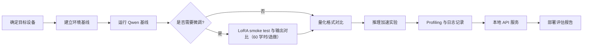

# 最终项目与验收标准

## 项目目标

最终项目要求学习者围绕一个可复现的小模型部署任务，输出一份 **端侧 Qwen 小模型部署评估报告**。报告不是实验流水账，而是面向工程评审的交付物：它要说明目标设备、模型选择、量化策略、推理加速手段、runtime 选型、profiling 结果、风险判断和下一步优化路线。

项目默认使用 Qwen 小模型、GGUF 权重、llama.cpp、Ubuntu Server + NVIDIA GPU，并可选择增加 NVIDIA Jetson 对照实验。课程不要求所有学员得到相同性能数字，因为不同显卡、Jetson 型号、驱动版本、散热条件和模型文件都会影响结果。课程要求的是：记录真实结果，并能解释结果。

报告还必须说明量化后如何进入 serving、benchmark 和 API 化链路。可以借鉴外部课程的“压缩/量化 -> 高性能推理 -> edge runtime -> final project”结构，但不要求加入 Docker、NVIDIA Triton 或云端集群 serving。

建议从第一周就按 [最终报告模板](/docs/report-template) 填写，不要等最后一周再整理。格式参考见 [完成版报告样例](/docs/example-final-report)。

## 项目主线

## 里程碑交付

| 里程碑 | 时间点 | 交付物 | 对应报告位置 | 最低证据 |
| --- | --- | --- | --- | --- |
| M0 | 第 1 次课后 | 场景约束卡和环境记录表 | 第 1、2 节 | 目标设备、workload、约束字段、环境日志路径和关键版本 |
| M1 | Part I 结束 | 推理指标小测和 baseline plan | 第 1、3 节草稿 | 固定 prompt、目标设备、模型文件、质量阈值和指标口径 |
| M2 | Part III 结束 | Q8/Q5/Q4 量化对比表 | 第 4 节 | 至少三组量化结果和日志路径 |
| M3 | Part V 结束 | runtime/profiling 对比表 | 第 5 节 | offload、ctx-size、threads 或 llama-bench 对比，含日志路径 |
| M4 | Part VI 结束 | local API smoke test 和服务日志 | 第 6 节 | 一次请求、请求记录、响应 JSON、HTTP 状态、elapsed/meta、是否超时、server 日志异常检查、模型 hash 和 server 参数 |
| M5 | 课程结束 | 端侧部署评估报告 | 全文 | 第 1-9 节完整、含推荐和不推荐方案 |

## 推荐项目范围

| 层级 | 必做内容 | 可选扩展 |
| --- | --- | --- |
| 硬件 | Ubuntu Server + NVIDIA GPU 或 Jetson 任选其一 | 第二台设备对照、Jetson Orin / Xavier 长稳 |
| 模型 | Qwen 小模型 GGUF | 同尺寸其他开源模型 |
| 微调 | 40 学时说明是否需要微调和理由，检查数据和 chat template | 60 学时或自选扩展：Qwen LoRA/QLoRA smoke test、adapter 输出对比 |
| 量化 | 至少 Q8/Q5/Q4 或同类变体 | KV Cache 量化、更多低比特格式 |
| Runtime | llama.cpp CLI 和 server | ONNX Runtime、TensorRT、MLC LLM |
| 推理加速 | GPU offload、ctx-size、threads、llama-bench | batch、FlashAttention、speculative decoding |
| Profiling | 首 token、tokens/s、峰值内存、失败日志 | 温度、功耗、p50/p95、长稳测试 |
| 服务 | 本地 OpenAI-compatible API smoke test、量化模型服务化说明 | 多轮对话、并发请求、简单前端、vLLM serving 对比 |

## 报告结构

最终报告建议按以下结构组织：

1. **场景与设备约束**：应用场景、目标设备、延迟、内存、功耗、隐私和不可接受风险。
2. **实验环境**：操作系统、驱动/CUDA/JetPack、CPU/GPU/内存、runtime 版本、模型来源和许可证。
3. **Baseline 结果**：prompt、参数、启动日志、首 token、tokens/s、内存和输出质量。
4. **量化版本对比**：Q8/Q5/Q4 或同类格式的文件大小、速度、内存、质量现象和判断。
5. **Runtime 参数与加速实验**：GPU offload、ctx-size、threads、llama-bench 或服务参数。
6. **API 服务测试**：OpenAI-compatible API 请求、响应、错误处理，并说明量化模型如何 benchmark 和 API 化。
7. **端侧部署风险**：温度、内存、长上下文、并发、输出质量、许可证、安全日志和端云 fallback。
8. **最终部署建议**：推荐模型、量化版本、runtime、参数、不推荐方案和下一步验证。
9. **附录**：命令、日志路径、表格、失败样例和参考资料。

建议在附录开头加入一张证据索引表。它不需要复杂工具，只要能把每个结论指向日志或公开运行记录：

| 结论 | 证据 | 是否公开 |
| --- | --- | --- |
| 推荐量化格式 | profiling 表、量化对比日志 | 摘要可公开 |
| 不推荐方案 | 失败样例、质量备注 | 脱敏后公开 |
| API 可用性 | 请求 JSON、HTTP 状态、server 日志 | 摘要可公开 |
| Agent 权限风险 | policy validator 输出 | 摘要可公开 |

## 评分维度

| 维度 | 权重 | 高质量表现 | 证据示例 |
| --- | ---: | --- | --- |
| 问题定义 | 15% | 目标设备、约束和指标清晰，不只追求单一速度数字 | 第 1 节约束表 |
| 实验可复现 | 20% | 命令、版本、模型文件、参数、日志路径完整 | 第 2、9 节环境和日志 |
| 量化判断 | 20% | 能解释不同量化格式的速度、内存和质量权衡 | 第 4 节对比表 |
| 推理加速判断 | 15% | 能区分量化收益、GPU offload、KV Cache、runtime 参数的影响 | 第 5 节参数实验 |
| Profiling 质量 | 15% | 有真实记录，能从日志定位失败或瓶颈 | `nvidia-smi`、`tegrastats`、`llama-bench`、server 日志 |
| 工程结论 | 15% | 给出可执行的部署建议和后续验证计划 | 第 7、8 节风险和建议 |

助教批改分档见 [教师使用指南](/docs/instructor-guide)。

如果项目选择做微调，微调结果不单独加分为“训练成功”。它要服务于工程判断：数据是否安全、格式是否稳定、adapter 是否改善目标任务、微调后是否还需要重新量化和 profiling。

## 验收结果

最低验收要求：

- 能在至少一台目标设备上完成 Qwen 小模型本地推理。
- 能完成至少三组量化版本或模型变体对比；runtime 参数对比不能替代第 4 节量化对比。
- 能记录首 token、tokens/s、峰值内存或显存、错误/异常检查结果；如未观察到错误，也要注明并保留原始日志。
- 能启动本地 OpenAI-compatible API，并用 curl 或 Python 客户端完成一次请求；保留请求记录、响应 JSON、HTTP 状态、elapsed/meta、是否超时、server 日志异常检查、模型 hash 和 server 参数。
- 能说明量化模型从 CLI 实验进入 serving、benchmark 和 API 化时新增了哪些成本和风险。
- 能写出为什么推荐某个部署方案，而不是只贴命令输出。

优秀项目应进一步做到：

- 同时覆盖 Ubuntu Server 和 Jetson，对比两类设备的性能、功耗和稳定性。
- 能解释长上下文下 KV Cache 的内存增长。
- 能区分模型加载、prefill、decode、服务化请求延迟的不同瓶颈。
- 能根据日志识别 CPU fallback、OOM、热降频或 kernel 不匹配。
- 能在需要微调时完成 LoRA/QLoRA smoke test，并解释 adapter 是否值得进入部署链路。
- 能提出下一轮优化实验，而不是停留在一次性结果。

## 结果记录模板

| 实验编号 | 设备 | 模型/量化 | Runtime 参数 | 首 token | tokens/s | 峰值内存/显存 | 温度/功耗 | 质量现象 | 日志路径 |
| --- | --- | --- | --- | --- | --- | --- | --- | --- | --- |
| E1 | 待填 | 待填 | 待填 | 待填 | 待填 | 待填 | 待填 | 待填 | 待填 |
| E2 | 待填 | 待填 | 待填 | 待填 | 待填 | 待填 | 待填 | 待填 | 待填 |
| E3 | 待填 | 待填 | 待填 | 待填 | 待填 | 待填 | 待填 | 待填 | 待填 |

## 常见问题

### 是否必须使用 Jetson？

不必须。40 学时基础版可以只使用 Ubuntu Server + NVIDIA GPU。60 学时完整版建议加入 Jetson 对照，因为 Jetson 能把端侧部署中的功耗、共享内存、温度和长期稳定性问题暴露得更明显。

### 是否必须做模型微调？

不必须。微调是条件触发任务：当问题主要来自固定格式、领域表达或交互风格时，才进入 Qwen LoRA/QLoRA smoke test。如果 prompt、RAG、校准、runtime 参数或换量化格式已经解决问题，报告中应说明为什么不做微调。

### 没有做移动端路线怎么写？

40 学时可以写“未做完整移动端实验”，说明原因是课程范围、设备限制或教师未布置。如果教师要求移动端路线图，列出候选模型格式、候选 runtime、未实测原因和下一步验证。

### 是否必须追求最高 tokens/s？

不必须。课程关注的是可解释的工程判断。一个速度更快但质量明显下降、温度不可控或服务不稳定的方案，不一定是更好的部署方案。

### 没有 GPU 是否能完成项目？

可以完成部分内容，但需要在报告中说明限制。无 GPU 环境可以完成模型加载、CPU 推理、API smoke test 和报告结构训练；GPU offload、显存、Jetson 和功耗相关实验需要目标硬件支持。

## 对应章节

- [40/60 学时教学安排](/docs/course-hours)
- [模型微调与 LoRA/QLoRA](/docs/finetuning-lora)
- [Qwen LoRA 微调实验](/docs/lab-qwen-lora-finetuning)
- [端侧部署问题框架](/docs/framework)
- [大模型量化与 KV Cache](/docs/llm-quantization)
- [推理加速基础](/docs/inference-acceleration)
- [Ubuntu Server 与 NVIDIA GPU 环境](/docs/lab-ubuntu-nvidia)
- [Jetson 环境与 Qwen 迁移](/docs/lab-jetson-setup)
- [Profiling 与结果记录](/docs/lab-profiling)

## 参考资料

本章吸收方式：

- **知识点**：从 ML Systems Book、MLPerf、llama.cpp、Qwen、Jetson、Nsight 和课程实跑记录中吸收系统指标、benchmark 严谨性、部署风险和证据链。
- **图解**：把外部评估资料重画为最终报告目录、评分维度、风险清单和结果记录模板。
- **实验**：报告必须串起 Qwen baseline、量化对比、profiling、本地 API、Jetson/Ubuntu 对照和失败样例。
- **取舍**：不引用外部 benchmark 数字作为结论；最终判断只基于学生自己的设备、日志和模型记录。

- [The Machine Learning Systems Book](https://www.mlsysbook.ai/)
- [MLPerf Inference](https://mlcommons.org/benchmarks/inference/)
- [llama.cpp 项目](https://github.com/ggml-org/llama.cpp)
- [Qwen llama.cpp 本地运行指南](https://qwen.readthedocs.io/en/v2.5/run_locally/llama.cpp.html)
- [NVIDIA Jetson documentation](https://docs.nvidia.com/jetson/)
- [NVIDIA Nsight Systems](https://developer.nvidia.com/nsight-systems)
- [公开运行记录仓库](https://github.com/neardws/edge-ai-deployment-course-runs)
