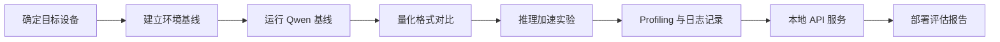

# 最终项目与验收标准

## 项目目标

最终项目要求学习者围绕一个可复现的小模型部署任务，输出一份 **端侧 Qwen 小模型部署评估报告**。报告不是实验流水账，而是面向工程评审的交付物：它要说明目标设备、模型选择、量化策略、推理加速手段、runtime 选型、profiling 结果、风险判断和下一步优化路线。

项目默认使用 Qwen 小模型、GGUF 权重、llama.cpp、Ubuntu Server + NVIDIA GPU，并可选择增加 NVIDIA Jetson 对照实验。课程不要求所有学员得到相同性能数字，因为不同显卡、Jetson 型号、驱动版本、散热条件和模型文件都会影响结果。课程要求的是：记录真实结果，并能解释结果。

## 项目主线

## 推荐项目范围

| 层级 | 必做内容 | 可选扩展 |
| --- | --- | --- |
| 硬件 | Ubuntu Server + NVIDIA GPU | Jetson Orin / Xavier 对照 |
| 模型 | Qwen 小模型 GGUF | 同尺寸其他开源模型 |
| 量化 | 至少 Q8/Q5/Q4 或同类变体 | KV Cache 量化、更多低比特格式 |
| Runtime | llama.cpp CLI 和 server | ONNX Runtime、TensorRT、MLC LLM |
| 推理加速 | GPU offload、ctx-size、threads、llama-bench | batch、FlashAttention、speculative decoding |
| Profiling | 首 token、tokens/s、峰值内存、失败日志 | 温度、功耗、p50/p95、长稳测试 |
| 服务 | 本地 OpenAI-compatible API smoke test | 多轮对话、并发请求、简单前端 |

## 报告结构

最终报告建议按以下结构组织：

1. **项目背景**：目标场景、部署设备、业务约束、不可接受风险。
2. **环境基线**：操作系统、驱动/CUDA、JetPack、CPU/GPU/内存、runtime 版本。
3. **模型与量化方案**：模型来源、许可证检查、量化格式、文件大小、选择理由。
4. **基线推理结果**：prompt、参数、启动日志、首 token、tokens/s、内存。
5. **量化对比实验**：Q8/Q5/Q4 或同类格式的速度、内存、质量现象。
6. **推理加速实验**：GPU offload、ctx-size、threads、llama-bench 或服务参数。
7. **Profiling 与失败分析**：`nvidia-smi`、`tegrastats`、日志片段、OOM/fallback/降速原因。
8. **本地服务验证**：OpenAI-compatible API 请求、响应、错误处理。
9. **部署建议**：推荐方案、不推荐方案、上线前补充验证。
10. **附录**：命令、日志路径、表格、参考资料。

## 评分维度

| 维度 | 权重 | 高质量表现 |
| --- | ---: | --- |
| 问题定义 | 15% | 目标设备、约束和指标清晰，不只追求单一速度数字 |
| 实验可复现 | 20% | 命令、版本、模型文件、参数、日志路径完整 |
| 量化判断 | 20% | 能解释不同量化格式的速度、内存和质量权衡 |
| 推理加速判断 | 15% | 能区分量化收益、GPU offload、KV Cache、runtime 参数的影响 |
| Profiling 质量 | 15% | 有真实记录，能从日志定位失败或瓶颈 |
| 工程结论 | 15% | 给出可执行的部署建议和后续验证计划 |

## 验收结果

最低验收要求：

- 能在至少一台目标设备上完成 Qwen 小模型本地推理。
- 能完成至少三种量化格式或参数配置的对比。
- 能记录首 token、tokens/s、峰值内存或显存、错误日志。
- 能启动本地 OpenAI-compatible API，并用 Python 客户端完成一次请求。
- 能写出为什么推荐某个部署方案，而不是只贴命令输出。

优秀项目应进一步做到：

- 同时覆盖 Ubuntu Server 和 Jetson，对比两类设备的性能、功耗和稳定性。
- 能解释长上下文下 KV Cache 的内存增长。
- 能区分模型加载、prefill、decode、服务化请求延迟的不同瓶颈。
- 能根据日志识别 CPU fallback、OOM、热降频或 kernel 不匹配。
- 能提出下一轮优化实验，而不是停留在一次性结果。

## 结果记录模板

| 实验编号 | 设备 | 模型/量化 | Runtime 参数 | 首 token | tokens/s | 峰值内存/显存 | 温度/功耗 | 质量现象 | 日志路径 |
| --- | --- | --- | --- | --- | --- | --- | --- | --- | --- |
| E1 | 待填 | 待填 | 待填 | 待填 | 待填 | 待填 | 待填 | 待填 | 待填 |
| E2 | 待填 | 待填 | 待填 | 待填 | 待填 | 待填 | 待填 | 待填 | 待填 |
| E3 | 待填 | 待填 | 待填 | 待填 | 待填 | 待填 | 待填 | 待填 | 待填 |

## 常见问题

### 是否必须使用 Jetson？

不必须。40 学时基础版可以只使用 Ubuntu Server + NVIDIA GPU。52 学时完整版建议加入 Jetson 对照，因为 Jetson 能把端侧部署中的功耗、共享内存、温度和长期稳定性问题暴露得更明显。

### 是否必须追求最高 tokens/s？

不必须。课程关注的是可解释的工程判断。一个速度更快但质量明显下降、温度不可控或服务不稳定的方案，不一定是更好的部署方案。

### 没有 GPU 是否能完成项目？

可以完成部分内容，但需要在报告中说明限制。无 GPU 环境可以完成模型加载、CPU 推理、API smoke test 和报告结构训练；GPU offload、显存、Jetson 和功耗相关实验需要目标硬件支持。

## 对应章节

- [40/52 学时教学安排](/docs/course-hours)
- [端侧部署问题框架](/docs/framework)
- [大模型量化与 KV Cache](/docs/llm-quantization)
- [推理加速基础](/docs/inference-acceleration)
- [Ubuntu Server 与 NVIDIA GPU 环境](/docs/lab-ubuntu-nvidia)
- [Jetson 环境与 Qwen 迁移](/docs/lab-jetson-setup)
- [Profiling 与结果记录](/docs/lab-profiling)
