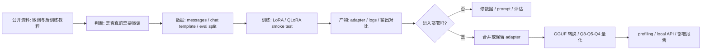
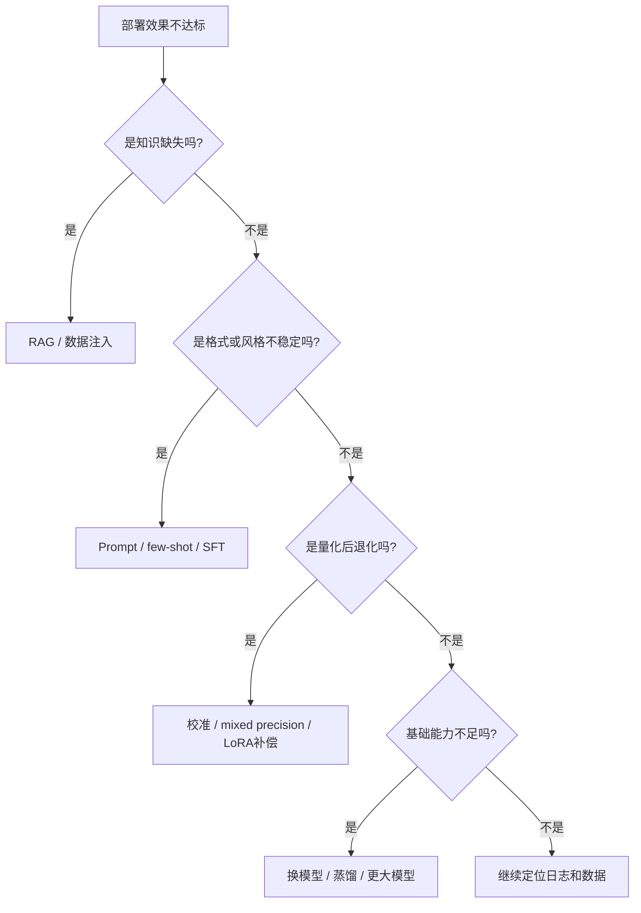
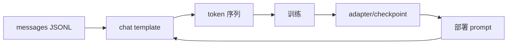
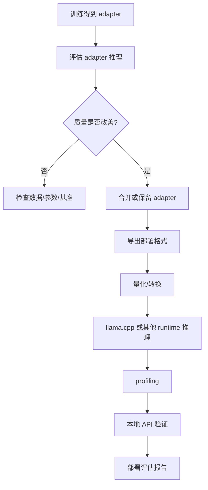

# 模型微调与 LoRA/QLoRA

## 建议学时

6 学时。

| 课时 | 内容 | 产出 |
| --- | --- | --- |
| 1 | 微调在端侧部署链路中的位置 | 微调必要性判断表 |
| 2 | 数据格式、chat template、SFT 数据质量 | 数据样例检查清单 |
| 3 | LoRA、QLoRA、全参微调、Adapter 的差异 | 微调策略选择表 |
| 4 | 训练配置、显存估算、日志阅读 | 训练配置草案 |
| 5 | 评估、过拟合、灾难性遗忘和安全边界 | 评估任务列表 |
| 6 | 微调后量化、合并、导出和部署验证 | 微调到部署流程图 |

本章对应实作：

- [Qwen LoRA 微调实验](/docs/lab-qwen-lora-finetuning)
- [Qwen GGUF 量化对比实验](/docs/lab-qwen-quantization)
- [Profiling 与结果记录](/docs/lab-profiling)
- [最终项目与验收标准](/docs/final-project)

## 自学路线

如果读者没有微调经验，建议按下面顺序学习，不要直接跳到长训练：

| 步骤 | 学什么 | 跟做什么 | 检查点 |
| --- | --- | --- | --- |
| 1 | 微调是否必要 | 填写微调必要性判断表 | 能说明为什么做或不做 |
| 2 | SFT 数据格式 | 读 5 条 `messages` JSONL | 每行可解析，最后一条是 assistant |
| 3 | Chat template | 用 tokenizer 打印 template 后文本 | 训练和推理格式一致 |
| 4 | LoRA 参数 | 看 `r`、`alpha`、target modules | 能解释训练了哪些模块 |
| 5 | Smoke test | 跑 5-step 训练 | 有 loss、日志和 adapter |
| 6 | 输出对比 | 固定 3-5 个 prompt | 能判断是否改善目标任务 |
| 7 | 部署回归 | 决定合并、量化或停止 | 结论进入最终项目报告 |

这一路线来自公开教程的共同粒度：数据、模板、训练入口、评估和部署要串起来，而不是只展示一条训练命令。

## 公开资料怎么转成本章内容

Hugging Face LLM Course、Transformers chat template、TRL/PEFT、Qwen/LLaMA-Factory 和中文后训练资料都会讲数据格式、训练入口、adapter 和部署参数。本章不复刻这些教程的 API 细节，而是把它们收束成一个端侧部署闭环：先判断是否需要微调，再用最小 LoRA smoke test 验证数据和训练链路，最后回到 GGUF、量化、profiling 和本地 API。



| 外部资料中的经典内容 | 本章吸收什么 | 课程里的落点 |
| --- | --- | --- |
| Hugging Face LLM Course / Transformers | tokenizer、generation、chat template 和模型生态 | 训练数据、部署 prompt 和本地推理使用同一 template |
| TRL SFTTrainer | SFT 数据入口、assistant loss、训练参数 | 只保留最小 smoke test 和日志阅读，不写成长训练手册 |
| PEFT | LoRA/QLoRA adapter、target modules、合并与加载 | 用于解释 adapter 产物和合并后再量化 |
| Qwen / LLaMA-Factory | Qwen 微调流程、配置和训练命令组织 | 作为 Qwen 小模型实作参考，结论必须回到 GGUF 部署 |
| 中文后训练与部署资料 | 微调、部署参数、KV Cache、LoRA serving 边界 | 用于补工程表达和 adapter 到服务化的取舍 |
| LoRA / QLoRA 论文 | 低秩增量、NF4、double quantization | 用公式解释参数和显存，不扩展成论文精读 |

本章每个微调实验都要留下四类证据：数据检查结果、训练日志、固定 prompt 输出对比、量化部署回归。

## 学习目标

完成本章后，学习者应能：

- 判断什么时候应该微调，什么时候应该先做 prompt、RAG、后处理、换模型或量化修复。
- 区分 SFT、LoRA、QLoRA、全参微调、蒸馏、继续预训练和偏好优化。
- 设计一个小规模、可复查的指令微调数据集，并检查数据格式和 chat template。
- 阅读训练日志，理解 loss、learning rate、显存、checkpoint、eval loss 的基本含义。
- 解释微调后为什么还需要重新评估、重新量化、重新 profiling。
- 把微调结果纳入端侧部署评估报告，而不是把训练和部署割裂。

## 章节定位

量化和推理加速解决的是“模型如何在设备上跑得更小、更快、更稳”。

微调解决的是“模型是否更适合某个任务、格式、领域或交互方式”。

这两个问题会互相影响：

- 微调后的模型需要重新评估量化质量。
- LoRA adapter 合并后可能改变权重分布。
- QLoRA 训练本身使用低比特基座，但部署时仍要看目标 runtime。
- 微调能修复一部分输出格式或领域问题，但不能替代 runtime profiling。

## 什么时候需要微调

优先级上，微调通常不是第一步。

端侧项目应先判断问题来源。

| 现象 | 先尝试 | 微调是否必要 |
| --- | --- | --- |
| 输出格式偶尔不稳定 | prompt、few-shot、JSON schema、后处理 | 不一定 |
| 缺少企业术语解释 | RAG、词表说明、few-shot | 视任务稳定性而定 |
| 固定格式任务长期失败 | 数据构造、SFT/LoRA | 可能需要 |
| 模型知识过时 | RAG、知识库更新 | 微调不是首选 |
| 风格、语气、模板固定 | SFT/LoRA | 适合小规模微调 |
| 复杂推理能力不足 | 换更强模型、任务拆解 | 微调不一定有效 |
| 量化后质量下降 | 先做精度修复和 mixed precision | 微调是第二阶段 |

常见问题的优先方案：

| 问题 | 优先方案 |
| --- | --- |
| 模型不会某个领域术语 | 先尝试 RAG、prompt 或 system instruction |
| 输出格式不稳定 | 少量 instruction tuning 或约束解码 |
| 风格不符合业务 | LoRA 微调 |
| 知识过期 | RAG 优先，不建议单纯微调 |
| 端侧内存不足 | 换小模型或量化优先，不要先微调 |
| 微调后 Q4 质量下降 | 回退 Q5/Q8 或重新评估 adapter/merge |

一个实用判断：



## 微调后部署检查表

```text
[ ] base model 能跑
[ ] adapter 能加载
[ ] chat template 未改变或已记录
[ ] 固定 prompt 对比 base vs adapter
[ ] merge 前后输出一致性检查
[ ] 量化后重新测试
[ ] local API 重新测试
```

## 微调类型

| 类型 | 做什么 | 适合 | 风险 |
| --- | --- | --- | --- |
| SFT | 用指令-回答数据训练模型遵循任务格式 | 格式、风格、领域表达 | 数据质量差会快速污染模型 |
| LoRA | 冻结基座，只训练低秩增量参数 | 小显存、快速试验 | adapter 与基座版本必须匹配 |
| QLoRA | 低比特加载基座并训练 LoRA | 显存受限训练 | 训练与部署低比特路径不可混淆 |
| 全参微调 | 更新全部权重 | 数据和算力充足的强定制 | 成本高、灾难性遗忘风险高 |
| 继续预训练 | 用大量文本继续语言建模 | 领域语言适配 | 不直接保证指令遵循 |
| 蒸馏 | 让小模型学习大模型输出 | 小模型能力补偿 | 教师输出质量决定上限 |
| 偏好优化 | 用偏好数据调整回答倾向 | 对齐和风格控制 | 需要更复杂数据和评估 |

本课程主线采用 LoRA/QLoRA 风格的小规模 SFT 实验。

原因是它最适合作为自学实验：

- 数据量可以很小，但能观察完整流程。
- 训练产物体积小，便于保存和比较。
- 与 Qwen、Transformers、PEFT、TRL、LLaMA-Factory 等生态对应。
- 训练后可以继续做量化、GGUF 转换和本地部署验证。

## LoRA 与 QLoRA 的数学形式

LoRA 的核心假设是：微调引起的权重变化是低秩的。

对一个被注入的线性层（例如 attention 的 q_proj），冻结原始权重 $W_0 \in \mathbb{R}^{d \times k}$，只训练两个低秩矩阵：

$$
h = W_0 x + \frac{\alpha}{r}\,BAx, \qquad B \in \mathbb{R}^{d \times r},\; A \in \mathbb{R}^{r \times k},\; r \ll \min(d, k)
$$

其中 $r$ 是秩（配置里的 `r`），$\alpha$ 是缩放系数（配置里的 `lora_alpha`），$\alpha/r$ 决定增量项的整体强度。初始化时 $A$ 用高斯随机、$B$ 置零，因此训练开始时增量 $BA = 0$，模型行为和基座完全一致。

可训练参数只有 $r(d + k)$ 个，相对该层全参数 $dk$ 的比例是：

$$
\frac{r(d+k)}{dk} = r\left(\frac{1}{k} + \frac{1}{d}\right)
$$

以 Qwen2.5-0.5B 的 q_proj 为例（$d = k = 896$、$r = 8$）：可训练参数 $8 \times 1792 = 14336$ 个，约占该层全参的 1.8%。LoRA 显存便宜的来源就在这里：梯度和优化器状态只为这一小部分参数维护。

部署时有两种用法：

- 不合并：runtime 同时加载 $W_0$ 和 $B$、$A$，推理时多一次低秩乘法。
- 合并：$W = W_0 + \frac{\alpha}{r}BA$，得到一个普通权重矩阵，对 runtime 完全透明，也是后续转 GGUF 的前提。

QLoRA 在此基础上把冻结的基座用 NF4（4-bit NormalFloat）量化加载。NF4 的 16 个格点按标准正态分布的分位数排布，对近似正态的权重分布，舍入误差比均匀 INT4 更小；double quantization 把每组的量化常数再量化一次，平均每参数再省约 0.4 bit。训练时前向用反量化的基座计算，梯度只流向 $A$、$B$。

三条路线的显存可以用计算式粗估（只算权重、梯度、Adam 优化器状态三项，$N$ 是基座参数量，$N_{lora}$ 是 LoRA 参数量）：

| 占用项 | 全参 FP16 | LoRA（FP16 基座） | QLoRA（NF4 基座） |
| --- | --- | --- | --- |
| 权重 | $2N$ | $2N$ | $\approx 0.5N$ |
| 梯度 | $2N$ | $2N_{lora}$ | $2N_{lora}$ |
| Adam 状态 | $8N$ | $8N_{lora}$ | $8N_{lora}$ |

全参训练光这三项就约 $12N$（0.5B 模型约 6 GB），LoRA 把后两项几乎抹掉，QLoRA 再把第一项压到约四分之一。激活占用另算，随 batch 和序列长度增长，这也是 smoke test 用 `max_seq_length 512`、`batch 1` 的原因。

## 数据格式

微调数据不是普通文本堆叠。

最基本的 SFT 样本需要明确：

- 用户输入。
- 助手输出。
- 是否有 system 指令。
- 是否需要工具调用或 JSON 格式。
- 是否符合目标模型的 chat template。

推荐 JSONL 样例：

```json
{"messages":[{"role":"system","content":"你是端侧模型部署课程助教。回答要简洁、可操作。"},{"role":"user","content":"什么情况下不应该先做模型微调？"},{"role":"assistant","content":"当问题可以通过 prompt、RAG、后处理、量化校准或 runtime 参数解决时，不应该先做微调。微调适合稳定的格式、风格或领域任务。"}]}
{"messages":[{"role":"system","content":"你是端侧模型部署课程助教。"},{"role":"user","content":"请输出 JSON，总结 Q4 量化的两个风险。"},{"role":"assistant","content":"{\"risks\":[\"低比特 kernel 不匹配时未必加速\",\"质量可能在格式化输出和长上下文任务中下降\"]}"}]}
```

数据检查清单：

| 检查项 | 为什么重要 |
| --- | --- |
| 每条样本有明确任务 | 避免模型学习到无意义聊天 |
| 输出格式稳定 | 方便评估是否学会目标格式 |
| 不含隐私和敏感信息 | 公开课程和开源仓库不能泄露数据 |
| 不含互相矛盾答案 | 小数据集里矛盾会被放大 |
| system/user/assistant 角色正确 | chat template 才能正确应用 |
| 训练集和评估集分开 | 避免只记住训练样本 |

最小数据检查命令：

```bash
python - <<'PY'
import json
from pathlib import Path

path = Path("labs/finetuning/sample_sft_data.jsonl")
rows = []
for line_no, line in enumerate(path.read_text(encoding="utf-8").splitlines(), 1):
    row = json.loads(line)
    assert "messages" in row, f"line {line_no} missing messages"
    roles = [msg["role"] for msg in row["messages"]]
    assert roles[-1] == "assistant", f"line {line_no} last role is not assistant"
    rows.append(row)
print(f"ok: {len(rows)} samples")
PY
```

检查通过只说明格式能读，不说明数据质量好。还要人工看 assistant 输出是否统一、是否含隐私信息、是否和最终评估任务一致。

## Chat template

同一段对话，如果使用不同 chat template，token 序列可能不同。

微调时和部署时必须保持一致。



自学时最常见的问题是：

- 训练时用了 messages 格式，推理时直接拼纯文本。
- 训练时有 system prompt，部署时忘记加。
- 训练时要求 JSON，部署时 prompt 不再强调格式。
- 使用不同 tokenizer 或模型版本。

可以先打印一条样本经过 chat template 后的文本：

```bash
python - <<'PY'
import json
from pathlib import Path
from transformers import AutoTokenizer

model = "Qwen/Qwen2.5-0.5B-Instruct"
row = json.loads(Path("labs/finetuning/sample_sft_data.jsonl").read_text(encoding="utf-8").splitlines()[0])
tokenizer = AutoTokenizer.from_pretrained(model, trust_remote_code=True)
text = tokenizer.apply_chat_template(
    row["messages"],
    tokenize=False,
    add_generation_prompt=False,
)
print(text)
PY
```

如果这里打印出的角色标记、system prompt 或 assistant 结尾和部署时不一致，先修模板问题，不要急着训练。

## 训练配置字段

一个训练配置至少要能回答这些问题：

| 字段 | 作用 | 记录方式 |
| --- | --- | --- |
| base model | 基座模型 | 模型名、版本、来源、许可证 |
| dataset | 训练数据 | 路径、条数、格式、切分方式 |
| max length | 最大序列长度 | 影响显存和样本截断 |
| batch size | 每步样本数 | 与显存直接相关 |
| gradient accumulation | 梯度累积 | 小显存模拟较大 batch |
| learning rate | 学习率 | 过高容易破坏模型行为 |
| epochs / steps | 训练轮数 | 小数据过多轮容易过拟合 |
| LoRA rank | 低秩维度 | 越大参数越多，未必越好 |
| target modules | 注入 LoRA 的模块 | 需与模型结构匹配 |
| save strategy | 保存 checkpoint | 便于回滚和对比 |
| eval strategy | 评估频率 | 观察是否过拟合 |

本课程 smoke test 的最低配置是：

| 字段 | 建议起点 | 原因 |
| --- | --- | --- |
| base model | `Qwen/Qwen2.5-0.5B-Instruct` | 小模型更适合教学验证 |
| max steps | 5 | 先验证训练链路，不追求效果 |
| max seq length | 512 | 降低显存压力 |
| batch size | 1 | 最小可运行起点 |
| LoRA rank | 8 | 能观察 adapter，又不扩大成本 |
| target modules | `q_proj/k_proj/v_proj/o_proj` | 常见注意力投影模块 |
| output path | 仓库外路径 | 避免提交 adapter 和 checkpoint |

这些字段在 PEFT 里逐项对应，可以和数学小节的公式互相印证：

```python
from peft import LoraConfig, get_peft_model
from transformers import AutoModelForCausalLM

model = AutoModelForCausalLM.from_pretrained("Qwen/Qwen2.5-0.5B-Instruct")
lora_config = LoraConfig(
    r=8,                       # 公式里的 r
    lora_alpha=16,             # 公式里的 alpha，增量强度 alpha/r = 2
    lora_dropout=0.05,
    target_modules=["q_proj", "k_proj", "v_proj", "o_proj"],
    task_type="CAUSAL_LM",
)
model = get_peft_model(model, lora_config)
model.print_trainable_parameters()
```

`print_trainable_parameters()` 输出的可训练参数比例，应该和用 $r(d+k)$ 手算的结果一致。对不上时先检查 target modules 是否真的匹配到了模块。

## 显存和训练成本

微调比推理更耗显存。

即使使用 LoRA，也要考虑：

- 基座模型加载。
- 激活保存。
- 梯度。
- 优化器状态。
- LoRA 参数。
- batch size 和 sequence length。

QLoRA 的意义是降低基座加载和训练过程中的显存压力，但它不是“免费训练”。

训练前应先做小样本 smoke test：

| 阶段 | 目标 |
| --- | --- |
| 1 条样本 | 验证数据格式和 tokenizer |
| 10 条样本 | 验证训练循环能跑通 |
| 小步数训练 | 验证 loss 能记录、checkpoint 能保存 |
| 小评估集 | 验证输出格式是否有变化 |
| 部署验证 | 验证微调结果是否能在目标 runtime 使用 |

## 训练日志怎么看

训练日志不是只看 loss 下降。

| 日志信号 | 可能含义 | 处理方式 |
| --- | --- | --- |
| loss 不动 | 学习率、数据格式、mask、模型加载有问题 | 先跑极小样本检查 |
| loss 快速变很低 | 数据太少或重复，可能过拟合 | 增加评估集和保留样本 |
| eval loss 上升 | 泛化变差 | 降低轮数或清理数据 |
| 显存 OOM | batch、max length、模型太大 | 降 batch、降长度、换 QLoRA |
| 输出格式没学会 | 数据不一致、样本太少 | 统一格式并增加样本 |
| 原有能力退化 | 灾难性遗忘 | 降学习率、混入通用样本 |

读日志的顺序建议是：

1. 先看环境是否真的用到了目标 GPU。
2. 再看每一步是否有 loss 和 learning rate。
3. 再看 checkpoint 或 adapter 是否保存。
4. 最后才看 loss 是否下降。

课程中的 5-step smoke test 即使 loss 没有明显下降，也可能是合格的。它的目标是验证数据、tokenizer、训练循环和保存路径。

## 微调前后评估

微调评估要固定 prompt、采样参数和输出要求。

不要只挑训练集中出现过的问题。至少准备三类 prompt：

| 类型 | 目的 | 示例 |
| --- | --- | --- |
| 近似训练样本 | 检查是否学会目标格式 | `请输出 JSON，总结 Q4 量化的两个风险。` |
| 未见同类任务 | 检查泛化 | `请用表格比较 LoRA 和 QLoRA。` |
| 部署解释任务 | 检查课程目标能力 | `Jetson 上 tokens/s 下降时先排查什么？` |
| 负面测试 | 检查是否过拟合 | `请给出一个和端侧部署无关的闲聊回答。` |

记录时不要只写“变好”。应说明改善点：

- JSON 是否合法。
- 是否少了无关解释。
- 是否更稳定遵循 system prompt。
- 是否引入新的错误。
- 是否影响原本已经会的任务。

## 微调后的部署链路

微调完成不等于部署完成。

需要继续执行：



部署时要分别回答：

- adapter 是否需要合并到基座？
- 合并后能否转换为 GGUF？
- 量化后目标任务是否仍然改善？
- 微调是否导致 tokens/s、内存、首 token 延迟变化？
- Jetson 上是否仍能加载和稳定运行？

合并路线的最小命令链。先在 Transformers 生态合并：

```python
from peft import PeftModel
from transformers import AutoModelForCausalLM, AutoTokenizer

base_id = "Qwen/Qwen2.5-0.5B-Instruct"
base = AutoModelForCausalLM.from_pretrained(base_id, torch_dtype="bfloat16")
merged = PeftModel.from_pretrained(base, "outputs/qwen-lora-smoke/adapter").merge_and_unload()
merged.save_pretrained("outputs/qwen-merged")
AutoTokenizer.from_pretrained(base_id).save_pretrained("outputs/qwen-merged")
```

`merge_and_unload()` 执行的就是数学小节的合并式 $W = W_0 + \frac{\alpha}{r}BA$。合并后回到[大模型量化](/docs/llm-quantization)的标准 GGUF 链路：

```bash
mkdir -p ~/edge-ai-lab/finetune/logs

python llama.cpp/convert_hf_to_gguf.py \
  ~/edge-ai-lab/finetune/outputs/qwen-merged \
  --outfile models/qwen/qwen2.5-0.5b-merged-f16.gguf \
  --outtype f16 \
  2>&1 | tee ~/edge-ai-lab/finetune/logs/convert-merged.log

./build/bin/llama-quantize \
  models/qwen/qwen2.5-0.5b-merged-f16.gguf \
  models/qwen/qwen2.5-0.5b-merged-q4_k_m.gguf \
  Q4_K_M \
  2>&1 | tee ~/edge-ai-lab/finetune/logs/quantize-merged.log
```

不合并的路线也存在：llama.cpp 的 `convert_lora_to_gguf.py` 可以把 adapter 单独转成 GGUF LoRA，推理时用 `--lora` 挂载到基座 GGUF 上。边界条件是：基座 GGUF 和 adapter 必须来自完全相同的模型版本，在量化基座上挂 adapter 的质量也要单独验证。课程推荐先走合并路线，因为它的部署语义最简单、和量化实验的衔接最直接。

部署回归的最低检查表：

| 检查项 | 通过标准 |
| --- | --- |
| adapter 推理 | 同一基座能加载 adapter 并生成结果 |
| 输出质量 | 至少 3 个固定 prompt 有记录 |
| 合并判断 | 能说明合并或不合并的理由 |
| 量化回归 | 微调后量化方案需要重新测试 |
| 性能回归 | 记录首 token、tokens/s、内存或失败原因 |
| 报告沉淀 | 结论写进最终部署评估报告 |

## 与量化的关系

微调和量化常见组合：

| 路线 | 说明 | 适合 |
| --- | --- | --- |
| 先微调再量化 | 先得到任务适配模型，再做部署压缩 | 任务质量优先 |
| 先量化再补偿 | 量化后质量下降，再做 LoRA/蒸馏修复 | 端侧约束优先 |
| QLoRA 训练 + 部署量化 | 训练时低比特加载，部署时重新选择格式 | 显存受限自学实验 |
| 微调 adapter + 不合并 | 部署时加载基座和 adapter | 服务端较方便，端侧未必方便 |
| 合并 adapter + GGUF | 合并后转 GGUF 做 llama.cpp | 本课程推荐验证路线 |

注意：QLoRA 训练中的 4bit 加载，不等同于最终部署的 GGUF Q4。

二者都涉及低比特，但工具链、目标和 runtime 不同。

## 配套实作

本章配套实作不追求训练出“强模型”。

它追求完整闭环：

1. 准备 10-50 条小型教学数据。
2. 检查 messages 格式和 chat template。
3. 运行极小步数 LoRA/QLoRA smoke test。
4. 保存 adapter 和训练日志。
5. 对比微调前后固定 prompt 输出。
6. 记录显存、训练时间、失败日志。
7. 判断是否值得进入合并、量化和部署验证。

建议按下面文件配合完成：

| 文件 | 用途 |
| --- | --- |
| `labs/finetuning/sample_sft_data.jsonl` | 教学样例数据 |
| `labs/finetuning/train_lora_smoke.py` | 最小 LoRA SFT smoke test |
| `labs/finetuning/lora_config.example.yaml` | 训练配置记录模板 |
| `labs/finetuning/finetuning-results-template.md` | 结果记录模板 |

## 验收结果

| 产物 | 验收标准 |
| --- | --- |
| 数据样例 | JSONL 可读，messages 角色正确，没有隐私信息 |
| 配置文件 | 能说明基座、数据、batch、学习率、LoRA 参数 |
| 训练日志 | 至少包含 loss、step、显存或失败原因 |
| adapter 或 checkpoint | 保存路径清晰，不提交到 Git |
| 对比输出 | 同一 prompt 下有微调前后结果 |
| 部署判断 | 能说明是否进入量化和端侧验证 |

## 常见问题

### 微调是不是一定能提升模型？

不是。微调只会让模型更接近训练数据分布。数据质量差、样本少、格式混乱或学习率过高时，模型可能变差。

### LoRA adapter 可以直接部署到 llama.cpp 吗？

要看具体工具链和格式。课程建议把 adapter 先在 Transformers 生态验证，再根据目标 runtime 决定是否合并、转换或重新量化。

### 小数据集有意义吗？

有教学意义，但不要夸大。小数据集适合学习流程、验证格式控制和观察失败模式，不适合证明模型能力全面提升。

### 微调和 RAG 怎么选？

知识更新优先 RAG，固定格式和风格优先微调。很多产品会同时使用：RAG 提供知识，微调改善回答格式和交互习惯。

## 作业

### 阅读题

1. 阅读 QLoRA 论文（arXiv 2305.14314）第 3 节，说明 NF4 的格点为什么按正态分位数排布，double quantization 节省了什么。
2. 阅读 PEFT 文档的 LoRA 页面，列出除注意力投影外还可以注入 LoRA 的模块，以及扩大 target modules 的代价。

### 检查题

1. 手算：Qwen2.5-0.5B 的一个 $896 \times 896$ 投影层注入 $r = 8$ 的 LoRA，可训练参数是多少个？占该层全参的百分比是多少？
2. `lora_alpha=32, r=8` 与 `lora_alpha=16, r=8` 的区别是什么？哪个等效于更强的增量？
3. 判断并说明理由：QLoRA 用 NF4 加载训练成功，说明这个模型用 GGUF Q4 部署的质量也没有问题。

### 实验题

1. 运行 `labs/finetuning/train_lora_smoke.py`，在日志中找到可训练参数信息，与检查题 1 的手算结果对照。
2. 把 smoke test 得到的 adapter 合并并量化为 Q4_K_M GGUF，用固定 3 个 prompt 对比“基座 Q4”和“合并后 Q4”的输出，把结论填入 `labs/finetuning/finetuning-results-template.md`。

### 讨论题

1. “先微调再量化”和“先量化再 LoRA 补偿”两条路线，分别在什么证据下应该优先选择？

## 参考资料

本章吸收方式：

- **知识点**：从 Hugging Face LLM Course、chat templates、PEFT/TRL、Qwen/LLaMA-Factory、LoRA/QLoRA 中提取数据格式、adapter、训练入口和部署回归。
- **图解**：把微调教程重画为“数据 -> template -> LoRA -> adapter -> 合并/量化 -> 部署验证”的闭环图。
- **实验**：外部训练路线只落到 5-step smoke test、输出对比、adapter 保存和回到 llama.cpp 的部署检查。
- **取舍**：不把课程变成完整训练课；微调必须服务于端侧部署质量问题。

- [Hugging Face LLM Course](https://huggingface.co/learn/llm-course/chapter1/1)
- [Hugging Face Transformers documentation](https://huggingface.co/docs/transformers/index)
- [Hugging Face Transformers Chat templates](https://huggingface.co/docs/transformers/chat_templating)
- [Hugging Face PEFT documentation](https://huggingface.co/docs/peft/index)
- [TRL SFTTrainer documentation](https://huggingface.co/docs/trl/sft_trainer)
- [Qwen LLaMA-Factory fine-tuning guide](https://qwen.readthedocs.io/en/v3.0/training/llama_factory.html)
- [LLaMA-Factory](https://github.com/hiyouga/LLaMA-Factory)
- [LLM 后训练实践：模型压缩、部署优化与能力扩展](https://posttrain.gaozhijun.me/docs/lecture-5/)
- [大模型微调与部署指南](https://wuduoyi.com/llm-finetune/deploy.html)
- [Unsloth documentation](https://docs.unsloth.ai/)
- [LoRA paper](https://arxiv.org/abs/2106.09685)
- [QLoRA paper](https://arxiv.org/abs/2305.14314)
