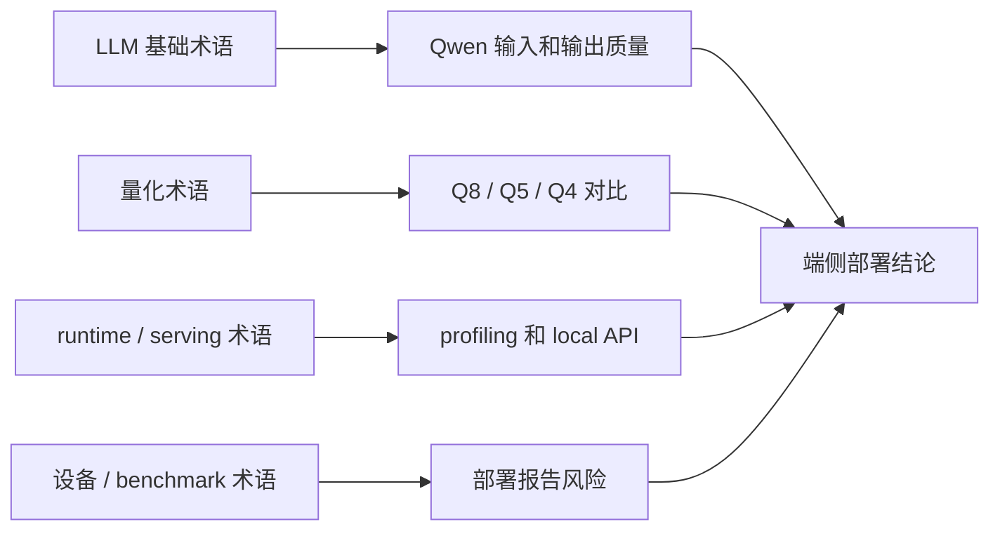

# 端侧部署术语表

本页只收录课程中反复出现、会影响实验判断的术语。更细的公式约定见 [公式与符号约定](/docs/math-conventions)。

## 公开资料怎么转成本页术语

公开课程和官方文档会使用很多相同词汇，但上下文不同：LLM 课程强调 tokenizer、chat template 和生成流程，量化资料强调 scale、zero-point、outlier 和 calibration，serving/runtime 资料强调 TTFT、throughput、KV Cache 和 API，Jetson/benchmark 资料强调内存、温度、功耗和可复现条件。本页只保留会影响本课程实验判断的词。

| 术语来源 | 本页吸收什么 | 为什么保留 |
| --- | --- | --- |
| Hugging Face LLM / Transformers | tokenizer、chat template、prefill、decode、KV Cache | 解释 Qwen 输入格式、首 token 和长上下文 |
| DeepLearning.AI / PyTorch / ONNX 量化资料 | calibration、scale、zero-point、outlier、低比特 | 支撑 Q8/Q5/Q4 和质量退化判断 |
| Qwen / llama.cpp 文档 | GGUF、Q4/Q5/Q8、GPU offload、`ctx-size`、server | 对齐课程主线实验命令和日志字段 |
| vLLM / serving / OpenAI-compatible API 资料 | TTFT、throughput、P50/P99、服务开销 | 区分 CLI 指标和 API 端到端体验 |
| Jetson / MLPerf / Nsight / llama-bench | fallback、thermal throttling、指标条件 | 写入 profiling、排障和最终报告风险 |

术语表不是百科。每个词都要能回答一个工程问题：它影响哪个命令、哪个日志字段、哪张表，或者最终报告中的哪类判断。

| 术语 | 一句话解释 | 本课程在哪里用 |
| --- | --- | --- |
| TTFT | 从请求发出到第一个 token 返回的时间，也叫首 token 延迟 | 推理指标、API 服务、profiling |
| tokens/s | LLM decode 阶段每秒生成 token 数 | baseline、量化对比、加速实验 |
| latency | 单次请求耗时，必须说明测量边界 | 推理基础、服务化 |
| throughput | 单位时间处理量，传统模型常用 samples/s，LLM 常用 tokens/s | batch、serving、benchmark |
| P50 / P99 | 延迟分位数，P99 描述尾部慢请求 | 服务化体验和稳定性 |
| prefill | 处理 prompt 并写入 KV Cache 的阶段 | Transformer、TTFT、长上下文 |
| decode | 逐 token 生成的阶段 | tokens/s、roofline、KV Cache |
| KV Cache | 保存历史 token 的 key/value，避免重复计算 | 长上下文、显存、并发 |
| GGUF | llama.cpp/ggml 生态常用模型文件格式 | Qwen 本地部署 |
| Q4/Q5/Q8 | GGUF 量化格式名，不等价于普通全模型 INT4/INT5/INT8 | 量化对比 |
| GPU offload | 把部分或全部层放到 GPU 上执行 | llama.cpp 加速、Jetson |
| `ctx-size` | llama.cpp 上下文长度设置 | KV Cache、内存、TTFT |
| LoRA adapter | 微调时保存的低秩增量参数 | 微调、部署回归 |
| QLoRA | 低比特加载基座并训练 LoRA 的方法 | 小显存微调 |
| chat template | 把 system/user/assistant 消息转为模型训练格式的模板 | Qwen、微调、服务化 |
| calibration | 用代表性样本统计量化范围 | PTQ、activation 量化 |
| outlier | 数值分布中少数异常大值，会拉大量化范围 | SmoothQuant、AWQ、LLM.int8 |
| fallback | runtime 因不支持某算子或格式回退到 CPU 或慢路径 | profiling、排障 |
| thermal throttling | 设备过热后降频，导致持续性能下降 | Jetson、长稳测试 |
| OpenAI-compatible API | 兼容 `/v1/chat/completions` 等接口的本地服务形态 | local API、Agent 集成 |

## 容易混淆的词

| 容易混淆 | 正确区分 |
| --- | --- |
| 模型文件大小 vs 运行内存 | 运行时还有 KV Cache、activation、workspace、服务进程 |
| TTFT vs tokens/s | 前者看第一个 token，后者看稳定生成速度 |
| 低比特 vs 更快 | 低比特通常更小，是否更快取决于 kernel、带宽和 offload |
| GGUF vs 量化算法 | GGUF 是文件格式，Q4_K_M 等是具体块量化格式 |
| CLI 跑通 vs API 可用 | API 还要验证端口、JSON、超时、日志和资源占用 |

## 参考资料

本章吸收方式：

- **知识点**：从 LLM、量化、runtime、serving、Jetson 和 benchmark 资料中提取会影响实验判断的术语。
- **图解**：重画为“术语来源 -> Qwen/量化/profiling/API -> 部署结论”的 Mermaid 图。
- **实验**：每个术语都对应 Qwen GGUF、Q8/Q5/Q4、profiling、local API 或最终报告字段。
- **取舍**：不做完整术语百科，不复制外部定义，也不收录本课程不会用到的厂商 API 名词。

- [类似教材与教程参考](/docs/similar-courses)
- [参考资料地图](/docs/reference-map)
- [公式与符号约定](/docs/math-conventions)
- [Hugging Face LLM Course](https://huggingface.co/learn/llm-course)
- [Hugging Face Transformers chat templates](https://huggingface.co/docs/transformers/chat_templating)
- [DeepLearning.AI Quantization Fundamentals](https://www.deeplearning.ai/courses/quantization-fundamentals/)
- [Qwen llama.cpp 本地运行指南](https://qwen.readthedocs.io/en/v2.5/run_locally/llama.cpp.html)
- [llama.cpp](https://github.com/ggml-org/llama.cpp)
- [MLPerf Inference](https://mlcommons.org/benchmarks/inference/)
