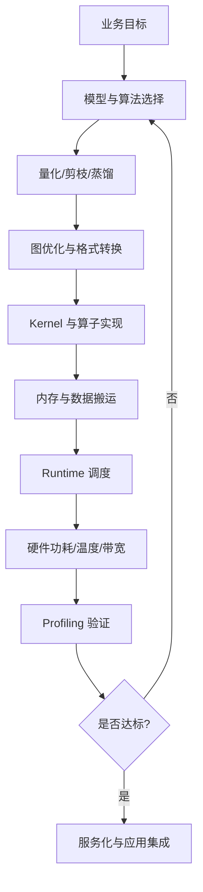
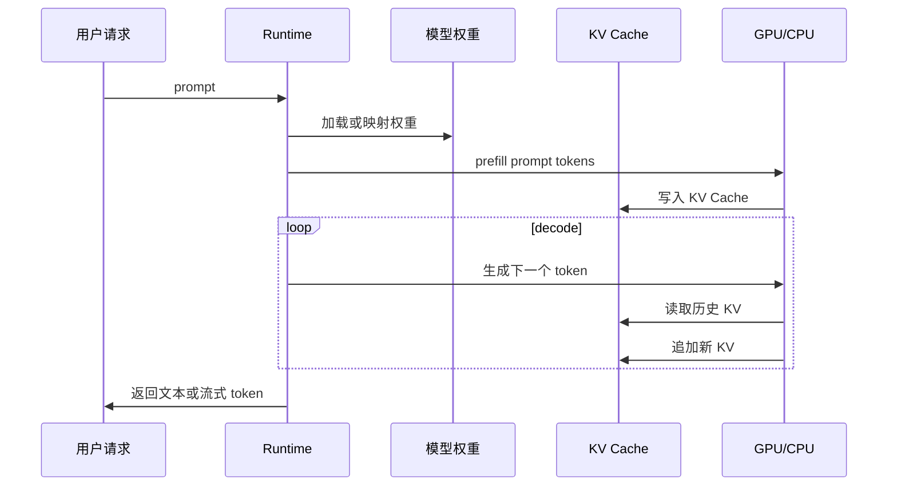
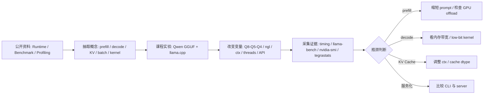

# 推理加速基础

## 建议学时

4 学时。

建议安排：

| 课时 | 内容 | 课堂产出 |
| --- | --- | --- |
| 1 | 推理加速分层框架 | 一张瓶颈定位图 |
| 2 | LLM 推理路径：prefill、decode、KV Cache | 一份指标解释表 |
| 3 | GPU offload、低比特 kernel、上下文长度实验设计 | 一组实验矩阵 |
| 4 | Ubuntu Server 与 Jetson 的日志解读 | 一份优化判断结论 |

本章对应实验章节：

- [推理加速实验](/docs/lab-inference-acceleration)
- [Profiling 与结果记录](/docs/lab-profiling)
- [Qwen GGUF 量化对比实验](/docs/lab-qwen-quantization)
- [Jetson 环境与 Qwen 迁移](/docs/lab-jetson-setup)

## 学习目标

完成本章后，学习者应能：

- 解释推理加速与模型压缩、量化之间的区别。
- 把一次 LLM 推理拆成模型加载、prefill、decode、KV Cache 读写和服务返回。
- 从算法、图优化、kernel、内存、runtime、硬件六层分析瓶颈。
- 判断“模型更小”为什么不必然等于“推理更快”。
- 设计 GPU offload、`ctx-size`、量化格式、线程参数和 `llama-bench` 的对比实验。
- 在 Ubuntu Server + NVIDIA GPU 与 Jetson 两类设备上记录可复查的性能数据。

## 问题背景

量化和压缩解决的是“模型是否更小、是否更容易放进设备”的问题，推理加速解决的是“模型是否能在目标设备上以可接受的延迟和吞吐运行”的问题。

两者有关联，但不能混为一谈。

例如，一个 Q4 GGUF 文件比 Q8 文件更小，但在某些设备上可能出现：

- 低比特 kernel 不匹配，运行时需要反量化到较高精度。
- GPU offload 不完整，部分层回落到 CPU。
- 上下文过长导致 KV Cache 占用过高。
- Jetson 功耗模式较低或散热不足，持续运行时降频。
- 服务化后 HTTP、队列、超时和并发带来额外延迟。

所以，本课程不把“模型文件大小”当作唯一优化目标，而是用实验记录回答三个问题：

1. 当前瓶颈在哪里？
2. 某个优化手段是否真的改善了瓶颈？
3. 改善之后有没有牺牲质量、稳定性或可维护性？

## 图示讲解

推理加速不是一个单点动作，而是一条需要反复验证的链路。



LLM 推理可以拆成两个主要阶段。



这张图说明：首 token 延迟通常更受 prefill、模型加载、上下文长度影响；稳定 tokens/s 更受 decode、KV Cache 读取、kernel、内存带宽和 GPU offload 影响。

## 公开资料怎么转成本章内容

vLLM、TensorRT-LLM、TensorRT、llama.cpp、MLPerf 和 Nsight 的资料都能讲推理性能。本章先贴入部分课程截图作为视觉参考，但不把外部 benchmark 图或厂商性能表当作课程结论。这里把外部资料改写成一个课堂可执行的问题：同一个 Qwen GGUF 模型，在同一设备上改变 `-ngl`、`ctx-size`、量化格式和服务形态时，瓶颈到底移动到了哪里。



| 外部资料中的经典内容 | 本章吸收什么 | 课程里的落点 |
| --- | --- | --- |
| vLLM / PagedAttention | KV Cache 管理、batching、TTFT、throughput | 用来解释服务化指标，不作为主实验框架 |
| TensorRT / TensorRT-LLM | graph、engine、kernel、precision 和 NVIDIA GPU 路线 | 用于说明低比特必须被 runtime/kernel 承接 |
| llama.cpp / llama-bench | GGUF 本地推理、server、benchmark 工具 | 本章主实验入口和日志来源 |
| MLPerf Inference | 明确硬件、负载、指标和报告口径 | 用于规范结果表，不引用外部成绩 |
| Nsight Systems | CPU/GPU 时间线和系统级 profiling | 作为进阶排查工具，课堂先用日志和监控命令 |
| Qwen llama.cpp 文档 | Qwen 本地运行和量化路径 | 保持所有加速实验回到同一模型主线 |

### 外部课程原图参考

下面三张图来自 vLLM 官方博客中的 DeepLearning.AI/vLLM 课程截图。本章用它们提醒学生：推理加速不是单一参数调优，而是课程结构、KV Cache 和 metrics 三件事共同决定。


| 原图重点 | 本章吸收什么 | 本课程里的动作 |
| --- | --- | --- |
| 课程结构覆盖压缩、服务、评估 | 加速实验要贯穿 Qwen 量化、server 和报告 | 把 Q8/Q5/Q4、`llama-server`、profiling 放进同一闭环 |
| KV Cache 图强调状态增长 | 长上下文瓶颈不能只靠权重量化解释 | 固定并记录 `ctx-size`、prompt tokens、generated tokens |
| metrics 图强调 serving 口径 | TTFT、tokens/s、throughput、P99 不是同一个指标 | CLI、`llama-bench` 和 API elapsed 分开记录 |

DeepLearning.AI/vLLM serving 课程的价值在于把“压缩、服务、压测”连成一条闭环。本课程对应到更轻量的本地版本：

| Serving 课程内容 | 本课程保留什么 | 本课程不展开什么 |
| --- | --- | --- |
| KV Cache 与显存层级图 | 解释 `ctx-size`、并发和长上下文为什么会吃内存 | 不要求学生改 vLLM 内存管理器 |
| Continuous batching / PagedAttention | 说明 throughput 和单请求 latency 的取舍 | 不搭建高并发生产集群 |
| OpenAI-compatible serving | 用 `llama-server` 验证本地 API 可调用 | 不把后端工程扩成完整 Web 服务 |
| Benchmark under load | 区分 TTFT、tokens/s、throughput、并发 | 不引用外部排行榜作为课程结论 |
| Quantization lab | 把压缩收益和质量回归一起看 | 不把 Qwen GGUF 主线换成其他工具链 |

所以，本章的结论必须写成“在哪个设备、哪个模型、哪个参数组合下观察到什么”，不能写成泛泛的“某框架更快”。

## 核心概念

### 推理加速六层框架

| 层级 | 典型手段 | 需要验证的问题 |
| --- | --- | --- |
| 模型与算法 | 小模型、蒸馏、剪枝、MoE 路由、speculative decoding | 质量是否下降，任务是否还可用 |
| 量化/压缩 | INT8、INT4、GGUF Q8/Q5/Q4、AWQ、GPTQ、SmoothQuant | kernel 是否支持，精度是否可接受 |
| 图优化 | constant folding、operator fusion、layout transform | 是否被 dynamic shape 或 unsupported op 破坏 |
| Kernel | GEMM、FlashAttention、低比特 kernel、Tensor Core | 目标硬件是否真正使用到加速实现 |
| 内存 | KV Cache 管理、减少 CPU/GPU 拷贝、pinned memory | 是否被内存带宽、碎片或 OOM 限制 |
| Runtime/硬件 | batching、GPU offload、线程、功耗模式、散热 | 延迟、吞吐、温度和稳定性是否达标 |

### 算术强度与 Roofline 判断

判断“瓶颈是计算还是内存带宽”有一个简单的数学工具：算术强度（arithmetic intensity）。

$$
AI = \frac{\text{FLOPs}}{\text{访存字节数}}
$$

设备有两个上限：峰值算力 $P$（FLOP/s）和内存带宽 $BW$（B/s）。Roofline 模型指出，实际性能不会超过：

$$
\text{性能} \le \min\big(P,\; AI \times BW\big)
$$

单位检查：

```text
AI 的单位是 FLOPs/Byte。
MemoryBandwidth 的单位是 Byte/s。
AI x MemoryBandwidth 的单位是 FLOPs/s。
```

算术强度低于拐点 $P/BW$ 的计算是 memory-bound：算力再强也要等数据到达。

把它套到 LLM 的两个阶段：

- prefill 一次处理整个 prompt，矩阵乘是“矩阵 × 矩阵”，每读一份权重做很多次乘加，算术强度高，更接近 compute-bound。
- decode 每步只生成一个 token，矩阵乘退化为“矩阵 × 向量”（GEMV），每个权重读进来只用一次，算术强度约为 1，几乎总是 memory-bound。

由此可以直接估算 decode 速度上限：

$$
\text{tokens/s} \lesssim \frac{BW}{\text{每 token 读取字节数}} \approx \frac{BW}{\text{模型权重字节数}}
$$

以 Qwen2.5-1.5B 的 Q4_K_M 为例（文件约 1 GB）：内存带宽约 100 GB/s 的设备上，decode 上限是 100 tokens/s 量级；带宽约 1 TB/s 的桌面 GPU 上是 1000 tokens/s 量级。这是数量级估算，不是性能承诺——实际还有 KV Cache 读取、激活计算和调度开销。它只能说明：当 decode 主要受权重读取限制且 low-bit kernel 生效时，低比特格式更可能带来速度收益。

端到端延迟可以拆成：

$$
T_{total} = T_{prefill} + \frac{n_{gen}}{v_{decode}}
$$

$T_{prefill}$ 随 prompt 长度增长，决定首 token 延迟；$v_{decode}$ 是稳定生成速度，决定长输出的总耗时。两段的瓶颈类型不同，优化手段也不同。

### Prefill 与 Decode

LLM 的一次生成通常分成：

| 阶段 | 输入 | 主要计算 | 常见指标 |
| --- | --- | --- | --- |
| Prefill | prompt 中已有 token | 一次性处理上下文 | prompt eval time、首 token 延迟 |
| Decode | 每次生成的新 token | 循环生成下一个 token | eval time、tokens/s |

当 prompt 很长时，prefill 会变重。

当生成很长时，decode 和 KV Cache 读写会成为主要成本。

## 瓶颈定位表

| 现象 | 可能瓶颈 | 该看什么 | 可能动作 |
| --- | --- | --- | --- |
| TTFT 很高 | prefill 慢、prompt 太长、冷启动 | `prompt eval time`、prompt token 数 | 缩短 prompt、预热、检查 GPU offload |
| tokens/s 低 | decode 慢、内存带宽瓶颈、kernel 不匹配 | `eval time`、GPU/CPU 监控、启动日志 | 换量化格式、检查 offload、换 runtime |
| 显存爆 | KV Cache 或权重过大 | peak VRAM、`ctx-size`、模型文件 | 降 ctx、换 Q5/Q4、换小模型 |
| GPU 利用率低 | CPU sampling、数据搬运、fallback | `nvidia-smi`、runtime 日志 | 调 threads、确认 CUDA 构建、检查参数 |
| Jetson 发热降频 | 功耗或温度限制 | `tegrastats`、`nvpmodel` | 调功耗模式、改善散热、降低负载 |
| API 慢于 CLI | HTTP、JSON、队列或客户端等待 | e2e latency、server log | 比较首次/二次请求、控制 `max_tokens` |

### KV Cache

KV Cache 保存 attention 的历史 key/value，使模型不需要每生成一个 token 都重新计算全部历史。

它带来速度收益，也带来内存压力。占用估算公式和 Qwen 数值算例见[大模型量化与 KV Cache](/docs/llm-quantization)。

decode 每生成一个 token 都要完整读一遍历史 cache，所以长上下文不只吃内存：cache 字节数会进入 roofline 估算的“每 token 读取字节数”，直接拉低 tokens/s。

需要观察：

- `--ctx-size` 越大，预留或可使用的 KV Cache 空间越大。
- 多轮对话越长，实际 KV Cache 占用越高。
- Jetson 这类统一内存设备上，模型权重、KV Cache、系统进程会共同竞争内存。
- 当显存或统一内存不足时，速度下降、OOM、进程被杀都有可能发生。

### GPU Offload

在 llama.cpp 中，`-ngl` 常用于控制有多少层 offload 到 GPU。

教学实验中常用两端对比：

| 参数 | 含义 | 教学用途 |
| --- | --- | --- |
| `-ngl 0` | 尽量走 CPU 路径 | 建立 CPU baseline |
| `-ngl 99` | 尽量把层 offload 到 GPU | 验证 GPU 是否带来收益 |

不要只看命令是否加了 `-ngl`，还要看启动日志和监控工具。

在 Ubuntu Server 上看 `nvidia-smi`。

在 Jetson 上看 `tegrastats`。

### 低比特 Kernel

低比特模型有两种收益来源：

- 权重文件更小，加载和存储压力下降。
- 如果 runtime 有匹配 kernel，计算和内存带宽也可能改善。

但如果低比特格式需要在计算前反量化，或者目标 GPU 没有合适 kernel，就可能出现“更小但不更快”的情况。

### 服务化开销

CLI 推理达标，不代表服务 API 达标。

服务化后还会增加：

- HTTP 请求解析。
- JSON 序列化。
- 流式输出。
- 并发排队。
- 超时和错误处理。
- 客户端重试。

所以本课程把 [本地 OpenAI-compatible 服务](/docs/lab-local-service) 放在推理加速之后，而不是只停留在命令行输出。

## 代码/命令示例

以下命令用于教学演示。模型文件名按实际下载结果调整。

### 比较 GPU offload

```bash
cd ~/edge-ai-lab/src/llama.cpp

./build/bin/llama-cli \
  -m ~/edge-ai-lab/models/qwen/qwen2.5-1.5b-instruct-q4_k_m.gguf \
  -p "解释推理加速和量化的关系。" \
  -n 128 \
  --ctx-size 2048 \
  -ngl 0 \
  2>&1 | tee ~/edge-ai-lab/logs/ngl-0.txt

./build/bin/llama-cli \
  -m ~/edge-ai-lab/models/qwen/qwen2.5-1.5b-instruct-q4_k_m.gguf \
  -p "解释推理加速和量化的关系。" \
  -n 128 \
  --ctx-size 2048 \
  -ngl 99 \
  2>&1 | tee ~/edge-ai-lab/logs/ngl-99.txt
```

### 比较上下文长度

```bash
for ctx in 1024 2048 4096
do
  ./build/bin/llama-cli \
    -m ~/edge-ai-lab/models/qwen/qwen2.5-1.5b-instruct-q4_k_m.gguf \
    -p "用项目复盘方式解释 KV Cache 对端侧部署的影响。" \
    -n 128 \
    --ctx-size ${ctx} \
    -ngl 99 \
    2>&1 | tee ~/edge-ai-lab/logs/ctx-${ctx}.txt
done
```

### 使用 llama-bench

```bash
./build/bin/llama-bench \
  -m ~/edge-ai-lab/models/qwen/qwen2.5-1.5b-instruct-q4_k_m.gguf \
  -p 512 \
  -n 128 \
  -ngl 99 \
  2>&1 | tee ~/edge-ai-lab/logs/llama-bench-q4.txt
```

### KV Cache 量化与 flash attention

```bash
./build/bin/llama-cli \
  -m ~/edge-ai-lab/models/qwen/qwen2.5-1.5b-instruct-q4_k_m.gguf \
  -p "解释 KV Cache 量化的收益和风险。" \
  -n 128 \
  --ctx-size 8192 \
  -ngl 99 \
  -fa \
  --cache-type-k q8_0 \
  --cache-type-v q8_0 \
  2>&1 | tee ~/edge-ai-lab/logs/kv-q8.txt
```

V cache 量化需要启用 flash attention（`-fa`），flag 细节以当前版本 `--help` 为准。对比启动日志中的 KV buffer size 行和长上下文下的 tokens/s。

### 并发吞吐基准

```bash
./build/bin/llama-batched-bench \
  -m ~/edge-ai-lab/models/qwen/qwen2.5-1.5b-instruct-q4_k_m.gguf \
  -ngl 99 \
  -npp 512 -ntg 128 -npl 1,2,4,8 \
  2>&1 | tee ~/edge-ai-lab/logs/batched-bench.txt
```

`-npl` 控制并发数。观察单流 tokens/s 和总吞吐的变化方向：decode 是 memory-bound，batching 把“每读一份权重服务一个 token”变成“服务多个 token”，总吞吐上升，但单流速度未必。

### 带宽与设备观测

```bash
# Ubuntu Server：逐秒观测 GPU 利用率、显存、功耗和频率
nvidia-smi dmon -s pucm -d 1 -c 60 2>&1 | tee ~/edge-ai-lab/logs/dmon.txt

# Jetson
tegrastats --interval 1000 --logfile ~/edge-ai-lab/logs/tegrastats-accel.log
```

## 教学实验设计

本章不追求一次调到最快，而是训练实验设计能力。

建议实验矩阵：

| 实验 | 改变变量 | 固定变量 | 观察指标 |
| --- | --- | --- | --- |
| GPU offload | `-ngl 0`、`-ngl 99` | 模型、prompt、`ctx-size`、`-n` | 首 token、tokens/s、GPU 使用 |
| 上下文长度 | `--ctx-size 1024/2048/4096` | 模型、prompt、`-ngl`、`-n` | KV Cache、内存、首 token |
| 量化格式 | Q8、Q5、Q4 | 模型基座、prompt、`ctx-size` | 文件大小、质量、速度 |
| CPU 线程 | `-t` 不同值 | CPU 或混合路径 | CPU 利用率、tokens/s |
| 服务化 | CLI vs server | 模型、prompt、采样参数 | API 延迟、错误日志 |
| Jetson 功耗 | 不同功耗模式 | 模型、prompt、`ctx-size` | 温度、频率、稳定性 |

每次实验只改变一个主要变量。

## 结果记录模板

| 硬件 | 模型 | 变量 | 参数值 | 首 token | tokens/s | 峰值内存 | 温度/功耗 | 质量备注 | 日志 |
| --- | --- | --- | --- | --- | --- | --- | --- | --- | --- |
| Ubuntu Server | 待填 | GPU offload | 待填 | 待填 | 待填 | 待填 | 待填 | 待填 | 待填 |
| Ubuntu Server | 待填 | ctx-size | 待填 | 待填 | 待填 | 待填 | 待填 | 待填 | 待填 |
| Jetson | 待填 | 功耗模式 | 待填 | 待填 | 待填 | 待填 | 待填 | 待填 | 待填 |

不要编造数字。

如果课堂设备无法完成某项实验，应写明原因，例如模型未下载、显存不足、驱动不可用或 Jetson 散热条件不足。

## 验收标准

本章验收不以“某个速度数值”为标准，而以记录完整性和解释能力为标准。

| 验收项 | 达标标准 |
| --- | --- |
| 实验矩阵 | 至少覆盖 GPU offload、`ctx-size`、量化格式三类变量 |
| 原始日志 | 每次实验有对应文本日志 |
| 监控证据 | Ubuntu 有 `nvidia-smi`，Jetson 有 `tegrastats` |
| 结论 | 能说明瓶颈更像计算、内存、runtime、服务化还是功耗 |
| 质量判断 | 记录输出是否跑题、重复、格式错误或事实错误 |

## 常见失败与排查

### Q4 更小但没有更快

检查：

- runtime 是否有对应量化格式的高效 kernel。
- GPU offload 是否真的生效。
- 是否因为上下文长度或 KV Cache 成为瓶颈。
- 是否 CPU fallback 抵消了量化收益。

### `-ngl 99` 后仍然没有 GPU 使用

检查：

- llama.cpp 是否用 CUDA 构建。
- 启动日志是否显示 CUDA 后端。
- `nvidia-smi` 是否看到进程。
- Jetson 上 `tegrastats` 是否看到 GPU/内存变化。

### 首 token 很慢但 tokens/s 可以接受

可能原因：

- prompt 太长。
- prefill 成本高。
- 模型首次加载或冷启动。
- 服务化路径有请求排队或 JSON 处理开销。

### 长上下文容易 OOM

可能原因：

- `ctx-size` 设置过高。
- 模型文件过大。
- KV Cache 与权重同时占用显存或统一内存。
- Jetson 上系统进程占用较多内存。

### Jetson 连续运行后速度下降

检查：

- `tegrastats` 中温度是否持续升高。
- 功耗模式是否限制频率。
- 电源适配器是否满足设备要求。
- 是否需要主动散热或降低模型尺寸。

## 作业

完成以下任务，并在实验报告中回答：

1. 在同一模型上比较 `-ngl 0` 与 `-ngl 99`。
2. 在同一模型上比较 `ctx-size` 1024、2048、4096。
3. 比较 Q8、Q5、Q4 中至少两个量化格式。
4. 选择一组结果，解释瓶颈最可能来自哪里。
5. 如果设备是 Jetson，补充功耗模式、温度和 `tegrastats` 日志。
6. 用 roofline 框架解释你的 `-ngl` 对比结果：哪个配置更接近 memory-bound？依据是什么？
7. 用 $\text{tokens/s} \lesssim BW / \text{模型字节数}$ 估算你设备上 Q4 模型的 decode 上限，与实测值对比并解释差距来源。

## 参考资料

本章吸收方式：

- **知识点**：从 llama.cpp、TensorRT、TensorRT-LLM、vLLM、DeepLearning.AI serving 课程、MLPerf 和 Roofline 中提取 prefill/decode、KV 管理、kernel、内存带宽和 benchmark 口径。
- **图解**：远程贴入 vLLM/DeepLearning.AI 课程结构、KV Cache 和 metrics 截图作为原图参考，再重画为瓶颈定位分层图和首 token/tokens/s 拆分图。
- **实验**：把加速方法转成 `-ngl`、ctx、threads、llama-bench、CLI/API 对照和 profiling 记录。
- **取舍**：不要求全员搭建高并发 serving 集群，重点是能解释本地部署为什么慢。

- [llama.cpp server documentation](https://github.com/ggml-org/llama.cpp/tree/master/tools/server)
- [llama.cpp llama-bench documentation](https://github.com/ggml-org/llama.cpp/tree/master/tools/llama-bench)
- [llama.cpp llama-bench README](https://github.com/ggml-org/llama.cpp/blob/master/tools/llama-bench/README.md)
- [Qwen llama.cpp 本地运行指南](https://qwen.readthedocs.io/en/v2.5/run_locally/llama.cpp.html)
- [Qwen llama.cpp 量化指南](https://qwen.readthedocs.io/en/v2.5/quantization/llama.cpp.html)
- [TensorRT documentation](https://docs.nvidia.com/deeplearning/tensorrt/latest/)
- [TensorRT-LLM documentation](https://nvidia.github.io/TensorRT-LLM/)
- [vLLM documentation](https://docs.vllm.ai/)
- [DeepLearning.AI Fast & Efficient LLM Inference with vLLM](https://www.deeplearning.ai/courses/fast-and-efficient-llm-inference-with-vllm/)
- [vLLM course announcement and screenshots](https://vllm.ai/blog/2026-06-03-deeplearning-ai-vllm-course)
- [MLPerf Inference](https://mlcommons.org/benchmarks/inference/)
- [NVIDIA Nsight Systems](https://developer.nvidia.com/nsight-systems)
- [Roofline: An Insightful Visual Performance Model](https://www2.eecs.berkeley.edu/Pubs/TechRpts/2008/Archive/EECS-2008-134.pdf)
