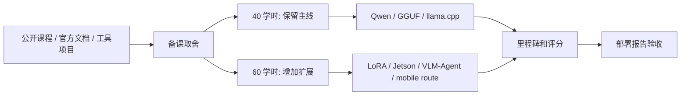

# 教师使用指南

本页面向教师和课程设计者。学生第一次学习可以先读 [Start Here](/docs/start-here)。

## 教师速查

| 任务 | 入口 |
| --- | --- |
| 确认 40/60 学时边界 | [40/60 学时教学安排](/docs/course-hours) |
| 查看最终验收 | [最终项目与验收标准](/docs/final-project) |
| 排查学生实验失败 | [排障索引](/docs/troubleshooting-index) |
| 追踪课程迭代反馈 | [课程迭代反馈记录](/docs/course-review-feedback) |

## 公开资料怎么转成本页备课

教师备课不需要把所有外部课程重新讲一遍。公开课程提供结构，官方文档提供可靠术语，工具项目提供可执行命令，benchmark 资料提供验收口径。本页只把这些资料转成教师可操作的三件事：讲什么、删什么、怎么验收。



| 外部资料中的可吸收点 | 教师页怎么处理 | 课堂落点 |
| --- | --- | --- |
| MIT/EfficientML 的 lecture/lab/project 结构 | 保留理论、实验、项目三段式 | 40/60 学时安排和里程碑 |
| DeepLearning.AI 量化与 serving 课程 | 量化后继续讲 benchmark、serving 和 API 化 | M2-M4 和最终报告 |
| Qwen / llama.cpp 文档 | 固定模型、格式和 runtime，减少变量 | 40 学时主线必做 |
| Jetson / Edge AI 资料 | 作为 60 学时设备扩展和功耗/温度证据 | Jetson 对照和优秀项目要求 |
| MLPerf / Nsight / llama-bench | 评分看指标、条件、日志和失败记录 | 评分建议和助教评分锚点 |

教师决定是否引入一个外部资料时，可以直接用这张表：

| 外部资料内容 | 进入 40 学时 | 进入 60 学时 | 不进入课堂正文 |
| --- | --- | --- | --- |
| 能帮助 Qwen/GGUF/llama.cpp 主线跑通 | 是 | 是 | 否 |
| 只提供横向 runtime 对比 | 作为选型表 | 可做选做实验 | 不展开 API 手册 |
| 需要额外设备或长训练 | 否 | 可选 | 不影响基础评分 |
| 只有 benchmark 排名或宣传图 | 否 | 否 | 只保留参考链接 |
| 能改善报告证据口径 | 是 | 是 | 否 |

如果要把外部课程材料先放进课堂讲义，建议按下面的粒度贴入，后续再删改。不要把整门外部课搬进来。

| 可先贴入的外部内容 | 教师如何改写 | 用在哪一课 |
| --- | --- | --- |
| 课程目录截图或结构图 | 改成 40/60 学时里程碑，不照搬周次 | 第 1 次课导读 |
| 量化概念图 | 改成 Q8/Q5/Q4、文件大小、质量和 runtime 支持 | Part III |
| benchmark lab 截图 | 改成 workload、硬件、参数、日志路径检查 | Profiling 前 |
| model card / files 截图 | 改成模型来源、许可证、hash 检查 | Baseline 前 |
| Jetson 设备图 | 改成设备型号、JetPack、功耗和温度字段 | Jetson 扩展 |
| Agent 架构图 | 改成工具白名单、确认点和 fallback 表 | Part VII |

外部课程的作业、rubric 和 final project 也可以先贴进来，但要马上转成课程自己的里程碑：

| 外部作业/rubric 常见项 | 本课程吸收什么 | 对应里程碑 |
| --- | --- | --- |
| Quiz / concept check | 检查 tokenizer、prefill/decode、scale/zero-point、KV Cache 是否会解释 | M1 |
| Quantization lab | 至少 Q8/Q5/Q4 三组结果，质量和性能一起看 | M2 |
| Serving lab | 本地 API 请求、响应、状态码、server log 和超时 | M4 |
| Benchmark report | workload、硬件、参数、日志路径和质量备注 | M3-M5 |
| Final project rubric | 问题定义、复现、量化判断、profiling、工程建议 | M5 |
| Peer review | 同学互评要指出缺证据的结论，不只改排版 | M5 前一周 |

教师备课时应先保护主线，再安排扩展。扩展内容只有能回到最终报告证据链时才进入课堂。

### 外部备课原图参考

下面几张图适合教师备课时直接给学生看：模型来源要有卡片和文件证据，benchmark 要有固定条件，评估结果要能回到任务和数据。课堂不需要照搬外部数字，但要照搬这种证据意识。


| 原图重点 | 教师页吸收什么 | 课堂检查项 |
| --- | --- | --- |
| model card | 模型名、许可证、文件和限制要一起记录 | 报告第 2 节模型来源 |
| benchmarking lab | benchmark 要固定 workload、模型、参数和硬件 | M2-M4 里程碑日志 |
| model evaluation | 质量评估要有任务、指标和条件 | 最终报告推荐/不推荐方案 |

## 40 学时讲法

40 学时只保留主线：

```text
Qwen -> GGUF -> llama.cpp -> Q8/Q5/Q4 -> profiling -> local API -> final report
```

建议取舍：

| 内容 | 处理 |
| --- | --- |
| LoRA/QLoRA | 讲判断框架；40 学时只做是否微调判断和数据/chat template 检查 |
| Jetson | 有设备就做一组迁移，没有设备就做路线阅读 |
| vLLM/TensorRT/MLC/LiteRT | 放入 runtime 横向比较，不做必做实验 |
| VLM/Agent | 只做系统设计复盘，不展开平台开发 |

## 60 学时讲法

60 学时可以加入：

- 微调到再量化的完整闭环。
- Jetson 功耗、温度和长稳测试。
- vLLM serving 和 benchmark 选做。
- MLC LLM、LiteRT、Arm Android 路线调研。
- VLM/Agent 端云协同复盘。

这些扩展仍然要回到最终报告，不能变成工具展示。

## 项目里程碑

| 里程碑 | 时间点 | 交付物 |
| --- | --- | --- |
| M0 | 第 1 次课后 | 环境记录表 |
| M1 | Part I 结束 | 推理指标小测和 baseline plan |
| M2 | Part III 结束 | Q8/Q5/Q4 量化对比表 |
| M3 | Part V 结束 | runtime/profiling 对比表 |
| M4 | Part VI 结束 | local API smoke test：请求记录、响应 JSON、HTTP 状态、elapsed/meta、是否超时、server 日志异常检查、模型 hash 和 server 参数 |
| M5 | 课程结束 | 端侧部署评估报告 |

## 评分建议

| 维度 | 权重 | 看什么 |
| --- | ---: | --- |
| 问题定义 | 15% | 场景、设备、约束是否清楚 |
| 实验可复现 | 20% | 命令、版本、模型、日志路径是否完整 |
| 量化判断 | 20% | 能否解释速度、内存和质量取舍 |
| 推理加速判断 | 15% | 能否区分 offload、ctx、kernel、服务开销 |
| Profiling 质量 | 15% | 是否有真实记录和失败分析 |
| 工程结论 | 15% | 推荐和不推荐方案是否有证据 |

### 助教评分锚点

最终是否通过以 [最终项目与验收标准](/docs/final-project) 的最低验收为准；下表只用于统一助教打分口径。

| 维度 | 完整证据 | 部分证据 | 不给分 |
| --- | --- | --- | --- |
| 问题定义 | 第 1 节有场景、设备、workload、指标和不可接受风险 | 只有设备或场景，约束不完整 | 只写“跑一个模型” |
| 实验可复现 | 第 2、9 节有版本、模型来源、hash、命令和日志路径 | 有结果但缺版本、hash 或部分日志 | 只有截图或口头描述 |
| 量化判断 | 至少三组量化/模型变体，有速度、内存、质量和判断 | 只有两组，或只比较文件大小 | 用 runtime 参数对比代替量化对比 |
| 推理加速判断 | 能区分 offload、ctx、threads、benchmark 和 API 开销 | 只记录参数变化，不解释影响 | 把所有变化都归因于量化 |
| Profiling 质量 | 有监控日志、失败记录和风险登记 | 有少量指标但不能定位瓶颈 | 没有可追溯日志 |
| 工程结论 | 推荐和不推荐方案都由第 4-7 节证据支撑 | 有推荐但风险或不推荐方案较弱 | 只有“最终选择某版本” |

## 课堂演示建议

- 演示只跑一组最短 baseline，避免课堂时间被下载模型吃掉。
- 量化对比可以用教师预先准备的日志讲解。
- Jetson 演示前先确认电源、散热和存储。
- 学生报告必须引用自己的日志路径，不接受只有截图的结论。

## 参考资料

本章吸收方式：

- **知识点**：从公开课程结构、量化/serving 教程、Jetson 文档和 benchmark 资料中吸收备课边界。
- **图解**：贴入 model card、benchmark 和 model evaluation 原图，并重画为“外部资料 -> 40/60 学时取舍 -> 里程碑和评分 -> 部署报告验收”的 Mermaid 图。
- **实验**：教师页把外部资料转成 Qwen GGUF、Q8/Q5/Q4、profiling、local API 和最终报告的课堂任务。
- **取舍**：不把扩展路线变成必做项，不把外部 benchmark 数字用于评分。

- [40/60 学时教学安排](/docs/course-hours)
- [Part 技术递进与工程实作细纲](/docs/part-technical-outline)
- [资料对比与课程取舍](/docs/source-comparison)
- [最终项目与验收标准](/docs/final-project)
- [类似教材与教程参考](/docs/similar-courses)
- [参考资料地图](/docs/reference-map)
- [Hugging Face Course documentation-images](https://huggingface.co/datasets/huggingface-course/documentation-images)
- [vLLM / DeepLearning.AI course screenshots](https://github.com/vllm-project/vllm-project.github.io/tree/main/assets/figures/2026-06-03-deeplearning-ai-course)
- [MIT 6.5940 TinyML and Efficient Deep Learning Computing](https://hanlab.mit.edu/courses/2024-fall-65940)
- [DeepLearning.AI Efficiently Serving LLMs](https://www.deeplearning.ai/courses/efficiently-serving-llms/)
- [Qwen llama.cpp 本地运行指南](https://qwen.readthedocs.io/en/v2.5/run_locally/llama.cpp.html)
- [NVIDIA Jetson documentation](https://docs.nvidia.com/jetson/)
- [MLPerf Inference](https://mlcommons.org/benchmarks/inference/)
