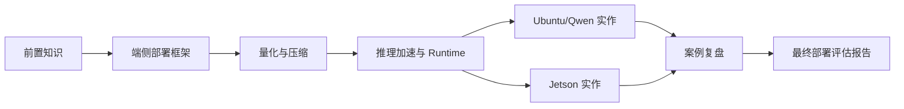

# 端侧模型量化部署技术专题

这本课程书面向需要把 AI 模型落到手机、PC、车载、IoT、工业终端、摄像头、机器人或本地服务器的技术团队。课程不把量化当成孤立算法，而是把模型能力、目标设备、runtime、低比特 kernel、上下文长度、功耗散热和产品体验放在同一个工程目标下分析。

本课程书按 40+ 学时正式课程设计，完整版本为 52 学时，可以裁剪为 40 学时基础版。内容保留原始八个专题的知识骨架，但会扩展成更细的在线 book：每章都包含图示、核心概念、代码或命令示例、配套实作、验收标准和参考资料。HTML 课件用于讲授演示，PPTX 输出留作后续交付。

## 学完后应能做到

- 用统一的部署判断框架拆解端侧项目，而不是只问“模型能不能量化”。
- 解释 PTQ、QAT、GPTQ、AWQ、SmoothQuant、LLM.int8()、KV Cache 量化等方法的适用边界。
- 基于 Ubuntu Server、NVIDIA GPU 和 Qwen 小模型完成本地推理、量化对比、profiling 和 API 服务验证。
- 解释推理加速和量化压缩的关系，能够从图优化、kernel、内存、runtime 和硬件层定位性能瓶颈。
- 将 Ubuntu Server 实作迁移到 NVIDIA Jetson，记录功耗、温度和稳定性差异。
- 系统排查量化后的精度、延迟、内存和服务稳定性问题。
- 把量化与剪枝、蒸馏、runtime 选型、VLM/Agent 系统架构放到同一个产品落地流程里比较。

## 课程书怎么读

建议按两条线阅读：

| 阅读线 | 适合对象 | 重点产出 |
| --- | --- | --- |
| 概念线 | 需要建立判断框架的工程负责人、算法工程师、产品技术负责人 | 端侧部署决策图、量化方法选择、风险清单 |
| 实作线 | 需要动手验证小模型部署的算法/推理工程师 | Ubuntu/Jetson 环境检查、Qwen GGUF 推理、量化对比、推理加速、profiling 表、API smoke test |

## 课程书结构

本书按“导读 + Part I-VI”的 7 部分组织。

| 部分 | 作用 | 当前重点 |
| --- | --- | --- |
| 导读 | 课程定位、学时安排、资料取舍 | 明确课程边界 |
| Part I 前置知识 | 推理、Transformer、量化数学、Linux/GPU/Jetson 工具链 | 让学习者能读懂日志和实验 |
| Part II 端侧部署框架 | 场景、指标、硬件约束、端云协同 | 建立工程判断 |
| Part III 量化与压缩 | PTQ/QAT、LLM 量化、KV Cache、精度修复、蒸馏压缩 | 建立方法选择能力 |
| Part IV 推理加速与 Runtime | 图优化、kernel、TensorRT、llama.cpp、vLLM、profiling | 建立性能优化视角 |
| Part V Ubuntu/Jetson 实作 | Qwen GGUF、量化对比、推理加速、API 服务 | 把概念落到可运行命令 |
| Part VI 案例复盘 | 视觉、LLM、VLM、Agent、最终项目 | 输出部署评估报告 |

每个主线章节都按相同模板组织：学习目标、问题背景、图示讲解、核心概念、代码/命令示例、配套实作、验收结果、常见问题和参考资料。这样做的目的，是让课程书既适合系统阅读，也适合作为实作手册查阅。

## 实作环境基线

本书的实作默认使用 Ubuntu Server、NVIDIA GPU、CUDA、llama.cpp 和 Qwen 小模型，并新增 NVIDIA Jetson 路径。所有命令都以“可复现教学”为目标，避免假设某个固定设备性能。实验表格会保留空位，由学员在自己的机器上记录真实结果。

> 课程书里的命令片段是教学骨架。正式跑实验前，应先按本书实作章节确认驱动、CUDA、模型许可证、磁盘空间和网络访问条件。

## 输出形态

- **课程书**：主交付物，图文并茂，包含代码和实作任务。
- **HTML 课件**：使用 reveal.js 构建，服务于课堂投屏和在线演示。
- **PPTX**：后续可由课程书和 HTML 课件继续生成，不作为当前版本范围。

## 学习产出

课程最终不以“看完章节”为完成标准，而以能交付一份部署评估报告为标准。学习者需要把方法选择、实验命令、性能记录、失败日志和部署建议整理成可以评审的材料。建议从第一部分开始就维护自己的实验记录，最后汇总到 [最终项目与验收标准](/docs/final-project)。

## 参考资料

- [前置知识学习路径](/docs/prerequisites)
- [40/52 学时教学安排](/docs/course-hours)
- [最终项目与验收标准](/docs/final-project)
- [资料对比与课程取舍](/docs/source-comparison)
- [参考资料地图](/docs/reference-map)
- [类似教材与教程参考](/docs/similar-courses)
- [Docusaurus Mermaid diagrams](https://docusaurus.io/docs/markdown-features/diagrams/)
- [Qwen llama.cpp 本地运行指南](https://qwen.readthedocs.io/en/v2.5/run_locally/llama.cpp.html)
- [llama.cpp 项目](https://github.com/ggml-org/llama.cpp)
