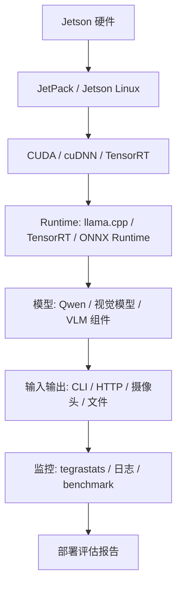
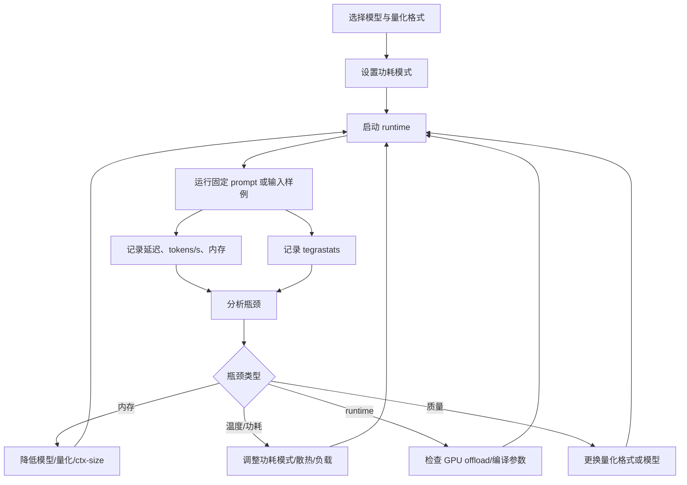
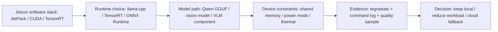

# Jetson 部署基础

## 建议学时

3 学时。

建议拆成三段：

| 时段 | 内容 | 课堂产出 |
| --- | --- | --- |
| 第 1 学时 | Jetson 硬件、JetPack 和软件栈 | Jetson 环境检查表 |
| 第 2 学时 | 功耗、温度、内存和 profiling | `tegrastats` 记录模板 |
| 第 3 学时 | Ubuntu Server 到 Jetson 的迁移路径 | 迁移风险清单 |

## 学习目标

- 理解 Jetson 是边缘端侧设备，不是普通 Ubuntu 服务器的缩小版。
- 掌握 JetPack、Jetson Linux、CUDA、cuDNN、TensorRT、`tegrastats`、`nvpmodel` 和 `jetson_clocks` 的定位。
- 能把 Ubuntu Server 上的 Qwen/llama.cpp 实验迁移到 Jetson，并记录差异。
- 能解释 Jetson 上内存、功耗、温度、热降频和存储对推理的影响。
- 能判断哪些任务适合 Jetson 本地部署，哪些更适合 Jetson + 云端协同。
- 能把 Jetson 结果写入最终部署评估报告，而不是只停留在命令行 demo。

## 问题背景

Jetson 常被用于机器人、工业视觉、边缘网关、智能摄像头和实验教学场景。它的价值不是替代高端服务器 GPU，而是在一个接近真实边缘产品的环境中观察模型部署的完整约束。

服务器实验通常强调“能不能跑”和“速度有多快”。Jetson 实验还必须关心功耗模式、散热条件、共享内存、存储空间、系统版本、长时间运行稳定性和硬件外设输入。对端侧部署课程来说，Jetson 是把模型优化从“算法实验”推进到“设备工程”的关键环节。

本章不展开 Jetson 全部型号差异，也不讲板级硬件设计。课程关注三件事：

1. 如何确认 Jetson 环境是否可用于推理实验。
2. 如何把 Ubuntu Server 上的模型和 runtime 迁移到 Jetson。
3. 如何记录 Jetson 上的性能、功耗、温度和失败日志。

## Jetson 环境链路

Jetson 部署不是单独安装一个推理框架，而是一条从硬件到系统到 runtime 的链路。



Jetson 上的每一层都可能成为问题来源。课程要求学习者在报告中写明软件栈版本，是因为很多错误不是模型本身导致的，而是来自系统镜像、CUDA/TensorRT 版本、Python 包、编译参数或架构差异。

## Jetson 与 Ubuntu Server 的定位差异

| 维度 | Ubuntu Server + NVIDIA GPU | Jetson |
| --- | --- | --- |
| 课堂定位 | 快速建立 baseline 和调参环境 | 观察边缘设备真实约束 |
| GPU 形态 | 独立 GPU 常见 | 嵌入式 GPU，和系统共享资源 |
| 内存形态 | CPU 内存和 GPU 显存分离更常见 | 统一/共享内存更常见 |
| 功耗约束 | 通常不是第一约束 | 功耗模式和散热是核心变量 |
| 监控工具 | `nvidia-smi`、Nsight、系统日志 | `tegrastats`、`nvpmodel`、`jetson_clocks` |
| 构建风险 | 驱动/CUDA/runtime 匹配 | JetPack 版本、ARM 架构、存储空间、温度 |
| 适合阶段 | 方案探索、批量实验、对比量化格式 | 迁移验证、边缘部署评估、稳定性观察 |

课程采用“两段式”路线：

- 第一段在 Ubuntu Server 上跑通模型、量化格式、runtime 和 API。
- 第二段迁移到 Jetson，观察同一方案在边缘设备上的变化。

这能避免一开始就在 Jetson 上被构建和依赖问题卡住，也能避免只在服务器上得到不具备端侧解释力的结果。

## JetPack 软件栈

JetPack 可以理解为 Jetson 的官方软件基础包。它通常包含 Jetson Linux、CUDA、cuDNN、TensorRT 和相关工具。

| 组件 | 作用 | 课程关注点 |
| --- | --- | --- |
| Jetson Linux | 操作系统基础 | 版本、内核、驱动和系统包 |
| CUDA | NVIDIA GPU 计算接口 | runtime 是否能调用 GPU |
| cuDNN | 深度学习算子库 | 视觉模型和框架依赖 |
| TensorRT | 推理优化 runtime | ONNX/视觉模型优化和 NVIDIA 路径 |
| tegrastats | Jetson 状态监控 | CPU/GPU/内存/温度/功耗记录 |
| nvpmodel | 功耗模式配置 | 比较不同功耗模式下的推理表现 |
| jetson_clocks | 频率状态检查/设置 | 排查频率波动和性能不稳定 |

Jetson 课程实验不要求学习者掌握每个底层组件的实现，但要求他们知道每个组件出问题时会表现成什么现象。

## 典型部署路线

Jetson 上的端侧 AI 部署可以分成三类路线。

| 路线 | 适合任务 | 优点 | 风险 |
| --- | --- | --- | --- |
| llama.cpp + GGUF | 小型 LLM、本地问答、轻量服务 | 简洁、可复现、适合教学 | 低比特速度依赖 kernel 和硬件支持 |
| ONNX Runtime / TensorRT | 视觉模型、传统 DNN、部分多模态组件 | NVIDIA 优化链路清晰 | 导出、算子支持和精度校验成本高 |
| Jetson + 云端服务 | VLM、Agent、复杂 reasoning | 兼顾隐私和能力 | routing、网络、权限和失败恢复要设计清楚 |

本课程默认以 Qwen 小模型 + llama.cpp 建立 LLM 实作路径，同时在案例章节介绍视觉模型和 TensorRT 路线。这样安排是为了让课程有一条可执行主线，又不把 Jetson 误解成只能跑 LLM。

## 量化与 Jetson 的关系

在 Jetson 上，量化有两个目标：

- 降低模型文件和内存占用，让模型能够装入设备。
- 在 runtime 和 kernel 支持合适时，提升推理速度或降低功耗。

但低比特不自动等于更快。Jetson 上必须同时检查：

| 检查项 | 为什么重要 |
| --- | --- |
| 模型能否加载 | 内存和存储可能先成为瓶颈 |
| GPU offload 是否生效 | fallback 到 CPU 会严重改变结论 |
| 低比特 kernel 是否适配 | 模型变小但算子不快并不罕见 |
| 上下文长度是否过大 | KV Cache 可能吃掉大量共享内存 |
| 温度是否升高 | 长时间运行可能热降频 |
| 功耗模式是否固定 | 不同功耗模式下结果不可直接比较 |

因此 Jetson 实验要把量化结果、runtime 参数和设备状态一起记录。

## 图示：Jetson 推理监控闭环



## 公开资料怎么转成本章内容

Jetson 官方文档、JetPack 说明、TensorRT 文档、Jetson AI Lab 和 TensorRT Edge-LLM 示例通常会展示软件栈、示例应用、runtime 路线和硬件能力。本章不复制这些页面的架构图或 demo 表格, 而是把它们重画成课程自己的 Jetson 证据链: 环境版本、功耗模式、runtime 后端、模型格式、监控日志和迁移结论必须连在一起。



### 外部 Jetson 原图参考

下面这张图来自 Jetson AI Lab，用源站 URL 远程展示。它不作为硬件选型结论，只用来提示学生：Jetson 是一组边缘设备形态，课程记录必须写清楚具体设备、JetPack/L4T、功耗模式和散热条件。


| 原图重点 | 本章吸收什么 | 转成课程记录 |
| --- | --- | --- |
| Jetson 覆盖多种边缘设备 | 同名 Jetson 路线不能省略具体型号和软件栈 | 设备型号、JetPack/L4T、CUDA/TensorRT |
| 边缘设备形态强调功耗和散热 | tokens/s 必须和温度、功耗模式一起解释 | `tegrastats`、`nvpmodel -q`、散热/电源说明 |
| Jetson AI Lab 聚合 demo 和应用路线 | demo 只提供方向，不能替代本课程实测 | Qwen GGUF 日志、质量样例、Ubuntu 对照 |

| 外部资料中的经典图表思路 | 本章重画/改写成 | Qwen 主线中的落点 |
| --- | --- | --- |
| Jetson docs / JetPack 的软件栈层次 | Jetson 环境链路和版本检查表 | 证明实验运行在哪个 JetPack/L4T/CUDA/TensorRT 组合上 |
| Jetson AI Lab 的边缘 AI 示例和本地服务思路 | “设备约束 -> runtime -> 应用形态”的部署路线 | 判断 Qwen local API 是否适合继续端侧化 |
| TensorRT / TensorRT Edge-LLM 的优化路径 | llama.cpp 主线之外的 NVIDIA runtime 扩展路线 | 说明视觉模型、VLM 组件或高性能 GPU 路线何时进入选做 |
| `tegrastats` / `nvpmodel` / `jetson_clocks` 的设备状态记录 | 推理监控闭环和功耗模式记录模板 | 把 tokens/s、温度、功耗、内存放进同一份报告 |
| Ubuntu 到 Jetson 的迁移经验 | 迁移对比表和风险清单 | 解释服务器 Q8/Q5/Q4 结果为什么不能直接代表边缘设备 |

从 NVIDIA / Jetson 资料吸收进来的字段，最低要落成这张表：

| 资料里常见的设备信息 | 本课程怎么填 | 没有它会影响什么 |
| --- | --- | --- |
| JetPack / L4T / CUDA / TensorRT | 写进环境摘要和报告第 2 节 | 无法解释构建失败或 runtime 差异 |
| 功耗模式 | 记录 `nvpmodel -q` 输出 | tokens/s 和温度变化没有上下文 |
| 实时状态 | 保存 `tegrastats` 日志 | 无法判断 OOM、降频或统一内存压力 |
| 构建参数 | 保存 llama.cpp build log 和 CUDA 后端信息 | 不知道是否真的启用了 GPU offload |
| 散热和电源 | 写明风扇、电源和长稳条件 | 短跑成功可能无法代表持续部署 |

Jetson 章节还可以贴入跨平台 runtime 的原图，用来解释“端侧部署不只有一条 llama.cpp 命令”。这些图只作为路线参考，正文结论仍回到 Jetson 上的 Qwen 日志。


| 原图 | 本章吸收什么 | 不扩展成什么 |
| --- | --- | --- |
| ExecuTorch stack | 模型到设备 runtime 需要导出、backend 和运行时层 | 不新增完整 PyTorch Mobile 实验 |
| MLC LLM workflow | 编译产物、tokenizer、backend 和 API 要匹配 | 不把 Jetson 主线改成 MLC 主线 |
| Jetson AI Lab 图 | 设备形态、功耗、温度和边缘应用约束 | 不用官方 demo 替代本机 Qwen 实测 |

这张表的判断标准很直接: Jetson 页面里看到的 demo 或优化路线, 只有在本课程里能落到日志、表格和失败样例时, 才能进入部署评估报告。否则它只是扩展阅读。

## 代码/命令示例

Jetson 基础检查：

```bash
cat /etc/nv_tegra_release
uname -a
python3 --version
cmake --version
git --version
free -h
df -h
```

查看实时状态：

```bash
tegrastats
```

记录到日志：

```bash
mkdir -p ~/edge-ai-lab/logs
tegrastats --interval 1000 | tee ~/edge-ai-lab/logs/jetson-tegrastats.txt
```

功耗模式和频率检查：

```bash
sudo nvpmodel -q
sudo jetson_clocks --show
```

运行 llama.cpp 前后都应该记录设备状态。这样才能说明速度变化是来自模型、runtime、温度、功耗模式还是上下文长度。

## Ubuntu 到 Jetson 的迁移清单

| 检查项 | Ubuntu Server | Jetson | 记录方式 |
| --- | --- | --- | --- |
| 操作系统 | Ubuntu 版本 | Jetson Linux / Ubuntu 版本 | `uname -a`、release 信息 |
| GPU 状态 | driver、CUDA、显存 | JetPack、共享内存、GPU 状态 | `nvidia-smi` / `tegrastats` |
| 模型文件 | GGUF 路径和大小 | 是否能放入存储和内存 | 文件列表和加载日志 |
| 编译参数 | CUDA 开关、BLAS、架构 | ARM 架构、CUDA、TensorRT | 构建命令和日志 |
| runtime 参数 | `-ngl`、`--ctx-size`、threads | 同一组参数或解释差异 | 命令行记录 |
| 监控指标 | VRAM、CPU/GPU 使用 | RAM、温度、功耗模式 | 日志和表格 |
| 失败日志 | 依赖、OOM、fallback | 依赖、OOM、热降频 | 原始日志摘要 |

迁移不是复制命令。迁移的重点是解释为什么相同模型在不同硬件上表现不同。

## 实验或演示

对应实作：[Jetson 环境与 Qwen 迁移](/docs/lab-jetson-setup)。

课堂演示重点：

- 同一 Qwen GGUF 模型在 Ubuntu Server 和 Jetson 上的加载差异。
- 同一 ctx-size 在 Jetson 上对内存和温度的影响。
- 功耗模式改变后，tokens/s、温度和稳定性是否变化。
- 如果 GPU offload 不生效，如何从日志和速度变化判断。
- 如果模型过大，如何用更小模型、更低比特或更短上下文恢复实验。

## Jetson 端云协同形态

Jetson 很适合做“边缘前处理 + 本地快速判断 + 云端复杂分析”的架构。

| 架构 | Jetson 负责 | 云端负责 | 适合场景 |
| --- | --- | --- | --- |
| 本地闭环 | 采集、推理、告警、简单 UI | 无 | 弱网、隐私强、任务简单 |
| 本地优先 | 初筛、脱敏、摘要、缓存 | 复杂推理、历史分析 | 工业巡检、机器人、边缘网关 |
| 云端优先 | 采集、压缩、上传、轻量 fallback | 主推理和服务 | 网络稳定、模型很大 |
| 分层 Agent | 本地工具执行和权限控制 | 高级规划和知识补全 | 本地文件、设备控制、运维助手 |

端云协同的关键是把“哪些内容可上传”和“云端不可用时如何退化”写成明确规则。

## 验收结果

| 产物 | 验收标准 |
| --- | --- |
| Jetson 环境检查表 | 能说明 JetPack、系统、Python、构建工具和存储状态 |
| `tegrastats` 记录 | 能对应到某次模型运行，不是孤立截图 |
| 迁移对比表 | 同一模型在 Ubuntu Server 和 Jetson 的差异可解释 |
| 风险清单 | 至少覆盖内存、温度、功耗模式、构建依赖和 runtime fallback |
| 后续优化建议 | 能明确下一步是降模型、降上下文、换 runtime、调功耗还是端云协同 |

## 作业模板

```markdown
## Jetson 部署记录

- 设备型号：
- JetPack / Jetson Linux：
- 功耗模式：
- 散热条件：
- 模型：
- 量化格式：
- Runtime：
- 运行命令：

## 运行结果

| 项目 | 结果 | 证据 |
| --- | --- | --- |
| 是否成功加载 | 待填 | 日志 |
| 首 token | 待填 | 日志 |
| tokens/s | 待填 | 日志 |
| 内存峰值 | 待填 | tegrastats |
| 温度范围 | 待填 | tegrastats |
| 失败/异常 | 待填 | 错误日志 |

## 结论

- 当前方案是否可用：
- 最大瓶颈：
- 下一步优化：
```

## 复盘问题

- 为什么 Jetson 上不能只看 tokens/s，还要看温度和功耗？
- `nvidia-smi` 和 `tegrastats` 的定位有什么不同？
- 同一个 Qwen GGUF 模型在 Ubuntu Server 和 Jetson 上差异可能来自哪些层？
- 低比特模型在 Jetson 上没有变快时，应该先检查什么？
- 哪些任务适合 Jetson 本地跑，哪些更适合端云协同？
- 如果 Jetson 内存不足，是降低模型尺寸、降低比特、降低上下文，还是改为云端兜底？

## 常见问题

- **把 Jetson 当服务器 GPU 用**：Jetson 的核心约束是功耗、温度、共享资源和嵌入式环境。
- **不记录功耗模式**：不同功耗模式下的结果不能直接比较。
- **只保留成功日志**：部署报告需要保留失败日志，才能解释迁移成本。
- **忽略存储空间**：模型文件、源码、构建产物和日志都会占用 Jetson 存储。
- **忽略散热条件**：裸板、外壳、风扇和环境温度都会影响长时间推理。

## 取舍说明

本章吸收 NVIDIA Jetson、JetPack、TensorRT 和 Jetson AI Lab 的部署思路，但不讲所有 Jetson 型号差异，也不展开板级硬件设计。课程关注的是：如何把模型放到 Jetson 上运行、如何记录性能和功耗、如何判断方案是否适合端侧产品。

## 参考资料

本章吸收方式：

- **知识点**：从 Jetson docs、JetPack、TensorRT 和 Jetson AI Lab 中提取软件栈、功耗模式、温度、统一内存和 runtime fallback。
- **图解**：远程贴入 Jetson AI Lab、ExecuTorch 和 MLC 原图作为参考，再把厂商文档中的组件关系重画为 Jetson 推理监控闭环和端云协同取舍表。
- **实验**：要求把 `tegrastats`、功耗模式、模型格式和 Ubuntu 对照写进部署记录。
- **取舍**：不做 Jetson 型号百科，也不展开板级硬件设计；课程只保留会影响端侧部署判断的变量。

- [NVIDIA Jetson documentation](https://docs.nvidia.com/jetson/)
- [NVIDIA JetPack SDK](https://developer.nvidia.com/embedded/jetpack)
- [Jetson AI Lab](https://www.jetson-ai-lab.com/)
- [NVIDIA TensorRT Edge-LLM](https://github.com/NVIDIA/TensorRT-Edge-LLM)
- [TensorRT documentation](https://docs.nvidia.com/deeplearning/tensorrt/latest/)
- [NVIDIA CUDA Installation Guide for Linux](https://docs.nvidia.com/cuda/cuda-installation-guide-linux/)
- [ExecuTorch documentation](https://docs.pytorch.org/executorch/stable/index.html)
- [MLC LLM documentation](https://llm.mlc.ai/docs/)
- [Qwen llama.cpp 本地运行指南](https://qwen.readthedocs.io/en/v2.5/run_locally/llama.cpp.html)
- [llama.cpp 项目](https://github.com/ggml-org/llama.cpp)
