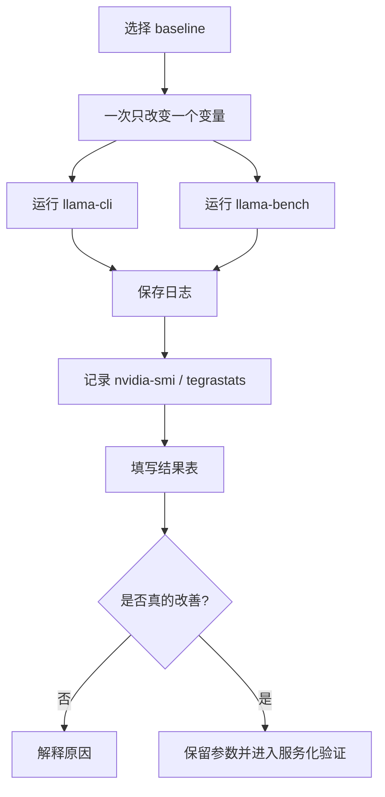
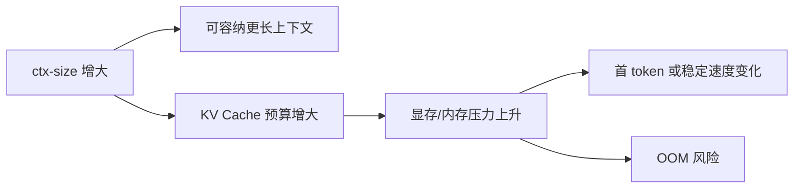

# 推理加速实验

## 建议学时

2 学时。

建议安排：

| 课时 | 内容 | 产出 |
| --- | --- | --- |
| 1 | GPU offload、`ctx-size`、线程和 `llama-bench` 对比 | 原始实验日志 |
| 2 | 解释瓶颈来源，形成优化建议 | 推理加速结论表 |

本实验对应理论章节：

- [推理加速基础](/docs/inference-acceleration)
- [推理框架与部署链路](/docs/runtime-deployment)
- [LLM 量化与 KV Cache](/docs/llm-quantization)

## 学习目标

完成本实验后，学习者应能：

- 用实验验证推理加速手段是否真实有效。
- 区分模型量化、GPU offload、上下文长度、CPU 线程和 benchmark 参数对性能的影响。
- 解释 `ctx-size` 与 KV Cache、首 token、内存占用之间的关系。
- 使用 `llama-bench` 补充标准化性能记录。
- 在 Ubuntu Server 与 Jetson 上分别记录推理加速相关指标。
- 建立“不凭感觉调参”的实验记录方式。

## 问题背景

推理加速不是把参数随便调大或调小。

每次调参都应该回答：

- 改了哪个变量？
- 其他变量是否保持不变？
- 速度是否真的提升？
- 内存、温度、功耗是否变差？
- 输出质量是否仍然可用？

本实验围绕四类变量：

1. GPU offload：`-ngl 0` vs `-ngl 99`。
2. 上下文长度：`--ctx-size 1024/2048/4096`。
3. CPU 线程：`-t`。
4. 标准化 benchmark：`llama-bench`。

量化格式对比见 [Qwen GGUF 量化对比实验](/docs/lab-qwen-quantization)。

## 图示讲解



KV Cache 与上下文长度：



## 前置条件

已经完成：

- [Ubuntu Server 与 NVIDIA GPU 环境](/docs/lab-ubuntu-nvidia)
- [Qwen 基线推理](/docs/lab-qwen-baseline)

需要准备：

| 项目 | 要求 |
| --- | --- |
| 模型 | 至少一个 Qwen GGUF |
| llama.cpp | `llama-cli` 和 `llama-bench` 可运行 |
| 日志目录 | `~/edge-ai-lab/logs` |
| 结果目录 | `~/edge-ai-lab/results` |
| 监控 | Ubuntu 用 `nvidia-smi`，Jetson 用 `tegrastats` |

## 实验原则

| 原则 | 说明 |
| --- | --- |
| 一次只改一个变量 | 否则无法解释收益来源 |
| 保存失败日志 | 失败比成功更能说明边界 |
| 不编造数字 | 没有采集到就写“未记录” |
| 质量和速度一起看 | 快但不可用不是有效优化 |
| 记录设备状态 | Jetson 特别要记录温度和功耗模式 |

## 实验 1：GPU offload

目标：观察 GPU offload 对速度和显存的影响。

固定变量：

- 模型文件。
- prompt。
- `ctx-size`。
- 生成长度。

改变变量：

- `-ngl 0`
- `-ngl 99`

命令：

```bash
cd ~/edge-ai-lab/src/llama.cpp

for ngl in 0 99
do
  ./build/bin/llama-cli \
    -m ~/edge-ai-lab/models/qwen/qwen2.5-1.5b-instruct-q4_k_m.gguf \
    -p "解释端侧模型推理加速的主要手段。" \
    -n 128 \
    --ctx-size 2048 \
    -ngl ${ngl} \
    2>&1 | tee ~/edge-ai-lab/logs/qwen-ngl-${ngl}.txt
done
```

Ubuntu 观察：

```bash
watch -n 0.5 nvidia-smi
```

Jetson 观察：

```bash
tegrastats --interval 1000 | tee ~/edge-ai-lab/logs/jetson-ngl-tegrastats.txt
```

记录表：

| 硬件 | `-ngl` | 首 token / prefill | tokens/s | 峰值内存/显存 | GPU 是否参与 | 质量备注 | 日志 |
| --- | --- | --- | --- | --- | --- | --- | --- |
| 待填 | 0 | 待填 | 待填 | 待填 | 待填 | 待填 | 待填 |
| 待填 | 99 | 待填 | 待填 | 待填 | 待填 | 待填 | 待填 |

解释问题：

- `-ngl 99` 是否明显更快？
- 显存或统一内存是否增加？
- 输出质量是否变化？
- 如果没有变快，可能是哪些原因？

## 实验 2：上下文长度与 KV Cache

目标：观察 `ctx-size` 对内存、首 token 和稳定速度的影响。

固定变量：

- 模型文件。
- prompt。
- `-ngl`。
- 生成长度。

改变变量：

- `--ctx-size 1024`
- `--ctx-size 2048`
- `--ctx-size 4096`

命令：

```bash
for ctx in 1024 2048 4096
do
  ./build/bin/llama-cli \
    -m ~/edge-ai-lab/models/qwen/qwen2.5-1.5b-instruct-q4_k_m.gguf \
    -p "请用项目复盘方式解释 KV Cache 对端侧部署的影响。" \
    -n 128 \
    --ctx-size ${ctx} \
    -ngl 99 \
    2>&1 | tee ~/edge-ai-lab/logs/qwen-ctx-${ctx}.txt
done
```

如果 4096 失败，不要删除失败日志。

记录失败原因：

- OOM。
- 进程被杀。
- 速度明显下降。
- 启动日志出现异常。

记录表：

| 硬件 | `ctx-size` | 首 token / prefill | tokens/s | 峰值内存/显存 | 是否成功 | 质量备注 | 日志 |
| --- | --- | --- | --- | --- | --- | --- | --- |
| 待填 | 1024 | 待填 | 待填 | 待填 | 待填 | 待填 | 待填 |
| 待填 | 2048 | 待填 | 待填 | 待填 | 待填 | 待填 | 待填 |
| 待填 | 4096 | 待填 | 待填 | 待填 | 待填 | 待填 | 待填 |

解释问题：

- `ctx-size` 增大后内存如何变化？
- 首 token 是否变化？
- tokens/s 是否变化？
- Jetson 是否更容易受 `ctx-size` 影响？

## 实验 3：CPU 线程参数

目标：观察 CPU 路径或混合路径中线程参数的影响。

该实验主要用于理解 CPU fallback 或 `-ngl 0` baseline。

命令：

```bash
for threads in 2 4 8
do
  ./build/bin/llama-cli \
    -m ~/edge-ai-lab/models/qwen/qwen2.5-1.5b-instruct-q4_k_m.gguf \
    -p "用三句话解释 CPU fallback 为什么会影响推理速度。" \
    -n 128 \
    --ctx-size 2048 \
    -ngl 0 \
    -t ${threads} \
    2>&1 | tee ~/edge-ai-lab/logs/qwen-cpu-t${threads}.txt
done
```

如果机器 CPU 核心较少，不需要照抄 `8`。

按实际核心数选择。

记录表：

| 硬件 | `-t` | CPU 使用 | tokens/s | 质量备注 | 日志 |
| --- | --- | --- | --- | --- | --- |
| 待填 | 2 | 待填 | 待填 | 待填 | 待填 |
| 待填 | 4 | 待填 | 待填 | 待填 | 待填 |
| 待填 | 8 | 待填 | 待填 | 待填 | 待填 |

解释问题：

- 线程数增加是否总是更快？
- 是否出现 CPU 饱和或内存带宽瓶颈？
- 这对 CPU fallback 有什么启发？

## 实验 4：llama-bench

目标：用更标准化的工具补充记录。

命令：

```bash
./build/bin/llama-bench \
  -m ~/edge-ai-lab/models/qwen/qwen2.5-1.5b-instruct-q4_k_m.gguf \
  -p 512 \
  -n 128 \
  -ngl 99 \
  2>&1 | tee ~/edge-ai-lab/logs/llama-bench-q4-ngl99.txt
```

比较 CPU 和 GPU：

```bash
for ngl in 0 99
do
  ./build/bin/llama-bench \
    -m ~/edge-ai-lab/models/qwen/qwen2.5-1.5b-instruct-q4_k_m.gguf \
    -p 512 \
    -n 128 \
    -ngl ${ngl} \
    2>&1 | tee ~/edge-ai-lab/logs/llama-bench-ngl-${ngl}.txt
done
```

记录表：

| 硬件 | 模型 | `-p` | `-n` | `-ngl` | prompt eval | token eval | 备注 | 日志 |
| --- | --- | --- | --- | --- | --- | --- | --- | --- |
| 待填 | 待填 | 512 | 128 | 0 | 待填 | 待填 | 待填 | 待填 |
| 待填 | 待填 | 512 | 128 | 99 | 待填 | 待填 | 待填 | 待填 |

`llama-bench` 的输出格式可能随版本变化。

按实际字段记录。

## 实验 5：Jetson 功耗和温度观察

如果有 Jetson，补充这一组。

运行前记录功耗模式：

```bash
sudo nvpmodel -q | tee ~/edge-ai-lab/results/jetson-nvpmodel.txt
sudo jetson_clocks --show | tee ~/edge-ai-lab/results/jetson-clocks-before.txt
```

另开终端：

```bash
tegrastats --interval 1000 | tee ~/edge-ai-lab/logs/jetson-acceleration-tegrastats.txt
```

运行 `ctx-size` 或 `-ngl` 对比命令。

记录：

| 实验 | 温度变化 | RAM 变化 | GPU/GR3D | 是否降频 | 备注 |
| --- | --- | --- | --- | --- | --- |
| `-ngl` 对比 | 待填 | 待填 | 待填 | 待填 | 待填 |
| `ctx-size` 对比 | 待填 | 待填 | 待填 | 待填 | 待填 |

## 综合结果表

| 实验 | 硬件 | 变量 | 参数 | 首 token / prefill | tokens/s | 峰值内存/显存 | 温度/功耗 | 质量备注 | 是否有效 | 日志 |
| --- | --- | --- | --- | --- | --- | --- | --- | --- | --- | --- |
| GPU offload | 待填 | `-ngl` | 待填 | 待填 | 待填 | 待填 | 待填 | 待填 | 待填 | 待填 |
| ctx-size | 待填 | `ctx-size` | 待填 | 待填 | 待填 | 待填 | 待填 | 待填 | 待填 | 待填 |
| CPU 线程 | 待填 | `-t` | 待填 | 待填 | 待填 | 待填 | 待填 | 待填 | 待填 | 待填 |
| llama-bench | 待填 | `-p/-n/-ngl` | 待填 | 待填 | 待填 | 待填 | 待填 | 不适用 | 待填 | 待填 |

## 如何写实验结论

结论建议按下面结构写：

```text
本次实验中，最明显影响速度的变量是 ______。
证据是 ______。
主要代价是 ______。
在 Ubuntu Server 上建议 ______。
在 Jetson 上需要额外注意 ______。
下一步应该验证 ______。
```

不要只写“更快”。

要写“在什么条件下、快在哪里、代价是什么”。

## 验收结果

| 产物 | 验收标准 |
| --- | --- |
| GPU offload 日志 | `-ngl 0` 与 `-ngl 99` 至少各一次 |
| `ctx-size` 日志 | 至少两个上下文长度，最好 1024/2048/4096 |
| `llama-bench` 日志 | 至少一组 benchmark 输出 |
| 资源监控 | Ubuntu 记录 `nvidia-smi`，Jetson 记录 `tegrastats` |
| 综合结果表 | 每组实验都有参数、日志和解释 |
| 结论 | 能指出瓶颈来源和下一步优化方向 |

## 失败排查

### `ctx-size 4096` 失败

处理：

- 保存失败日志。
- 降到 2048 或 1024。
- 记录是否为 OOM。
- 检查模型大小和 KV Cache 预算。

### `-ngl 99` 没有变快

可能原因：

- llama.cpp 未启用 CUDA。
- 模型太小，CPU 已足够快。
- 低比特 kernel 没有明显收益。
- 数据搬运或内存带宽成为瓶颈。
- 日志中的 GPU offload 未真正发生。

### 线程数增加后变慢

可能原因：

- CPU 核心数不足。
- 线程调度开销上升。
- 内存带宽瓶颈。
- 其他进程竞争资源。

### `llama-bench` 输出看不懂

处理：

- 先保存原始输出。
- 找 prompt eval 和 token eval 相关字段。
- 与 CLI 业务 prompt 结果分开解释。

## 作业

提交一份推理加速报告，包含：

1. GPU offload 对比。
2. `ctx-size` 对比。
3. `llama-bench` 结果。
4. 至少一段失败或无提升案例分析。
5. Ubuntu Server 与 Jetson 的差异说明，若没有 Jetson，则写预期差异。

## 参考资料

- [llama.cpp llama-bench documentation](https://www.mintlify.com/ggml-org/llama.cpp/api/tools/llama-bench)
- [llama.cpp llama-cli documentation](https://www.mintlify.com/ggml-org/llama.cpp/inference/llama-cli)
- [TensorRT-LLM documentation](https://nvidia.github.io/TensorRT-LLM/)
- [vLLM documentation](https://docs.vllm.ai/)
