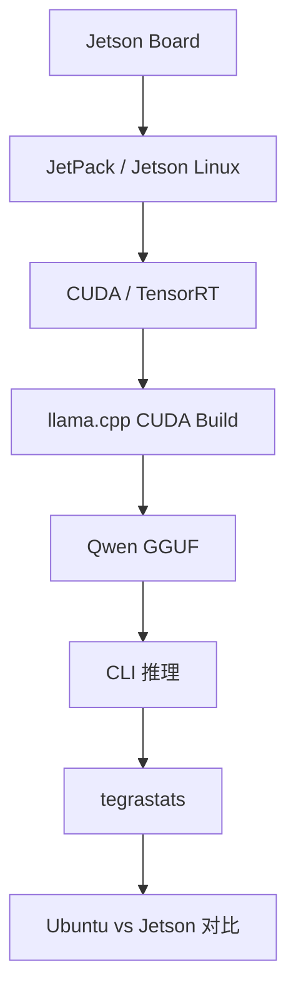
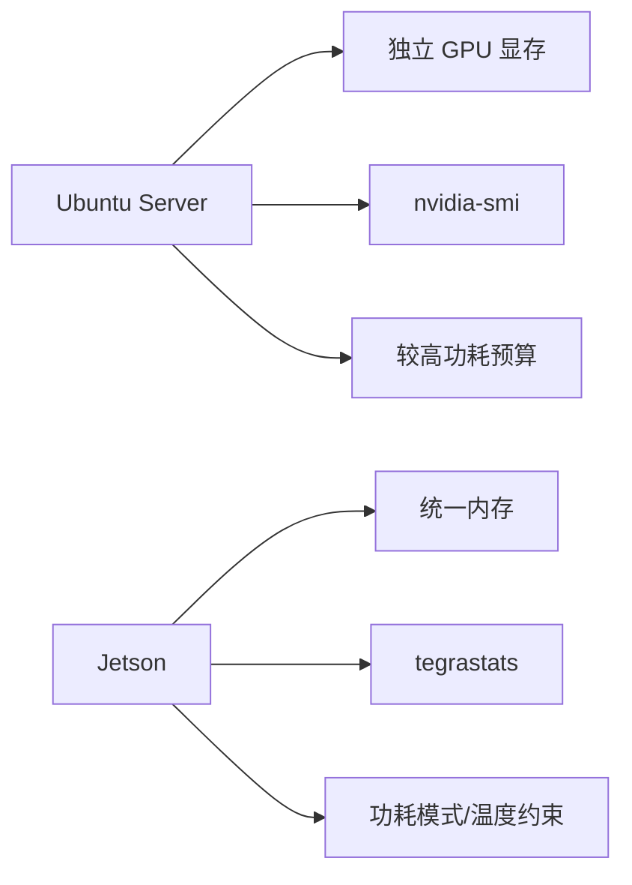

# Jetson 环境与 Qwen 迁移

## 建议学时

2 学时。

建议安排：

| 课时 | 内容 | 产出 |
| --- | --- | --- |
| 1 | Jetson 环境、JetPack、功耗模式、`tegrastats` 检查 | Jetson 环境日志 |
| 2 | 迁移 Qwen GGUF 和 llama.cpp 运行方式 | Ubuntu vs Jetson 对比表 |

本实验对应理论章节：

- [Jetson 部署基础](/docs/jetson-deployment)
- [推理框架与部署链路](/docs/runtime-deployment)
- [推理加速基础](/docs/inference-acceleration)

## 学习目标

完成本实验后，学习者应能：

- 在 Jetson 上确认 JetPack、Jetson Linux、CUDA、TensorRT 和基础工具状态。
- 复用 Ubuntu Server 实验中的 Qwen/llama.cpp 思路，在 Jetson 上建立 baseline。
- 使用 `tegrastats` 记录 CPU、GPU、内存、温度和功耗相关信息。
- 解释 Jetson 与普通 Ubuntu Server 在内存、功耗、散热和监控方式上的差异。
- 判断同一 Qwen GGUF 在 Jetson 上是否适合作为后续实验模型。

## 本章定位

| 项目 | 内容 |
| --- | --- |
| 本章解决的问题 | Ubuntu 上的 Qwen/llama.cpp 路线迁移到 Jetson 后，内存、功耗、温度和速度会怎样变化。 |
| 你需要先知道 | 已完成 Ubuntu baseline，知道 `tegrastats`、功耗模式和统一内存的含义。 |
| 你会产出 | Jetson 环境日志、`tegrastats` 日志、Ubuntu vs Jetson 对比表。 |
| 最终报告位置 | 第 2 节实验环境、第 7 节端侧部署风险。 |

## 问题背景

Jetson 不是一台“小号服务器”。

它通常有以下特点：

- CPU、GPU 和内存处在同一板级系统中。
- 内存预算比服务器更紧。
- 功耗模式会影响频率和持续性能。
- 散热条件会影响长时间运行稳定性。
- 软件栈由 JetPack、Jetson Linux、CUDA、TensorRT 等组合决定。

因此，同一条命令在 Ubuntu Server 上可用，并不代表在 Jetson 上也能得到相同性能。

本实验的目标不是追求最高速度，而是建立可复查的 Jetson baseline。

## 实验边界

本实验默认：

- Jetson 已能正常启动。
- 学员可以通过终端访问设备。
- 模型文件由教师提供或学员自行下载到 `~/edge-ai-lab/models/qwen`。
- 不把模型权重、第三方源码和构建产物提交到课程仓库。

如果课程设备不允许修改功耗模式，只记录当前功耗模式，不强行修改。

## 图示讲解



与服务器的主要差异：



## 前置条件

| 项目 | 要求 | 检查方式 |
| --- | --- | --- |
| Jetson 设备 | 已刷好系统并可登录 | SSH 或本机终端 |
| 存储空间 | 能放模型和源码 | `df -h` |
| 网络 | 能获取源码和模型，或已离线准备 | `git`、模型文件 |
| 散热 | 能持续运行实验 | 观察温度 |
| 电源 | 满足设备要求 | 按板卡说明确认 |

## Step 1：建立实验目录

```bash
mkdir -p ~/edge-ai-lab/{models/qwen,src,logs,results}
cd ~/edge-ai-lab
```

记录目录：

```bash
find ~/edge-ai-lab -maxdepth 2 -type d | sort
```

## Step 2：检查 Jetson 系统信息

```bash
cat /etc/nv_tegra_release
uname -a
cat /etc/os-release
free -h
df -h
```

记录：

| 字段 | 说明 |
| --- | --- |
| Jetson Linux / L4T 版本 | 决定底层软件栈 |
| Ubuntu 版本 | 系统包和工具链相关 |
| 内核版本 | 驱动问题排查 |
| 内存总量 | 判断模型和 KV Cache 能力 |
| 存储空间 | 判断是否能放模型和构建产物 |

## Step 3：检查工具链和 NVIDIA 组件

```bash
python3 --version
cmake --version
git --version
gcc --version
g++ --version
```

如果系统提供 CUDA 编译器，也可记录：

```bash
nvcc --version
```

如果能查询 TensorRT Python 包：

```bash
python3 -c "import tensorrt as trt; print(trt.__version__)"
```

如果没有 TensorRT Python 包，不代表本实验不能继续。

本实验主线是 llama.cpp + GGUF。

## Step 4：检查功耗模式和频率状态

查询功耗模式：

```bash
sudo nvpmodel -q
```

查看时钟状态：

```bash
sudo jetson_clocks --show
```

如果课程允许固定频率，可由教师统一执行：

```bash
sudo jetson_clocks
```

如果不允许修改，只记录当前状态。

不要在不了解散热和电源条件的情况下强行提高功耗模式。

## Step 5：启动 `tegrastats`

另开一个终端运行，并按本次 baseline 命名日志：

```bash
{
  date
  tegrastats --interval 1000
} | tee ~/edge-ai-lab/logs/jetson-tegrastats-baseline.txt
```

运行实验结束后，用 `Ctrl+C` 停止。

关注：

| 项目 | 说明 |
| --- | --- |
| RAM | 统一内存占用 |
| CPU | CPU 负载 |
| GPU/GR3D | GPU 使用情况 |
| 温度 | 是否接近热限制 |
| 功耗 | 如果设备输出功耗字段，记录变化 |

为了和 Qwen 运行日志对齐，开始推理前后各记录一次时间：

```bash
date | tee -a ~/edge-ai-lab/logs/jetson-qwen-baseline.txt
```

## Step 6：构建 llama.cpp

```bash
cd ~/edge-ai-lab/src
git clone https://github.com/ggml-org/llama.cpp.git
cd llama.cpp
cmake -B build -DGGML_CUDA=ON
cmake --build build --config Release -j
```

如果内存紧张，可以降低并行度：

```bash
cmake --build build --config Release -j2
```

记录构建日志：

```bash
cmake -B build -DGGML_CUDA=ON 2>&1 | tee ~/edge-ai-lab/logs/jetson-cmake.txt
cmake --build build --config Release -j2 2>&1 | tee ~/edge-ai-lab/logs/jetson-build.txt
```

检查工具：

```bash
./build/bin/llama-cli --help | head
./build/bin/llama-bench --help | head
```

## Step 7：准备 Qwen GGUF

把模型放在：

```bash
~/edge-ai-lab/models/qwen/
```

检查文件：

```bash
ls -lh ~/edge-ai-lab/models/qwen/*.gguf
```

记录：

| 字段 | 示例 |
| --- | --- |
| 模型来源（报告第 2 节） | 待填 |
| 模型许可证（报告第 2 节） | 待填，查不到写“未记录” |
| 文件名 | 待填 |
| SHA256（报告第 2 节） | `sha256sum *.gguf` |
| 量化格式 | Q4/Q5/Q8 等 |
| 文件大小 | 待填 |
| 下载日期 | 待填 |

## Step 8：运行 Qwen baseline

```bash
cd ~/edge-ai-lab/src/llama.cpp

./build/bin/llama-cli \
  -m ~/edge-ai-lab/models/qwen/qwen2.5-1.5b-instruct-q4_k_m.gguf \
  -p "用三句话解释 Jetson 上做端侧模型部署需要关注什么。" \
  -n 128 \
  --ctx-size 2048 \
  -ngl 99 \
  2>&1 | tee ~/edge-ai-lab/logs/jetson-qwen-baseline.txt
```

如果失败，先尝试降低上下文：

```bash
./build/bin/llama-cli \
  -m ~/edge-ai-lab/models/qwen/qwen2.5-1.5b-instruct-q4_k_m.gguf \
  -p "用三句话解释 Jetson 上做端侧模型部署需要关注什么。" \
  -n 96 \
  --ctx-size 1024 \
  -ngl 99 \
  2>&1 | tee ~/edge-ai-lab/logs/jetson-qwen-baseline-ctx1024.txt
```

如果仍失败，再比较 CPU 路径：

```bash
./build/bin/llama-cli \
  -m ~/edge-ai-lab/models/qwen/qwen2.5-1.5b-instruct-q4_k_m.gguf \
  -p "用三句话解释 Jetson 上做端侧模型部署需要关注什么。" \
  -n 96 \
  --ctx-size 1024 \
  -ngl 0 \
  2>&1 | tee ~/edge-ai-lab/logs/jetson-qwen-cpu.txt
```

## Step 9：填写 Ubuntu vs Jetson 对比

| 项目 | Ubuntu Server | Jetson |
| --- | --- | --- |
| 设备型号 | 待填 | 待填 |
| GPU | 待填 | 待填 |
| 内存/显存 | 待填 | 待填 |
| 驱动/JetPack | 待填 | 待填 |
| 模型文件 | 待填 | 待填 |
| 量化格式 | 待填 | 待填 |
| `ctx-size` | 待填 | 待填 |
| `-ngl` | 待填 | 待填 |
| 首 token | 待填 | 待填 |
| tokens/s | 待填 | 待填 |
| 峰值内存/显存 | 待填 | 待填 |
| 温度 | 待填 | 待填 |
| 功耗模式 | 不适用/待填 | 待填 |
| 质量备注 | 待填 | 待填 |
| 原始日志 | 待填 | 待填 |

## 验收结果

选择 Jetson 作为目标设备时的通过标准：

```text
[ ] Jetson 环境日志已保存
[ ] 功耗模式已记录，或说明无权限
[ ] 至少一次 Qwen 推理过程有 `tegrastats` 记录
[ ] 能填出 Ubuntu vs Jetson 的关键差异
[ ] 能写出 Jetson 上下一步该降模型、降 ctx 还是改善散热
```

40 学时如果选择 Ubuntu Server + NVIDIA GPU 作为目标设备，本章可以作为路线阅读；最终报告写“Jetson 不适用（未测）”并说明未测原因。60 学时或教师明确布置 Jetson 对照时，再按本章标准验收。
本章只适用于选择 Jetson 路线或做扩展对照的学生；Ubuntu-only 最终项目可跳过本章。

| 产物 | 验收标准 |
| --- | --- |
| Jetson 环境日志 | 包含 JetPack/Jetson Linux、OS、内存、磁盘 |
| 功耗模式记录 | 包含 `nvpmodel` 或说明无权限 |
| `tegrastats` 日志 | 覆盖一次 Qwen 推理过程 |
| llama.cpp 构建记录 | 能说明是否启用 CUDA |
| Qwen baseline 输出 | 固定 prompt 能生成文本 |
| Ubuntu vs Jetson 表 | 60 学时或已有 Ubuntu baseline 时填写；40 学时 Jetson-only 路线至少写 Jetson 环境、`tegrastats`、Qwen baseline 和下一步判断 |

## 失败排查

### 构建过程中内存不足

处理：

- 降低并行度，例如 `-j2`。
- 关闭不必要进程。
- 确认磁盘空间足够。

### `-ngl 99` 运行失败

处理：

- 先确认 CUDA 构建是否成功。
- 降低 `ctx-size`。
- 换更小模型或更低量化文件。
- 尝试 `-ngl 0` 判断是否是 GPU 路径问题。

### 推理过程中设备变慢

检查：

- `tegrastats` 中温度是否升高。
- 功耗模式是否限制性能。
- 电源和散热是否可靠。
- 是否同时运行其他高负载任务。

### 结果与 Ubuntu Server 差异很大

这是正常现象。

需要解释差异来自：

- 独立显存 vs 统一内存。
- GPU 规模和带宽。
- 功耗和散热。
- Runtime 后端和 kernel 行为。
- 模型是否适合该设备。

## 作业

提交一份 Jetson 迁移记录，包含：

1. Jetson 环境摘要。
2. `tegrastats` 关键片段。
3. Qwen baseline 输出摘要。
4. Ubuntu Server 与 Jetson 对比表。
5. 是否建议在该 Jetson 上继续做 Qwen 量化实验，以及原因。

## 参考资料

- [Jetson AI Lab](https://www.jetson-ai-lab.com/)
- [NVIDIA Jetson documentation](https://docs.nvidia.com/jetson/)
- [NVIDIA Jetson Linux Developer Guide](https://docs.nvidia.com/jetson/archives/r36.4.4/DeveloperGuide/)
- [llama.cpp build documentation](https://www.mintlify.com/ggml-org/llama.cpp/development/build)
