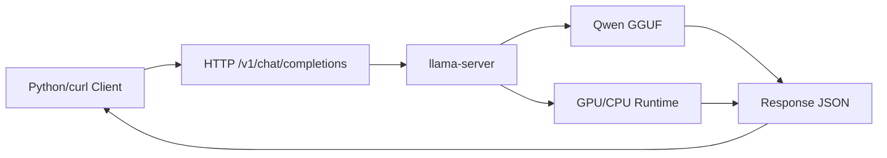
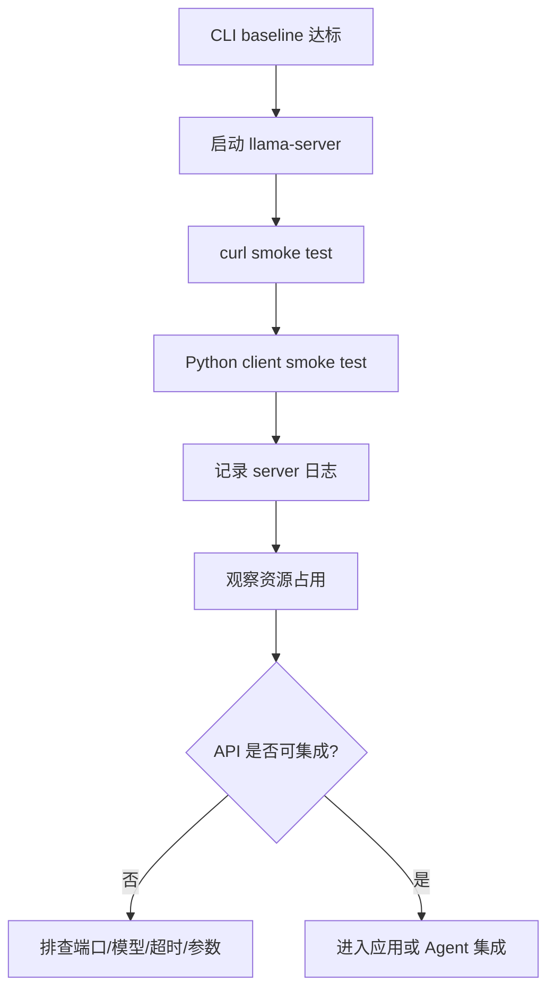

# 本地 OpenAI-compatible 服务

## 建议学时

2 学时。

建议安排：

| 课时 | 内容 | 产出 |
| --- | --- | --- |
| 1 | 启动 `llama-server`，用 `curl` 完成 API smoke test | server 日志和 JSON 响应 |
| 2 | 用 Python 客户端调用，记录超时、错误和服务化开销 | 服务验收记录 |

本实验对应理论章节：

- [推理框架与部署链路](/docs/runtime-deployment)
- [推理加速基础](/docs/inference-acceleration)
- [VLM 与 Agent 端侧扩展](/docs/vlm-agent)

## 学习目标

完成本实验后，学习者应能：

- 用 llama.cpp 启动本地 OpenAI-compatible API。
- 使用 `curl` 调用 `/v1/chat/completions`。
- 使用 Python 客户端完成 smoke test。
- 把模型推理从 CLI 推进到可被应用、VLM 或 Agent 调用的服务形态。
- 记录 server 日志、请求参数、响应内容、错误和资源占用。
- 解释 CLI 推理达标后为什么仍需要 API 层验收。

## 问题背景

前面的实验解决“模型能否在本机跑起来”。

真实应用还需要：

- 稳定服务接口。
- 请求超时控制。
- 错误日志。
- 模型加载和预热策略。
- 客户端调用边界。
- 后续与 VLM、Agent、业务系统集成的接口。

本章只做最小服务化验证。

不展开复杂并发、鉴权、网关、限流和多模型路由。

## 实验边界

本实验默认：

- 已完成 [Qwen 基线推理](/docs/lab-qwen-baseline)。
- `llama-server` 可执行文件存在。
- 模型文件在 `~/edge-ai-lab/models/qwen`。
- 本机或同一内网可以访问服务端口。

安全边界：

- 课堂实验建议只绑定本机或受控内网。
- 不要把未加鉴权的端口暴露到公网。
- 不要在请求里放真实敏感数据。

## 图示讲解



服务化验收链路：



## 核心概念

| 项目 | 第一阶段要求 | 后续扩展 |
| --- | --- | --- |
| API | 本地可调用 | 鉴权、限流、日志 |
| 超时 | smoke test 可控 | 请求队列、取消生成 |
| 模型 | 单模型服务 | 多模型 routing |
| 流式输出 | 可选 | 前端实时显示 |
| 安全 | 本机或内网验证 | 权限隔离、工具调用审计 |
| 稳定性 | 单请求成功 | 并发、长时间运行、自动重启 |

## 前置条件

检查 `llama-server`：

```bash
cd ~/edge-ai-lab/src/llama.cpp
./build/bin/llama-server --help | head
```

检查模型：

```bash
ls -lh ~/edge-ai-lab/models/qwen/*.gguf
```

检查端口是否被占用：

```bash
ss -ltnp | grep 8080
```

如果 `ss` 不可用，可以直接尝试启动服务。

端口被占用时换一个端口，例如 8081。

## Step 1：启动本地服务

Ubuntu Server 或 Jetson 都可以使用类似命令。

```bash
cd ~/edge-ai-lab/src/llama.cpp

./build/bin/llama-server \
  -m ~/edge-ai-lab/models/qwen/qwen2.5-1.5b-instruct-q4_k_m.gguf \
  -ngl 99 \
  --ctx-size 2048 \
  --host 127.0.0.1 \
  --port 8080 \
  2>&1 | tee ~/edge-ai-lab/logs/llama-server.txt
```

如果需要让同一内网其他机器访问，可以改成：

```bash
--host 0.0.0.0
```

但课堂实验默认使用 `127.0.0.1` 更安全。

启动后观察日志：

- 模型是否加载成功。
- 是否启用 CUDA 或目标 backend。
- `ctx-size` 是否按预期设置。
- 是否出现 OOM、fallback 或 error。
- server 是否监听指定端口。

## Step 2：用 curl 验证 chat completions

另开终端运行：

```bash
curl http://localhost:8080/v1/chat/completions \
  -H "Content-Type: application/json" \
  -d '{
    "model": "qwen-local",
    "messages": [
      {"role": "user", "content": "用三句话解释端侧模型量化。"}
    ],
    "temperature": 0.2,
    "max_tokens": 128
  }' \
  | tee ~/edge-ai-lab/logs/api-curl-response.json
```

如果终端输出不方便阅读，可以保存后再查看：

```bash
python3 -m json.tool ~/edge-ai-lab/logs/api-curl-response.json
```

如果返回不是标准 JSON，也要保存原始输出。

## Step 3：用 Python smoke test

课程仓库提供了一个简单脚本。

从课程仓库根目录运行：

```bash
python3 labs/scripts/openai_compatible_smoke_test.py \
  --base-url http://localhost:8080/v1 \
  --prompt "用三句话解释端侧模型量化。" \
  2>&1 | tee ~/edge-ai-lab/logs/api-python-smoke-test.txt
```

如果脚本依赖缺失，先看错误信息。

也可以用最小 Python 标准库版本验证：

```bash
python3 - <<'PY'
import json
import urllib.request

payload = {
    "model": "qwen-local",
    "messages": [
        {"role": "user", "content": "用三句话解释端侧模型量化。"}
    ],
    "temperature": 0.2,
    "max_tokens": 128,
}

req = urllib.request.Request(
    "http://localhost:8080/v1/chat/completions",
    data=json.dumps(payload).encode("utf-8"),
    headers={"Content-Type": "application/json"},
)

with urllib.request.urlopen(req, timeout=60) as resp:
    print(resp.read().decode("utf-8"))
PY
```

该代码只用于本地 smoke test。

正式应用应使用更完整的错误处理和超时策略。

## Step 4：记录服务化开销

服务化之后，除了模型推理，还要记录 API 层行为。

| 项目 | 记录 |
| --- | --- |
| server 启动时间 | 待填 |
| 首次请求是否慢 | 待填 |
| 第二次请求是否变化 | 待填 |
| 请求 prompt | 待填 |
| `max_tokens` | 待填 |
| HTTP 状态码 | 待填 |
| 响应是否 JSON | 待填 |
| 是否超时 | 待填 |
| server 日志异常 | 待填 |
| GPU/内存变化 | 待填 |

如果要比较 CLI 与 API：

| 形态 | 参数 | 首 token / 总耗时 | tokens/s 或主观流畅度 | 备注 |
| --- | --- | --- | --- | --- |
| CLI | 待填 | 待填 | 待填 | 待填 |
| API curl | 待填 | 待填 | 待填 | 待填 |
| API Python | 待填 | 待填 | 待填 | 待填 |

不要把 curl 命令耗时直接等同于模型 decode 性能。

它还包含 HTTP、JSON 和客户端等待开销。

## Step 5：观察资源

Ubuntu Server：

```bash
watch -n 0.5 nvidia-smi
```

Jetson：

```bash
tegrastats --interval 1000 | tee ~/edge-ai-lab/logs/jetson-server-tegrastats.txt
```

服务化时要额外关注：

- server 常驻后模型占用是否一直存在。
- 第一次请求和后续请求是否差异明显。
- 端口空闲时是否仍有较高负载。
- Jetson 长时间运行是否升温。

## Step 6：停止服务

在 server 终端按：

```text
Ctrl+C
```

确认端口释放：

```bash
ss -ltnp | grep 8080
```

如果端口仍被占用，找到对应进程后再处理。

不要随意杀掉不属于本实验的进程。

## 验收结果

| 产物 | 验收标准 |
| --- | --- |
| server 日志 | 模型加载成功，无明显 OOM 或 fallback 异常 |
| curl 响应 | `/v1/chat/completions` 返回可读响应 |
| Python smoke test | 能打印模型回答或清晰错误 |
| 资源记录 | Ubuntu 有 `nvidia-smi`，Jetson 有 `tegrastats` |
| 服务记录表 | 端口、模型、参数、响应、异常都已记录 |
| 安全说明 | 明确服务只在本机或受控内网暴露 |

## 失败排查

### 服务端口不可访问

检查：

- server 是否仍在运行。
- 端口是否和请求一致。
- `--host` 是否绑定到可访问地址。
- 防火墙或容器网络是否阻断。

### curl 返回连接失败

处理：

- 查看 `llama-server.txt` 是否启动成功。
- 确认端口没有被其他程序占用。
- 用 `localhost` 和 `127.0.0.1` 分别尝试。

### 请求返回但内容异常

检查：

- 模型路径是否正确。
- 模型是否 instruction/chat 版本。
- prompt 是否适合该模型。
- chat template 是否匹配。
- 采样参数是否过高。

### API 成功但很慢

可能原因：

- 首次请求触发模型加载或预热。
- `ctx-size` 太大。
- `max_tokens` 太高。
- GPU offload 未生效。
- Jetson 温度或功耗限制。
- 客户端等待完整响应而非流式输出。

处理：

- 比较第一次和第二次请求。
- 与 CLI baseline 对照。
- 降低 `ctx-size` 或 `max_tokens`。
- 查看资源监控。

### Python 脚本失败

检查：

- Python 版本。
- base URL 是否写成 `http://localhost:8080/v1`。
- server 是否支持 OpenAI-compatible endpoint。
- 错误是连接错误、超时还是 JSON 解析错误。

## 作业

提交一份服务化验收记录，包含：

1. `llama-server` 启动命令。
2. server 日志关键摘要。
3. `curl` 请求和响应摘要。
4. Python smoke test 输出摘要。
5. 资源占用记录。
6. 是否可以进入应用集成，以及还需要补充哪些保护措施。

## 参考资料

- [llama.cpp server documentation](https://www.mintlify.com/ggml-org/llama.cpp/inference/server)
- [Qwen llama.cpp 本地运行指南](https://qwen.readthedocs.io/en/v2.5/run_locally/llama.cpp.html)
