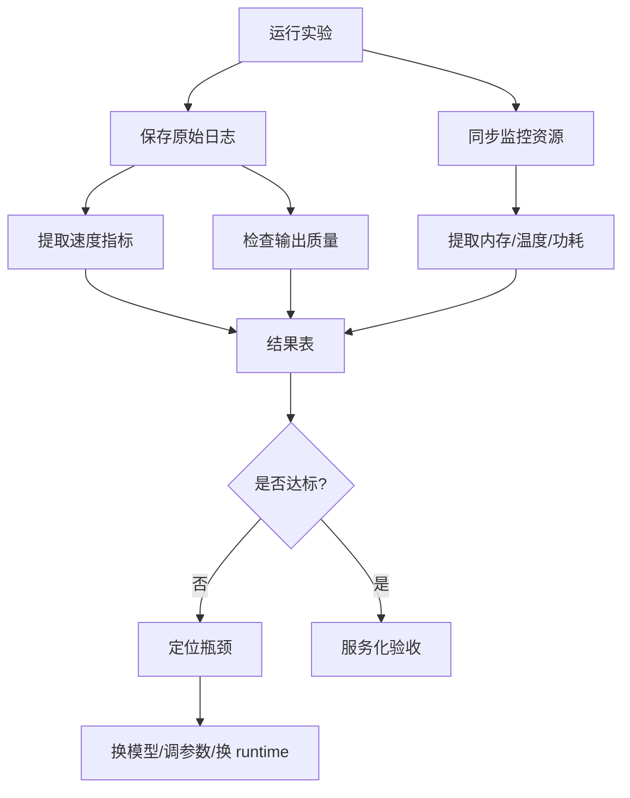
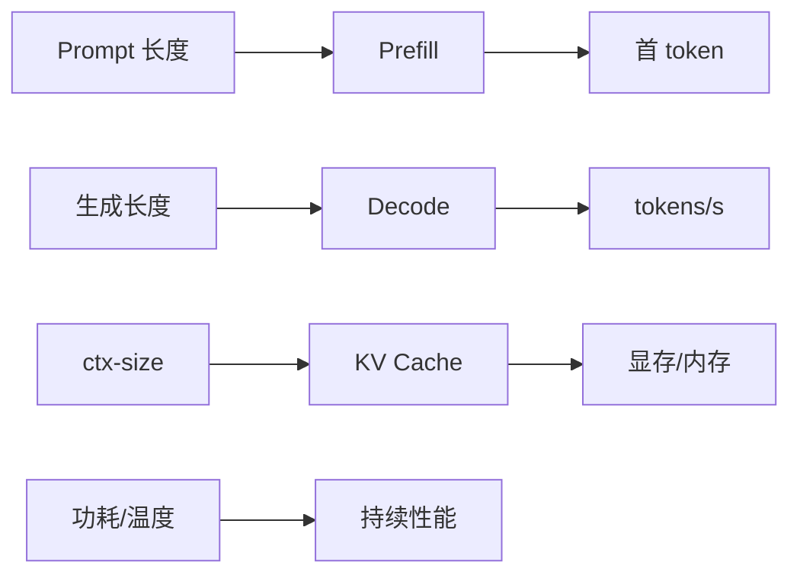
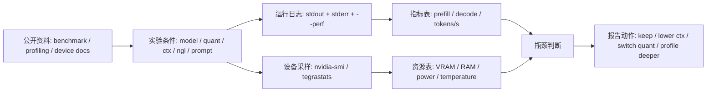

# Profiling 与结果记录

## 建议学时

2 学时。

建议安排：

| 课时 | 内容 | 产出 |
| --- | --- | --- |
| 1 | 指标体系：质量、首 token、tokens/s、显存、功耗、稳定性 | profiling 记录模板 |
| 2 | 分析 Ubuntu Server 与 Jetson 的实验日志 | 优化建议和验收结论 |

本实验对应理论章节：

- [推理加速基础](/docs/inference-acceleration)
- [推理框架与部署链路](/docs/runtime-deployment)
- [Jetson 部署基础](/docs/jetson-deployment)

实跑记录：

- [profiling record run](https://github.com/neardws/edge-ai-deployment-course-runs/tree/main/runs/2026-06-29-profiling-record)

## 学习目标

完成本实验后，学习者应能：

- 把端侧部署结果拆成质量、速度、显存/内存、功耗/温度和稳定性。
- 区分首 token、prefill、decode 和稳定 tokens/s。
- 使用统一表格记录 Qwen GGUF、GPU offload、`ctx-size`、`llama-bench` 和服务化结果。
- 在 Ubuntu Server 上结合 `nvidia-smi` 记录 GPU 状态。
- 在 Jetson 上结合 `tegrastats` 记录内存、温度和功耗状态。
- 根据记录写出可执行的下一步优化建议。

## 本章定位

| 项目 | 内容 |
| --- | --- |
| 本章解决的问题 | 把 baseline、量化、加速和服务化日志整理成可比较、可复查的 profiling 结论。 |
| 你需要先知道 | 已至少完成 baseline 和一组量化或加速实验。 |
| 你会产出 | profiling 总表、失败记录、下一步优化建议。 |
| 最终报告位置 | 第 5 节 Runtime 参数与加速实验、第 7 节端侧部署风险。 |

## 问题背景

“跑起来了”不是验收标准。

端侧部署要证明模型在真实设备上稳定达到业务可用标准。

对小型 LLM 来说，至少要区分：

- 首 token 延迟：决定用户第一次等待感。
- tokens/s：决定生成是否流畅。
- KV Cache：决定长上下文和多轮对话能力。
- VRAM/RAM：决定能否常驻和是否会 OOM。
- 温度/功耗：决定 Jetson 等边缘设备能否持续运行。
- 输出质量：决定模型是否真正可用。
- 服务化稳定性：决定应用能否调用。

本章目标是建立结果记录方法，而不是制造好看的性能数字。

## 图示讲解



指标之间的关系：



## 公开资料怎么转成本章内容

llama-bench、Nsight Systems、MLPerf 和厂商设备文档都在讲 profiling，但层级不同。本章只吸收三件事：指标必须定义清楚，采样条件必须记录清楚，结论必须能追溯到原始日志。复杂 trace、竞赛级 benchmark 和跨厂商榜单都作为扩展阅读，不进入课堂最低要求。



| 外部资料中的经典内容 | 本实验吸收什么 | 课程里的落点 |
| --- | --- | --- |
| llama.cpp llama-bench | 把 prompt processing 和 text generation 分开记录 | Step 2、Step 5 和结果总表中的速度字段 |
| Nsight Systems | 系统级 profiling 先看时间线和资源占用 | 作为“需要更深分析时再用”的扩展工具 |
| MLPerf Inference | 指标、负载、条件、结果必须一起报告 | 验收表要求每行结果能对应原始日志 |
| CUDA / NVIDIA 文档 | GPU 状态、显存、温度、功耗的采样入口 | Ubuntu Server 的 `nvidia-smi` 记录 |
| Jetson documentation | 统一内存、功耗模式、温度和降频风险 | Jetson 的 `tegrastats`、`nvpmodel` 记录 |
| 课程 profiling 实跑记录 | stderr timing、短运行 GPU 利用率采样容易失真 | Step 3、Step 5 明确用 `2>&1 | tee`，并保留显存/功耗证据 |

vLLM 课程的 benchmark lab 提醒我们：压测结果必须同时说明负载形状和质量边界。本实验不引入 GuideLLM，但保留它的记录习惯：

### 外部课程原图参考

下面两张图来自 vLLM 官方博客中的 DeepLearning.AI/vLLM 课程截图。本实验不要求复现图中的工具，只把 metrics 和 benchmarking lab 的记录口径搬到 Qwen/llama.cpp 日志里。


| 原图重点 | 本实验吸收什么 | 转成哪个证据 |
| --- | --- | --- |
| metrics 要区分层级 | API elapsed、TTFT、tokens/s、throughput 不混写 | timing log、curl 计时、结果总表 |
| benchmark 要说明负载 | 并发、prompt 长度、生成长度会改变结论 | prompt 文件、`-p/-n`、ctx、并发说明 |
| benchmark 还要看质量 | 更快不等于更可用 | 固定输出样例、质量备注、失败日志 |

| Profiling 维度 | 记录什么 | 没记录会怎样 |
| --- | --- | --- |
| 负载形状 | 并发数、prompt 长度、生成长度、是否共享 system prompt | 吞吐数字无法解释 |
| 延迟拆分 | TTFT、总耗时、tokens/s 或 `llama-bench` prompt/eval | 不知道用户等待来自 prefill 还是 decode |
| 资源采样 | VRAM/RAM、功耗、温度、GPU 利用率 | 速度变化无法和设备状态对应 |
| 质量回归 | 固定 prompt 输出、PPL 或规则检查 | 压缩后可能只是更快地输出坏结果 |
| 原始证据 | 命令、stdout/stderr、采样日志、模型 hash | 报告无法复查 |

所以，本章的重点不是画更复杂的性能图，而是让每个部署判断都有日志、采样和质量备注支撑。

外部 benchmark 页面里的表格通常很好看，但不能直接搬成课程结论。可以先贴入它们的“字段结构”，再替换成本课程实测值。

| 外部 benchmark 字段 | 本课程对应字段 | 备注 |
| --- | --- | --- |
| model / backend | Qwen GGUF 文件、llama.cpp commit、CUDA/Jetson backend | 不能只写模型名 |
| workload | prompt tokens、generated tokens、ctx-size、并发数 | 短 prompt 结论不能推广到长上下文 |
| latency | TTFT、total elapsed、prompt eval、eval | CLI 和 API 要分开 |
| throughput | tokens/s、requests/s 或 samples/s | 本课程主线优先记录 tokens/s |
| memory | VRAM/RAM、KV Cache、统一内存 | Jetson 必须补功耗和温度 |
| quality | 固定 prompt 输出、规则检查、失败样例 | 更快但答错不算部署成功 |
| evidence | 原始命令、日志、采样文件、hash | 没有证据的数字不进入报告 |

把 MLPerf、Nsight Systems 和 llama-bench 的资料贴进课程时，最有用的是下面这些字段，而不是外部成绩：

| 资料字段 | 本实验保留什么 | 写进哪份文件 |
| --- | --- | --- |
| Scenario / workload | 单请求、并发、prompt 长度、生成长度 | `results/profiling-summary.md` |
| System under test | CPU/GPU/Jetson、driver、JetPack、功耗模式 | `results/env-check.txt` 或 Jetson 环境摘要 |
| Model and precision | Qwen GGUF 文件、Q8/Q5/Q4、hash | 量化对比总表 |
| Timing breakdown | prompt processing、text generation、total elapsed | `llama-bench` 或 stderr timing |
| Resource trace | VRAM/RAM、温度、功耗、GPU/GR3D | `nvidia-smi` 或 `tegrastats` 日志 |
| Accuracy / quality | 固定 prompt 输出、规则检查、失败样例 | 第 4 节质量备注 |
| Reproducibility | 命令、参数、commit、日志路径 | 报告附录证据索引 |

## 指标定义

| 指标 | 含义 | 记录建议 |
| --- | --- | --- |
| 首 token 延迟 | 从请求到第一个 token 的等待 | 单独记录，不和总耗时混用 |
| prompt eval / prefill | 处理 prompt 的阶段 | 对长上下文尤其重要 |
| eval / decode | 逐 token 生成阶段 | 关注 tokens/s |
| tokens/s | decode 阶段生成速度 | 尽量记录同一生成长度 |
| 峰值 VRAM | GPU 显存高点 | Ubuntu 用 `nvidia-smi` |
| RAM | 系统内存或统一内存占用 | Jetson 特别重要 |
| 温度 | 持续运行稳定性 | Jetson 用 `tegrastats` |
| 功耗模式 | 影响频率和性能 | Jetson 用 `nvpmodel` |
| 输出质量 | 是否满足任务 | 固定 prompt + 人工备注 |
| 失败日志 | fallback、OOM、格式错误 | 必须保存 |

## 实验设计

profiling 至少覆盖四组：

| 实验 | 固定变量 | 改变变量 | 观察重点 |
| --- | --- | --- | --- |
| 量化格式对比 | 模型基座、prompt、ctx、`-ngl` | Q8/Q5/Q4 | 文件、显存、速度、质量 |
| GPU offload 对比 | 模型、prompt、ctx、生成长度 | `-ngl 0/99` | GPU 是否带来收益 |
| 上下文长度对比 | 模型文件、prompt、`-ngl` | ctx 1024/2048/4096 | KV Cache 和首 token |
| 服务化 smoke test | 模型文件、ctx、采样参数 | CLI vs server | API 可用性和额外开销 |
| Jetson 对比 | 模型、prompt、ctx | Ubuntu Server vs Jetson | 速度、内存、温度、功耗 |

课堂中不追求严格统计显著性。

但要保证每次实验条件可解释，至少做到“一次只改一个主变量”。

## Step 1：建立结果文件

复制课程模板：

```bash
cp labs/templates/profiling-results.md ~/edge-ai-lab/results/profiling-results.md
```

如果模板不存在，也可以直接在实验报告中使用本页表格。

建议记录文件：

```bash
touch ~/edge-ai-lab/results/profiling-notes.md
```

## Step 2：保存运行日志

每次实验都用 `tee` 保存：

```bash
./build/bin/llama-cli \
  -m ~/edge-ai-lab/models/qwen/qwen2.5-1.5b-instruct-q4_k_m.gguf \
  -p "用三句话解释 profiling 对端侧部署的价值。" \
  -n 128 \
  --ctx-size 2048 \
  -ngl 99 \
  2>&1 | tee ~/edge-ai-lab/logs/profiling-sample.txt
```

日志命名建议：

| 实验 | 日志命名 |
| --- | --- |
| baseline | `qwen-baseline-q8.txt` |
| 量化对比 | `qwen2.5-...-q4_k_m.gguf.log` |
| GPU offload | `qwen-ngl-0.txt`、`qwen-ngl-99.txt` |
| ctx-size | `qwen-ctx-1024.txt` |
| llama-bench | `llama-bench-ngl-99.txt` |
| server | `llama-server.txt` |
| Jetson | `jetson-qwen-baseline.txt` |

## Step 3：Ubuntu Server 资源监控

运行前保存：

```bash
nvidia-smi > ~/edge-ai-lab/results/nvidia-smi-before.txt
```

运行中观察：

```bash
watch -n 0.5 nvidia-smi
```

运行后保存：

```bash
nvidia-smi > ~/edge-ai-lab/results/nvidia-smi-after.txt
```

如果希望自动记录一段时间，可以用：

```bash
nvidia-smi \
  --query-gpu=timestamp,name,utilization.gpu,memory.used,memory.total,temperature.gpu,power.draw \
  --format=csv \
  -l 1 \
  > ~/edge-ai-lab/logs/nvidia-smi-loop.csv
```

实验结束后用 `Ctrl+C` 停止。

如果某些 GPU 不支持 `power.draw` 字段，删除该字段再运行。

如果实验只持续几百毫秒，`nvidia-smi` 可能采不到 GPU utilization 峰值，甚至显示 0%。这时不要只看 utilization；同时看显存、功耗、llama.cpp timing。需要稳定利用率时，改用更长生成或 `llama-bench`。

## Step 4：Jetson 资源监控

记录功耗模式：

```bash
sudo nvpmodel -q | tee ~/edge-ai-lab/results/jetson-nvpmodel.txt
```

记录时钟状态：

```bash
sudo jetson_clocks --show | tee ~/edge-ai-lab/results/jetson-clocks.txt
```

推理过程中记录：

```bash
tegrastats --interval 1000 | tee ~/edge-ai-lab/logs/tegrastats.txt
```

实验结束后用 `Ctrl+C` 停止。

分析时关注：

| 字段 | 解读 |
| --- | --- |
| RAM | 统一内存压力 |
| SWAP | 是否开始使用交换空间 |
| CPU | CPU 是否成为瓶颈 |
| GR3D/GPU | GPU 是否参与 |
| 温度 | 是否可能热降频 |
| 功耗 | 不同功耗模式下的差异 |

## Step 5：提取 llama.cpp 日志信息

不同版本的 llama.cpp 输出格式会变化。

原则是保存原始日志，然后按实际字段提取。

重点查找：

```bash
grep -i "eval" ~/edge-ai-lab/logs/qwen-baseline-q4.txt
grep -i "cuda" ~/edge-ai-lab/logs/qwen-baseline-q4.txt
grep -i "warning\\|fallback\\|error\\|oom" ~/edge-ai-lab/logs/qwen-baseline-q4.txt
```

如果 `grep` 没有结果，不代表实验失败。

说明该版本日志字段不同，人工查看即可。

如果把 stdout 和 stderr 分开保存，要确认 timing 在哪个文件里。实跑中 `llama-completion --perf` 的 timing 出现在 stderr；解析 stdout 文件会得到空结果。最省事的写法仍然是：

```bash
./build/bin/llama-completion ... --perf 2>&1 | tee ~/edge-ai-lab/logs/profiling-sample.txt
```

## Step 6：结果总表

| 实验 | 硬件 | 模型 | 参数 | 首 token / prefill | tokens/s | 峰值内存/显存 | 温度/功耗 | 输出质量 | 是否达标 | 日志 |
| --- | --- | --- | --- | --- | --- | --- | --- | --- | --- | --- |
| baseline | 待填 | 待填 | 待填 | 待填 | 待填 | 待填 | 待填 | 待填 | 待填 | 待填 |
| Q8 | 待填 | 待填 | 待填 | 待填 | 待填 | 待填 | 待填 | 待填 | 待填 | 待填 |
| Q5 | 待填 | 待填 | 待填 | 待填 | 待填 | 待填 | 待填 | 待填 | 待填 | 待填 |
| Q4 | 待填 | 待填 | 待填 | 待填 | 待填 | 待填 | 待填 | 待填 | 待填 | 待填 |
| `-ngl 0` | 待填 | 待填 | 待填 | 待填 | 待填 | 待填 | 待填 | 待填 | 待填 | 待填 |
| `-ngl 99` | 待填 | 待填 | 待填 | 待填 | 待填 | 待填 | 待填 | 待填 | 待填 | 待填 |
| `ctx 1024` | 待填 | 待填 | 待填 | 待填 | 待填 | 待填 | 待填 | 待填 | 待填 | 待填 |
| `ctx 4096` | 待填 | 待填 | 待填 | 待填 | 待填 | 待填 | 待填 | 待填 | 待填 | 待填 |
| server | 待填 | 待填 | 待填 | 待填 | 待填 | 待填 | 待填 | 待填 | 待填 | 待填 |

## Step 7：质量记录

建议固定一个主 prompt 和一个压力 prompt。

主 prompt：

```text
用三句话解释端侧模型量化的价值。
```

压力 prompt：

```text
请用项目复盘方式解释 KV Cache 对端侧部署的影响，并列出三个风险。
```

质量记录表：

| 模型/参数 | 是否回答问题 | 格式是否符合 | 是否重复 | 是否有明显错误 | 中文是否自然 | 备注 |
| --- | --- | --- | --- | --- | --- | --- |
| 待填 | 待填 | 待填 | 待填 | 待填 | 待填 | 待填 |

## Step 8：失败日志分类

失败也要记录。

| 失败类型 | 可能原因 | 下一步 |
| --- | --- | --- |
| OOM | 模型过大、ctx 过高、KV Cache 过大 | 降低 ctx、换 Q4、换小模型 |
| CUDA 不可用 | 构建未启 CUDA、驱动问题 | 检查构建日志和 `nvidia-smi` |
| 输出质量差 | 量化过低、prompt 不合适、模型不匹配 | 换 Q5/Q8、固定 prompt |
| API 超时 | 模型加载慢、请求排队、上下文过长 | 预热、降 ctx、设置超时 |
| Jetson 降速 | 温度、功耗模式、电源 | 检查 `tegrastats`、散热和电源 |

## Step 9：写优化建议

优化建议要从证据出发。

建议格式：

```text
观察：
- ______

判断：
- 瓶颈更可能是 ______。

证据：
- 日志 ______ 显示 ______。
- 监控 ______ 显示 ______。

下一步：
- ______。
```

不要只写“继续优化”。

要写出具体动作。

## Step 10：风险登记和部署建议

把 profiling 结果转成报告第 7、8 节时，不要只列风险名称。每个风险都要有证据和动作。

| 风险项 | 证据日志 | 影响 | 缓解动作 | 是否进入最终建议 |
| --- | --- | --- | --- | --- |
| 温度/功耗 | 待填 | 待填 | 待填 | 是/否 |
| 内存/显存 | 待填 | 待填 | 待填 | 是/否 |
| 长上下文 | 待填 | 待填 | 待填 | 是/否 |
| API 超时 | 待填 | 待填 | 待填 | 是/否 |
| 输出质量 | 待填 | 待填 | 待填 | 是/否 |
| 许可证/日志安全 | 待填 | 待填 | 待填 | 是/否 |

最终建议至少要包含一个推荐方案和一个不推荐方案。推荐或不推荐都必须能回到上表中的证据。

## 验收结果

注意：本章的三类 profiling 结果不能替代最终项目第 4 节的至少三组量化版本或模型变体对比。

本章完整记录标准：

```text
[ ] profiling 表至少包含三类实验结果
[ ] 每行结果都能对应到原始日志
[ ] Ubuntu 或 Jetson 资源监控证据已保存
[ ] 至少记录一个失败、无提升或质量下降案例
[ ] 能写出下一步优化动作和证据
[ ] 风险登记表能支撑最终推荐和不推荐方案
```

最终报告最低验收不要求一次完成所有 profiling 维度，但必须有可追溯的首 token、tokens/s、峰值内存或显存、错误/异常检查结果，以及至少一类 runtime/profiling 对比证据。未完成项写“未记录”并说明原因。

| 产物 | 验收标准 |
| --- | --- |
| profiling 表 | 至少包含 baseline、量化对比，以及一类 runtime/profiling 对比；量化结果可引用量化实验页日志和表格 |
| 原始日志 | 每行结果都能对应到日志文件 |
| 资源监控 | Ubuntu 有 `nvidia-smi`，Jetson 有 `tegrastats` |
| 质量记录 | 至少一个固定 prompt 的质量备注 |
| 失败记录 | 如果有失败，保留日志并分类 |
| 优化建议 | 能说明下一步动作和证据 |

## 常见问题

### 只跑一次就下结论

第一次运行可能受冷启动、缓存、温度或系统负载影响。

课堂实验可以只跑一次，但结论要写“初步观察”。

正式部署前应多次运行。

### 混用不同采样参数

采样参数变化会影响输出长度和质量。

如果改了 temperature、top-p 或生成长度，必须记录。

### 只保存截图

截图适合展示，但不适合搜索和复盘。

优先保存文本日志。

### 只看最快结果

部署更关心稳定性。

要保留失败、变慢和质量下降的记录。

## 作业

提交一份 profiling 报告，包含：

1. 设备环境摘要。
2. 结果总表。
3. 至少三份原始日志路径。
4. 一段质量记录。
5. 一段失败或风险分析。
6. 下一步优化建议。

## 参考资料

本章吸收方式：

- **知识点**：从 llama-bench、Nsight、MLPerf、DeepLearning.AI/vLLM benchmark lab、CUDA 和 Jetson 文档吸收 profiling 边界、采样工具和报告严谨性。
- **图解**：远程贴入 vLLM/DeepLearning.AI metrics 和 benchmarking lab 截图作为原图参考，再重画为“命令日志、系统采样、结果表、结论”的记录闭环。
- **实验**：要求保留 stdout/stderr、`nvidia-smi` 或 `tegrastats`、解析表和失败样例。
- **取舍**：不做竞赛级 benchmark，也不把截图当作唯一证据。

- [llama.cpp 项目](https://github.com/ggml-org/llama.cpp)
- [llama.cpp llama-bench documentation](https://github.com/ggml-org/llama.cpp/tree/master/tools/llama-bench)
- [DeepLearning.AI Fast & Efficient LLM Inference with vLLM](https://www.deeplearning.ai/courses/fast-and-efficient-llm-inference-with-vllm/)
- [vLLM course announcement and screenshots](https://vllm.ai/blog/2026-06-03-deeplearning-ai-vllm-course)
- [NVIDIA Nsight Systems](https://developer.nvidia.com/nsight-systems)
- [MLPerf Inference](https://mlcommons.org/benchmarks/inference/)
- [NVIDIA CUDA Installation Guide for Linux](https://docs.nvidia.com/cuda/cuda-installation-guide-linux/)
- [NVIDIA Jetson documentation](https://docs.nvidia.com/jetson/)
