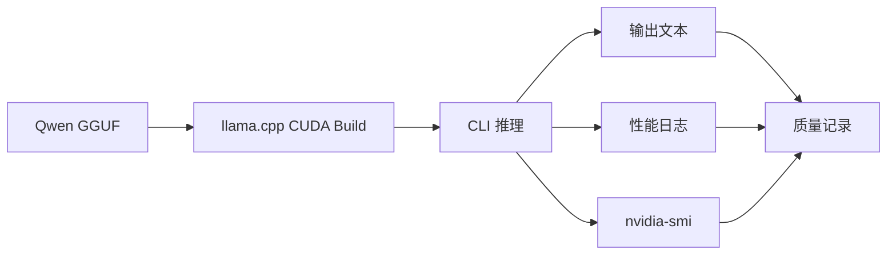
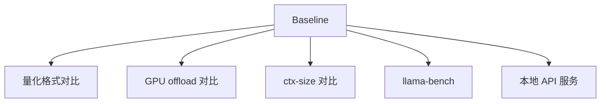

# Qwen 基线推理

## 建议学时

2 学时。

建议安排：

| 课时 | 内容 | 产出 |
| --- | --- | --- |
| 1 | 构建 llama.cpp CUDA 版本，准备 Qwen GGUF | 构建日志和模型清单 |
| 2 | 固定 prompt 跑 baseline，记录速度、显存和质量 | baseline 实验记录 |

本实验对应理论章节：

- [推理框架与部署链路](/docs/runtime-deployment)
- [LLM 量化与 KV Cache](/docs/llm-quantization)
- [推理加速基础](/docs/inference-acceleration)

## 学习目标

完成本实验后，学习者应能：

- 构建启用 CUDA 的 llama.cpp。
- 下载或准备 Qwen 小模型 GGUF 文件。
- 使用固定 prompt、固定上下文、固定生成长度建立 baseline。
- 记录首 token、tokens/s、显存、输出质量和原始日志。
- 为后续 Q8/Q5/Q4 量化对比、GPU offload 和服务化实验提供基线。

## 本章定位

| 项目 | 内容 |
| --- | --- |
| 本章解决的问题 | 同一个 Qwen GGUF 模型能否在目标设备上稳定跑通一次 baseline。 |
| 你需要先知道 | Linux/GPU 环境检查、TTFT、tokens/s、GGUF 和 llama.cpp 基础命令。 |
| 你会产出 | `logs/qwen-baseline-*.txt`、模型清单、baseline 结果表。 |
| 最终报告位置 | 第 2 节实验环境、第 3 节 Baseline 结果。 |

## 问题背景

量化对比之前必须先有 baseline。

baseline 不只是“模型能说话”，还包括：

- 固定模型文件。
- 固定 runtime 版本。
- 固定 prompt。
- 固定 `ctx-size`。
- 固定生成长度。
- 固定 `-ngl`。
- 固定采样参数。
- 保存原始日志和质量备注。

没有 baseline，后续看到速度变化或质量变化时，就无法判断变化来自哪里。

## 实验边界

本实验默认在 Ubuntu Server + NVIDIA GPU 上完成。

如果在 Jetson 上做，请优先阅读 [Jetson 环境与 Qwen 迁移](/docs/lab-jetson-setup)。

本实验不要求下载大模型。

课程建议从 Qwen 小模型 GGUF 开始，例如 1.5B 级别或教师提供的更小模型。

不要把模型文件提交到 Git。

一份服务器实跑记录见：[edge-ai-deployment-course-runs](https://github.com/neardws/edge-ai-deployment-course-runs/tree/main/runs/2026-06-29-server-smoke)。它只保存脱敏命令、环境摘要和结果摘要，不保存模型权重。

## 图示讲解



baseline 与后续实验的关系：



## 前置条件

已经完成：

- [Ubuntu Server 与 NVIDIA GPU 环境](/docs/lab-ubuntu-nvidia)
- `~/edge-ai-lab/{models/qwen,src,logs,results}` 目录。
- `nvidia-smi` 能正常运行。
- CMake、Git、编译器可用。

## Step 1：获取 llama.cpp

第三方源码放在实验目录，不放进课程仓库。

```bash
cd ~/edge-ai-lab/src
git clone https://github.com/ggml-org/llama.cpp.git
cd llama.cpp
git rev-parse --short HEAD | tee ~/edge-ai-lab/results/llama-cpp-commit.txt
```

如果已经下载过：

```bash
cd ~/edge-ai-lab/src/llama.cpp
git status --short
git rev-parse --short HEAD
```

课堂实验不要求追最新 commit。

关键是记录当前 commit，保证结果可追踪。

## Step 2：构建 CUDA 版本

```bash
cmake -B build -DGGML_CUDA=ON 2>&1 | tee ~/edge-ai-lab/logs/cmake-cuda.txt
cmake --build build --config Release --target llama-cli llama-bench llama-server -j2 \
  2>&1 | tee ~/edge-ai-lab/logs/build-cuda.txt
cmake --build build --config Release --target llama-completion -j2 \
  2>&1 | tee ~/edge-ai-lab/logs/build-completion.txt
```

第一次实验优先构建这几个目标。完整构建也可以，但输出更长，可能包含 server UI/frontend 相关构建信息。

如果机器核心数和内存充足，可以提高并行度：

```bash
cmake --build build --config Release --target llama-cli llama-bench llama-server -j8
```

记录 `llama.cpp commit` 时，从 `~/edge-ai-lab/src/llama.cpp` 执行：

```bash
git rev-parse --short HEAD
```

不要把这里的 commit 和课程仓库 commit 混在一起。

检查可执行文件：

```bash
./build/bin/llama-cli --help | head
./build/bin/llama-bench --help | head
./build/bin/llama-server --help | head
./build/bin/llama-completion --help | head
```

记录：

| 项目 | 结果 |
| --- | --- |
| llama.cpp commit | 待填 |
| CMake 参数 | `-DGGML_CUDA=ON` |
| 构建是否成功 | 待填 |
| `llama-cli` 是否可运行 | 待填 |
| `llama-bench` 是否可运行 | 待填 |
| `llama-server` 是否可运行 | 待填 |
| `llama-completion` 是否可运行 | 待填 |

## Step 3：准备 Qwen GGUF

把模型放入：

```bash
~/edge-ai-lab/models/qwen/
```

优先使用教师或课程指定的 Qwen Instruct GGUF 文件。第一次 baseline 不要自己同时换模型、换量化格式和换 runtime，否则后续结果无法比较。

选择文件时先看三件事：

| 检查项 | 建议 |
| --- | --- |
| 模型族 | 选 Qwen 小模型 Instruct 版本，文件名和报告中保持一致。 |
| 文件格式 | 必须是 `.gguf`，用于 llama.cpp 主线。 |
| 量化格式 | baseline 优先用 Q8 或教师指定版本；如果设备内存不足，再用 Q4 并记录原因。 |

如果还没有模型文件，先不要跳过记录。把“模型来源未确定、计划使用的模型族、目标量化格式、需要教师确认的问题”写入报告第 3 节，再继续准备环境。

服务器或笔记本烟雾测试可以先用 Qwen2.5 0.5B Instruct 的 Q4_K_M 文件跑通流程：

```bash
cd ~/edge-ai-lab/models/qwen
curl -L -C - --retry 3 --retry-delay 3 \
  -o qwen2.5-0.5b-instruct-q4_k_m.gguf \
  https://huggingface.co/Qwen/Qwen2.5-0.5B-Instruct-GGUF/resolve/main/qwen2.5-0.5b-instruct-q4_k_m.gguf

ls -lh qwen2.5-0.5b-instruct-q4_k_m.gguf
sha256sum qwen2.5-0.5b-instruct-q4_k_m.gguf
```

如果教师指定了其他 Qwen GGUF 文件，以教师指定文件为准，但仍记录文件名、来源、大小和 SHA256。

检查文件：

```bash
ls -lh ~/edge-ai-lab/models/qwen/*.gguf
sha256sum ~/edge-ai-lab/models/qwen/*.gguf
```

记录模型信息：

| 项目 | 结果 |
| --- | --- |
| 模型名称 | 待填 |
| 模型来源（报告第 2 节） | 教师提供 / Hugging Face repo / 离线包 + 文件名 |
| 模型许可证（报告第 2 节） | 从模型卡或教师说明填写；查不到写“未记录” |
| 文件名 | 待填 |
| 下载 URL / 教师包编号 | 待填 |
| SHA256（报告第 2 节） | 待填 |
| 量化格式 | 待填 |
| 文件大小 | 待填 |
| 下载日期 | 待填 |

如果模型由教师提供，记录“教师提供”和文件名即可。

## Step 4：固定 baseline 参数

课堂统一使用一组 baseline 参数，便于后续比较。

| 参数 | 建议值 | 说明 |
| --- | --- | --- |
| prompt | `用三句话解释端侧模型量化的价值。` | 后续量化对比复用 |
| `-n` | `128` | 固定生成长度 |
| `--ctx-size` | `2048` | 初始上下文长度 |
| `-ngl` | `99` | 尽量 GPU offload |
| temperature | 默认或明确记录 | 不混用采样参数 |

如果设备内存不足，可以把 `ctx-size` 降到 1024，但必须记录。

## Step 5：运行 baseline

```bash
cd ~/edge-ai-lab/src/llama.cpp

MODEL=~/edge-ai-lab/models/qwen/qwen2.5-0.5b-instruct-q4_k_m.gguf

nvidia-smi --query-gpu=index,name,memory.used,memory.total --format=csv,noheader \
  > ~/edge-ai-lab/results/gpu-before-baseline.csv

./build/bin/llama-completion \
  -m "$MODEL" \
  -p "用三句话解释端侧模型量化的价值。" \
  -n 128 \
  -ngl 99 \
  --ctx-size 2048 \
  --temp 0.2 \
  --seed 42 \
  -cnv \
  -st \
  --no-display-prompt \
  --perf \
  2>&1 | tee ~/edge-ai-lab/logs/qwen-baseline-q4.txt

nvidia-smi --query-gpu=index,name,memory.used,memory.total --format=csv,noheader \
  > ~/edge-ai-lab/results/gpu-after-baseline.csv
```

模型文件名按实际情况修改。

新版 `llama.cpp` 中，`llama-cli --no-conversation` 可能不再是安全的非交互命令；如果看到提示 `please use llama-completion instead`，按上面的 `llama-completion -cnv -st` 路径执行。

## Step 6：同步观察 GPU

如果不能另开终端，先使用 Step 5 中的 `gpu-before-baseline.csv` 和 `gpu-after-baseline.csv` 做最低记录。

另开一个终端保存 GPU 采样日志：

```bash
nvidia-smi \
  --query-gpu=timestamp,name,memory.used,utilization.gpu,temperature.gpu,power.draw \
  --format=csv \
  -lms 500 | tee ~/edge-ai-lab/logs/nvidia-smi-qwen-baseline.csv
```

运行结束后用 `Ctrl+C` 停止采样，再保存一次结束快照：

```bash
nvidia-smi | tee ~/edge-ai-lab/logs/nvidia-smi-after-baseline.txt
```

记录：

- 推理前显存。
- 推理中峰值显存。
- 是否看到 `llama-completion` 或对应 runtime 进程。
- GPU 使用率是否有变化。

## Step 7：读取日志中的性能信息

从 `qwen-baseline-*.txt` 中查找：

- 模型加载信息。
- backend 或 CUDA 相关信息。
- prompt eval 或 prefill 统计。
- eval 或 decode 统计。
- tokens/s。
- 是否有 warning、fallback、OOM、unsupported 等异常信息。

如果日志格式随 llama.cpp 版本变化，按实际输出记录。

不要为了填表编造不存在的字段。

可以再跑一次标准化小基准，补充报告第 5 节：

```bash
./build/bin/llama-bench \
  -m "$MODEL" \
  -ngl 99 \
  -p 128 \
  -n 128 \
  -r 3 \
  2>&1 | tee ~/edge-ai-lab/logs/qwen-bench.txt
```

## 结果记录表

| 字段 | 结果 |
| --- | --- |
| 设备 | 待填 |
| GPU | 待填 |
| Driver/CUDA | 待填 |
| OS/CPU/RAM/Python | 见 `results/env-check.txt` |
| llama.cpp commit | 待填 |
| 模型文件 | 待填 |
| 模型来源/许可证/SHA256 | 待填 |
| 量化格式 | 待填 |
| 文件大小 | 待填 |
| `ctx-size` | 待填 |
| `-ngl` | 待填 |
| 生成长度 | 待填 |
| 首 token / prompt eval | 待填 |
| tokens/s / eval | 待填 |
| 推理前显存 | 待填 |
| 峰值显存 | 待填 |
| GPU 采样日志 | `logs/nvidia-smi-qwen-baseline.csv` |
| 输出质量备注 | 待填 |
| 原始日志 | 待填 |

## 质量记录建议

对输出做简单人工检查：

| 维度 | 说明 |
| --- | --- |
| 是否回答 prompt | 没有跑题 |
| 是否三句话 | 大致满足格式要求 |
| 是否有明显事实错误 | 记录异常 |
| 是否重复 | 记录循环或重复片段 |
| 是否语言稳定 | 中文是否自然 |

baseline 质量不是绝对评分，而是后续量化对比的参照。

## 验收结果

本章最低通过标准：

```text
[ ] 命令能成功执行
[ ] baseline 日志保存到 logs/qwen-baseline-*.txt
[ ] 模型文件、量化格式、ctx-size、ngl 已记录
[ ] 记录首 token/TTFT 口径；如果日志不直接给出，说明用 prompt eval 近似，并指出 eval/tokens/s 字段
[ ] 峰值内存或显存、异常/错误检查结果已保存
[ ] 能写出一句 baseline 质量判断
```

这是最终项目最低验收的基础：最终报告必须至少有一次成功的 Qwen 本地推理。失败日志可以作为阶段记录或限制说明，但不能替代最终验收中的 baseline 结果。

| 产物 | 验收标准 |
| --- | --- |
| `cmake-cuda.txt` | 能看到 CUDA 构建配置记录 |
| `build-cuda.txt` | 构建成功，无关键错误 |
| 模型清单 | `ls -lh` 记录模型文件和大小 |
| baseline 日志 | 包含模型加载、输出文本和性能统计 |
| GPU 监控记录 | 能说明 GPU 是否参与 |
| 异常检查 | 如果没有错误，也写“未观察到 OOM/fallback/unsupported”等检查结果 |
| baseline 表 | 所有可获得字段已填写，缺失字段说明原因 |

## 失败排查

### `llama-cli` 不存在

处理：

- 确认当前目录是 `~/edge-ai-lab/src/llama.cpp`。
- 确认构建是否成功。
- 查看 `build/bin` 下实际文件名。

### 模型文件找不到

处理：

- 用 `ls -lh ~/edge-ai-lab/models/qwen/` 确认文件名。
- 修改 `-m` 参数。
- 不要把模型移动到课程仓库。

### CUDA 构建失败

处理：

- 检查 `nvidia-smi`。
- 检查 CMake 日志。
- 确认课程环境是否安装编译工具。
- 如果是 Jetson，参考 Jetson 实验降低并行度。

### 推理输出乱码或异常

处理：

- 确认模型是 Qwen instruction/chat 版本。
- 检查 prompt 是否被 shell 转义破坏。
- 尝试更短 prompt。
- 比较不同 GGUF 文件。

### 速度字段找不到

处理：

- 不同 llama.cpp 版本日志格式可能不同。
- 保存原始日志。
- 在报告中说明“该版本未显示该字段”。
- 可用 `llama-bench` 补充标准化测试。

## 作业

提交 baseline 记录，包含：

1. llama.cpp commit。
2. 模型文件名和量化格式。
3. 固定 prompt 输出。
4. 首 token 或 prompt eval 信息。
5. tokens/s 或 eval 信息。
6. 显存观察。
7. 一段不超过 150 字的 baseline 质量说明。

三句话复盘：

```text
我在当前设备上跑通了 Qwen GGUF baseline。
日志显示 ______，输出质量 ______。
因此后续量化对比会固定 ______，并把 baseline 作为参照。
```

## 参考资料

- [Qwen llama.cpp 本地运行指南](https://qwen.readthedocs.io/en/v2.5/run_locally/llama.cpp.html)
- [llama.cpp build documentation](https://www.mintlify.com/ggml-org/llama.cpp/development/build)
- [llama.cpp llama-cli documentation](https://www.mintlify.com/ggml-org/llama.cpp/inference/llama-cli)
