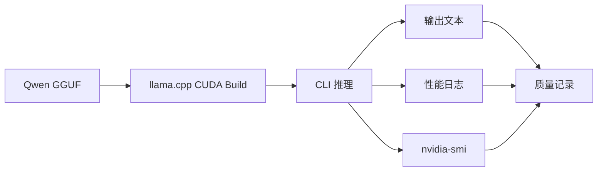
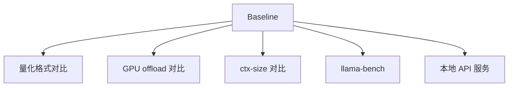

# Qwen 基线推理

## 建议学时

2 学时。

建议安排：

| 课时 | 内容 | 产出 |
| --- | --- | --- |
| 1 | 构建 llama.cpp CUDA 版本，准备 Qwen GGUF | 构建日志和模型清单 |
| 2 | 固定 prompt 跑 baseline，记录速度、显存和质量 | baseline 实验记录 |

本实验对应理论章节：

- [推理框架与部署链路](/docs/runtime-deployment)
- [LLM 量化与 KV Cache](/docs/llm-quantization)
- [推理加速基础](/docs/inference-acceleration)

## 学习目标

完成本实验后，学习者应能：

- 构建启用 CUDA 的 llama.cpp。
- 下载或准备 Qwen 小模型 GGUF 文件。
- 使用固定 prompt、固定上下文、固定生成长度建立 baseline。
- 记录首 token、tokens/s、显存、输出质量和原始日志。
- 为后续 Q8/Q5/Q4 量化对比、GPU offload 和服务化实验提供基线。

## 问题背景

量化对比之前必须先有 baseline。

baseline 不只是“模型能说话”，还包括：

- 固定模型文件。
- 固定 runtime 版本。
- 固定 prompt。
- 固定 `ctx-size`。
- 固定生成长度。
- 固定 `-ngl`。
- 固定采样参数。
- 保存原始日志和质量备注。

没有 baseline，后续看到速度变化或质量变化时，就无法判断变化来自哪里。

## 实验边界

本实验默认在 Ubuntu Server + NVIDIA GPU 上完成。

如果在 Jetson 上做，请优先阅读 [Jetson 环境与 Qwen 迁移](/docs/lab-jetson-setup)。

本实验不要求下载大模型。

课程建议从 Qwen 小模型 GGUF 开始，例如 1.5B 级别或教师提供的更小模型。

不要把模型文件提交到 Git。

## 图示讲解



baseline 与后续实验的关系：



## 前置条件

已经完成：

- [Ubuntu Server 与 NVIDIA GPU 环境](/docs/lab-ubuntu-nvidia)
- `~/edge-ai-lab/{models/qwen,src,logs,results}` 目录。
- `nvidia-smi` 能正常运行。
- CMake、Git、编译器可用。

## Step 1：获取 llama.cpp

第三方源码放在实验目录，不放进课程仓库。

```bash
cd ~/edge-ai-lab/src
git clone https://github.com/ggml-org/llama.cpp.git
cd llama.cpp
git rev-parse --short HEAD | tee ~/edge-ai-lab/results/llama-cpp-commit.txt
```

如果已经下载过：

```bash
cd ~/edge-ai-lab/src/llama.cpp
git status --short
git rev-parse --short HEAD
```

课堂实验不要求追最新 commit。

关键是记录当前 commit，保证结果可追踪。

## Step 2：构建 CUDA 版本

```bash
cmake -B build -DGGML_CUDA=ON 2>&1 | tee ~/edge-ai-lab/logs/cmake-cuda.txt
cmake --build build --config Release -j 2>&1 | tee ~/edge-ai-lab/logs/build-cuda.txt
```

如果机器核心数较少或内存紧张，可以降低并行度：

```bash
cmake --build build --config Release -j2
```

检查可执行文件：

```bash
./build/bin/llama-cli --help | head
./build/bin/llama-bench --help | head
./build/bin/llama-server --help | head
```

记录：

| 项目 | 结果 |
| --- | --- |
| llama.cpp commit | 待填 |
| CMake 参数 | `-DGGML_CUDA=ON` |
| 构建是否成功 | 待填 |
| `llama-cli` 是否可运行 | 待填 |
| `llama-bench` 是否可运行 | 待填 |
| `llama-server` 是否可运行 | 待填 |

## Step 3：准备 Qwen GGUF

把模型放入：

```bash
~/edge-ai-lab/models/qwen/
```

检查文件：

```bash
ls -lh ~/edge-ai-lab/models/qwen/*.gguf
```

记录模型信息：

| 项目 | 结果 |
| --- | --- |
| 模型名称 | 待填 |
| 模型来源 | 待填 |
| 文件名 | 待填 |
| 量化格式 | 待填 |
| 文件大小 | 待填 |
| 下载日期 | 待填 |

如果模型由教师提供，记录“教师提供”和文件名即可。

## Step 4：固定 baseline 参数

课堂统一使用一组 baseline 参数，便于后续比较。

| 参数 | 建议值 | 说明 |
| --- | --- | --- |
| prompt | `用三句话解释端侧模型量化的价值。` | 后续量化对比复用 |
| `-n` | `128` | 固定生成长度 |
| `--ctx-size` | `2048` | 初始上下文长度 |
| `-ngl` | `99` | 尽量 GPU offload |
| temperature | 默认或明确记录 | 不混用采样参数 |

如果设备内存不足，可以把 `ctx-size` 降到 1024，但必须记录。

## Step 5：运行 baseline

```bash
cd ~/edge-ai-lab/src/llama.cpp

./build/bin/llama-cli \
  -m ~/edge-ai-lab/models/qwen/qwen2.5-1.5b-instruct-q8_0.gguf \
  -p "用三句话解释端侧模型量化的价值。" \
  -n 128 \
  -ngl 99 \
  --ctx-size 2048 \
  2>&1 | tee ~/edge-ai-lab/logs/qwen-baseline-q8.txt
```

模型文件名按实际情况修改。

如果使用 Q4 作为 baseline，也可以：

```bash
./build/bin/llama-cli \
  -m ~/edge-ai-lab/models/qwen/qwen2.5-1.5b-instruct-q4_k_m.gguf \
  -p "用三句话解释端侧模型量化的价值。" \
  -n 128 \
  -ngl 99 \
  --ctx-size 2048 \
  2>&1 | tee ~/edge-ai-lab/logs/qwen-baseline-q4.txt
```

## Step 6：同步观察 GPU

另开一个终端：

```bash
watch -n 0.5 nvidia-smi
```

也可以在运行前后保存：

```bash
nvidia-smi > ~/edge-ai-lab/results/nvidia-smi-after-baseline.txt
```

记录：

- 推理前显存。
- 推理中峰值显存。
- 是否看到 `llama-cli` 进程。
- GPU 使用率是否有变化。

## Step 7：读取日志中的性能信息

从 `qwen-baseline-*.txt` 中查找：

- 模型加载信息。
- backend 或 CUDA 相关信息。
- prompt eval 或 prefill 统计。
- eval 或 decode 统计。
- tokens/s。
- 是否有 warning、fallback、OOM、unsupported 等异常信息。

如果日志格式随 llama.cpp 版本变化，按实际输出记录。

不要为了填表编造不存在的字段。

## 结果记录表

| 字段 | 结果 |
| --- | --- |
| 设备 | 待填 |
| GPU | 待填 |
| Driver/CUDA | 待填 |
| llama.cpp commit | 待填 |
| 模型文件 | 待填 |
| 量化格式 | 待填 |
| 文件大小 | 待填 |
| `ctx-size` | 待填 |
| `-ngl` | 待填 |
| 生成长度 | 待填 |
| 首 token / prompt eval | 待填 |
| tokens/s / eval | 待填 |
| 推理前显存 | 待填 |
| 峰值显存 | 待填 |
| 输出质量备注 | 待填 |
| 原始日志 | 待填 |

## 质量记录建议

对输出做简单人工检查：

| 维度 | 说明 |
| --- | --- |
| 是否回答 prompt | 没有跑题 |
| 是否三句话 | 大致满足格式要求 |
| 是否有明显事实错误 | 记录异常 |
| 是否重复 | 记录循环或重复片段 |
| 是否语言稳定 | 中文是否自然 |

baseline 质量不是绝对评分，而是后续量化对比的参照。

## 验收结果

| 产物 | 验收标准 |
| --- | --- |
| `cmake-cuda.txt` | 能看到 CUDA 构建配置记录 |
| `build-cuda.txt` | 构建成功，无关键错误 |
| 模型清单 | `ls -lh` 记录模型文件和大小 |
| baseline 日志 | 包含模型加载、输出文本和性能统计 |
| GPU 监控记录 | 能说明 GPU 是否参与 |
| baseline 表 | 所有可获得字段已填写，缺失字段说明原因 |

## 失败排查

### `llama-cli` 不存在

处理：

- 确认当前目录是 `~/edge-ai-lab/src/llama.cpp`。
- 确认构建是否成功。
- 查看 `build/bin` 下实际文件名。

### 模型文件找不到

处理：

- 用 `ls -lh ~/edge-ai-lab/models/qwen/` 确认文件名。
- 修改 `-m` 参数。
- 不要把模型移动到课程仓库。

### CUDA 构建失败

处理：

- 检查 `nvidia-smi`。
- 检查 CMake 日志。
- 确认课程环境是否安装编译工具。
- 如果是 Jetson，参考 Jetson 实验降低并行度。

### 推理输出乱码或异常

处理：

- 确认模型是 Qwen instruction/chat 版本。
- 检查 prompt 是否被 shell 转义破坏。
- 尝试更短 prompt。
- 比较不同 GGUF 文件。

### 速度字段找不到

处理：

- 不同 llama.cpp 版本日志格式可能不同。
- 保存原始日志。
- 在报告中说明“该版本未显示该字段”。
- 可用 `llama-bench` 补充标准化测试。

## 作业

提交 baseline 记录，包含：

1. llama.cpp commit。
2. 模型文件名和量化格式。
3. 固定 prompt 输出。
4. 首 token 或 prompt eval 信息。
5. tokens/s 或 eval 信息。
6. 显存观察。
7. 一段不超过 150 字的 baseline 质量说明。

## 参考资料

- [Qwen llama.cpp 本地运行指南](https://qwen.readthedocs.io/en/v2.5/run_locally/llama.cpp.html)
- [llama.cpp build documentation](https://www.mintlify.com/ggml-org/llama.cpp/development/build)
- [llama.cpp llama-cli documentation](https://www.mintlify.com/ggml-org/llama.cpp/inference/llama-cli)
