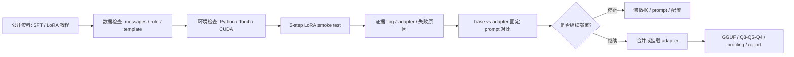
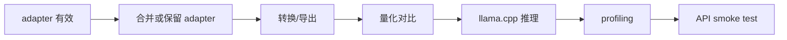

# Qwen LoRA 微调实验

## 建议学时

4 学时。

| 课时 | 内容 | 产出 |
| --- | --- | --- |
| 1 | 环境、数据、tokenizer 和 chat template 检查 | 数据检查记录 |
| 2 | 运行 LoRA/QLoRA smoke test | 训练日志 |
| 3 | 对比微调前后输出 | 评估表 |
| 4 | 判断是否进入合并、量化和部署验证 | 微调决策结论 |

本实验对应理论章节：

- [模型微调与 LoRA/QLoRA](/docs/finetuning-lora)
- [量化精度修复](/docs/accuracy-repair)
- [Qwen GGUF 量化对比实验](/docs/lab-qwen-quantization)
- [最终项目与验收标准](/docs/final-project)

## 学习目标

完成本实验后，学习者应能：

- 准备一个公开安全的小型 instruction 数据集。
- 检查 `messages` 格式、system prompt 和输出格式。
- 使用 LoRA/QLoRA 方式完成一次极小规模 Qwen 微调 smoke test。
- 保存训练日志、adapter 路径和失败记录。
- 用固定 prompt 比较微调前后输出。
- 判断微调结果是否值得继续做量化和端侧部署验证。

## 本章定位

| 项目 | 内容 |
| --- | --- |
| 本章解决的问题 | 微调是否真的改善目标任务，并且是否值得进入后续量化和端侧部署链路。 |
| 你需要先知道 | 数据格式、chat template、LoRA/QLoRA 基础和“不一定先微调”的判断。 |
| 你会产出 | 数据检查记录、训练日志、adapter 路径、base vs adapter 输出对比。 |
| 最终报告位置 | 第 8 节最终部署建议；训练日志和 adapter 路径放第 9 节附录。 |

## 实验边界

本实验是教学 smoke test，不是生产训练方案。

不要承诺模型能力提升。

不要把 adapter、checkpoint、模型权重、训练缓存提交到 Git。

实验目标是让读者按步骤跑通：

1. 数据格式。
2. 训练配置。
3. 训练命令。
4. 日志记录。
5. 输出对比。
6. 部署判断。

## 推荐硬件

| 环境 | 推荐用途 |
| --- | --- |
| Ubuntu Server + NVIDIA GPU | 推荐训练环境 |
| 本地 Mac/CPU | 只适合读代码、检查数据、极小模型实验 |
| Jetson | 不推荐作为第一训练环境，可用于训练后部署验证 |
| 云 GPU | 适合没有本地 GPU 的学员 |

Jetson 更适合做部署验证，而不是作为本课程第一训练设备。

原因是训练显存、温度、功耗和包兼容问题会显著增加学习成本。

实跑记录：

- [Qwen LoRA smoke run](https://github.com/neardws/edge-ai-deployment-course-runs/tree/main/runs/2026-06-29-qwen-lora-smoke)

## 公开资料怎么转成本章内容

Hugging Face、TRL/PEFT、Qwen/LLaMA-Factory 和中文后训练资料通常会给出完整训练命令、数据格式和配置字段。本实验只吸收它们能服务教学闭环的部分：数据可检查、训练可复现、adapter 可定位、输出可对比，最后能判断是否进入 GGUF 量化和端侧部署。



| 外部资料中的经典内容 | 本实验吸收什么 | 课程里的落点 |
| --- | --- | --- |
| Transformers chat templates | `messages`、role、generation prompt 一致性 | Step 4-5 的数据和模板检查 |
| TRL SFTTrainer | SFT 训练入口、日志和训练参数 | Step 6-7 的短步数 smoke test 和日志表 |
| PEFT | LoRA adapter、target modules、保存与加载 | adapter 路径、base vs adapter 输出对比 |
| Qwen / LLaMA-Factory | Qwen 微调配置、模型选择和训练流程 | 使用 Qwen 小模型，不把实验扩成多框架训练 |
| 中文后训练与部署资料 | LoRA、KV Cache、服务化和部署参数边界 | 判断合并/挂载 adapter 后是否进入量化和本地 API |
| 课程实跑记录 | 真实错误、日志和可复查路径 | 明确失败也算结果，不删除失败日志 |

把这些教程转成实验证据时，不要只抄训练命令。最低要补齐下面的记录：

| 外部教程常见步骤 | 本实验要记录什么 | 失败时怎么写 |
| --- | --- | --- |
| 准备 SFT 数据 | JSONL 路径、样本数、role 字段、是否通过 template 检查 | `data_schema_error` 或 `template_mismatch` |
| 配置 LoRA/QLoRA | base model、target modules、rank、alpha、4-bit/NF4 是否启用 | `adapter_config_error` 或 `bitsandbytes_unavailable` |
| 启动训练 | 训练命令、依赖版本、GPU、步数、loss 片段 | `train_crash`，附 traceback 和日志路径 |
| 保存 adapter | adapter 目录、文件列表、是否在课程仓库外 | `adapter_missing` 或 `path_not_recorded` |
| 输出对比 | 同一 prompt 下 base vs adapter 的输出摘要 | `no_quality_gain`，停止部署路线 |
| 回到部署 | 是否合并、是否量化、是否重新 profiling | `not_deployed_yet`，写下一轮验证项 |

从 PEFT/TRL 教程里搬实验细节时，按下面字段落地到本实验日志：

| 字段 | 为什么要记 | 最小记录 |
| --- | --- | --- |
| base model revision | adapter 不能脱离基座模型解释 | 模型名、commit/revision、许可证 |
| tokenizer / chat template | 训练格式和部署 prompt 不一致会直接污染结论 | 打印 1 条 template 后样本 |
| trainable parameters | LoRA 是否真的只训练小部分参数 | `print_trainable_parameters` 输出或等价日志 |
| target modules | 不同模块选择会改变效果和合并风险 | `q_proj/v_proj/...` 列表 |
| quantized loading | QLoRA 的 4-bit/NF4 是训练加载策略 | bitsandbytes 配置、显存记录 |
| adapter files | 后续复现和合并需要文件证据 | `adapter_config.json`、adapter 权重文件列表 |
| merge result | 部署前要确认合并没有破坏输出 | merge 日志、base/adapter/merged 三列对比 |

### 外部课程原图参考

下面两张图来自 Hugging Face Course documentation-images 数据集。它们适合直接贴入本实验：第一张提醒微调只是从预训练模型出发做任务适配，第二张提醒长文本或多轮样本进入训练前要先被切块、模板化和检查。


| 原图重点 | 本实验吸收什么 | 转成哪个检查项 |
| --- | --- | --- |
| fine-tuning | 微调从 base model 出发，产物要和原模型关系明确 | 记录 base model、adapter 路径、训练日志 |
| chunking texts | 数据进入训练前要处理长度、边界和样本格式 | 检查 JSONL、`messages`、chat template、样本长度 |
| 任务适配 | 微调后必须用固定 prompt 验证是否真的改善目标任务 | base vs adapter 输出对比和继续/停止判断 |

本实验的核心不是“训练出更强模型”，而是把微调路线纳入同一份部署证据链。

## 目录结构

建议训练相关文件放在课程仓库外部：

```bash
mkdir -p ~/edge-ai-lab/finetune/{data,outputs,logs,configs}
```

课程仓库里只保留教学脚本和模板：

```bash
labs/finetuning/
  sample_sft_data.jsonl
  train_lora_smoke.py
  lora_config.example.yaml
  finetuning-results-template.md
```

## Step 0：确认执行位置

以下命令默认从课程仓库根目录执行。

```bash
pwd
test -f labs/finetuning/train_lora_smoke.py
test -f labs/finetuning/sample_sft_data.jsonl
```

如果 `test` 命令没有输出，表示文件存在。

如果不在课程仓库根目录，先进入仓库再继续。

如果课程仓库在 Mac，本地复制到服务器时建议避免带入 AppleDouble 元数据文件：

```bash
COPYFILE_DISABLE=1 tar -C <course-repo> -czf - labs/finetuning \
  | ssh <server> 'mkdir -p ~/edge-ai-lab/course && tar -C ~/edge-ai-lab/course -xzf -'
```

## Step 1：准备 Python 环境

以下命令是教学示例。具体版本以课堂环境和目标 GPU 为准。

```bash
mkdir -p ~/edge-ai-lab/finetune/{data,outputs,logs,configs}
python3 -m venv ~/edge-ai-lab/finetune/.venv
source ~/edge-ai-lab/finetune/.venv/bin/activate
python -m pip install --upgrade pip
```

安装训练依赖：

```bash
pip install "torch" "transformers" "datasets" "accelerate" "peft" "trl" "bitsandbytes"
```

如果 `bitsandbytes` 在本机不可用，可以先使用非 QLoRA 的 LoRA smoke test，或换云 GPU/Ubuntu CUDA 环境。

如果服务器已经有 CUDA 可用的 Python 环境，优先复用它，不要盲目新建环境后安装到不兼容的 PyTorch。实跑中出现过 `nvidia-smi` 可见 GPU，但 PyTorch 是 CUDA 13.0 构建、服务器驱动只支持 CUDA 12.8，导致 `torch.cuda.is_available()` 为 `False`。

## Step 2：检查环境

```bash
python - <<'PY'
import platform
import torch

print("python:", platform.python_version())
print("torch:", torch.__version__)
print("torch cuda:", torch.version.cuda)
print("cuda available:", torch.cuda.is_available())
if torch.cuda.is_available():
    print("gpu:", torch.cuda.get_device_name(0))
PY
```

如果 `cuda available` 是 `False`，仍可尝试极小模型或 CPU 路径，但应在实验记录中写清楚限制。

也可以记录 GPU 当前状态：

```bash
nvidia-smi
```

如果没有 NVIDIA GPU 或命令不存在，把失败原因写进日志，不要伪造 GPU 结果。

## Step 3：复制样例数据

```bash
cp labs/finetuning/sample_sft_data.jsonl ~/edge-ai-lab/finetune/data/sample_sft_data.jsonl
cp labs/finetuning/lora_config.example.yaml ~/edge-ai-lab/finetune/configs/lora_config.example.yaml
```

检查前几行：

```bash
head -n 3 ~/edge-ai-lab/finetune/data/sample_sft_data.jsonl
```

每行应是一个 JSON 对象，并包含 `messages`。

## Step 4：检查数据格式

可以先用 Python 验证 JSONL 是否可解析：

```bash
python - <<'PY'
import json
from pathlib import Path

path = Path.home() / "edge-ai-lab/finetune/data/sample_sft_data.jsonl"
for i, line in enumerate(path.read_text(encoding="utf-8").splitlines(), 1):
    row = json.loads(line)
    assert "messages" in row, f"line {i} missing messages"
    roles = [m["role"] for m in row["messages"]]
    assert roles[-1] == "assistant", f"line {i} last role should be assistant"
print("ok")
PY
```

数据检查表：

| 检查项 | 结果 | 备注 |
| --- | --- | --- |
| JSONL 可解析 | 待填 | 待填 |
| 每行有 messages | 待填 | 待填 |
| role 顺序正确 | 待填 | 待填 |
| assistant 输出格式稳定 | 待填 | 待填 |
| 无隐私和敏感信息 | 待填 | 待填 |
| 训练/评估可切分 | 待填 | 待填 |

## Step 5：检查 chat template

训练前先打印一条样本经过 tokenizer 后的文本。

```bash
python labs/finetuning/train_lora_smoke.py \
  --model Qwen/Qwen2.5-0.5B-Instruct \
  --data ~/edge-ai-lab/finetune/data/sample_sft_data.jsonl \
  --output ~/edge-ai-lab/finetune/outputs/template-check \
  --print-sample
```

检查点：

| 检查项 | 结果 |
| --- | --- |
| system 指令出现在模板中 | 待填 |
| user/assistant 边界清楚 | 待填 |
| assistant 答案没有被截断 | 待填 |
| 与后续推理 prompt 格式一致 | 待填 |

如果这里就不符合预期，先修数据或 tokenizer 配置，不要进入训练。

## Step 6：运行训练 smoke test

先不要直接跑长训练。

使用极小步数验证流程：

```bash
python labs/finetuning/train_lora_smoke.py \
  --model Qwen/Qwen2.5-0.5B-Instruct \
  --data ~/edge-ai-lab/finetune/data/sample_sft_data.jsonl \
  --output ~/edge-ai-lab/finetune/outputs/qwen-lora-smoke \
  --max-steps 5 \
  --max-seq-length 512 \
  2>&1 | tee ~/edge-ai-lab/finetune/logs/qwen-lora-smoke.log
```

如果机器显存不足，可以先降低：

- `--max-seq-length`
- batch size
- 模型尺寸

如果依赖无法安装，记录失败原因，不要跳过日志。

训练后检查 adapter 是否保存：

```bash
test -d ~/edge-ai-lab/finetune/outputs/qwen-lora-smoke/adapter
find ~/edge-ai-lab/finetune/outputs/qwen-lora-smoke/adapter -maxdepth 1 -type f
tail -n 20 ~/edge-ai-lab/finetune/logs/qwen-lora-smoke.log
```

## Step 7：记录训练日志

训练日志至少记录：

| 字段 | 值 |
| --- | --- |
| base model | 待填 |
| torch / CUDA build | 待填 |
| driver CUDA | 待填 |
| dataset path | 待填 |
| sample count | 待填 |
| max steps | 待填 |
| max seq length | 待填 |
| LoRA rank | 待填 |
| learning rate | 待填 |
| peak VRAM/RAM | 待填 |
| adapter path | 待填 |
| log path | 待填 |

不要只写“训练成功”。

要保留能复查的命令和日志路径。

## Step 8：固定 prompt 对比

选择 3-5 个固定 prompt。

至少包含：

- 训练集中相似任务。
- 训练集中没有出现但同类型任务。
- JSON 输出任务。
- 量化/部署领域解释任务。

记录表：

| Prompt ID | Prompt | 基座输出 | 微调后输出 | 是否更符合任务 | 问题 |
| --- | --- | --- | --- | --- | --- |
| P1 | 待填 | 待填 | 待填 | 待填 | 待填 |
| P2 | 待填 | 待填 | 待填 | 待填 | 待填 |
| P3 | 待填 | 待填 | 待填 | 待填 | 待填 |

可以用下面脚本做基座和 adapter 的最小推理对比。

先测试基座：

```bash
python - <<'PY'
import torch
from transformers import AutoModelForCausalLM, AutoTokenizer

model_name = "Qwen/Qwen2.5-0.5B-Instruct"
prompt = "请输出 JSON，总结 Q4 量化的两个风险。"
messages = [
    {"role": "system", "content": "你是端侧模型部署课程助教。回答要简洁、可操作。"},
    {"role": "user", "content": prompt},
]

tokenizer = AutoTokenizer.from_pretrained(model_name, trust_remote_code=True)
inputs = tokenizer.apply_chat_template(
    messages,
    tokenize=True,
    add_generation_prompt=True,
    return_tensors="pt",
)
model = AutoModelForCausalLM.from_pretrained(
    model_name,
    trust_remote_code=True,
    device_map="auto",
)
outputs = model.generate(
    inputs.to(model.device),
    max_new_tokens=128,
    do_sample=False,
)
print(tokenizer.decode(outputs[0][inputs.shape[-1]:], skip_special_tokens=True))
PY
```

再测试 adapter：

```bash
python - <<'PY'
import torch
from pathlib import Path
from peft import PeftModel
from transformers import AutoModelForCausalLM, AutoTokenizer

model_name = "Qwen/Qwen2.5-0.5B-Instruct"
adapter_path = Path("~/edge-ai-lab/finetune/outputs/qwen-lora-smoke/adapter").expanduser()
prompt = "请输出 JSON，总结 Q4 量化的两个风险。"
messages = [
    {"role": "system", "content": "你是端侧模型部署课程助教。回答要简洁、可操作。"},
    {"role": "user", "content": prompt},
]

tokenizer = AutoTokenizer.from_pretrained(model_name, trust_remote_code=True)
inputs = tokenizer.apply_chat_template(
    messages,
    tokenize=True,
    add_generation_prompt=True,
    return_tensors="pt",
)
base = AutoModelForCausalLM.from_pretrained(
    model_name,
    trust_remote_code=True,
    device_map="auto",
)
model = PeftModel.from_pretrained(base, str(adapter_path))
outputs = model.generate(
    inputs.to(model.device),
    max_new_tokens=128,
    do_sample=False,
)
print(tokenizer.decode(outputs[0][inputs.shape[-1]:], skip_special_tokens=True))
PY
```

这两个命令可能下载模型并占用较多内存。失败时记录错误，不要把失败删除。

## Step 9：判断是否继续

完成 smoke test 后，不要直接进入大规模训练。

先判断：

| 问题 | 如果答案是“否” |
| --- | --- |
| 数据格式是否稳定？ | 先修数据 |
| 微调后目标格式是否改善？ | 先调数据和 prompt |
| 基座能力是否足够？ | 考虑换模型 |
| 显存和训练时间是否可接受？ | 调小模型或用 QLoRA |
| 是否会影响端侧部署？ | 继续量化和 profiling |

只有当微调确实改善目标任务，才进入下一步：



## 失败排查

### 无法下载模型

- 检查网络和 Hugging Face 访问。
- 检查模型名称是否正确。
- 如果模型需要授权，按模型页面要求处理。
- 第一次下载模型时，训练命令可能长时间没有输出；另开终端看 Hugging Face cache 或网络状态，不要直接中断。

### CUDA 或 bitsandbytes 不可用

- 检查 `nvidia-smi`。
- 检查 PyTorch CUDA 版本。
- 检查 `torch.version.cuda` 是否高于驱动支持的 CUDA 版本。
- 先运行非 QLoRA LoRA smoke test。
- 换 Ubuntu CUDA 环境或云 GPU。

### TRL API 不兼容

如果报错：

```text
TypeError: SFTTrainer.__init__() got an unexpected keyword argument 'dataset_text_field'
```

说明脚本使用了旧版 TRL 参数。当前课程脚本已把 `dataset_text_field` 和 `max_length` 放入 `SFTConfig`，并把 tokenizer 作为 `processing_class` 传给 `SFTTrainer`。

### OOM

- 降低 `max_seq_length`。
- 降低 batch size。
- 使用 gradient accumulation。
- 换更小模型。
- 尝试 QLoRA。

### loss 很快降低但输出没有改善

- 训练集太小或重复。
- prompt 与部署 prompt 不一致。
- 输出格式样例不稳定。
- 评估 prompt 太少。

5-step LoRA 的最低目标是验证 pipeline，不是证明任务质量提升。如果 base vs adapter 对比更差，应停止在“需要改数据和评估”这个结论，不要继续合并、量化和部署。

### 微调后 JSON 更差

- 训练样本里 JSON 不合法。
- assistant 输出有多余解释。
- system prompt 不一致。
- 评估时采样温度过高。

## 验收结果

本章最低通过标准：

```text
[ ] 数据能通过 JSONL 和 role 检查
[ ] chat template 至少打印并人工检查 1 条
[ ] smoke test 有训练日志或清晰失败原因
[ ] adapter/checkpoint 保存在课程仓库外
[ ] 能判断继续合并/量化，还是停止微调路线
```

| 产物 | 验收标准 |
| --- | --- |
| 环境检查 | Python、Torch、CUDA 或限制说明已记录 |
| 数据检查表 | 已完成并说明问题 |
| chat template 检查 | 至少打印 1 条样本并确认格式 |
| 训练日志 | 有命令、step、loss 或失败原因 |
| adapter/checkpoint | 保存到仓库外路径 |
| 对比输出 | 至少 3 个 prompt |
| 继续/停止判断 | 能说明是否值得后续量化部署 |

## 作业

1. 把样例数据扩展到 20 条，保持同一输出格式。
2. 打印 1 条样本的 chat template 文本，说明角色边界是否正确。
3. 跑一次 5-step smoke test，保存日志。
4. 用 3 个 prompt 比较基座和微调后输出。
5. 写一段结论：微调是否值得进入量化部署阶段。

## 参考资料

本章吸收方式：

- **知识点**：从 PEFT、TRL、Qwen/LLaMA-Factory 和 chat template 文档吸收 SFT 数据、adapter、训练日志和部署 prompt 一致性。
- **图解**：贴入 Hugging Face fine-tuning / chunking 原图，并把外部微调流程重画为 smoke test 检查表和部署回归链路。
- **实验**：只要求短步数跑通、保存 adapter、对比输出并回到课程报告，不追求训练效果指标。
- **取舍**：不新增长训练任务；微调是否继续由质量证据决定。

- [模型微调与 LoRA/QLoRA](/docs/finetuning-lora)
- [Hugging Face LLM Course](https://huggingface.co/learn/llm-course/chapter1/1)
- [Hugging Face Course documentation-images](https://huggingface.co/datasets/huggingface-course/documentation-images)
- [Hugging Face Transformers documentation](https://huggingface.co/docs/transformers/index)
- [Hugging Face Transformers Chat templates](https://huggingface.co/docs/transformers/chat_templating)
- [Hugging Face PEFT documentation](https://huggingface.co/docs/peft/index)
- [TRL SFTTrainer documentation](https://huggingface.co/docs/trl/sft_trainer)
- [Qwen LLaMA-Factory fine-tuning guide](https://qwen.readthedocs.io/en/v3.0/training/llama_factory.html)
- [LLaMA-Factory](https://github.com/hiyouga/LLaMA-Factory)
- [LLM 后训练实践：模型压缩、部署优化与能力扩展](https://posttrain.gaozhijun.me/docs/lecture-5/)
- [大模型微调与部署指南](https://wuduoyi.com/llm-finetune/deploy.html)
