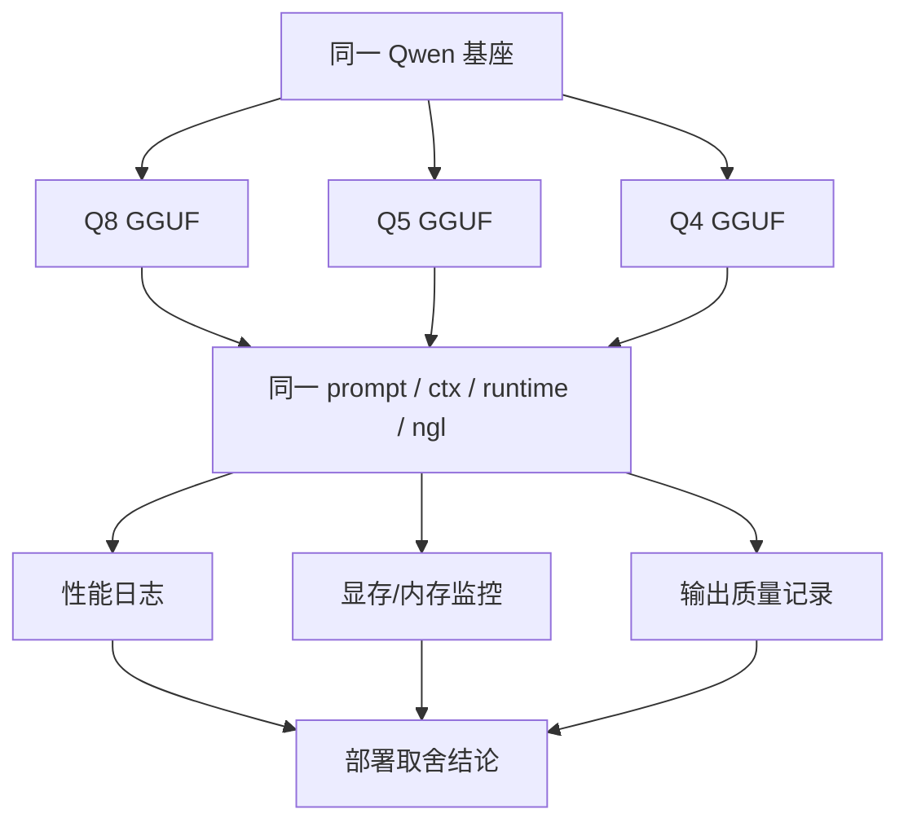
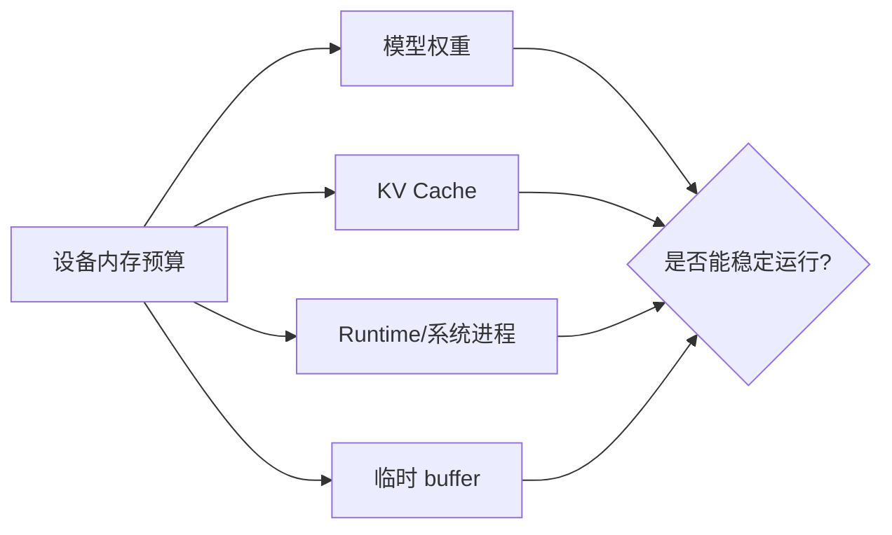

# Qwen GGUF 量化对比实验

## 建议学时

2 学时。

建议安排：

| 课时 | 内容 | 产出 |
| --- | --- | --- |
| 1 | 准备 Q8/Q5/Q4 GGUF，统一实验变量 | 模型清单和实验矩阵 |
| 2 | 运行对比、填写速度/显存/质量记录 | 量化选择结论 |

本实验对应理论章节：

- [LLM 量化与 KV Cache](/docs/llm-quantization)
- [推理加速基础](/docs/inference-acceleration)
- [Profiling 与结果记录](/docs/lab-profiling)

## 学习目标

完成本实验后，学习者应能：

- 用同一套条件比较 Qwen GGUF 的不同量化格式。
- 观察文件大小、VRAM/RAM、首 token、tokens/s 和输出质量之间的取舍。
- 解释为什么 Q4 文件更小但不一定在所有设备上都更快。
- 在 Ubuntu Server 与 Jetson 上分别记录量化对比结果。
- 建立“不预设 benchmark 数字，只记录真实设备数据”的实验习惯。

## 本章定位

| 项目 | 内容 |
| --- | --- |
| 本章解决的问题 | 同一个 Qwen 模型在 Q8、Q5、Q4 下，速度、内存和输出质量如何变化。 |
| 你需要先知道 | 已完成 Qwen baseline，知道 llama.cpp 的基本命令，知道 TTFT 和 tokens/s。 |
| 你会产出 | `logs/qwen-*.log`、`results/quant_compare.csv` 或等价表格、部署选择结论。 |
| 最终报告位置 | 第 4 节量化版本对比。 |

## 问题背景

Q8、Q5、Q4 等 GGUF 变体通常会带来不同的文件大小和运行特征。

但具体收益取决于：

- 模型基座是否一致。
- runtime 是否支持对应量化格式。
- GPU offload 是否生效。
- `ctx-size` 和 KV Cache 占用。
- 目标设备是独立 GPU 还是 Jetson 统一内存。
- 输出质量是否仍满足任务。

所以本实验不预置性能数字。

每位学员必须在自己的设备上记录结果。

## 实验边界

本实验只比较 GGUF 文件的运行表现。

不要求学员自己从原始权重重新量化。

如果课程提供了 Q8/Q5/Q4 文件，直接使用这些文件。

如果只拿到两个量化文件，可以先作为阶段性草稿比较两个，但最终报告仍需要三组量化版本或模型变体。runtime 参数对比不能替代量化对比。无法补齐第三组时，必须说明缺失项、原因和对结论可信度的影响。

不要把 `.gguf` 文件放进课程仓库。

## 图示讲解



KV Cache 和权重共同占用资源：



## 前置条件

已经完成：

- [Ubuntu Server 与 NVIDIA GPU 环境](/docs/lab-ubuntu-nvidia)
- [Qwen 基线推理](/docs/lab-qwen-baseline)

需要准备：

| 项目 | 要求 |
| --- | --- |
| llama.cpp | 已构建，`llama-cli` 可运行 |
| 模型文件 | 至少两个 Qwen GGUF 量化变体 |
| 日志目录 | `~/edge-ai-lab/logs` |
| 结果目录 | `~/edge-ai-lab/results` |
| GPU 监控 | Ubuntu 用 `nvidia-smi`，Jetson 用 `tegrastats` |

## Step 1：列出模型文件

```bash
ls -lh ~/edge-ai-lab/models/qwen/*.gguf
```

把实际模型填入：

| 文件名 | 量化格式 | 文件大小 | 来源 | 备注 |
| --- | --- | --- | --- | --- |
| 待填 | Q8 | 待填 | 待填 | 待填 |
| 待填 | Q5 | 待填 | 待填 | 待填 |
| 待填 | Q4 | 待填 | 待填 | 待填 |

如果文件名中没有清晰量化信息，需要查模型来源页面或教师说明。

不要靠猜测填写。

## Step 2：固定实验变量

量化对比必须尽量只改变模型量化格式。

| 变量 | 建议固定值 | 说明 |
| --- | --- | --- |
| prompt | `用三句话解释端侧模型量化的价值。` | 与 baseline 一致 |
| `-n` | `128` | 固定生成长度 |
| `--ctx-size` | `2048` | 固定上下文 |
| `-ngl` | `99` | 尽量 GPU offload |
| 采样参数 | 默认或统一设置 | 不要每次不同 |
| 运行目录 | `~/edge-ai-lab/src/llama.cpp` | 避免路径错误 |

如果设备内存不足，可以改成 `--ctx-size 1024`。

但所有量化文件都要用同一个 `ctx-size`。

## Step 3：运行 Q8/Q5/Q4 对比

按实际文件名修改数组。

```bash
cd ~/edge-ai-lab/src/llama.cpp

for model in \
  qwen2.5-1.5b-instruct-q8_0.gguf \
  qwen2.5-1.5b-instruct-q5_k_m.gguf \
  qwen2.5-1.5b-instruct-q4_k_m.gguf
do
  ./build/bin/llama-cli \
    -m ~/edge-ai-lab/models/qwen/${model} \
    -p "用三句话解释端侧模型量化的价值。" \
    -n 128 \
    -ngl 99 \
    --ctx-size 2048 \
    2>&1 | tee ~/edge-ai-lab/logs/${model}.log
done
```

如果只有两个模型：

```bash
for model in \
  qwen2.5-1.5b-instruct-q8_0.gguf \
  qwen2.5-1.5b-instruct-q4_k_m.gguf
do
  ./build/bin/llama-cli \
    -m ~/edge-ai-lab/models/qwen/${model} \
    -p "用三句话解释端侧模型量化的价值。" \
    -n 128 \
    -ngl 99 \
    --ctx-size 2048 \
    2>&1 | tee ~/edge-ai-lab/logs/${model}.log
done
```

## Step 4：同步记录 GPU 或 Jetson 状态

Ubuntu Server：

```bash
watch -n 0.5 nvidia-smi
```

可在每次运行前后保存：

```bash
nvidia-smi > ~/edge-ai-lab/results/nvidia-smi-quantization.txt
```

Jetson：

```bash
tegrastats --interval 1000 | tee ~/edge-ai-lab/logs/jetson-quantization-tegrastats.txt
```

记录重点：

| 平台 | 重点 |
| --- | --- |
| Ubuntu Server | 峰值显存、是否看到进程、GPU 使用变化 |
| Jetson | RAM、GPU/GR3D、温度、功耗模式、是否降频 |

## Step 5：整理性能字段

从每个日志中提取：

- 模型加载是否成功。
- prompt eval 或 prefill 时间。
- eval 或 decode 速度。
- tokens/s。
- warning、fallback、OOM、unsupported 等异常。
- 输出文本。

可以使用课程提供的轻量脚本辅助提取常见 timing 字段：

```bash
python3 labs/scripts/parse_llama_log.py ~/edge-ai-lab/logs/qwen2.5-1.5b-instruct-q4_k_m.gguf.log \
  --append ~/edge-ai-lab/results/quant_compare.csv
```

脚本只提取日志中已经存在的字段。没有出现的字段应留空或写“未记录”。

如果字段名称随 llama.cpp 版本不同，以实际日志为准。

不要把没有出现的字段硬填。

## Step 6：质量对比

用同一 prompt 比较输出。

建议从以下维度记录：

| 维度 | 记录方式 |
| --- | --- |
| 是否回答问题 | 是/否/部分 |
| 是否满足“三句话” | 是/否/大致 |
| 是否概念正确 | 简短说明 |
| 是否重复 | 无/轻微/严重 |
| 是否有格式问题 | 简短说明 |
| 中文是否自然 | 简短说明 |

不要只看速度。

低比特模型如果输出质量明显下降，就需要在结论中说明。

## 结果记录表

| 硬件 | 模型文件 | 量化 | 文件大小 | `ctx-size` | `-ngl` | 首 token / prefill | tokens/s | 峰值内存/显存 | 温度/功耗 | 质量备注 | 日志 |
| --- | --- | --- | --- | --- | --- | --- | --- | --- | --- | --- | --- |
| Ubuntu Server | 待填 | Q8 | 待填 | 待填 | 待填 | 待填 | 待填 | 待填 | 待填 | 待填 | 待填 |
| Ubuntu Server | 待填 | Q5 | 待填 | 待填 | 待填 | 待填 | 待填 | 待填 | 待填 | 待填 | 待填 |
| Ubuntu Server | 待填 | Q4 | 待填 | 待填 | 待填 | 待填 | 待填 | 待填 | 待填 | 待填 | 待填 |
| Jetson | 待填 | Q4 | 待填 | 待填 | 待填 | 待填 | 待填 | 待填 | 待填 | 待填 | 待填 |

## Step 7：写部署选择结论

结论不需要很长，但必须回答：

1. 当前设备上哪个量化格式最适合？
2. 它的优势是什么？
3. 它的风险是什么？
4. 是否有质量下降？
5. 如果换成 Jetson，结论是否可能变化？

示例结构：

```text
在本设备上，暂时推荐使用 ______。
原因是 ______。
不推荐 ______，因为 ______。
如果部署到 Jetson，需要重新验证 ______。
```

## 验收结果

本章最低通过标准：

```text
[ ] 至少三个 GGUF 量化变体或模型变体完成运行；两组结果只算阶段性草稿
[ ] 每个模型有独立原始日志
[ ] 结果填入量化对比表
[ ] 能解释一个速度、内存或质量差异
[ ] 能写出推荐和不推荐的量化格式
```

| 产物 | 验收标准 |
| --- | --- |
| 模型清单 | 最终报告至少三组 GGUF 量化变体或模型变体，阶段草稿可先记录两组并说明缺失 |
| 原始日志 | 每个模型有独立日志 |
| 资源记录 | Ubuntu 有 `nvidia-smi`，Jetson 有 `tegrastats` |
| 结果表 | 文件大小、速度、内存、质量备注尽量完整 |
| 结论 | 能说明推荐格式和不推荐原因 |

## 失败排查

### 某个 GGUF 无法加载

检查：

- 文件是否下载完整。
- 文件名是否写错。
- llama.cpp 版本是否过旧。
- 模型是否需要特殊 chat template。

### Q4 输出明显变差

处理：

- 对比 Q5 或 Q8。
- 固定 prompt 重跑一次。
- 检查是否采样参数不同。
- 不要为了速度强行选择不可用输出。

### Q8 无法在 Jetson 上运行

可能原因：

- 模型权重和 KV Cache 超出统一内存预算。
- `ctx-size` 太大。
- 系统进程占用内存较多。

处理：

- 降低 `ctx-size`。
- 使用 Q5 或 Q4。
- 选择更小模型。

### 速度差异不明显

可能原因：

- 瓶颈不在权重读取。
- GPU offload 不充分。
- 低比特 kernel 没有带来计算收益。
- prompt 太短，测不出差异。

处理：

- 用 [推理加速实验](/docs/lab-inference-acceleration) 做 `-ngl` 和 `ctx-size` 对比。
- 用 `llama-bench` 补充标准化记录。

## 作业

提交量化对比记录，包含：

1. 模型清单。
2. 每个模型的原始日志路径。
3. 结果表。
4. 一段部署选择结论。
5. 如果有 Jetson 设备，补充 Jetson 上至少一个量化文件的运行记录。

三句话复盘：

```text
我比较了 ______ 个量化版本。
当前设备上 ______ 的速度、内存和质量最平衡。
因此后续 profiling 以 ______ 为主版本，______ 作为备选。
```

## 参考资料

- [Qwen llama.cpp 量化指南](https://qwen.readthedocs.io/en/v2.5/quantization/llama.cpp.html)
- [llama.cpp quantize documentation](https://www.mintlify.com/ggml-org/llama.cpp/tools/quantize)
- [llama.cpp quantize README](https://github.com/ggml-org/llama.cpp/blob/master/tools/quantize/README.md)
