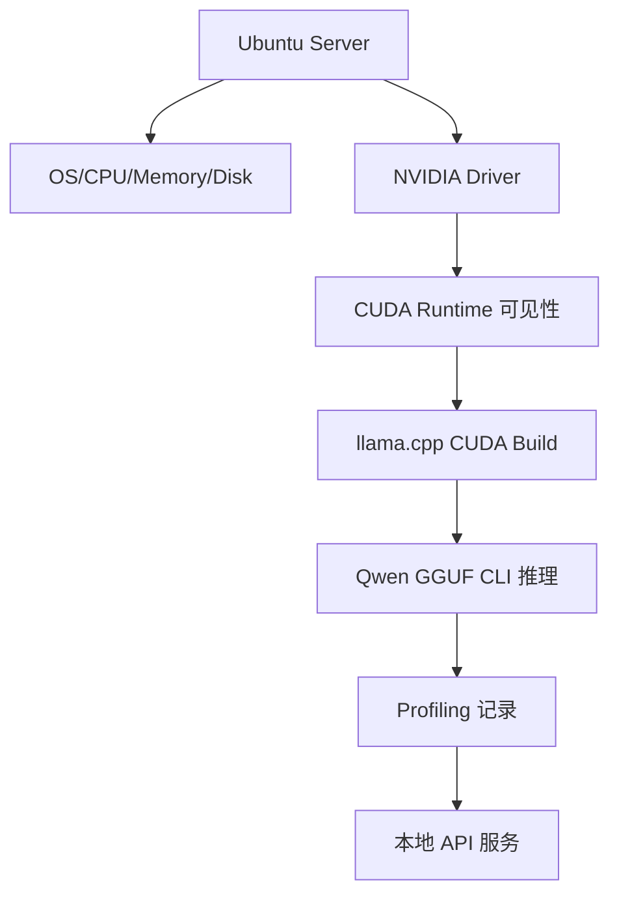
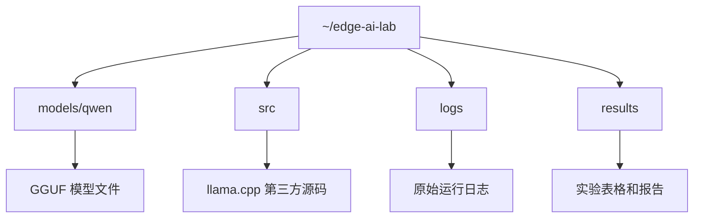
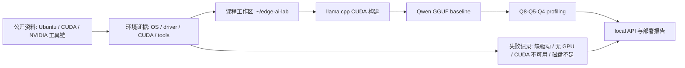

# Ubuntu Server 与 NVIDIA GPU 环境

## 建议学时

2 学时。

建议安排：

| 课时 | 内容 | 产出 |
| --- | --- | --- |
| 1 | 检查 Ubuntu Server、GPU、驱动、CUDA runtime、工具链 | 环境基线日志 |
| 2 | 建立实验目录、运行检查脚本、确认 Git 忽略边界 | 可复用实验工作区 |

本实验对应理论章节：

- [推理框架与部署链路](/docs/runtime-deployment)
- [推理加速基础](/docs/inference-acceleration)

## 学习目标

完成本实验后，学习者应能：

- 建立可复查的 Ubuntu Server 实验基线。
- 确认 NVIDIA 驱动、CUDA runtime、Python、CMake、Git 和磁盘空间。
- 区分课程仓库、模型权重、第三方源码、构建产物和实验日志。
- 解释为什么环境检查是端侧部署实验的第一步。
- 生成一份可放入实验报告的 `env-check.txt`。

## 本章定位

| 项目 | 内容 |
| --- | --- |
| 本章解决的问题 | 目标 Ubuntu/NVIDIA GPU 环境是否足够支撑后续 Qwen、量化、profiling 和 API 实验。 |
| 你需要先知道 | 基础 Linux 命令、路径、Git 边界和日志保存习惯。 |
| 你会产出 | `env-check.txt`、`nvidia-smi-before.txt`、实验目录和环境记录表。 |
| 最终报告位置 | 第 2 节实验环境。 |

## 问题背景

很多部署失败不是模型问题，而是环境问题。

常见情况包括：

- `nvidia-smi` 不可用，说明驱动或 GPU 可见性有问题。
- 驱动可见，但 llama.cpp 构建时没有启用 CUDA。
- CMake、编译器或 Git 缺失，导致 runtime 无法构建。
- 模型权重放进课程仓库，导致 Git 仓库膨胀。
- 磁盘空间不足，下载模型或构建时中断。
- 远程服务器没有记录版本，后续无法复现实验结果。

本实验先不追求跑模型，而是把机器状态记录清楚。

## 实验边界

本实验只做环境检查和目录准备。

不会把以下内容写入 Git：

- 模型权重。
- `llama.cpp` 第三方源码。
- `build/` 构建产物。
- 大型 profiling 日志。
- 本机敏感路径或密钥。

课程仓库只保存教材、脚本、模板和少量示例。

## 图示讲解



实验目录建议：



## 公开资料怎么转成本章内容

Ubuntu、CUDA、NVIDIA Container Toolkit 和 Nsight 的官方资料通常从安装和运维角度讲环境配置。本实验只吸收其中和课程主线有关的检查点：GPU 是否可见、驱动/CUDA 是否匹配、工具链是否能构建 llama.cpp、后续 profiling 是否有可复查日志。



| 外部资料中的经典内容 | 本实验吸收什么 | 课程里的落点 |
| --- | --- | --- |
| Ubuntu NVIDIA driver guide | 驱动安装前要确认硬件、系统和管理员权限 | 本章只记录状态，未授权时不要求学生改系统 |
| CUDA Installation Guide | driver、CUDA toolkit、runtime 的边界 | 用 `nvidia-smi` 和后续构建日志判断 CUDA 路线是否成立 |
| NVIDIA Container Toolkit | 容器访问 GPU 的前置条件 | 作为后续扩展，不把容器变成第一轮必做 |
| Nsight Systems | 系统级 profiling 需要稳定环境和可追踪日志 | 先用 `nvidia-smi` 建基线，高级 profiling 后置 |
| Qwen / llama.cpp 主线 | 环境检查最终要服务模型运行 | 本章字段直接进入 Qwen baseline、profiling 和最终报告 |

官方安装文档里的步骤很多，本实验只把它们压成后续可复查字段：

| 环境字段 | 最小证据 | 后续用途 |
| --- | --- | --- |
| GPU 可见 | `nvidia-smi` 输出 | 证明能进入 GPU offload 实验 |
| Driver / CUDA | `nvidia-smi`、`nvcc --version` 或“未安装 nvcc”说明 | 解释构建路径和失败边界 |
| 编译工具 | `cmake --version`、`git --version` | 证明能构建 llama.cpp |
| 工作目录 | `~/edge-ai-lab` 目录结构 | 保证日志、模型和结果可追踪 |
| 磁盘空间 | `df -h` | 避免模型下载或构建中断 |

### 官方资料到实验字段

这节实验可以先把官方资料中的关键图表和说明“贴进脑子里”，但提交时只要留下能复查的字段。这样后面做 Qwen baseline、量化和 profiling 时，环境问题不会被误判成模型问题。

| 官方资料 | 本实验可吸收的内容 | 需要写进日志的字段 | 后续章节怎么用 |
| --- | --- | --- | --- |
| Ubuntu NVIDIA driver guide | GPU 被系统识别后才能进入 CUDA 路线 | GPU 型号、Driver Version、`nvidia-smi` 状态 | 判断能否做 GPU offload |
| CUDA Installation Guide | driver、runtime、toolkit 不是一回事 | `nvidia-smi` CUDA Version、`nvcc --version` 或未安装说明 | 解释构建失败和运行失败的差别 |
| NVIDIA Container Toolkit | 容器 GPU 可见性依赖宿主机驱动 | 是否使用容器、是否能看到 GPU | 作为服务化扩展，不作为本章必做 |
| Nsight Systems | profiling 依赖稳定环境和明确时间段 | 先保留环境快照和运行日志 | 后续再进入 profiling 实验 |
| Qwen / llama.cpp | 环境检查最终要能支撑小模型运行 | llama.cpp commit、模型路径、构建日志位置 | 进入 baseline 和 Q8/Q5/Q4 对比 |

如果学生直接从官方安装教程复制内容，本章只保留下面这些会进入报告的证据，不保留完整安装流水账：

| 可贴入的官方内容 | 本章保留 | 报告里怎么写 |
| --- | --- | --- |
| 驱动安装结果 | `nvidia-smi` 截取或文本日志 | GPU、Driver、CUDA Version |
| CUDA toolkit 检查 | `nvcc --version` 或未安装说明 | 构建能力和失败边界 |
| CMake / Git / compiler 检查 | 版本输出 | llama.cpp 构建前置条件 |
| 磁盘和内存检查 | `df -h`、`free -h` | 模型下载和构建风险 |
| 失败日志 | 命令、stderr、返回码 | 排障索引和报告第 7 节 |

### 外部原图到环境证据链

环境检查本身通常没有漂亮的课程图，但后续所有模型卡、benchmark 和错误日志都依赖它。下面三张图用于提醒学生：本章保存的环境字段会进入模型来源、性能记录和失败复盘。


| 原图重点 | 本实验吸收什么 | 环境页怎么落地 |
| --- | --- | --- |
| model card | 模型来源、许可证和文件证据要可追踪 | 记录模型来源、文件路径、hash 和许可证 |
| benchmarking lab | benchmark 不能脱离硬件、runtime 和参数 | 记录 OS、driver、CUDA、CMake、Git、磁盘和日志路径 |
| traceback | 失败日志必须能定位环境、依赖或模型问题 | 保存 `env-check.txt`、`nvidia-smi-before.txt` 和失败原因 |

所以，本章的产物不是“安装成功截图”，而是一组能解释后续实验成败的环境证据。

## 前置条件

开始前确认：

| 项目 | 要求 | 说明 |
| --- | --- | --- |
| 操作系统 | Ubuntu Server | 建议 22.04 或 24.04，同学按实际环境记录 |
| GPU | NVIDIA GPU | 需要能被系统识别 |
| 权限 | 普通用户可创建实验目录 | 安装驱动或系统包可能需要管理员权限 |
| 网络 | 能访问模型来源和 GitHub | 离线环境需提前准备源码和模型 |
| 磁盘 | 有足够空间 | 具体空间随模型大小变化，记录实际可用空间 |

如果课堂设备已经由教师预配置，不需要学员自行安装驱动。

如果设备未配置驱动，应先按系统管理员要求完成安装，再继续实验。

## 核心概念

| 项目 | 需要确认 | 失败表现 |
| --- | --- | --- |
| OS | 发行版、内核、架构 | 驱动和 CUDA 包不匹配 |
| CPU | 核心数、架构 | CPU fallback 时性能异常 |
| 内存 | 总内存和可用内存 | 模型加载失败或被系统杀死 |
| 磁盘 | 可用空间 | 下载、解压、构建中断 |
| 驱动 | `nvidia-smi` 正常显示 GPU | CUDA 不可见、GPU offload 失败 |
| CUDA runtime | runtime 能被程序调用 | llama.cpp 只能 CPU 跑 |
| Python | smoke test 和辅助脚本可运行 | API 测试脚本无法执行 |
| CMake/Git | 构建和获取源码 | runtime 无法构建 |

## Step 1：建立实验目录

模型、源码和日志放在用户目录下的实验工作区。

```bash
mkdir -p ~/edge-ai-lab/{models/qwen,src,logs,results}
cd ~/edge-ai-lab
```

检查目录：

```bash
find ~/edge-ai-lab -maxdepth 2 -type d | sort
```

预期能看到：

```text
/home/用户名/edge-ai-lab
/home/用户名/edge-ai-lab/logs
/home/用户名/edge-ai-lab/models
/home/用户名/edge-ai-lab/models/qwen
/home/用户名/edge-ai-lab/results
/home/用户名/edge-ai-lab/src
```

## Step 2：记录系统信息

```bash
uname -a
lsb_release -a
lscpu
free -h
df -h
```

如果 `lsb_release` 不存在，可以用：

```bash
cat /etc/os-release
```

记录重点：

| 项目 | 记录位置 |
| --- | --- |
| Ubuntu 版本 | 实验报告“环境”部分 |
| 内核版本 | 驱动排查时使用 |
| CPU 型号和核心数 | CPU baseline 解释 |
| 总内存和可用内存 | 模型加载能力判断 |
| 磁盘可用空间 | 模型下载和构建能力判断 |

## Step 3：检查 NVIDIA GPU

```bash
nvidia-smi
```

需要记录：

| 字段 | 用途 |
| --- | --- |
| Driver Version | 判断驱动版本 |
| CUDA Version | 判断驱动支持的 CUDA 版本上限 |
| GPU 名称 | 对比实验硬件 |
| Memory-Usage | 记录推理前后的显存变化 |
| Processes | 确认 llama.cpp 是否使用 GPU |

保存一次基线：

```bash
nvidia-smi > ~/edge-ai-lab/results/nvidia-smi-before.txt
```

如果希望推理时连续观察：

```bash
watch -n 0.5 nvidia-smi
```

`watch` 命令用于观察，不需要保存到 Git。

## Step 4：检查工具链

```bash
python3 --version
cmake --version
git --version
gcc --version
g++ --version
```

如果某个命令不存在，记录缺失项。

课堂环境可以由教师统一安装。

自行安装时，先确认课程机器是否允许改系统包。

常见安装命令如下：

```bash
sudo apt update
sudo apt install -y build-essential cmake git python3 python3-venv curl
```

不要在不了解机器用途的情况下随意升级驱动或 CUDA。

## Step 5：运行课程环境检查脚本

从课程仓库根目录运行：

```bash
bash labs/scripts/env_check.sh | tee ~/edge-ai-lab/results/env-check.txt
```

如果脚本不可执行，直接用 `bash` 调用即可。

检查结果中至少应包含：

- OS 信息。
- CPU 信息。
- 内存信息。
- 磁盘信息。
- GPU 信息。
- Python、CMake、Git 版本。

## Step 6：确认 Git 边界

回到课程仓库：

```bash
git status --short
```

确认模型和第三方源码没有出现在 Git 变更中。

如果你把模型放在 `~/edge-ai-lab/models`，它不会进入课程仓库。

如果你误把模型放入课程仓库，应先移动到实验目录：

```bash
mkdir -p ~/edge-ai-lab/models/qwen
mv 路径/模型文件.gguf ~/edge-ai-lab/models/qwen/
```

不要把 `.gguf` 文件提交到 Git。

## 结果记录表

| 项目 | 结果 |
| --- | --- |
| 日期 | 待填 |
| 机器用途 | Ubuntu Server / 远程实验机 / 本地工作站 |
| Ubuntu 版本 | 待填 |
| 内核版本 | 待填 |
| CPU | 待填 |
| 内存 | 待填 |
| GPU | 待填 |
| NVIDIA Driver | 待填 |
| CUDA Version from `nvidia-smi` | 待填 |
| Python | 待填 |
| CMake | 待填 |
| Git | 待填 |
| 可用磁盘空间 | 待填 |
| 实验目录 | `~/edge-ai-lab` |

回填报告第 2 节时，本章负责硬件和工具链字段；模型字段在 [Qwen 基线推理](/docs/lab-qwen-baseline) 中补齐。

| 报告第 2 节字段 | 本章来源 |
| --- | --- |
| OS | Ubuntu 版本、内核版本 |
| CPU | CPU 型号和核心数 |
| RAM | 内存 |
| GPU / Jetson | GPU；未使用 Jetson 时写“不适用（未测）” |
| Driver / CUDA / JetPack | NVIDIA Driver、`nvidia-smi` CUDA、`nvcc` 是否存在 |
| Python | Python 版本 |
| 环境日志路径 | `~/edge-ai-lab/results/env-check.txt` |

## 验收结果

本章最低通过标准：

```text
[ ] `~/edge-ai-lab` 工作区已建立
[ ] 环境快照保存到 env 或 results 目录
[ ] GPU/驱动/CUDA 状态已记录，或限制已说明
[ ] 课程仓库没有混入模型权重和构建产物
[ ] 能说明后续实验要用哪台机器和哪些版本
```

| 产物 | 验收标准 |
| --- | --- |
| `~/edge-ai-lab` 目录 | 包含 `models/qwen`、`src`、`logs`、`results` |
| `env-check.txt` | 包含 OS、CPU、内存、磁盘、GPU、Python、CMake、Git 信息 |
| `nvidia-smi-before.txt` | 能看到 GPU 名称、驱动版本和显存 |
| Git 状态 | 没有模型文件、第三方源码和构建产物进入课程仓库 |
| 实验记录表 | 关键版本字段已填写 |

## 失败排查

### `nvidia-smi` 不存在

可能原因：

- 没有安装 NVIDIA 驱动。
- 机器没有 NVIDIA GPU。
- 容器环境没有透传 GPU。
- PATH 或驱动安装不完整。

处理：

- 先确认硬件和课程环境说明。
- 不要直接下载随机驱动安装包。
- 按 Ubuntu 或 NVIDIA 官方文档安装。

### `nvidia-smi` 显示 GPU，但后续程序无法用 CUDA

可能原因：

- llama.cpp 未启用 CUDA 构建。
- CUDA runtime 库路径不可见。
- 程序运行在容器内但没有 `--gpus all`。

处理：

- 在 [Qwen 基线推理](/docs/lab-qwen-baseline) 中检查构建日志。
- 运行时使用 `-ngl 99`。
- 用 `nvidia-smi` 观察进程。

### 磁盘不足

处理：

- 删除自己实验目录中不需要的临时模型或构建产物。
- 不要清理系统目录。
- 不要删除其他同学或系统服务的文件。

### 网络无法下载模型

处理：

- 记录网络失败原因。
- 使用教师提前准备的模型文件。
- 保持模型文件名、来源和校验信息可追踪。

## 作业

提交一份环境记录，包含：

1. `env-check.txt` 的关键摘要。
2. `nvidia-smi-before.txt`。
3. 实验目录结构。
4. 你认为后续 Qwen 推理最可能遇到的环境风险。

## 参考资料

本章吸收方式：

- **知识点**：从 Ubuntu、CUDA 和 Container Toolkit 文档提取驱动、CUDA、GPU 可见性和容器 GPU 访问的检查点。
- **图解**：贴入 model card、benchmark 和 traceback 原图，把安装链路重画为服务器基线环境栈。
- **实验**：所有检查都落到环境摘要、GPU 状态和后续 Qwen baseline 的可追溯字段。
- **取舍**：不做通用服务器运维课，只保留影响模型推理的依赖。

- [Ubuntu Server NVIDIA driver guide](https://ubuntu.com/server/docs/how-to/graphics/install-nvidia-drivers/)
- [NVIDIA CUDA Installation Guide for Linux](https://docs.nvidia.com/cuda/cuda-installation-guide-linux/)
- [NVIDIA Container Toolkit Install Guide](https://docs.nvidia.com/datacenter/cloud-native/container-toolkit/latest/install-guide.html)
- [NVIDIA Nsight Systems](https://developer.nvidia.com/nsight-systems)
- [Hugging Face Course documentation-images](https://huggingface.co/datasets/huggingface-course/documentation-images)
- [vLLM / DeepLearning.AI course screenshots](https://github.com/vllm-project/vllm-project.github.io/tree/main/assets/figures/2026-06-03-deeplearning-ai-course)
- [Qwen llama.cpp 本地运行指南](https://qwen.readthedocs.io/en/v2.5/run_locally/llama.cpp.html)
