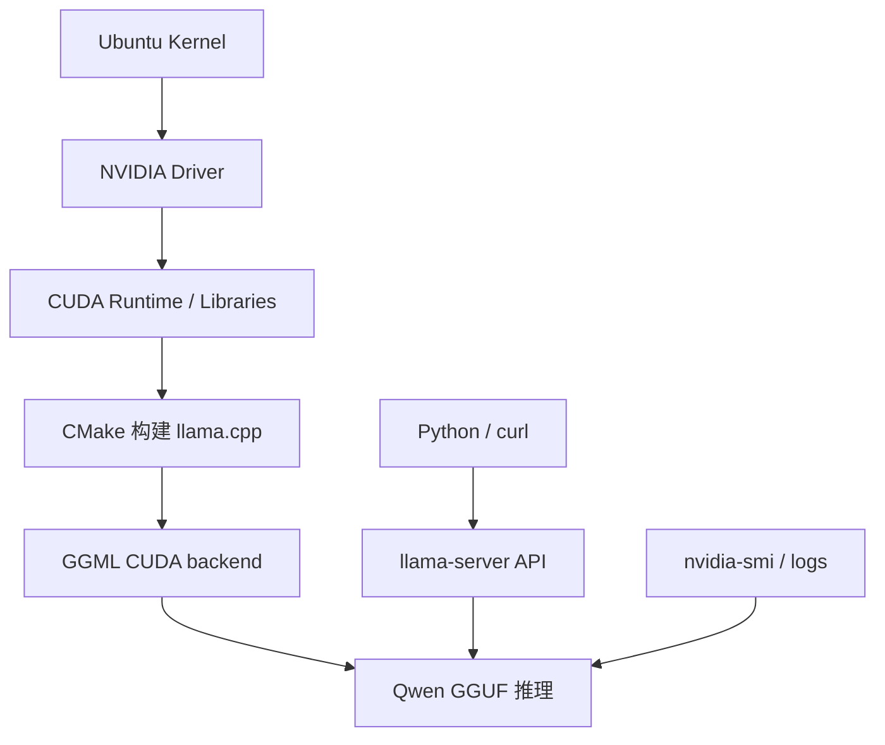
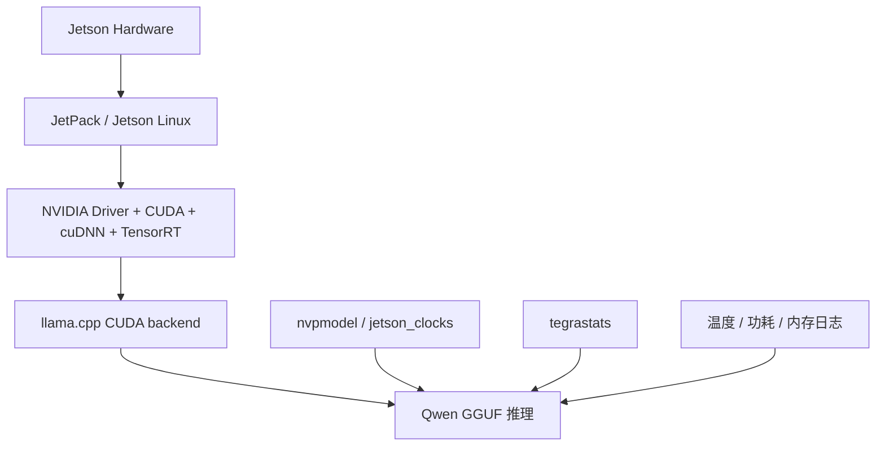
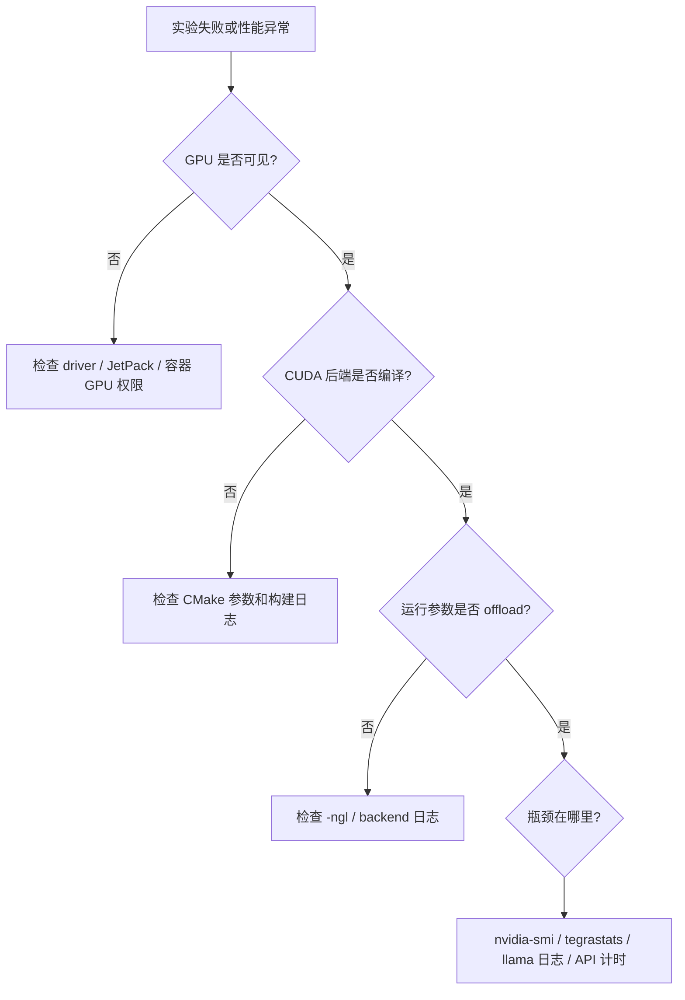

# Linux/GPU/Jetson 工具链基础

## 学习目标

- 掌握 Ubuntu Server 上跑端侧/本地推理实验所需的基本工具链。
- 理解 NVIDIA driver, CUDA runtime/toolkit, CMake, Python 环境和容器之间的关系。
- 理解 Jetson 上 JetPack, Jetson Linux, `tegrastats`, `nvpmodel` 和功耗模式的作用。
- 能构建和运行 llama.cpp CUDA 后端, 并判断 GPU offload 是否生效。
- 能保存可复查的环境信息, 避免实验不可复现。

:::tip
本章的目标不是把学员训练成 Linux 运维或 CUDA 工程师, 而是让学员能独立完成端侧模型部署实验的环境检查, 构建, 运行和日志保存。
:::

## 问题背景

推理框架经常依赖系统级组件。驱动, CUDA, CMake, 编译器, Python 包和动态库路径任何一个环节错了, 都可能表现成“模型慢”, “GPU 没用上”, “构建失败”或“服务启动后立刻退出”。

课程实作采用两条硬件路径:

- Ubuntu Server + NVIDIA GPU: 用于建立可重复的 Qwen 小模型部署基线, 适合先做量化和推理加速对比。
- NVIDIA Jetson: 用于观察边缘设备约束, 包括共享内存, 功耗模式, 温度, 散热和 JetPack 版本差异。

这两条路径都不是“安装完就结束”。学员需要能回答:

- GPU 是否被系统识别?
- runtime 是否编译了 CUDA 后端?
- 模型运行时是否真的 offload 到 GPU?
- 显存或内存峰值如何记录?
- Jetson 当前功耗模式是什么?
- 实验结果能否被别人复现?

## 图示讲解

### Ubuntu Server 推理工具链



### Jetson 推理工具链



### 问题定位路径



## 核心概念

### NVIDIA Driver

Driver 让操作系统识别并调度 NVIDIA GPU。服务器上常用 `nvidia-smi` 查看驱动和 GPU 状态。驱动不可用时, 上层 CUDA 和推理框架通常也无法正常使用 GPU。

关键检查:

```bash
nvidia-smi
```

关注:

- GPU 型号。
- Driver Version。
- CUDA Version 字段。
- 显存总量和当前占用。
- 当前运行的 GPU 进程。

:::note
`nvidia-smi` 中显示的 CUDA Version 表示驱动支持的 CUDA 运行能力上限, 不等同于本机安装了完整 CUDA toolkit。
:::

### CUDA Runtime 与 CUDA Toolkit

CUDA runtime 是运行 GPU 程序所需的库。CUDA toolkit 包含编译器 `nvcc`, 头文件和开发工具。很多部署场景只需要 runtime, 但编译 llama.cpp CUDA 后端时通常需要相应开发环境。

检查:

```bash
nvcc --version
ldconfig -p | grep cuda || true
```

如果 `nvcc` 不存在, 不一定代表 GPU 不能运行已有程序, 但可能影响从源码构建 CUDA 后端。

### CMake 与编译器

llama.cpp 等本地推理项目通常使用 CMake 构建。课程中重点关注构建参数是否启用了 CUDA 后端。

```bash
cmake --version
gcc --version || clang --version
```

### Python 环境

Python 在本课程中主要用于:

- 调用本地 API。
- 做环境 smoke test。
- 处理 profiling 结果表。
- 使用 Transformers 检查 tokenizer 和 chat template。

不要把模型权重, 下载缓存和虚拟环境提交到课程仓库。建议实验目录放在 `~/edge-ai-lab`。

### Container

容器可以减少环境差异, 但也会引入 GPU 权限和挂载问题。使用容器时要确认:

- 宿主机 driver 正常。
- NVIDIA Container Toolkit 已安装。
- 容器启动参数允许访问 GPU。
- 模型目录和结果目录正确挂载。

本课程先以宿主机原生运行建立基础, 再把容器作为可选扩展。

### JetPack 与 Jetson Linux

JetPack 是 Jetson 的软件栈集合, 通常包含 Jetson Linux, CUDA, cuDNN, TensorRT, 多媒体组件和开发工具。Jetson 上不要只记录 Ubuntu 版本, 还要记录 JetPack 或 L4T 信息。

```bash
cat /etc/nv_tegra_release
```

### `tegrastats`

`tegrastats` 是 Jetson 上观察资源的核心工具, 可显示 CPU/GPU/内存/温度/功耗等信息。课程中用于记录 Qwen 推理时的资源变化。

```bash
tegrastats
```

保存日志:

```bash
tegrastats --interval 1000 | tee ~/edge-ai-lab/logs/tegrastats-qwen.txt
```

### `nvpmodel` 与 `jetson_clocks`

Jetson 的性能受功耗模式和频率策略影响。实验报告必须记录当前功耗模式。

```bash
sudo nvpmodel -q
sudo jetson_clocks --show
```

不要在没有说明的情况下切换功耗模式, 否则不同实验之间不可比。

## Ubuntu Server 环境检查

### 最小检查命令

```bash
uname -a
lsb_release -a 2>/dev/null || cat /etc/os-release
python3 --version
git --version
cmake --version
nvidia-smi
```

### GPU 进程和显存

```bash
nvidia-smi --query-gpu=name,driver_version,memory.total,memory.used,temperature.gpu,power.draw --format=csv
nvidia-smi --query-compute-apps=pid,process_name,used_memory --format=csv
```

### 周期观察

```bash
watch -n 1 nvidia-smi
```

如果不能使用 `watch`, 可以用:

```bash
while true; do
  date
  nvidia-smi --query-gpu=memory.used,utilization.gpu,temperature.gpu,power.draw --format=csv
  sleep 1
done
```

### 读懂 `nvidia-smi` 字段

| 字段 | 含义 | 部署中怎么用 |
| --- | --- | --- |
| `memory.used` / `memory.total` | 显存占用与上限 | 对照模型大小和 KV Cache 估算, 判断还能加多大上下文 |
| `utilization.gpu` | 采样窗口内有 kernel 执行的时间占比 | 持续接近 0 说明计算没上 GPU |
| `temperature.gpu` | 核心温度 | 持续高温会触发降频, 长稳测试必记 |
| `power.draw` | 实时功耗 | 结合 tokens/s 可以算每 token 能耗, 与 Jetson 对比 |
| `pstate` | 性能状态 P0-P12 | 推理时长期处于高 P 值说明 GPU 停在低功耗档 |

两个常见误读:

- `utilization.gpu` 是“有 kernel 在跑”的时间占比, 不是算力利用率。LLM decode 阶段是 memory-bound, 这个数字可以很高, 同时大量算力在等数据。
- 显存占用包含 runtime 预分配的 buffer, 不等于“模型权重 + KV Cache”的精确求和。

## Jetson 环境检查

### 最小检查命令

```bash
cat /etc/nv_tegra_release
uname -a
free -h
df -h
python3 --version
git --version
cmake --version
```

### Jetson 资源和功耗

```bash
tegrastats
sudo nvpmodel -q
sudo jetson_clocks --show
```

### 保存一次 Jetson 快照

```bash
{
  date
  cat /etc/nv_tegra_release
  uname -a
  free -h
  df -h
  python3 --version
  git --version
  cmake --version
  sudo nvpmodel -q
  sudo jetson_clocks --show
} | tee ~/edge-ai-lab/results/jetson-env.txt
```

:::caution
Jetson 上的内存常与 GPU 共享。不要用服务器独立显存的思维直接判断 Jetson 是否“显存足够”。要同时看系统内存, swap, 温度和功耗。
:::

## llama.cpp 构建与运行

### 获取源码

```bash
mkdir -p ~/edge-ai-lab/repos
cd ~/edge-ai-lab/repos
git clone https://github.com/ggml-org/llama.cpp.git
cd llama.cpp
git rev-parse --short HEAD
```

保存 commit:

```bash
git rev-parse HEAD | tee ~/edge-ai-lab/results/llama-cpp-commit.txt
```

### CUDA 构建

```bash
cmake -B build -DGGML_CUDA=ON
cmake --build build --config Release -j
```

检查二进制:

```bash
./build/bin/llama-cli --help | head
./build/bin/llama-server --help | head
```

### 运行 Qwen GGUF

```bash
./build/bin/llama-cli \
  -m ~/edge-ai-lab/models/qwen/qwen2.5-1.5b-instruct-q4_k_m.gguf \
  -p "请用三点说明端侧模型部署的主要约束。" \
  -n 128 \
  --ctx-size 2048 \
  -ngl 99
```

判断 GPU offload:

- 构建日志中能看到 CUDA backend。
- 运行日志中出现 GPU/CUDA 相关 backend 信息。
- `nvidia-smi` 或 `tegrastats` 中能观察到资源变化。
- 改变 `-ngl 0` 与 `-ngl 99` 后性能和资源路径有差异。

## 本地服务检查

启动 OpenAI-compatible 服务:

```bash
./build/bin/llama-server \
  -m ~/edge-ai-lab/models/qwen/qwen2.5-1.5b-instruct-q4_k_m.gguf \
  --host 127.0.0.1 \
  --port 8080 \
  --ctx-size 2048 \
  -ngl 99
```

使用 `curl` 验证:

```bash
curl -s http://127.0.0.1:8080/v1/chat/completions \
  -H "Content-Type: application/json" \
  -d '{
    "model": "local-qwen",
    "messages": [
      {"role": "user", "content": "用一句话解释什么是端侧推理。"}
    ],
    "max_tokens": 64
  }'
```

如果 API 调用失败, 按顺序检查:

1. 服务是否仍在运行。
2. 端口是否正确。
3. 模型是否加载成功。
4. JSON 是否合法。
5. 日志中是否有 OOM, unsupported backend 或超时。

## 常见问题定位

| 现象 | 可能原因 | 检查方法 |
| --- | --- | --- |
| `nvidia-smi` 不存在 | 未安装驱动, 非 NVIDIA GPU 环境, Jetson 上工具不同 | 服务器查 driver, Jetson 查 `/etc/nv_tegra_release` |
| 构建成功但 GPU 没负载 | 未启用 CUDA 后端或 `-ngl` 太低 | 看 CMake 参数, 运行日志, 改 `-ngl` |
| 模型加载 OOM | 模型过大, ctx 太大, 其他进程占用 | 降低模型格式/ctx, 清理进程, 记录峰值 |
| CLI 能跑, API 失败 | 服务参数, 端口, JSON, chat template 问题 | 看 server 日志和 curl 响应 |
| Jetson 跑一段时间变慢 | 温度或功耗限制 | 记录 `tegrastats`, `nvpmodel`, 散热条件 |
| 结果不可复现 | 未记录版本和参数 | 保存 env, commit, prompt, 模型文件名 |

## 配套实作

### 实作 1: Ubuntu 环境报告

对应章节: [Ubuntu Server 与 NVIDIA GPU 环境](/docs/lab-ubuntu-nvidia)

产物:

```text
~/edge-ai-lab/results/ubuntu-env.txt
~/edge-ai-lab/results/llama-cpp-commit.txt
~/edge-ai-lab/logs/qwen-baseline.log
```

验收:

- 能看到 GPU 型号和 driver。
- 能看到 CMake/Git/Python 版本。
- 能看到 llama.cpp commit。
- 能跑一次 Qwen CLI 推理。

### 实作 2: Jetson 环境报告

对应章节: [Jetson 环境与 Qwen 迁移](/docs/lab-jetson-setup)

产物:

```text
~/edge-ai-lab/results/jetson-env.txt
~/edge-ai-lab/logs/tegrastats-qwen.txt
~/edge-ai-lab/logs/qwen-jetson.log
```

验收:

- 能看到 Jetson Linux/L4T 信息。
- 能看到功耗模式。
- 能保存 `tegrastats` 日志。
- 能说明 Jetson 与 Ubuntu Server 的资源差异。

### 实作 3: CPU/GPU offload 对比

对应章节: [推理加速实验](/docs/lab-inference-acceleration)

固定模型和 prompt, 分别运行:

```bash
-ngl 0
-ngl 99
```

结果模板:

| 设备 | ngl | 峰值显存/内存 | 首 token | tokens/s | 资源观察 | 备注 |
| --- | --- | --- | --- | --- | --- | --- |
| Ubuntu GPU | 0 | 待填 | 待填 | 待填 | 待填 | 待填 |
| Ubuntu GPU | 99 | 待填 | 待填 | 待填 | 待填 | 待填 |
| Jetson | 0 | 待填 | 待填 | 待填 | 待填 | 待填 |
| Jetson | 99 | 待填 | 待填 | 待填 | 待填 | 待填 |

## 验收结果

| 产物 | 验收标准 |
| --- | --- |
| 环境检查日志 | 包含系统, Python, Git, CMake, GPU/Jetson 信息 |
| 构建记录 | 包含 llama.cpp commit 和 CMake 参数 |
| 运行日志 | 包含模型路径, prompt, ctx, ngl 和性能统计 |
| 资源监控 | Ubuntu 有 `nvidia-smi`, Jetson 有 `tegrastats` |
| 问题定位说明 | 能把失败归类到驱动, CUDA, 构建, 运行参数, 模型或服务层 |

## 常见问题

### CUDA toolkit 和 driver 是一回事吗?

不是。Driver 让系统识别 GPU 并提供运行支持; toolkit 提供编译器和开发文件。运行已有 GPU 程序未必需要完整 toolkit, 但从源码编译 CUDA 后端通常需要。

### 为什么 `nvidia-smi` 正常, 但 llama.cpp 没用 GPU?

常见原因是构建时没有启用 `-DGGML_CUDA=ON`, 运行时没有设置足够的 `-ngl`, 或实际使用的是另一个未启用 CUDA 的二进制。

### Jetson 上为什么不用 `nvidia-smi`?

Jetson 的监控方式和桌面/服务器 NVIDIA GPU 不完全相同。课程主要使用 `tegrastats`, `nvpmodel` 和 Jetson 系统信息来记录资源状态。

### 是否建议一开始就用 Docker?

如果班级环境差异大, Docker 有帮助。但初学阶段建议先理解宿主机 driver, CUDA 和本地构建关系。否则容器失败时很难定位是宿主机, 容器权限还是镜像问题。

### 为什么要记录 commit?

llama.cpp, Qwen 文档和低比特格式支持都在持续更新。没有 commit 和版本信息, 实验结果很难复现或比较。

### 可以把模型文件放进 Git 仓库吗?

不可以。模型权重, 构建产物, 下载仓库和实验日志通常都应放在本地实验目录或外部存储, 不进入课程源码仓库。

## 作业

### 阅读题

1. 阅读 NVIDIA CUDA Installation Guide 的版本兼容性部分, 说明 driver 版本和 CUDA toolkit 版本的兼容方向（谁可以比谁新）。

### 检查题

1. `nvidia-smi` 显示 `utilization.gpu` 为 95%, 能否得出“GPU 算力已经打满”的结论? 为什么?
2. 机器上没有安装 CUDA toolkit 但 `nvidia-smi` 正常, llama.cpp 的 CUDA 构建会在哪一步失败? 运行已构建好的二进制呢?

### 实验题

1. 完成实作 1 或实作 2, 提交完整环境报告。
2. 在一次 Qwen 推理过程中后台运行周期观察脚本, 在保存的 GPU 指标记录上标注模型加载, prefill, decode 三个阶段的位置。

## 参考资料

- [NVIDIA CUDA Installation Guide for Linux](https://docs.nvidia.com/cuda/cuda-installation-guide-linux/)
- [NVIDIA Container Toolkit Install Guide](https://docs.nvidia.com/datacenter/cloud-native/container-toolkit/latest/install-guide.html)
- [Ubuntu Server NVIDIA driver guide](https://ubuntu.com/server/docs/how-to/graphics/install-nvidia-drivers/)
- [NVIDIA Jetson Linux Developer Guide](https://docs.nvidia.com/jetson/)
- [NVIDIA JetPack SDK](https://developer.nvidia.com/embedded/jetpack)
- [llama.cpp build docs](https://github.com/ggml-org/llama.cpp/blob/master/docs/build.md)
- [Qwen llama.cpp local run guide](https://qwen.readthedocs.io/en/v2.5/run_locally/llama.cpp.html)
