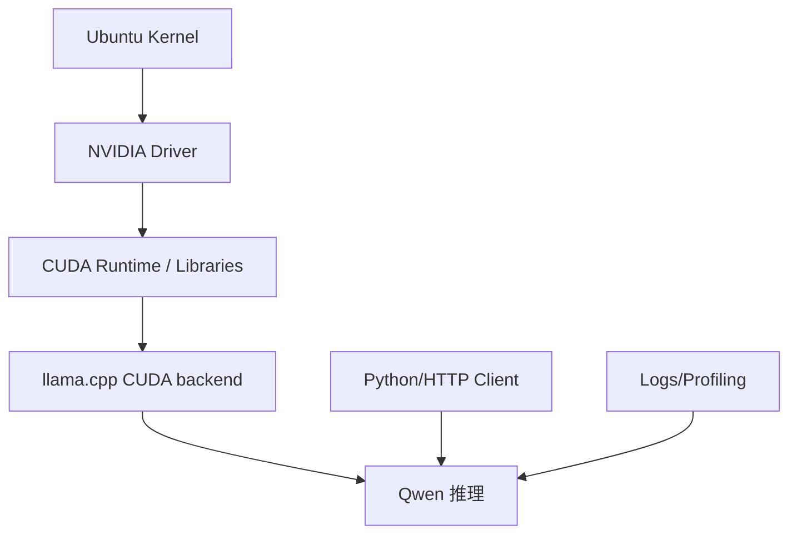

# Linux/GPU 工具链基础

## 学习目标

- 掌握 Ubuntu Server 上跑端侧/本地推理实验所需的基本工具。
- 理解 NVIDIA 驱动、CUDA runtime、编译工具、Python 环境和容器之间的关系。
- 能保存可复查的环境信息，避免实验不可复现。

## 问题背景

推理框架经常依赖系统级组件。驱动、CUDA、CMake、编译器、Python 包和动态库路径任何一个环节错了，都可能表现成“模型慢”“GPU 没用上”或“构建失败”。课程实作不要求深入 CUDA 编程，但要求能读懂基本环境信息。

## 图示讲解



## 核心概念

| 工具 | 用途 | 课程中怎么用 |
| --- | --- | --- |
| `nvidia-smi` | 查看 GPU、驱动、显存、进程 | 验证 GPU 可见和显存变化 |
| `cmake` | 构建 llama.cpp | 开启 `-DGGML_CUDA=ON` |
| `git` | 获取第三方源码 | 获取 llama.cpp |
| `python3` | 跑 smoke test 和简单脚本 | 调 OpenAI-compatible API |
| `curl` | HTTP 接口检查 | 验证本地服务 |
| `watch` | 周期观察命令输出 | 观察显存变化 |

## 代码/命令示例

最小环境检查：

```bash
nvidia-smi
cmake --version
git --version
python3 --version
curl --version
```

检查 GPU 进程：

```bash
nvidia-smi --query-compute-apps=pid,process_name,used_memory --format=csv
```

## 配套实作

对应实作章节：[Ubuntu Server 与 NVIDIA GPU 环境](/docs/lab-ubuntu-nvidia)。

把环境信息保存为文本，而不是只看终端：

```bash
bash labs/scripts/env_check.sh | tee ~/edge-ai-lab/results/env-check.txt
```

## 验收结果

| 产物 | 验收标准 |
| --- | --- |
| 环境检查日志 | 包含系统、CPU、内存、磁盘、GPU、Python、CMake、Git |
| 工具链结论 | 能说明当前环境是否适合继续跑 Qwen 实作 |
| 问题记录 | 如果 GPU 不可见，能把问题定位到驱动/CUDA/容器/权限之一 |

## 常见问题

- **把 CUDA toolkit 和驱动混为一谈**：驱动决定 GPU 是否可见，toolkit 更多影响编译和开发。
- **只在容器里验证**：容器能看到 GPU 不代表宿主机所有路径都正确。
- **没有记录 commit**：llama.cpp 更新频繁，实验需要记录版本。

## 参考资料

- [NVIDIA CUDA Installation Guide for Linux](https://docs.nvidia.com/cuda/cuda-installation-guide-linux/)
- [NVIDIA Container Toolkit Install Guide](https://docs.nvidia.com/datacenter/cloud-native/container-toolkit/latest/install-guide.html)
- [llama.cpp build docs](https://github.com/ggml-org/llama.cpp/blob/master/docs/build.md)
