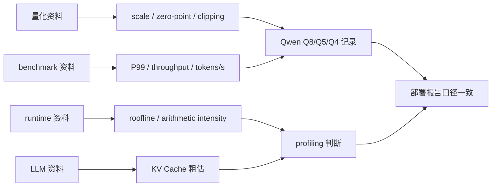

# 公式与符号约定

本课程统一采用下面的符号。后续章节如果没有特别说明，都按本页理解。

## 公开资料怎么转成本页约定

公开资料中的公式口径并不总是统一：量化教程可能把 `scale` 写成不同方向，benchmark 资料会区分平均值、分位数和场景口径，runtime 资料会把 tokens/s、prefill、decode、KV Cache 和内存带宽放在不同层面。本页只统一课程会反复用到的最小符号集，避免 Qwen GGUF、Q8/Q5/Q4、profiling 和 local API 报告里同一个词有多种算法。



| 外部资料中的公式口径 | 本页统一成什么 | 课程落点 |
| --- | --- | --- |
| DeepLearning.AI、PyTorch、ONNX 的线性量化 | `scale = real_range / integer_range`，再写 `q` 和反量化 | 量化数学、Q8/Q5/Q4 质量解释 |
| MLPerf、llama-bench、serving 资料 | 平均值、P99、throughput、tokens/s 分开写 | profiling 表和 API 服务记录 |
| Roofline 论文和 runtime 优化资料 | 用算术强度判断 compute-bound / memory-bound | 解释低比特不一定更快 |
| Hugging Face KV Cache、vLLM、LLM runtime 资料 | 用粗估公式说明 cache 随上下文增长 | `ctx-size`、长上下文、Jetson 内存风险 |

公式页不是证明课。它的作用是让所有章节用同一套符号解释日志、表格和工程判断。

## 量化符号

本课程统一采用：

```text
scale = real_range / integer_range
```

不要把这里的 `scale` 理解成 inverse scale。

非对称线性量化：

$$
q = \mathrm{clamp}\left(\mathrm{round}\left(\frac{x}{s}\right) + z,\; q_{\min},\; q_{\max}\right)
$$

$$
\hat{x} = s(q - z)
$$

其中：

$$
s = \frac{x_{\max} - x_{\min}}{q_{\max} - q_{\min}}, \qquad z = \mathrm{round}\left(q_{\min} - \frac{x_{\min}}{s}\right)
$$

对称量化取 $z = 0$，常用：

$$
s = \frac{\max |x|}{2^{b-1} - 1}
$$

clipping 范围内，舍入误差上界是：

$$
|x - \hat{x}| \le \frac{s}{2}
$$

## P99 延迟

给定 $n$ 次请求延迟 $t_1,t_2,\ldots,t_n$，P99 表示 99% 请求不超过的延迟值：

$$
P_{99} = \inf \{t \mid F(t) \ge 0.99\}
$$

工程计算时：

```text
sorted_t = sort(t)
P99 = sorted_t[ceil(0.99 * n) - 1]
```

平均延迟看总体快不快，P99 看尾部慢请求会不会影响体验。端侧交互场景通常不能只报平均值。

## Throughput

传统模型吞吐：

$$
throughput = \frac{batch\_size}{batch\_elapsed\_time}
$$

LLM 生成吞吐：

$$
tokens/s = \frac{generated\_tokens}{decode\_elapsed\_time}
$$

LLM 中不要把 requests/s 和 tokens/s 混为一谈。一个请求生成 32 tokens 和 512 tokens，对服务压力不同。

## Roofline 与算术强度

算术强度：

$$
AI = \frac{FLOPs}{Bytes}
$$

Roofline 上限：

$$
Performance \le \min(PeakFLOPs,\ AI \times MemoryBandwidth)
$$

单位检查：

```text
AI 的单位是 FLOPs/Byte。
MemoryBandwidth 的单位是 Byte/s。
AI x MemoryBandwidth 的单位是 FLOPs/s。
```

LLM decode 常接近 memory-bound，因为每生成一个 token 都要重复读取大量权重和 KV Cache。

## KV Cache 粗估

KV Cache 占用和层数、KV head 数、head 维度、上下文长度、batch、并发和数据类型有关。

粗略写法：

$$
KVBytes \approx 2 \times layers \times kv\_heads \times head\_dim \times context \times batch \times bytes\_per\_value
$$

前面的 $2$ 来自 key 和 value 两份缓存。实际 runtime 可能有 padding、对齐和额外 workspace，最终以日志和 profiling 为准。

## 参考资料

本章吸收方式：

- **知识点**：从量化、benchmark、runtime、Roofline 和 KV Cache 资料中提取课程必须统一的公式口径。
- **图解**：重画为“外部公式口径 -> Qwen 量化/profiling -> 部署报告”的 Mermaid 图。
- **实验**：公式只服务 Q8/Q5/Q4 量化记录、P99/tokens/s、roofline 判断和 KV Cache 估算。
- **取舍**：不展开完整数学证明，不复制外部推导，也不引入课程暂时不用的复杂统计口径。

- [类似教材与教程参考](/docs/similar-courses)
- [参考资料地图](/docs/reference-map)
- [量化数学基础](/docs/quantization-math-basics)
- [机器学习推理基础](/docs/ml-inference-basics)
- [推理加速基础](/docs/inference-acceleration)
- [DeepLearning.AI Quantization Fundamentals](https://www.deeplearning.ai/courses/quantization-fundamentals/)
- [PyTorch Quantization documentation](https://pytorch.org/docs/stable/quantization.html)
- [ONNX Runtime Quantization](https://onnxruntime.ai/docs/performance/model-optimizations/quantization.html)
- [MLPerf Inference](https://mlcommons.org/benchmarks/inference/)
- [Roofline: An Insightful Visual Performance Model](https://dl.acm.org/doi/10.1145/1498765.1498785)
- [Hugging Face Transformers KV cache](https://huggingface.co/docs/transformers/kv_cache)
