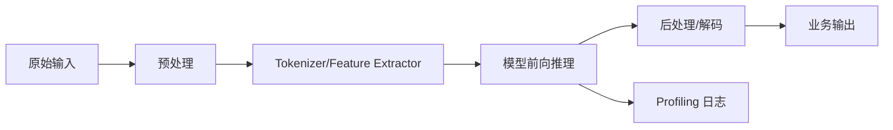

# 机器学习推理基础

## 学习目标

- 理解模型推理从输入到输出的基本链路。
- 区分 latency、throughput、batch size、memory footprint 和 warmup。
- 知道为什么模型转换、量化和 runtime 优化都要回到真实设备验证。

## 问题背景

端侧部署关心的是推理，不是训练。训练阶段强调梯度、优化器和收敛；推理阶段强调输入预处理、算子执行、内存移动、后处理、服务接口和稳定性。很多部署项目失败，不是算法指标不够，而是端到端链路中某个环节拖慢或出错。

## 图示讲解



## 核心概念

| 概念 | 解释 | 常见误区 |
| --- | --- | --- |
| Latency | 单次请求耗时 | 只看模型层耗时，忽略预处理和服务 |
| Throughput | 单位时间处理量 | batch 变大可能让单请求等待更久 |
| Warmup | 首次运行的初始化成本 | 把第一次运行当成稳定性能 |
| Memory footprint | 权重、激活、缓存、临时 buffer 总占用 | 只看模型文件大小 |
| End-to-end | 从输入到业务输出的完整耗时 | 只测 runtime 内核 |

## 代码/命令示例

用最小 Python 计时器区分“能跑”和“稳定耗时”：

```python
import time

def measure(fn, repeat=5):
    values = []
    for _ in range(repeat):
        start = time.perf_counter()
        fn()
        values.append(time.perf_counter() - start)
    return values
```

LLM 实验中还要单独看生成日志里的 prompt eval 和 eval 阶段，而不是只记录总耗时。

## 配套实作

在 [Qwen 基线推理](/docs/lab-qwen-baseline) 中，把 llama.cpp 的输出日志保存下来，找出：

- 模型加载耗时。
- prompt eval 相关统计。
- decode/eval 相关统计。
- 生成结果质量备注。

## 验收结果

| 产物 | 验收标准 |
| --- | --- |
| 推理链路图 | 能解释每个环节可能带来的延迟 |
| 指标表 | latency、throughput、memory、warmup 含义清楚 |
| 日志片段 | 能从一次运行日志中指出关键性能字段 |

## 常见问题

- **只测核心算子**：业务上真正感知的是端到端体验。
- **忽略数据搬运**：CPU/GPU 间拷贝、格式转换、tokenizer 都可能成为瓶颈。
- **把吞吐当交互体验**：交互式应用更看重首 token 和响应稳定性。

## 参考资料

- [ONNX Runtime performance documentation](https://onnxruntime.ai/docs/performance/)
- [TensorFlow Lite performance best practices](https://www.tensorflow.org/lite/performance/best_practices)
- [MLPerf Inference](https://mlcommons.org/benchmarks/inference/)
