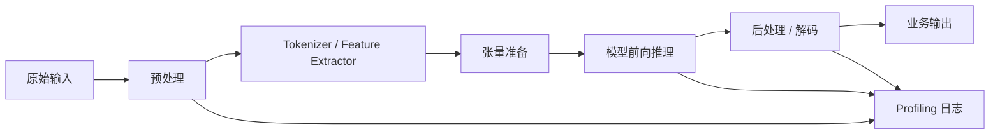
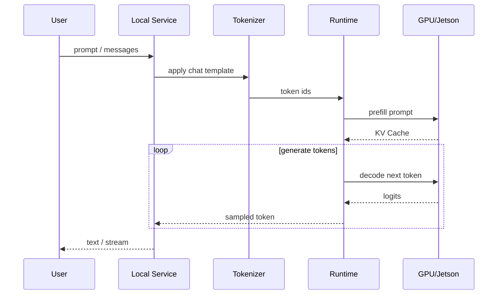
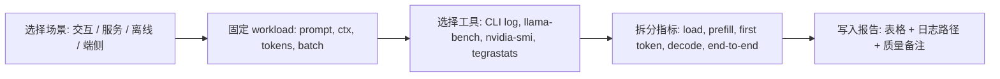
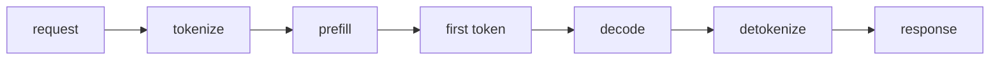

# 机器学习推理基础

## 学习目标

- 理解模型推理从输入到输出的完整链路, 而不是只看模型前向计算。
- 区分 latency, throughput, batch size, warmup, memory footprint 和 end-to-end time。
- 能把 LLM 的 prefill, decode, first-token latency 和 tokens/s 放到通用推理框架里理解。
- 知道为什么量化, runtime 优化和硬件加速都必须回到真实设备验证。
- 能设计一个不编造数字, 可复现, 可对比的基础推理实验。

:::tip
推理基础的核心问题不是“模型能不能运行”, 而是“模型在指定设备, 指定输入, 指定服务形态下能否稳定地满足指标”。
:::

## 问题背景

端侧部署关心的是推理, 不是训练。训练阶段强调梯度, 优化器, 数据增强和收敛; 推理阶段强调输入预处理, 算子执行, 内存移动, 后处理, 服务接口和稳定性。很多部署项目失败, 不是因为模型精度不够, 而是端到端链路中某个环节拖慢, 某个算子 fallback, 某个输入格式错误, 或某个指标口径没有统一。

在服务器上, 问题常表现为:

- GPU 显存足够, 但首 token 很慢。
- 模型文件已经变小, 但 tokens/s 没有明显提升。
- 单次 CLI 推理正常, 但服务接口延迟不稳定。
- batch 增大后吞吐提升, 但交互体验变差。

在 Jetson 上, 问题还会增加:

- CPU, GPU 和内存共享资源, 峰值内存更敏感。
- 功耗模式和温度会影响持续性能。
- 同样的模型格式在服务器和 Jetson 上可能表现不同。

本章的作用是建立统一语言: 先定义测量边界, 再讨论优化方法。

## 图示讲解

### 通用推理链路



如果只测 `E: 模型前向推理`, 很容易低估真实业务延迟。端侧应用常见的瓶颈可能在图像 resize, tokenizer, CPU/GPU 拷贝, JSON 编解码, 后处理 NMS, 或服务队列等待。

### LLM 推理链路



LLM 与传统分类模型的不同在于它会持续生成。一次请求通常包含:

- 模型加载: 加载权重和初始化 runtime。
- Prompt 处理: 对输入 token 做 prefill。
- 首 token: 从请求开始到第一个输出 token。
- Decode 循环: 每次生成一个 token, 直到达到停止条件。
- 服务返回: CLI 输出, HTTP JSON 或流式响应。

## 公开资料怎么转成本章内容

MLPerf, ONNX Runtime, TFLite/LiteRT, Nsight 和 llama-bench 都在强调同一件事: 先定义场景和测量边界, 再谈性能数字。本章不复制它们的 benchmark 表或工具截图, 而是把这些资料重画为课程自己的推理记录流程。



| 外部资料中的经典图表思路 | 本章重画/改写成 | Qwen 主线中的落点 |
| --- | --- | --- |
| MLPerf 按 SingleStream, Server, Offline 等场景区分性能口径 | “场景先于数字”的测量边界表 | 判断 CLI 单请求、API 服务和批处理结果不能混报 |
| ONNX Runtime profiling 把 runtime 事件拆成可查看的性能记录 | “端到端延迟拆解”图和日志字段表 | 区分模型加载、prefill、decode、服务开销 |
| llama-bench 把 prompt processing 和 token generation 分开测试 | `prompt eval` / `eval` 对照表 | 解释 Qwen 的首 token 和 tokens/s |
| TFLite/LiteRT 和移动端资料强调设备内资源竞争 | “峰值内存、温度/功耗、CPU/GPU 利用率”指标表 | 迁移到 Jetson 或移动端路线时补设备约束 |
| Nsight 等 profiling 工具强调时间线和瓶颈定位 | “一次只改一个变量”的实验习惯 | 比较 Q8/Q5/Q4、`-ngl`、ctx、threads 时避免误判 |

因此, 本章的性能数字必须带四个上下文: 场景, workload, 工具, 设备。缺任何一个, 数字都不能进入最终部署报告。

## 核心概念

### Latency

Latency 是单个请求的耗时。它可以有多个边界:

| 口径 | 起点 | 终点 | 适用场景 |
| --- | --- | --- | --- |
| Kernel latency | 单个算子开始 | 单个算子结束 | 算子优化, kernel 对比 |
| Model latency | 输入张量就绪 | 模型输出张量完成 | runtime 对比 |
| End-to-end latency | 原始输入进入系统 | 业务结果返回 | 产品体验评估 |
| First-token latency | 用户请求开始 | LLM 第一个 token 输出 | 对话, Agent, 流式输出 |

课程实验默认记录端到端口径, 同时从 llama.cpp 日志中拆出 prompt eval 和 eval 统计。

统计口径也要明确。单次测量受波动影响, 实验应重复多次并报告分位数。给定 $n$ 次请求延迟 $t_1,t_2,\ldots,t_n$, P99 表示 99% 请求不超过的延迟值:

$$
P_{99} = \inf\,\{\, t : F(t) \ge 0.99 \,\}
$$

$F(t)$ 是延迟的经验分布函数。工程计算时可以先排序:

```text
sorted_t = sort(t)
P99 = sorted_t[ceil(0.99 * n) - 1]
```

P50 描述典型体验, P99 描述尾部最差体验。交互式服务通常对 P99 敏感: 100 次请求里最慢的那一次, 决定用户对“卡”的印象。更多公式约定见[公式与符号约定](/docs/math-conventions)。

### Throughput

Throughput 是单位时间处理量。传统 CV/NLP 模型常用 samples/s, LLM 常用 tokens/s。两种口径不要混用。

传统模型吞吐:

$$
throughput = \frac{batch\_size}{batch\_elapsed\_time}
$$

LLM 生成吞吐:

$$
tokens/s = \frac{generated\_tokens}{decode\_elapsed\_time}
$$

如果写成 batch 形式, $B$ 是 batch size, $T_{batch}$ 是一个 batch 的总耗时:

$$
X = \frac{B}{T_{batch}}
$$

batch 变大时 $T_{batch}$ 的增长通常慢于 $B$（设备利用率提高）, 所以吞吐上升, 但单个请求的等待时间被拉长。这就是“吞吐和延迟不总是一致”的数学形式:

- 增大 batch 可能提升吞吐, 但单个请求等待更久。
- 并发请求可能提升设备利用率, 但增加排队时间。
- 在 Jetson 上, 长时间高负载可能受功耗和温度影响, 吞吐不稳定。

LLM 中不要把 requests/s 和 tokens/s 混为一谈。一个请求生成 32 tokens 和 512 tokens, 对服务压力完全不同。

### 端到端延迟拆解



CLI 日志、HTTP 计时和用户体感可能对应不同边界。报告中必须写清楚测量的是哪一段。

### llama.cpp 日志字段

| 字段 | 常见含义 | 报告写法 |
| --- | --- | --- |
| `load time` | 模型加载和 runtime 初始化 | 单独记录, 不混入稳定生成速度 |
| `prompt eval time` | prefill 阶段 | 用于解释首 token 或 TTFT |
| `eval time` | decode 阶段 | 用于记录 tokens/s |
| `sample time` | 采样开销 | 通常不是主瓶颈, 但异常时要记录 |
| `total time` | CLI 总耗时 | 不等于 HTTP API 端到端延迟 |

### Batch size

Batch size 是一次推理处理的样本数量。端侧交互式 LLM 通常 batch 不大, 更关心单请求响应。离线批处理或网关服务则可能通过 batching 提高吞吐。

### Warmup

Warmup 指首次运行前后的初始化成本, 可能包括:

- 动态库加载。
- GPU context 初始化。
- kernel 编译或选择。
- 内存池初始化。
- 模型权重和 tokenizer 缓存。

因此第一次运行不能直接代表稳定性能。实验应至少区分冷启动和稳定运行。

### Memory footprint

推理内存不是模型文件大小。它通常由下面几部分组成:

| 内存部分 | 说明 | LLM 场景 |
| --- | --- | --- |
| Weights | 模型权重 | 量化主要降低这一部分 |
| Activations | 中间激活 | 与 batch, shape, runtime 策略相关 |
| KV Cache | attention 历史缓存 | 与层数, heads, hidden size, context length 相关 |
| Runtime buffers | workspace, 临时 buffer | 与后端和 kernel 实现相关 |
| Service overhead | tokenizer, Python, HTTP, 日志 | 服务化时不可忽略 |

:::caution
权重量化后, 模型文件变小, 但长上下文下 KV Cache 仍会增长。不能用“GGUF 文件大小”直接推断端到端显存。
:::

### End-to-end

End-to-end 是从业务输入到业务输出的完整链路。课程强调端到端, 因为端侧部署的最终约束来自用户体验和设备资源, 而不是单个算子分数。

### FLOPs 与 MACs

FLOPs（浮点运算次数）和 MACs（乘加次数）描述计算量, 1 MAC 算 2 FLOPs。矩阵乘 $A_{m \times k} \cdot B_{k \times n}$ 的计算量是:

$$
\text{MACs} = mkn, \qquad \text{FLOPs} \approx 2mkn
$$

LLM decode 一个 token 的计算量约为 $2N$ FLOPs（$N$ 是参数量）: 每个权重参与一次乘加。把它和设备峰值算力对比会发现, decode 阶段算力几乎不可能成为瓶颈, 真正的上限来自内存带宽——这个判断的完整框架（roofline）见[推理加速基础](/docs/inference-acceleration)。

## 指标口径表

| 指标 | 单位 | 怎么测 | 注意事项 |
| --- | --- | --- | --- |
| 模型加载时间 | s | CLI 日志或手动计时 | 不要混入首 token |
| 首 token 延迟 | s/ms | 请求开始到第一个 token | 流式输出时尤其重要 |
| tokens/s | tokens/s | decode 阶段 token 数 / 时间 | 固定 prompt 和生成长度 |
| 峰值显存 | MiB/GiB | `nvidia-smi`, runtime 日志 | Jetson 需看 shared memory |
| CPU 占用 | % | `top`, `htop`, `pidstat` | tokenizer 和 fallback 常见 |
| GPU 利用率 | % | `nvidia-smi dmon`, `tegrastats` | 采样频率影响判断 |
| 温度/功耗 | C/W | Jetson `tegrastats`, `nvpmodel` | 边缘设备必记 |
| 质量备注 | 文本 | 人工检查或任务指标 | 不要只看速度 |

## 代码/命令示例

### Python 最小计时器

```python
import statistics
import time

def measure(fn, warmup=2, repeat=5):
    for _ in range(warmup):
        fn()

    values = []
    for _ in range(repeat):
        start = time.perf_counter()
        fn()
        values.append(time.perf_counter() - start)

    return {
        "min": min(values),
        "median": statistics.median(values),
        "max": max(values),
        "all": values,
    }

def workload():
    text = "端侧模型部署需要同时观察速度, 显存和质量。"
    return "|".join(text)

print(measure(workload))
```

这个示例不代表真实模型性能, 但它提供了实验习惯:

- 先 warmup。
- 多次重复。
- 记录 min/median/max, 不只记录一次。
- 明确 workload。

### llama.cpp 固定 workload

```bash
./build/bin/llama-cli \
  -m ~/edge-ai-lab/models/qwen/qwen2.5-1.5b-instruct-q4_k_m.gguf \
  -p "请用三点说明端侧部署为什么要同时看速度、显存和质量。" \
  -n 128 \
  --ctx-size 2048 \
  -ngl 99
```

记录时至少写清楚:

- 模型文件。
- prompt。
- 生成长度 `-n`。
- 上下文长度 `--ctx-size`。
- GPU offload 参数 `-ngl`。
- llama.cpp commit。
- 设备型号和驱动/JetPack 版本。

### HTTP 服务端到端计时

如果使用本地 OpenAI-compatible API, 可以用下面的 Python 结构做 smoke test:

```python
import json
import time
import urllib.request

payload = {
    "model": "local-qwen",
    "messages": [
        {"role": "user", "content": "用一句话解释什么是首 token 延迟。"}
    ],
    "max_tokens": 64,
}

start = time.perf_counter()
request = urllib.request.Request(
    "http://127.0.0.1:8080/v1/chat/completions",
    data=json.dumps(payload).encode("utf-8"),
    headers={"Content-Type": "application/json"},
)

with urllib.request.urlopen(request, timeout=60) as response:
    body = response.read().decode("utf-8")

elapsed = time.perf_counter() - start
print(f"end_to_end={elapsed:.3f}s")
print(body[:500])
```

这段代码用于验证服务链路, 不用于替代系统 profiling。

## 配套实作

### 实作 1: 拆解一次 Qwen 推理日志

对应章节: [Qwen 基线推理](/docs/lab-qwen-baseline)

步骤:

1. 固定一个 prompt 和 `-n 128`。
2. 分别运行 CPU 路径和 GPU offload 路径。
3. 保存完整终端日志。
4. 从日志中标注模型加载, prompt eval, eval/decode。
5. 记录输出质量备注。

结果表:

| 设备/路径 | 模型 | ctx | ngl | 加载时间 | prompt eval | decode tokens/s | 质量备注 |
| --- | --- | --- | --- | --- | --- | --- | --- |
| Ubuntu GPU | 待填 | 待填 | 待填 | 待填 | 待填 | 待填 | 待填 |
| Jetson | 待填 | 待填 | 待填 | 待填 | 待填 | 待填 | 待填 |

### 实作 2: 观察上下文长度对内存的影响

对应章节: [Transformer 与 LLM 基础](/docs/transformer-llm-basics), [Profiling 与结果记录](/docs/lab-profiling)

固定模型和 prompt, 分别设置:

```bash
--ctx-size 1024
--ctx-size 2048
--ctx-size 4096
```

每次记录:

- 峰值显存或内存。
- 首 token 延迟。
- tokens/s。
- 是否出现 OOM 或明显降速。

### 实作 3: 对比 CLI 与 API

对应章节: [本地服务与 OpenAI-compatible API](/docs/lab-local-service)

同一个 prompt, 分别用 CLI 和 HTTP API 调用, 对比:

- 端到端耗时。
- 输出是否一致。
- 服务日志中是否有错误。
- 是否能进行流式输出。

## 验收结果

| 产物 | 验收标准 |
| --- | --- |
| 推理链路图 | 能解释预处理, tokenizer, 前向计算, 后处理和服务层的关系 |
| 指标口径表 | 能区分模型 latency, end-to-end latency, first-token latency 和 tokens/s |
| Qwen 日志标注 | 能从一次运行日志中指出 prompt eval 和 decode 指标 |
| 内存拆分说明 | 能说明权重, activation, KV Cache, runtime buffer 的差别 |
| 实验记录模板 | 不编造数字, 但预留字段完整, 能支持后续填数 |

## 常见问题

### 为什么我用低比特模型后速度没有变快?

可能原因包括:

- 设备瓶颈不在权重读取, 而在 decode kernel, tokenizer 或服务层。
- runtime 没有使用对应的低比特优化 kernel。
- 低比特格式需要 dequant, 抵消了部分收益。
- GPU offload 参数没有正确启用。
- Jetson 上受内存带宽, 功耗模式或温度影响。

### 为什么第一次推理特别慢?

常见原因是冷启动: 加载权重, 初始化 GPU context, 分配内存池, 加载 tokenizer 和选择 kernel。实验中要区分冷启动和稳定运行。

### 为什么 tokens/s 高, 但用户仍然觉得慢?

用户首先感知的是首 token 延迟。如果 prefill 很慢, 或服务队列等待很长, decode tokens/s 再高也不能完全改善体验。

### 为什么要固定 prompt?

LLM 的 prompt 长度, 语言, 模板和生成长度都会影响结果。比较模型格式或运行参数时, 必须尽量只改变一个变量。

### 可以只看平均值吗?

不建议。至少记录 min, median, max。端侧设备可能有温度, 后台进程或服务队列带来的波动, 只看平均值容易掩盖问题。

## 作业

### 阅读题

1. 阅读 MLPerf Inference 的场景定义（SingleStream, Server, Offline）, 说明它们分别对应本章哪种指标口径。

### 检查题

1. 解释 P50 和 P99 分别回答什么问题, 为什么交互式服务不能只报平均延迟。
2. 用 FLOPs ≈ 2N 估算 Qwen2.5-1.5B decode 一个 token 的计算量。假设设备峰值算力 10 TFLOPS, 计算“纯算力上限”的 tokens/s, 并解释为什么实测远低于这个数字。
3. batch 从 1 提到 8 后, 总吞吐从 30 提到 120 tokens/s。用 $X = B / T_{batch}$ 计算单 batch 耗时变化, 说明单请求等待发生了什么。

### 实验题

1. 用本章 Python 计时器对同一 workload 测 min/median/max, 重复 3 组, 记录组间波动并猜测来源。
2. 完成实作 1, 在日志中分别标出模型加载, prompt eval, decode 三段时间, 验证端到端时间约等于三段之和加服务开销。

## 参考资料

本章吸收方式：

- **知识点**：吸收 MLPerf、ONNX Runtime、TFLite、Nsight 和 llama-bench 对 latency、throughput、场景和 profiling 口径的定义。
- **图解**：把通用推理系统图重画成端到端延迟拆分图，单独标出模型加载、prefill、decode 和服务开销。
- **实验**：把外部 benchmark 思路转成 Qwen 日志标注、CLI/API 对比和 min/median/max 记录。
- **取舍**：不引入竞赛级 MLPerf 流程，也不引用外部性能数字作为本课程结论。

- [ONNX Runtime performance documentation](https://onnxruntime.ai/docs/performance/)
- [TensorFlow Lite performance best practices](https://www.tensorflow.org/lite/performance/best_practices)
- [MLPerf Inference](https://mlcommons.org/benchmarks/inference/)
- [NVIDIA Nsight Systems](https://developer.nvidia.com/nsight-systems)
- [llama.cpp llama-bench README](https://github.com/ggml-org/llama.cpp/blob/master/tools/llama-bench/README.md)
- [Qwen llama.cpp local run guide](https://qwen.readthedocs.io/en/v2.5/run_locally/llama.cpp.html)
