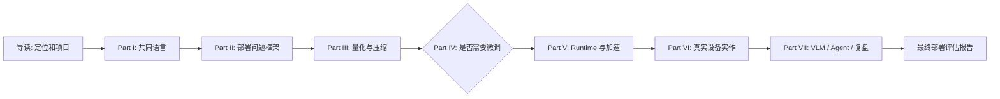
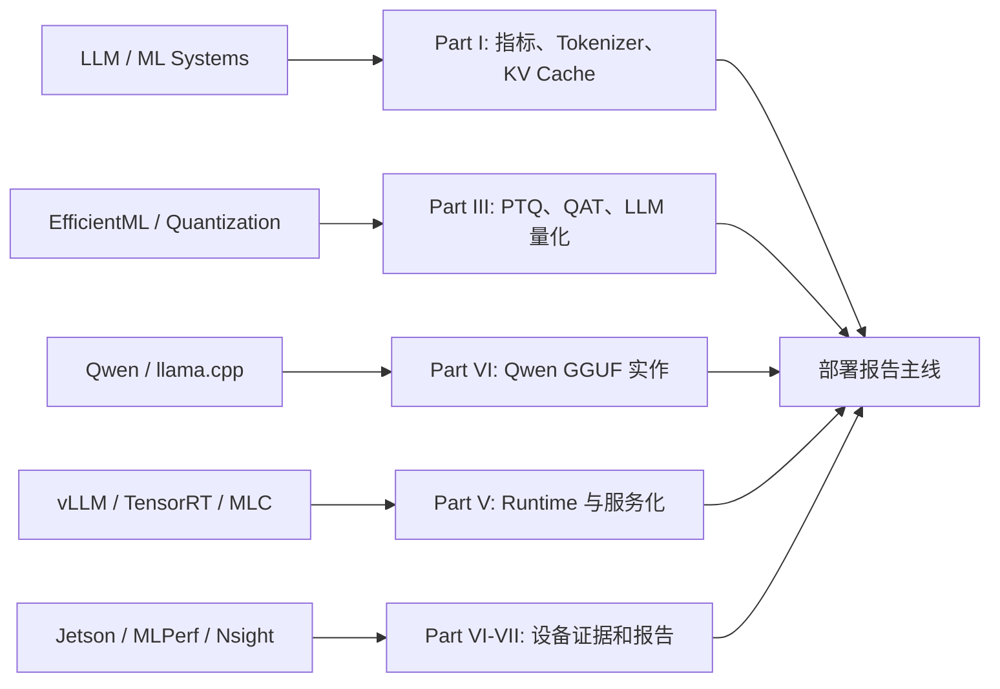

# Part 技术递进与工程实作细纲

## 本页目标

本页把课程从“章节列表”细化成“技术点递进 + 工程实作闭环”。每个 Part 都同时回答两件事：

- 技术点怎么从基础概念一步步走到工程判断。
- 工程实作怎么从最小验证走到最终部署评估报告。

V1 版本先固定课程结构和每个 Part 的细纲，不展开所有正文。后续扩写章节时，应优先保证每个技术点都能落到实验、记录表、失败排查或最终项目结论中。

## 总体学习主线

技术学习和工程实作不是两条分离路线。技术点负责解释“为什么这样做”，实作负责验证“这样做在目标设备上是否成立”。

本课程不是单一量化课，而是用同一个 Qwen 小模型、同一套设备约束、同一组量化版本和同一份部署评估报告贯穿压缩、适配、runtime 加速、服务化和复盘。

## 公开资料怎么转成本页细纲

公开课程和官方文档分别擅长不同层面：LLM 课程讲共同语言，EfficientML 和量化课程讲压缩方法，runtime 文档讲执行层，Jetson 和 benchmark 资料讲设备证据。本页只把这些资料压成 Part I-VII 的递进关系，不把外部课程目录照搬进来。

| Part | 主要吸收的外部资料 | 在本课程中改写成什么 |
| --- | --- | --- |
| Part I | Hugging Face LLM Course、ML Systems Book | tokenizer、prefill/decode、KV Cache 和推理指标的共同语言 |
| Part II | ML Systems Book、EfficientML、Jetson docs | 场景、质量、延迟、内存、功耗和端云协同决策表 |
| Part III | DeepLearning.AI Quantization、PyTorch/ONNX/TFLite/OpenVINO、GPTQ/AWQ/SmoothQuant | Q8/Q5/Q4 前的量化概念、误差来源和方法边界 |
| Part IV | Hugging Face、TRL/PEFT、Qwen/LLaMA-Factory | 是否微调、数据检查、chat template、adapter 和部署回归 |
| Part V | llama.cpp、vLLM、TensorRT-LLM、MLC LLM | runtime 选型、KV 管理、server/API 和 profiling 假设 |
| Part VI | Qwen、llama.cpp、Jetson docs、JetPack、Jetson AI Lab | Qwen baseline、GGUF、量化对比、Jetson/Ubuntu 迁移和 local API |
| Part VII | HF 多模态资料、OpenAI tools/agents 文档、MLPerf、Nsight、llama-bench | VLM/Agent 系统边界、失败恢复和最终报告证据链 |

### 外部原图到 Part 的映射

下面几张图不代表本课程要照搬对应课程目录，而是说明 Part I-VII 为什么要按“模型共同语言 -> 量化压缩 -> runtime/serving -> 端侧设备 -> 系统复盘”的顺序组织。

| 原图 | 对应 Part | 本课程怎么吸收 |
| --- | --- | --- |
| Transformer blocks | Part I | 只讲和推理成本、KV Cache、量化对象有关的结构 |
| Quantization schemes | Part III | 转成 scale、粒度、对象、Q8/Q5/Q4 记录要求 |
| MLC workflow | Part V/VI | 说明模型格式、编译产物、backend 和 API 是不同层 |
| ExecuTorch stack | Part VI | 移动端和嵌入式路线作为扩展，不改 40 学时主线 |

外部课程内容可以先按下面粒度贴入对应 Part，后续再改写。这样能快速增加教材厚度，同时不把课程改成资料堆。

| 可先贴入的外部材料 | 放到哪个 Part | 改成本课程什么内容 |
| --- | --- | --- |
| LLM/tokenizer/pipeline 图 | Part I | Qwen 输入、chat template、prefill/decode 说明 |
| 量化 scheme、校准、误差图 | Part III | Q8/Q5/Q4 对比前的概念表和失败模式 |
| LoRA/SFT 数据格式示例 | Part IV | `messages` JSONL、adapter 记录和部署回归表 |
| runtime workflow / API 截图 | Part V | model format、backend、server、endpoint 和日志字段 |
| Jetson/device stack 图 | Part VI | JetPack/L4T、功耗模式、`tegrastats` 和迁移清单 |
| Agent/function calling 图 | Part VII | 工具白名单、确认点、fallback 和风险表 |

这张表的用途是控制课程边界：外部资料提供解释和图表思路，课堂主线仍收束到 Qwen、GGUF、llama.cpp、Q8/Q5/Q4、profiling、local API 和部署报告。

## 导读：课程定位与项目主线

| 项目 | 内容 |
| --- | --- |
| 学习顺序 | 先明确端侧部署问题，再了解课程产物，最后建立贯穿项目目录和记录习惯。 |
| 核心技术点 | 端侧部署不是单一量化问题，而是模型能力、设备约束、runtime、功耗、延迟、质量和维护成本的组合问题。 |
| 工程实作 | 建立最终报告草稿，预留设备信息、模型信息、实验命令、日志路径、质量样例和结论字段。 |
| 阶段产出 | 学习路线图、最终报告目录草案、实验记录模板。 |
| 容易误解的边界 | 不把课程理解成论文综述、框架 API 手册或一次 demo 展示；最终目标是能给出可评审的部署判断。 |

导读部分要让学习者知道后续每一章为什么存在。比如学 tokenizer 不是为了背术语，而是为了解释 chat template 和本地模型输入；学 Jetson 不是为了认识某块板卡，而是为了看到功耗、温度和统一内存如何改变部署判断。

## Part I 前置知识与工具链

| 项目 | 内容 |
| --- | --- |
| 学习顺序 | 先学推理指标，再学 Transformer/LLM 推理流程，再学量化数学基础，最后学 Linux/GPU/Jetson 工具链。 |
| 核心技术点 | latency、throughput、batch、warmup、memory footprint；tokenizer、chat template、prefill/decode、KV Cache；scale、zero-point、clipping、outlier；driver、CUDA、CMake、Python 环境、JetPack、`tegrastats`。 |
| 工程实作 | 记录一次 Ubuntu 或 Jetson 环境快照，运行最小 Qwen 推理或计时脚本，标注日志中的首 token、tokens/s、内存和设备状态。 |
| 阶段产出 | 基础概念检查表、环境基线字段、日志阅读笔记。 |
| 容易误解的边界 | 不要求先完整掌握深度学习或 CUDA 编程，但必须能读懂实验日志和失败信号。 |

技术递进应从“指标口径”开始。学习者先知道如何描述一次推理，再理解 LLM 为什么分成 prefill 和 decode，然后才能解释上下文长度、KV Cache 和量化格式为什么影响内存与速度。

## Part II 端侧部署问题框架

| 项目 | 内容 |
| --- | --- |
| 学习顺序 | 先定义场景和指标，再分析设备约束，然后比较端侧、云端和端云协同，最后形成项目评估模板。 |
| 核心技术点 | 任务类型、质量阈值、延迟预算、内存预算、功耗和温度、隐私和离线需求、模型许可证、端云 fallback、目标设备画像。 |
| 工程实作 | 用一个目标场景填写部署决策矩阵，明确模型候选、runtime 候选、硬件路径、风险和验收指标。 |
| 阶段产出 | 端侧部署评估模板、指标和约束表、端云协同决策图。 |
| 容易误解的边界 | 不先问“模型能不能量化”，而是先问“业务目标和设备约束是什么”。 |

这一 Part 要把后续技术选择绑定到场景。比如同样是 Q4 模型，离线机器人、手机助手和本地服务器服务的指标重点不同，不能共用一套结论。

## Part III 量化与压缩

| 项目 | 内容 |
| --- | --- |
| 学习顺序 | 先学 PTQ/QAT 和数值表示，再学 LLM weight-only 量化和 KV Cache，再学精度修复，最后学剪枝、蒸馏和换模型的边界。 |
| 核心技术点 | INT8/INT4/NF4/FP8、per-channel/per-group、校准集、activation outlier、GPTQ、AWQ、SmoothQuant、LLM.int8()、GGUF、mixed precision、敏感层回退、蒸馏数据设计。 |
| 工程实作 | 设计 Qwen GGUF Q8/Q5/Q4 对比实验，固定 prompt、上下文长度和采样参数，记录质量、速度、内存、失败日志和是否进入下一轮部署。 |
| 阶段产出 | 量化路线选择表、量化实验设计、误差归因表、质量修复建议。 |
| 容易误解的边界 | 量化能降低模型大小和部分内存压力，但不保证一定加速；压缩收益必须看 runtime 和硬件 kernel 是否支持。 |

技术点要按“数值误差 -> 方法选择 -> 质量验证 -> 真实设备收益”的顺序写。不能只说某方法更先进，要说明它解决哪类误差、依赖什么数据、在哪些设备或 runtime 上可能收益不成立。

## Part IV 模型微调与数据适配

| 项目 | 内容 |
| --- | --- |
| 学习顺序 | 先判断是否需要微调，再学数据格式和 chat template，然后学 LoRA/QLoRA，最后学评估、adapter 合并、再量化和部署回归。 |
| 核心技术点 | prompt/RAG/tool/换模型/微调的选择；`messages` JSONL；chat template 一致性；SFT、LoRA、QLoRA、target modules、rank、alpha、learning rate、loss、checkpoint、adapter merge、灾难性遗忘。 |
| 工程实作 | 先完成微调必要性判断和数据检查；60 学时或项目制课程再跑 Qwen LoRA smoke test，保存数据、配置、训练日志和 adapter，用固定 prompt 对比基座和 adapter，再判断是否合并、转 GGUF、再量化和 profiling。 |
| 阶段产出 | 微调必要性判断表、数据检查清单；60 学时可增加训练配置草案、微调前后质量对比、部署去留结论。 |
| 容易误解的边界 | 微调不是知识库更新的首选，也不能替代量化精度修复或 runtime profiling；训练成功不等于部署成功。 |

这一 Part 独立出来，是因为微调在端侧链路中既影响模型质量，也影响后续量化和部署格式。课程应从“是否应该训练”讲起，而不是直接从 LoRA 公式或训练命令讲起。

## Part V Runtime 与推理加速

| 项目 | 内容 |
| --- | --- |
| 学习顺序 | 先拆解推理阶段，再理解格式和 runtime，然后分析 GPU offload、kernel、内存和服务化开销，最后用 profiling 验证瓶颈。 |
| 核心技术点 | llama.cpp、Ollama、TensorRT、TensorRT-LLM、vLLM、MLC、ExecuTorch；GGUF/ONNX/engine 格式；prefill/decode；KV Cache；low-bit kernel；batching；CPU/GPU 数据搬运；fallback。 |
| 工程实作 | 用同一模型和 prompt 比较 runtime 参数、GPU offload、`ctx-size`、threads、batch、server 接口和 `llama-bench` 输出。 |
| 阶段产出 | Runtime 选型矩阵、瓶颈定位表、profiling 记录、服务化开销分析。 |
| 容易误解的边界 | 模型格式、推理引擎、硬件后端和 API 包装是四层问题；换一个外壳不一定改变底层性能。 |

技术递进要从“模型如何生成 token”走到“哪个执行层成为瓶颈”。学习者需要能解释为什么同一模型在 CLI、Ollama、本地 server 和 Jetson 上表现不同。

## Part VI Ubuntu / Jetson / 移动端实作

| 项目 | 内容 |
| --- | --- |
| 学习顺序 | 先在 Ubuntu Server 建 baseline，再迁移到 Jetson，然后做量化、加速、profiling 和本地 API，最后了解移动端路线图。 |
| 核心技术点 | Ubuntu GPU 环境、CUDA 构建、Qwen GGUF baseline、JetPack、统一内存、NVMe、功耗模式、散热、`nvpmodel`、`jetson_clocks`、Android/on-device LLM、AI Edge Gallery、ExecuTorch/MLC 方向。 |
| 工程实作 | 完成 Qwen baseline、Jetson setup、Q8/Q5/Q4 对比、推理加速实验、本地 OpenAI-compatible 服务和 Ubuntu vs Jetson 对比表。 |
| 阶段产出 | 真实运行日志、设备对比表、性能和质量记录、本地服务 smoke test、移动端扩展路线说明。 |
| 容易误解的边界 | Ubuntu 结果是调试基线，不是端侧最终结论；移动端 V1 只做路线图，不新增完整 Android 实验。 |

这一 Part 是课程的实作骨架。前面所有方法都要在这里落到命令、日志、记录表和失败排查。移动端内容先用于建立广义端侧视野，避免课程只围绕 Jetson。

## Part VII VLM、Agent 与最终复盘

| 项目 | 内容 |
| --- | --- |
| 学习顺序 | 先复盘单模型部署，再扩展到 VLM，然后扩展到 Agent 和端云协同，最后完成最终项目报告。 |
| 核心技术点 | 视觉预处理、vision encoder、projector、视觉 token、分辨率、OCR、小目标；Agent 工具权限、状态管理、失败恢复、本地初筛、云端兜底、隐私边界。 |
| 工程实作 | 用案例模板拆解 VLM 或 Agent 系统，标注延迟预算、端侧/云端分工、权限表、失败恢复策略，并把前面实验结果汇总成最终报告。 |
| 阶段产出 | VLM/Agent 系统图、风险清单、方案评审材料、最终部署评估报告。 |
| 容易误解的边界 | 不做完整 Agent 平台开发，也不追逐多模态模型排行榜；重点是从单模型部署迁移到系统设计判断。 |

最后一部分的目标不是再开一个新主题，而是训练迁移能力。学习者要能把量化、微调、runtime、设备和服务化结果放进同一份部署方案里，说明推荐方案、不推荐方案和下一步。

## 后续扩写优先级

后续扩写每个 Part 时，按下面顺序补内容：

1. 先补技术递进图和核心术语边界。
2. 再补最小命令、日志检查点或记录表。
3. 再补失败模式和回退路径。
4. 最后补阅读资料和课堂讨论题。

不要先堆工具名或论文名。每个技术点都要能回答：它解决什么问题，什么时候不用，如何在实验中验证，如何进入最终报告。

## 参考资料

本章吸收方式：

- **知识点**：把 LLM、系统、量化、runtime、Jetson 和 benchmark 资料压成 Part I-VII 的递进顺序。
- **图解**：贴入 Transformer、量化、MLC 和 ExecuTorch 原图，并重画为“外部资料 -> Part -> 部署报告主线”的 Mermaid 图。
- **实验**：每个 Part 都必须落到 Qwen、GGUF、llama.cpp、Q8/Q5/Q4、profiling、local API 或最终报告。
- **取舍**：不把外部课程目录、厂商 API 或 benchmark 数字原样搬进总纲。

- [类似教材与教程参考](/docs/similar-courses)
- [参考资料地图](/docs/reference-map)
- [课程来源对照与取舍](/docs/source-comparison)
- [可吸收原始资料暂存](/docs/raw-reference-intake)
- [Hugging Face LLM Course](https://huggingface.co/learn/llm-course)
- [Hugging Face Course documentation-images](https://huggingface.co/datasets/huggingface-course/documentation-images)
- [vLLM / DeepLearning.AI course screenshots](https://github.com/vllm-project/vllm-project.github.io/tree/main/assets/figures/2026-06-03-deeplearning-ai-course)
- [MLC LLM](https://llm.mlc.ai/docs/)
- [ExecuTorch](https://docs.pytorch.org/executorch/stable/index.html)
- [MIT 6.5940 TinyML and Efficient Deep Learning Computing](https://hanlab.mit.edu/courses/2024-fall-65940)
- [DeepLearning.AI Quantization Fundamentals](https://www.deeplearning.ai/courses/quantization-fundamentals/)
- [Qwen llama.cpp 本地运行指南](https://qwen.readthedocs.io/en/v2.5/run_locally/llama.cpp.html)
- [llama.cpp](https://github.com/ggml-org/llama.cpp)
- [NVIDIA Jetson documentation](https://docs.nvidia.com/jetson/)
- [MLPerf Inference](https://mlcommons.org/benchmarks/inference/)
