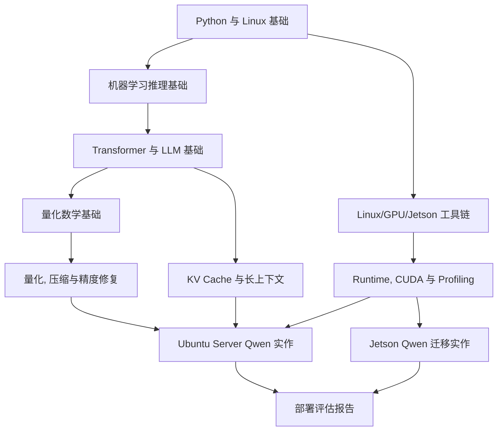

# 前置知识学习路径

## 学习目标

- 建立学习本课程所需的最小知识底座: 推理链路, Transformer, 量化数学, Linux/GPU 工具链。
- 知道哪些概念必须先会, 哪些概念可以在实验中边做边补。
- 能把后续课程中的 Qwen, llama.cpp, CUDA, Jetson, Profiling 术语放到同一张地图里理解。
- 避免把基础知识缺口误判为模型问题, 环境问题或量化方法问题。
- 为 40+ 学时课程形成可执行的预习, 复习和补课路径。

:::tip
本章不是通用 AI 入门课。这里的所有前置知识都服务于一个目标: 把模型压缩, 量化和推理加速方法落到 Ubuntu Server, NVIDIA GPU 和 Jetson 设备上的可验证部署结果。
:::

## 问题背景

端侧模型部署横跨算法, 系统和产品约束。只懂模型结构, 可能解释不了 kernel fallback, 显存增长和服务延迟。只懂 Linux 命令, 又可能误判 tokenizer, KV Cache, calibration data 或低比特量化误差。课程后续章节默认读者能看懂模型推理的基本流程, 能在 Linux 上运行命令, 能记录实验日志, 也能用简单表格解释结果。

这门课的前置知识有三个特点:

- 它是任务驱动的。我们不要求完整学完机器学习, 编译器或 CUDA 编程, 但要求能解释端侧部署中常见的瓶颈。
- 它是可验证的。每个概念都要能在日志, 命令输出, 显存曲线或模型响应里找到证据。
- 它是分层的。算法层, runtime 层, 硬件层和服务层需要分开看, 再合起来做决策。

如果学员已经熟悉深度学习, 可以快速通过本章自测进入主线。如果基础较弱, 建议先完成本章后面的 5 个小任务, 再进入量化和 Jetson 实作。

## 图示讲解



这张图说明课程前置知识不是孤立模块。比如:

- 学 `latency` 和 `throughput`, 是为了后面能解释首 token 延迟和 tokens/s。
- 学 `scale` 和 `zero-point`, 是为了理解 PTQ, QAT, GPTQ, AWQ 和 GGUF 低比特格式。
- 学 `nvidia-smi` 和 `tegrastats`, 是为了在 Ubuntu Server 和 Jetson 上观察显存, 负载, 温度和功耗。
- 学 `chat template`, 是为了避免把提示词格式错误误判为模型量化损伤。

## 前置知识分层

| 层级 | 需要掌握 | 不要求掌握 | 课程中用来解决的问题 |
| --- | --- | --- | --- |
| Python/Shell | 文件路径, 环境变量, 虚拟环境, HTTP 请求, 简单计时 | 大型工程框架开发 | 跑 smoke test, 调本地 API, 保存实验结果 |
| 推理基础 | 输入输出, 预处理, 前向计算, 后处理, latency, throughput | 训练优化器细节 | 判断端到端瓶颈和指标口径 |
| Transformer/LLM | token, embedding, attention, MLP, prefill, decode, KV Cache | 从零训练大模型 | 解释 Qwen 部署, 长上下文和显存增长 |
| 量化数学 | scale, zero-point, clipping, rounding, per-channel, per-group | 量化理论证明 | 判断低比特格式的收益和风险 |
| Linux/GPU | driver, CUDA runtime, CMake, llama.cpp 构建, 日志检查 | CUDA kernel 编写 | 让 GPU 真正参与推理, 定位构建和运行问题 |
| Jetson | JetPack, shared memory, power mode, tegrastats | Jetson BSP 深度定制 | 把服务器实验迁移到边缘设备 |

## 你不需要先掌握什么

- 不需要从零训练 LLM。
- 不需要手写 CUDA kernel。
- 不需要完整推导 Transformer。
- 不需要熟悉所有移动端 runtime。

需要做到的是：每个概念都能回到日志、参数、表格或部署判断。

## 10 分钟自测

| 问题 | 简短答案 |
| --- | --- |
| TTFT 和 tokens/s 有什么区别？ | TTFT 看第一个 token 多久返回，tokens/s 看 decode 阶段稳定生成速度。 |
| 为什么 Q4 不一定比 Q8 快？ | Q4 更小，但速度还取决于 kernel、offload、反量化开销和内存带宽。 |
| KV Cache 为什么会占显存？ | 它保存历史 token 的 key/value，随上下文、batch 和并发增长。 |
| `nvidia-smi` 显示 GPU 利用率低一定是坏事吗？ | 不一定。短 prompt、decode memory-bound、CPU sampling 或监控采样间隔都会影响观察。 |
| chat template 为什么会影响质量？ | Instruct 模型依赖训练时的角色格式，模板错了会让同一模型收到不同输入。 |

## 学习路径

### 路径 A: 有深度学习基础的学员

适合已经使用过 PyTorch 或 Transformers, 但端侧部署经验较少的学员。

1. 快速阅读 [机器学习推理基础](/docs/ml-inference-basics), 重点看指标口径和端到端链路。
2. 阅读 [Transformer 与 LLM 基础](/docs/transformer-llm-basics), 重点看 prefill, decode 和 KV Cache。
3. 阅读 [量化数学基础](/docs/quantization-math-basics), 确认能解释 scale, zero-point 和 outlier。
4. 完成 [Ubuntu Server 与 NVIDIA GPU 环境](/docs/lab-ubuntu-nvidia) 的环境检查。
5. 进入 [端侧部署决策地图](/docs/framework) 和后续主线章节。

### 路径 B: 有系统或嵌入式基础的学员

适合熟悉 Linux, 驱动或边缘设备, 但对 LLM 和量化不熟悉的学员。

1. 先读 [机器学习推理基础](/docs/ml-inference-basics), 建立模型推理词汇。
2. 再读 [Transformer 与 LLM 基础](/docs/transformer-llm-basics), 重点理解 token 级生成。
3. 用 [量化数学基础](/docs/quantization-math-basics) 补齐低比特表示。
4. 阅读 [Linux/GPU/Jetson 工具链基础](/docs/linux-gpu-toolchain), 把已有系统知识映射到课程工具。
5. 从 [Jetson 环境与 Qwen 迁移](/docs/lab-jetson-setup) 开始做硬件对比。

### 路径 C: 基础较弱但需要完整学习的学员

适合第一次系统接触模型部署的学员。

1. 按本章顺序读完 5 个前置章节。
2. 每章至少完成一个命令或代码小练习。
3. 把每章的“验收结果”填成自己的学习记录。
4. 再进入 40+ 学时主线, 每次实验都保留日志和截图。

## 自测清单

进入主线前, 建议能回答下面的问题。如果不能回答, 不需要停课, 但要知道应该回到哪一章补。

| 问题 | 能回答说明 | 回看章节 |
| --- | --- | --- |
| 为什么同一个模型的首 token 延迟和后续 tokens/s 是两个指标? | 能区分 prefill 和 decode | [Transformer 与 LLM 基础](/docs/transformer-llm-basics) |
| 为什么 INT4 文件变小不一定让端到端速度变快? | 能解释内存, kernel, dequant 和 fallback | [机器学习推理基础](/docs/ml-inference-basics) |
| 为什么长上下文会增加显存, 即使权重已经量化? | 能说明 KV Cache 随上下文增长 | [Transformer 与 LLM 基础](/docs/transformer-llm-basics) |
| 为什么 outlier 会让低比特量化更难? | 能解释 scale 被异常值拉大 | [量化数学基础](/docs/quantization-math-basics) |
| 为什么 `nvidia-smi` 正常不代表 llama.cpp 一定用了 GPU? | 能区分驱动可见, CUDA 后端编译和运行参数 | [Linux/GPU/Jetson 工具链基础](/docs/linux-gpu-toolchain) |
| 为什么 Jetson 上要记录功耗模式和温度? | 能说明边缘设备受功耗和热限制影响 | [Linux/GPU/Jetson 工具链基础](/docs/linux-gpu-toolchain) |
| 为什么 tokenizer 或 chat template 错了会影响质量评估? | 能说明输入格式属于模型契约 | [Transformer 与 LLM 基础](/docs/transformer-llm-basics) |

## 最小工具准备

课程默认的实作环境有两条路径:

- 路径 1: Ubuntu Server + NVIDIA GPU, 用于建立可重复的 Qwen 小模型部署基线。
- 路径 2: NVIDIA Jetson, 用于观察边缘设备上的共享内存, 功耗模式和温度约束。

推荐先准备下面这些工具:

```bash
python3 --version
git --version
cmake --version
curl --version
```

Ubuntu Server GPU 环境还需要:

```bash
nvidia-smi
nvcc --version || true
```

Jetson 环境还需要:

```bash
cat /etc/nv_tegra_release
tegrastats --help
sudo nvpmodel -q
```

:::caution
不要把“命令能运行”当成实验环境已经可用。课程要求保存环境日志, 记录模型版本, 记录 llama.cpp commit, 并能解释每次实验使用的硬件路径。
:::

## 前置知识与课程主线的关系

| 主线模块 | 依赖的前置知识 | 典型错误 | 纠正方式 |
| --- | --- | --- | --- |
| 部署决策地图 | 指标口径, 环境约束 | 只按模型大小选方案 | 先列 latency, memory, quality, cost 约束 |
| PTQ/QAT | scale, calibration, clipping | 只看 bit-width | 同时看量化粒度, 校准数据和算子支持 |
| LLM 量化 | Transformer 结构, KV Cache | 认为 weight-only 解决全部显存问题 | 拆分权重, KV Cache, activation 和 runtime buffer |
| 推理加速 | 端到端链路, kernel, graph | 只换格式不测性能 | 固定 workload, 逐项改变变量 |
| Runtime 部署 | Linux/GPU 工具链 | GPU 可见但后端没启用 | 检查构建参数, 运行日志和 GPU 负载 |
| Jetson 迁移 | JetPack, power mode | 服务器结论直接搬到 Jetson | 重新测内存, 温度, 功耗和 tokens/s |
| 服务化 | HTTP, JSON, 并发 | 本地 CLI 能跑但 API 不稳定 | 添加 smoke test 和错误日志 |

## 预习任务

### 任务 1: 建立实验目录

```bash
mkdir -p ~/edge-ai-lab/{models,repos,results,logs}
cd ~/edge-ai-lab
pwd
```

预期结果:

- 能说明 `models`, `repos`, `results`, `logs` 分别存什么。
- 知道大模型文件和下载仓库不应该提交到课程 Git 仓库。

### 任务 2: 保存一次环境快照

```bash
{
  date
  uname -a
  python3 --version
  git --version
  cmake --version
  nvidia-smi || true
  cat /etc/nv_tegra_release 2>/dev/null || true
} | tee ~/edge-ai-lab/results/prereq-env.txt
```

预期结果:

- `prereq-env.txt` 中能看到系统, Python, Git, CMake 和 GPU/Jetson 信息。
- 如果某条命令失败, 能写出失败原因属于“未安装”, “非 NVIDIA GPU 环境”, “非 Jetson 环境”还是“权限问题”。

### 任务 3: 做一次端到端计时

```python
import time

start = time.perf_counter()
text = "端侧模型部署"
tokens = text.split()
result = "|".join(tokens)
elapsed = time.perf_counter() - start

print(result)
print(f"elapsed={elapsed:.6f}s")
```

这个例子不是模型推理, 但它训练一个习惯: 先定义测量边界, 再记录结果。后续测 Qwen 时也要明确是模型加载, prefill, decode, 还是完整 HTTP 请求。

## 课程产物

完成前置知识部分后, 学员应该形成下面这些产物:

| 产物 | 文件建议 | 用途 |
| --- | --- | --- |
| 环境快照 | `results/prereq-env.txt` | 后续问题定位和报告引用 |
| 概念自测表 | `results/prereq-checklist.md` | 标记需要复习的知识点 |
| 推理指标模板 | `results/metrics-template.md` | 后续 profiling 统一口径 |
| 实验目录说明 | `README-lab.md` | 保证实验数据不混乱 |

## 常见问题

### 需要先完整学完深度学习吗?

不需要。课程只要求理解推理阶段的最小概念: 输入, tensor, 前向计算, 后处理, 指标和误差来源。训练细节只在 QAT 和蒸馏章节作为背景出现。

### 需要会 CUDA 编程吗?

不需要写 CUDA kernel。但要知道 driver, CUDA runtime, CMake 后端和 GPU offload 参数之间的关系, 否则很难判断模型是否真的在 GPU 上运行。

### Jetson 和 Ubuntu Server 可以只选一个吗?

可以。完整课程建议两条路径都看, 因为 Ubuntu Server 更适合建立可重复基线, Jetson 更接近边缘部署约束。时间压缩到 40 学时时, 可以把 Jetson 作为对比实验而不是完整项目。

### 前置知识需要多少学时?

完整版建议 8 学时, 40 学时版本建议 6 学时。基础较好的班级可以把部分内容转为课前阅读, 把课堂时间留给实验和结果讨论。

### 为什么本课程反复强调记录日志?

端侧部署的很多问题只在特定硬件, 驱动版本, runtime commit 和模型格式组合下出现。没有日志, 就无法复盘“为什么这次实验快了或慢了”。

## 作业

### 自测题

1. 不查资料, 用一句话分别定义 latency, throughput, 首 token 延迟和 tokens/s, 再对照[机器学习推理基础](/docs/ml-inference-basics)检查。
2. 解释模型文件大小和运行内存占用为什么不相等, 至少列出两个额外的内存来源。
3. 判断自己属于路径 A/B/C 中哪一类, 列出对应路径中自己最需要补强的前两项。

### 预习实验

1. 完成预习任务 1-3, 保留实验目录结构, 环境快照和端到端计时三个产物, 它们会在后续每个实验中被复用。

## 参考资料

本章吸收方式：

- **知识点**：从 Hugging Face、PyTorch、ONNX Runtime 和 CUDA/Jetson 文档提取最小共同语言：模型、tokenizer、runtime、GPU/Jetson 环境和日志。
- **图解**：把外部工具链说明重画成“前置知识到实验主线”的课程地图，而不是复制工具文档截图。
- **实验**：所有前置检查都落到环境快照、目录结构和一次端到端计时，后续 Qwen/Jetson 实验直接复用。
- **取舍**：不要求学生先学完整深度学习或 CUDA 编程，只保留推理部署需要的概念。

- [Hugging Face Transformers documentation](https://huggingface.co/docs/transformers/index)
- [Hugging Face chat templates](https://huggingface.co/docs/transformers/chat_templating)
- [Hugging Face KV cache strategies](https://huggingface.co/docs/transformers/kv_cache)
- [PyTorch documentation](https://pytorch.org/docs/stable/index.html)
- [ONNX Runtime performance documentation](https://onnxruntime.ai/docs/performance/)
- [NVIDIA CUDA Installation Guide for Linux](https://docs.nvidia.com/cuda/cuda-installation-guide-linux/)
- [NVIDIA Jetson Linux Developer Guide](https://docs.nvidia.com/jetson/)
- [Qwen llama.cpp local run guide](https://qwen.readthedocs.io/en/v2.5/run_locally/llama.cpp.html)
