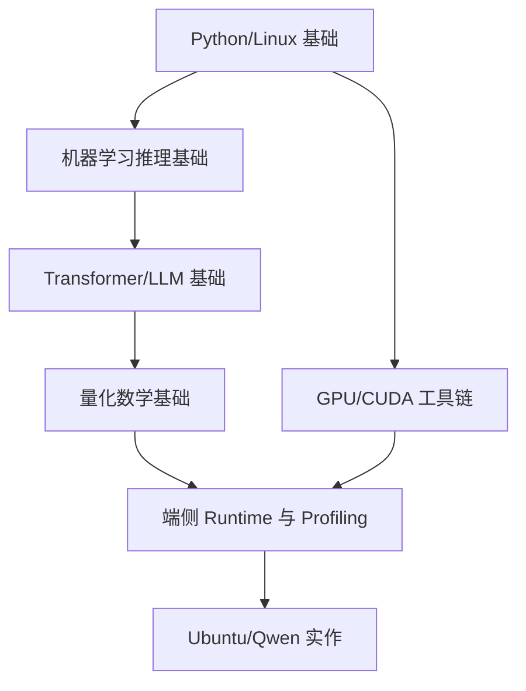

# 前置知识学习路径

## 学习目标

- 明确学习本课程前需要补齐哪些基础。
- 把数学、模型结构、系统工具和部署框架分成可逐步学习的路径。
- 避免在量化实验中把基础概念问题误判为工程问题。

## 为什么需要前置知识

端侧模型部署横跨算法、系统和产品约束。只懂模型结构，可能解释不了 kernel、fallback 和显存；只懂系统命令，又可能误判量化误差、tokenizer 或 KV Cache。课程书后续章节默认读者至少知道模型推理的基本流程，并能在 Linux 上阅读日志、运行脚本、记录实验。

## 学习地图

## 必备基础

| 模块 | 需要掌握 | 对应章节 |
| --- | --- | --- |
| Linux/Python | shell、目录、日志、Python HTTP 请求 | [Linux/GPU 工具链](/docs/linux-gpu-toolchain) |
| 推理基础 | tensor、batch、latency、throughput、memory | [机器学习推理基础](/docs/ml-inference-basics) |
| Transformer | token、attention、KV Cache、chat template | [Transformer 与 LLM 基础](/docs/transformer-llm-basics) |
| 量化数学 | scale、zero-point、clipping、granularity | [量化数学基础](/docs/quantization-math-basics) |
| 工程资料 | 官方文档、论文、框架手册 | [参考资料地图](/docs/reference-map) |

## 自测清单

进入主线章节前，建议能回答：

- 为什么同一个模型在首 token 和后续 tokens/s 上表现不同？
- 为什么 INT4 文件变小不一定让端到端速度变快？
- 为什么长上下文会增加显存，即使模型权重已经量化？
- 为什么 tokenizer/chat template 错误会让模型质量明显变差？
- 为什么一个 unsupported op 或 CPU fallback 可能抵消整体优化收益？

## 推荐学习顺序

1. 先读前置知识模块，建立基本词汇。
2. 再读课程书主线，理解部署判断和量化方法。
3. 同步跑 Ubuntu/Qwen 实作，把每个概念落到日志和指标。
4. 最后读参考资料地图，决定后续深入 PyTorch/ONNX/TensorRT/ExecuTorch/MLC/llama.cpp 哪条路线。

## 参考资料

- [Hugging Face Transformers documentation](https://huggingface.co/docs/transformers/index)
- [PyTorch documentation](https://pytorch.org/docs/stable/index.html)
- [NVIDIA CUDA Installation Guide for Linux](https://docs.nvidia.com/cuda/cuda-installation-guide-linux/)
