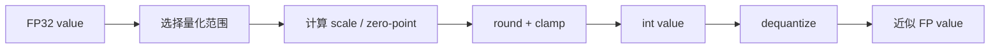

# 量化数学基础

## 学习目标

- 理解 scale、zero-point、clipping、rounding 和 dequantization。
- 区分 symmetric/asymmetric、per-tensor/per-channel/per-group。
- 知道量化误差从哪里来，以及为什么 outlier 会破坏低比特表示。

## 问题背景

量化本质上是在有限离散值中近似连续或高精度数值。bit-width 越低，可表示的离散点越少，误差越容易放大。工程量化的关键不是背公式，而是理解“范围怎么定、粒度怎么分、异常值怎么处理、runtime 是否真的用低比特算”。

## 图示讲解



## 核心概念

| 概念 | 说明 | 影响 |
| --- | --- | --- |
| Scale | 浮点范围到整数范围的缩放系数 | scale 越粗，误差越大 |
| Zero-point | 浮点 0 对应的整数位置 | asymmetric quantization 常见 |
| Clipping | 截断超出范围的值 | 降低大多数值误差，但牺牲 outlier |
| Rounding | 把浮点映射到整数 | 引入不可避免的舍入误差 |
| Granularity | 量化参数共享粒度 | per-group/per-channel 常比 per-tensor 精度好 |

## 代码/命令示例

对称 INT8 量化示意：

```python
import numpy as np

def symmetric_quantize(x: np.ndarray, bits: int = 8):
    qmax = 2 ** (bits - 1) - 1
    scale = np.max(np.abs(x)) / qmax
    q = np.clip(np.round(x / scale), -qmax - 1, qmax).astype(np.int8)
    restored = q.astype(np.float32) * scale
    return q, restored, scale

x = np.array([-4.0, -0.5, 0.0, 0.8, 2.0], dtype=np.float32)
q, restored, scale = symmetric_quantize(x)
print(q, restored, scale)
```

观察 outlier 影响：

```python
x = np.array([-0.2, -0.1, 0.0, 0.2, 9.0], dtype=np.float32)
```

加入 9.0 后，绝大多数小值会被更粗的 scale 近似。

## 配套实作

在 [量化基础与 PTQ/QAT](/docs/ptq-qat) 章节中，把这个示意和 Qwen GGUF 实验联系起来：

- 数学示例解释 scale 和误差。
- Qwen 实验观察低比特格式带来的真实质量和性能变化。
- Profiling 表记录“理论压缩”和“真实收益”是否一致。

## 验收结果

| 产物 | 验收标准 |
| --- | --- |
| scale 示例 | 能手算或用代码解释一个简单数组的量化结果 |
| outlier 解释 | 能说明异常值为什么影响整体精度 |
| 粒度对照 | 能区分 per-tensor、per-channel、per-group |

## 常见问题

- **只记公式**：工程中更重要的是范围、粒度、校准数据和 runtime 支持。
- **忽略溢出和截断**：clamp 会保护整数范围，但也会损失 outlier 信息。
- **把 dequantization 当免费**：如果 runtime 频繁反量化，速度收益会下降。

## 参考资料

- [PyTorch Quantization documentation](https://pytorch.org/docs/stable/quantization.html)
- [ONNX Runtime Quantization](https://onnxruntime.ai/docs/performance/model-optimizations/quantization.html)
- [TensorFlow Lite post-training quantization](https://www.tensorflow.org/lite/performance/post_training_quantization)
