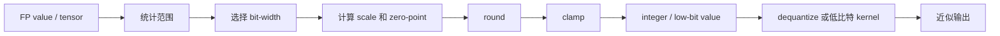
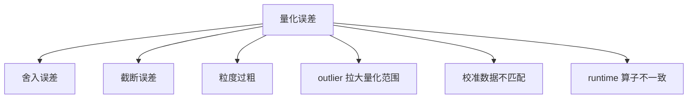
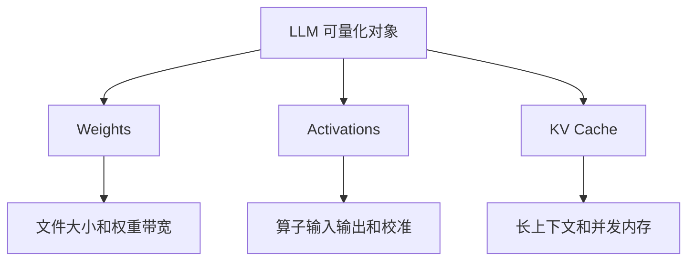

# 量化数学基础

## 学习目标

- 理解 scale, zero-point, clipping, rounding 和 dequantization 的基本含义。
- 区分 symmetric/asymmetric, per-tensor/per-channel/per-group, weight-only/activation/KV Cache 量化。
- 能用一个小数组手算或用代码演示 INT8/INT4 量化误差。
- 知道 outlier 为什么会破坏低比特表示, 以及 SmoothQuant, AWQ, GPTQ 等方法大致在解决什么问题。
- 能把数学概念映射到 Qwen GGUF Q8/Q5/Q4 实验和端侧推理结果。

:::tip
本章只讲部署课程需要的量化数学。重点不是推导复杂证明, 而是让学员能解释“为什么低比特会省内存, 为什么会损失精度, 为什么不一定提速”。
:::

## 问题背景

神经网络训练和原始模型发布通常使用 FP32, FP16 或 BF16 等浮点格式。端侧部署时, 模型要运行在显存, 内存, 带宽, 功耗和延迟都受限的设备上。量化把高精度数值近似为低比特整数或低比特块格式, 目标通常包括:

- 减小模型文件大小。
- 降低权重读取带宽。
- 降低显存或内存占用。
- 利用硬件低精度计算能力。
- 让更大的模型能放进端侧设备。

但是量化不是简单地把 `float` 改成 `int`。实际效果取决于:

- 数值范围怎么选。
- 量化参数共享粒度多大。
- outlier 怎么处理。
- 哪些层或张量被量化。
- runtime 是否有对应 kernel。
- 目标硬件是否真的支持低比特高效执行。

本章用最小数学模型解释这些因素, 为后续 PTQ/QAT, LLM 量化, 精度修复和推理加速做准备。

## 图示讲解

### 基本量化流程



### 误差来源



### 权重, 激活与 KV Cache



## 核心概念

### 浮点与整数表示

浮点数可以表示很大范围和小数, 但占用更多位宽。整数位宽越低, 可表示的离散点越少。

| 格式 | 常见用途 | 部署含义 |
| --- | --- | --- |
| FP32 | 训练, 高精度基线 | 精度高, 占用大 |
| FP16/BF16 | GPU 推理和训练 | 常见推理基线 |
| INT8 | 通用量化推理 | 工具链成熟, 精度通常较稳 |
| INT4/低比特块格式 | LLM 权重量化 | 文件和内存更小, 更依赖方法和 runtime |

:::note
GGUF 中的 Q4_K_M, Q5_K_M, Q8_0 等格式不是简单的“整个模型统一 int4/int5/int8”。它们是面向 llama.cpp/ggml 的具体块量化格式。实验中应记录具体格式名, 不要只写 INT4。
:::

### Scale

Scale 是浮点值和整数值之间的缩放系数。对称量化中, 常见形式是:

```text
q = round(x / scale)
x_hat = q * scale
```

其中 `x` 是原始浮点值, `q` 是整数近似, `x_hat` 是反量化后的近似值。

### Zero-point

Zero-point 表示浮点 0 对应的整数位置。非对称量化常见形式是:

```text
q = round(x / scale + zero_point)
x_hat = (q - zero_point) * scale
```

对称量化实现更简单, 非对称量化可以更好利用非对称数据范围。部署中具体使用哪一种, 取决于框架, 硬件和模型特点。

### Clipping

Clipping 把超出范围的值截断到最小或最大整数。它可以避免溢出, 但会损失 outlier 信息。

如果范围选得太宽, 大多数普通值会被较粗的 scale 表示, 舍入误差变大。如果范围选得太窄, outlier 会被截断。校准和 clipping 策略就是在这两个风险之间折中。

### Rounding

Rounding 是把连续值映射到离散整数的步骤。只要 bit-width 有限, 舍入误差就不可避免。低比特时离散点更少, 误差更明显。

### Granularity

Granularity 是共享量化参数的粒度。

| 粒度 | 含义 | 优点 | 风险 |
| --- | --- | --- | --- |
| Per-tensor | 整个张量共享 scale | 简单, 开销低 | outlier 影响范围大 |
| Per-channel | 每个输出通道一个 scale | 精度更好 | 参数和实现更复杂 |
| Per-group | 每组权重一个 scale | LLM 低比特常用折中 | group size 影响精度和速度 |
| Per-token | 每个 token 或动态范围 | 适合部分 activation 场景 | runtime 支持更复杂 |

LLM 的权重量化常使用 per-group 或块量化, 因为大矩阵中不同区域的分布差异明显。

### Calibration

Calibration 是用一组代表性数据统计 activation 或权重范围。PTQ 中, 校准数据质量会直接影响量化参数。如果校准数据与真实业务输入差异很大, 量化后质量可能下降。

### Outlier

Outlier 是数值分布中远离主体的异常大值。它会拉大量化范围, 导致普通值可用的离散点变少。

示例:

```text
[-0.2, -0.1, 0.0, 0.2, 9.0]
```

如果按最大绝对值 9.0 计算 scale, 前面几个小值会被粗糙表示。许多 LLM 量化论文都围绕“如何处理 outlier 或敏感权重/通道”展开。

## 对称 INT8 示例

下面用 NumPy 展示一个最小对称量化函数:

```python
import numpy as np

def symmetric_quantize(x: np.ndarray, bits: int = 8):
    qmax = 2 ** (bits - 1) - 1
    qmin = -2 ** (bits - 1)
    max_abs = np.max(np.abs(x))
    scale = max_abs / qmax if max_abs != 0 else 1.0
    q = np.clip(np.round(x / scale), qmin, qmax).astype(np.int8)
    restored = q.astype(np.float32) * scale
    error = restored - x
    return q, restored, error, scale

x = np.array([-4.0, -0.5, 0.0, 0.8, 2.0], dtype=np.float32)
q, restored, error, scale = symmetric_quantize(x)

print("scale:", scale)
print("q:", q)
print("restored:", restored)
print("error:", error)
```

观察点:

- `scale` 由最大绝对值决定。
- `round` 会造成误差。
- `restored` 不是原始值, 而是低比特表示反量化后的近似。

## Outlier 示例

把数组改成:

```python
x = np.array([-0.2, -0.1, 0.0, 0.2, 9.0], dtype=np.float32)
q, restored, error, scale = symmetric_quantize(x)

print("scale:", scale)
print("q:", q)
print("restored:", restored)
print("error:", error)
```

思考:

- 9.0 让 `scale` 变大。
- 小值之间的差异更容易被舍入抹平。
- 如果这些小值属于重要通道, 模型输出可能明显变化。

:::caution
不要用这个 toy example 推断具体模型性能。它只帮助理解误差机制。真实模型需要结合层分布, 校准数据, 任务指标和 runtime 支持判断。
:::

## INT4 为什么更难

INT8 有 256 个离散值。带符号 INT4 只有 16 个离散值。可表示点减少后, 同样范围内每个台阶更粗, 舍入误差更大。LLM 低比特量化通常需要额外策略:

- 更细粒度的 group。
- 对敏感层保留更高精度。
- 对 outlier 通道特殊处理。
- 用二阶信息或近似优化减少输出误差。
- 使用专门的块量化格式和 kernel。

这也是为什么 Q4, Q5, Q8 不能只按文件大小排序, 还要结合质量和速度实验。

## 常见量化对象

| 类型 | 说明 | 课程中的观察方式 |
| --- | --- | --- |
| Weight-only | 只量化权重, activation 通常仍较高精度 | 比较 GGUF Q8/Q5/Q4 文件和推理 |
| Weight + Activation | 权重和激活都量化 | 关注校准数据和 runtime 支持 |
| KV Cache 量化 | 降低长上下文 cache 占用 | 关注上下文长度, 质量和速度 |
| Mixed precision | 不同层或张量不同精度 | 关注敏感层和质量修复 |

## 典型方法如何对应数学问题

| 方法 | 主要关注 | 可以怎样理解 |
| --- | --- | --- |
| LLM.int8() | outlier 通道和 8-bit 矩阵乘 | 把异常值影响隔离, 保持大部分计算低精度 |
| SmoothQuant | activation outlier 平滑 | 在权重和激活之间迁移量化难度 |
| GPTQ | 权重量化误差补偿 | 用近似二阶信息减少量化后输出误差 |
| AWQ | 激活感知权重量化 | 保护对输出更重要的权重通道 |
| GGUF K-quants | llama.cpp 块量化格式 | 在文件大小, 质量和执行效率之间折中 |

这些方法的细节会在后续章节展开。本章只要求能识别它们不是“同一种 int4”, 而是在处理不同误差来源。

## 与推理加速的关系

量化可能带来加速, 但不是必然。

可能加速的原因:

- 权重更小, 内存读取压力下降。
- 低比特 kernel 更快。
- 更大模型能放进 GPU/Jetson 内存, 避免 CPU fallback。

可能不加速的原因:

- runtime 没有对应低比特 kernel。
- dequantization 开销抵消收益。
- 瓶颈在 tokenizer, KV Cache, 服务层或内存带宽。
- Jetson 受功耗模式和温度限制。

因此课程后续实验要求同时记录:

- 文件大小。
- 峰值显存/内存。
- 首 token。
- tokens/s。
- 输出质量备注。
- 设备和 runtime 版本。

## 配套实作

### 实作 1: 手写量化误差表

用一个数组分别做 INT8 和 INT4 近似, 填写:

| 原始值 | INT8 q | INT8 restored | INT8 error | INT4 q | INT4 restored | INT4 error |
| --- | --- | --- | --- | --- | --- | --- |
| 待填 | 待填 | 待填 | 待填 | 待填 | 待填 | 待填 |

目标不是得到漂亮数字, 而是理解 bit-width 变低后误差如何扩大。

### 实作 2: 比较 Qwen GGUF 格式

对应章节: [Qwen GGUF 量化对比](/docs/lab-qwen-quantization)

固定 prompt, 生成长度和上下文长度, 比较:

- Q8_0。
- Q5_K_M。
- Q4_K_M。

结果模板:

| 格式 | 文件大小 | ctx | 峰值显存/内存 | 首 token | tokens/s | 质量备注 |
| --- | --- | --- | --- | --- | --- | --- |
| Q8_0 | 待填 | 待填 | 待填 | 待填 | 待填 | 待填 |
| Q5_K_M | 待填 | 待填 | 待填 | 待填 | 待填 | 待填 |
| Q4_K_M | 待填 | 待填 | 待填 | 待填 | 待填 | 待填 |

### 实作 3: 观察 outlier 对 scale 的影响

修改 NumPy 示例:

1. 先使用没有 outlier 的数组。
2. 再加入一个异常大值。
3. 对比 scale 和普通值误差。
4. 写一句话解释这与 SmoothQuant/AWQ/GPTQ 的关系。

## 验收结果

| 产物 | 验收标准 |
| --- | --- |
| 量化公式说明 | 能解释 scale, zero-point, round, clamp, dequantize |
| Toy example 输出 | 能指出误差从哪里来 |
| Outlier 分析 | 能说明异常值为什么让低比特量化变难 |
| 粒度对照表 | 能区分 per-tensor, per-channel, per-group |
| Qwen 格式对比表 | 不编造数字, 但字段完整, 能支持真实实验填写 |
| 方法映射 | 能说出 GPTQ, AWQ, SmoothQuant 大致解决的数学问题 |

## 常见问题

### INT4 是不是一定比 INT8 快?

不是。INT4 文件更小, 但速度取决于 kernel, dequant, 内存带宽和硬件支持。某些设备上 INT8 或 FP16 可能更稳定。

### 文件大小能不能代表显存占用?

不能完全代表。运行时还包括 KV Cache, activation, workspace, tokenizer 和服务进程开销。

### PTQ 和 QAT 的数学基础一样吗?

都涉及量化表示和误差, 但 QAT 在训练过程中模拟量化影响, 让模型参数适应低精度。PTQ 则在训练后用校准和算法修正降低误差。

### 为什么 LLM 量化常用 group?

LLM 权重矩阵很大, 不同区域分布差异明显。per-tensor 太粗, per-element 成本太高, per-group 是常见折中。

### 为什么不能只看困惑度或只看人工主观判断?

部署评估需要质量和系统指标共同决定。困惑度, 下游任务, 人工检查和真实业务样例各有局限, 课程实验至少保留质量备注和可复查 prompt。

## 参考资料

- [PyTorch Quantization documentation](https://pytorch.org/docs/stable/quantization.html)
- [ONNX Runtime Quantization](https://onnxruntime.ai/docs/performance/model-optimizations/quantization.html)
- [TensorFlow Lite post-training quantization](https://www.tensorflow.org/lite/performance/post_training_quantization)
- [llama.cpp quantize README](https://github.com/ggml-org/llama.cpp/blob/master/tools/quantize/README.md)
- [LLM.int8(): 8-bit Matrix Multiplication for Transformers at Scale](https://arxiv.org/abs/2208.07339)
- [GPTQ: Accurate Post-Training Quantization for Generative Pre-trained Transformers](https://arxiv.org/abs/2210.17323)
- [SmoothQuant: Accurate and Efficient Post-Training Quantization for Large Language Models](https://arxiv.org/abs/2211.10438)
- [AWQ: Activation-aware Weight Quantization for LLM Compression and Acceleration](https://arxiv.org/abs/2306.00978)
