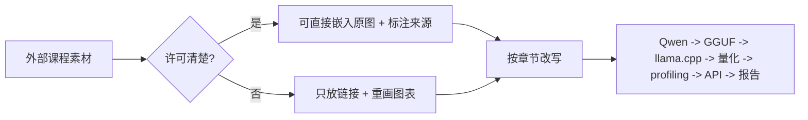

# 可吸收原始资料暂存

本页先把外部课程中可以放进课程书的素材集中起来。后续再按章节改写、重画或裁剪。

使用规则：

| 素材类型 | 本页先怎么放 | 后续怎么处理 |
| --- | --- | --- |
| 明确开放许可的原图 | 直接嵌入原图，标注来源和许可 | 放到对应章节，补中文解释 |
| 不明再分发许可的原图 | 只放原图链接，不复制到仓库 | 重画成 Mermaid 或原创表格 |
| 外部课程正文 | 不整段复制，只放短摘录或改写要点 | 改写成本课程讲解 |
| 官方命令和 API | 只吸收和本课程主线有关的参数 | 转成 Qwen/GGUF/llama.cpp 实验 |

## Hugging Face LLM Course 图片池

来源：[Hugging Face Course documentation-images dataset](https://huggingface.co/datasets/huggingface-course/documentation-images)，许可：Apache-2.0。

这些图适合直接嵌入，因为图片数据集明确标注 Apache-2.0。课程正文仍然用中文重新解释，不照搬原课程段落。

### NLP 推理流水线

可贴入章节：

| 落点 | 可吸收内容 | 改写方向 |
| --- | --- | --- |
| [机器学习推理基础](/docs/ml-inference-basics) | tokenizer、model、post-processing 的完整链路 | 改成“业务输入 -> token -> 模型 -> 输出后处理 -> 服务响应” |
| [Transformer 与 LLM 基础](/docs/transformer-llm-basics) | tokenizer 和模型不是同一个环节 | 解释 chat template、tokenization、prefill/decode 的关系 |
| [本地 OpenAI-compatible 服务](/docs/lab-local-service) | API 返回前还有后处理 | 解释为什么要记录请求、响应、elapsed 和 server 日志 |

### Word-based tokenization

可贴入章节：

| 落点 | 可吸收内容 | 改写方向 |
| --- | --- | --- |
| [Transformer 与 LLM 基础](/docs/transformer-llm-basics) | 文本先被切成 token，再进入模型 | 用中文例子说明“词、子词、标点、空格”都会影响 token 数 |
| [Qwen baseline 实验](/docs/lab-qwen-baseline) | 同一个 prompt 的 token 数影响速度和内存 | 要求记录 prompt 长度和生成 token 数 |

### BPE / subword tokenization

可贴入章节：

| 落点 | 可吸收内容 | 改写方向 |
| --- | --- | --- |
| [Transformer 与 LLM 基础](/docs/transformer-llm-basics) | 子词切分降低未知词问题 | 解释中英文混合、代码、型号名为什么会改变 token 预算 |
| [Profiling 与结果记录](/docs/lab-profiling) | token 数是 benchmark 的基本口径 | 把 prompt token、generated token 写进记录表 |

### Transformer blocks

可贴入章节：

| 落点 | 可吸收内容 | 改写方向 |
| --- | --- | --- |
| [Transformer 与 LLM 基础](/docs/transformer-llm-basics) | Transformer block 是重复堆叠的结构 | 只讲和推理成本有关的 attention、MLP、layer 数 |
| [量化数学基础](/docs/quantization-math-basics) | 大量矩阵运算是量化和低比特 kernel 的目标 | 连接到 weight、activation、scale、zero point |
| [推理加速基础](/docs/inference-acceleration) | attention 与 MLP 的瓶颈不同 | 引出 prefill/decode、KV Cache、GPU offload |

### Transformer 架构总览

可贴入章节：

| 落点 | 可吸收内容 | 改写方向 |
| --- | --- | --- |
| [Transformer 与 LLM 基础](/docs/transformer-llm-basics) | encoder、decoder、encoder-decoder 的差异 | 本课程只重点讲 decoder-only 本地 LLM |
| [VLM、Agent 与系统架构](/docs/vlm-agent) | 多模态模型常会组合不同模块 | 用作“组件拆解”而不是训练细节 |

### Causal modeling 与 pretraining

可贴入章节：

| 落点 | 可吸收内容 | 改写方向 |
| --- | --- | --- |
| [Transformer 与 LLM 基础](/docs/transformer-llm-basics) | causal LM 根据前文预测下一个 token | 连接到 prefill、decode、生成长度和 stop token |
| [模型微调与 LoRA/QLoRA](/docs/finetuning-lora) | 预训练和任务适配不是同一阶段 | 解释为什么微调后还要重新量化和部署回归 |

### Transformer and head

可贴入章节：

| 落点 | 可吸收内容 | 改写方向 |
| --- | --- | --- |
| [Transformer 与 LLM 基础](/docs/transformer-llm-basics) | base transformer 和 task head 的关系 | 解释不同任务的输出约束和后处理 |
| [机器学习推理基础](/docs/ml-inference-basics) | 模型前向之后仍有 head/post-processing | 区分 model latency 和 end-to-end latency |

### Tokenization pipeline

可贴入章节：

| 落点 | 可吸收内容 | 改写方向 |
| --- | --- | --- |
| [机器学习推理基础](/docs/ml-inference-basics) | tokenization 会产生 token、offset、special tokens 等结构 | 连接到 prompt token 数、ctx-size 和日志字段 |
| [Qwen 基线推理](/docs/lab-qwen-baseline) | 输入长度不是字符数 | baseline 记录 prompt 和生成 token 口径 |

### Fine-tuning 图

可贴入章节：

| 落点 | 可吸收内容 | 改写方向 |
| --- | --- | --- |
| [模型微调与 LoRA/QLoRA](/docs/finetuning-lora) | 预训练模型可以通过任务数据继续适配 | 改成“是否需要微调 -> LoRA smoke test -> 部署回归” |
| [Qwen LoRA 微调实验](/docs/lab-qwen-lora-finetuning) | fine-tuning 不是最终目标 | 强调 adapter、日志、对比 prompt、量化回归 |

### Chunking texts

可贴入章节：

| 落点 | 可吸收内容 | 改写方向 |
| --- | --- | --- |
| [模型微调与 LoRA/QLoRA](/docs/finetuning-lora) | 长文本要切块后再训练或评估 | 连接到 context length、样本构造和训练日志 |
| [本地 OpenAI-compatible 服务](/docs/lab-local-service) | 长输入会影响延迟和内存 | API smoke test 要记录输入长度和是否超时 |

### Model card 与文件列表

可贴入章节：

| 落点 | 可吸收内容 | 改写方向 |
| --- | --- | --- |
| [Qwen 基线推理](/docs/lab-qwen-baseline) | 模型卡、文件列表、许可证和权重文件要一起记录 | 下载 Qwen GGUF 时要求保存来源、文件名、SHA256、许可证 |
| [最终报告模板](/docs/report-template) | 模型来源证据不能只写模型名 | 第 2 节补模型来源、许可证和 hash |

### Traceback 与模型 ID 错误

可贴入章节：

| 落点 | 可吸收内容 | 改写方向 |
| --- | --- | --- |
| [排障索引](/docs/troubleshooting-index) | 报错要保留完整 traceback，不能只说“运行失败” | 将 traceback、模型路径、模型 ID、参数和日志路径写进风险登记 |
| [样例日志与结果表](/docs/sample-logs) | 错误日志也是课程证据 | 失败日志要能定位到环境、模型、runtime、设备或服务层 |

## Hugging Face 文字内容先吸收成要点

来源：[Hugging Face LLM Course](https://huggingface.co/learn/llm-course/chapter1/1)、[Transformers documentation](https://huggingface.co/docs/transformers/index)、[Transformers chat templates](https://huggingface.co/docs/transformers/chat_templating)、[Transformers KV cache](https://huggingface.co/docs/transformers/kv_cache)。

| 主题 | 可写进课程的内容 | 建议落点 |
| --- | --- | --- |
| pipeline | 推理不是单个模型调用，而是预处理、模型执行、后处理的组合 | 推理基础、本地服务 |
| tokenizer | token 数影响上下文长度、KV Cache、速度和费用 | Transformer 基础、profiling |
| chat template | `messages` 必须转换成模型训练时熟悉的输入格式 | 微调、Qwen baseline、本地 API |
| generation | max tokens、temperature、top-p 会改变输出质量和耗时 | Qwen baseline、本地服务 |
| KV Cache | cache 能减少重复计算，但会占用随上下文增长的内存 | 推理加速、LLM 量化、profiling |

## PEFT / TRL / QLoRA 微调资料

来源：[Hugging Face PEFT](https://huggingface.co/docs/peft/index)、[TRL SFTTrainer](https://huggingface.co/docs/trl/sft_trainer)、[Transformers bitsandbytes](https://huggingface.co/docs/transformers/quantization/bitsandbytes)。

| 主题 | 可写进课程的内容 | 建议落点 |
| --- | --- | --- |
| adapter | LoRA 产物不是完整模型，必须记录 base model 和 adapter 路径 | Qwen LoRA 实验、最终报告附录 |
| target modules | LoRA 只改部分模块，target modules 会影响训练效果和部署兼容 | LoRA 实验记录表 |
| QLoRA / NF4 | 4-bit 加载可以降低训练显存，但不等于部署量化已经完成 | LoRA 实验、LLM 量化 |
| SFTTrainer | 数据格式、template、训练参数和日志版本要一起记录 | LoRA smoke test |
| 回归评估 | adapter 有效性必须用固定 prompt 对比 base vs adapter | 质量修复、最终项目 |

## Qwen 与 llama.cpp 官方资料

来源：[Qwen llama.cpp 本地运行](https://qwen.readthedocs.io/en/latest/run_locally/llama.cpp.html)、[Qwen llama.cpp 量化](https://qwen.readthedocs.io/en/v2.5/quantization/llama.cpp.html)、[llama.cpp](https://github.com/ggml-org/llama.cpp)、[llama.cpp server](https://github.com/ggml-org/llama.cpp/tree/master/tools/server)。

| 主题 | 可写进课程的内容 | 建议落点 |
| --- | --- | --- |
| GGUF | 模型格式、tokenizer 信息和量化权重需要一起被 runtime 识别 | LLM 量化、Qwen baseline |
| 量化等级 | Q8/Q5/Q4 不只是文件大小不同，也会影响速度、内存和质量 | Qwen 量化实验、报告模板 |
| GPU offload | 速度取决于 offload 层数、显存、kernel 和回退路径 | 推理加速、profiling |
| llama-bench | benchmark 要固定模型、prompt、线程、batch 和硬件条件 | lab-profiling、样例日志 |
| server | 本地服务要记录 HTTP 状态、响应、耗时、日志异常和模型参数 | lab-local-service、最终报告 |

## Microsoft Edge AI for Beginners

来源：[microsoft/edgeai-for-beginners](https://github.com/microsoft/edgeai-for-beginners)，许可：MIT。

### Local-first Agent 架构

可贴入章节：

| 落点 | 可吸收内容 | 改写方向 |
| --- | --- | --- |
| [VLM 与 Agent 端侧形态](/docs/vlm-agent) | 本地 SLM、工具编排、人类确认、多模态输出、observability 的组合架构 | 改写成本课程的 local API、权限白名单、端云 fallback 和失败恢复图 |
| [端侧部署问题框架](/docs/framework) | local-first 的价值来自隐私、延迟、成本和可观察性 | 回到“是否必须端侧”和“证据在哪里”的决策矩阵 |

`lab2.png` 已作为 Agent workflow 视觉参考进入正文。`lab1.png`、`lab3.png` 和 `cover1.png` 图内文字瑕疵较多，先放在本页暂存，后续人工取舍或重画。

### 文字内容可吸收表

| Microsoft EdgeAI 模块 | 可写进课程的内容 | 建议落点 |
| --- | --- | --- |
| EdgeAI Fundamentals | 端侧 AI 的核心价值是隐私、低延迟、离线能力、成本可控和设备侧自治 | 端侧部署问题框架、最终项目风险 |
| Qwen Family | Qwen 有多个尺寸和多模态/代码/数学等变体，选型要看任务、设备、上下文长度和部署格式 | Qwen baseline、VLM/Agent、模型来源记录、量化实验 |
| BitNET Family | 1-bit/1.58-bit、ternary weight、BitLinear、bitnet.cpp 和能耗/内存优势需要与普通 Q4/GGUF 区分 | LLM 量化、压缩蒸馏、移动端路线 |
| Local SLM Deployment | 本地 SLM 部署要比较开发便利性、企业集成、跨平台、硬件加速、API 形态、模型生命周期和日志证据 | Runtime 选型、本地 API、最终报告 |
| Llama.cpp Guide | llama.cpp 的核心是 GGUF、量化、跨平台后端、CLI/server、GPU offload 和低依赖本地推理 | Qwen baseline、量化实验、local API、runtime 选型 |
| Agent Introduction | SLM 适合高频结构化工具任务，LLM 适合复杂开放推理，最佳方案常是混合路由 | VLM/Agent、端云协同 |
| Function Calling | 工具调用要经过工具定义、参数抽取、JSON 输出、应用层执行、结果回填和日志记录 | Agent 权限表、policy validator、排障索引 |

## DeepLearning.AI 推理与量化课程

来源：[Quantization Fundamentals](https://www.deeplearning.ai/courses/quantization-fundamentals/)、[Quantization in Depth](https://www.deeplearning.ai/courses/quantization-in-depth/)、[Fast & Efficient LLM Inference with vLLM](https://www.deeplearning.ai/courses/fast-and-efficient-llm-inference-with-vllm/)、[Efficiently Serving LLMs](https://www.deeplearning.ai/courses/efficiently-serving-llms/)。

vLLM 官方博客放出了 DeepLearning.AI vLLM 课程截图。站点内容许可未单独标明，本页先用源站 URL 远程展示，便于后续逐张改写；不把这些截图下载进仓库，也不把它们并入课程授权范围。

| 原图主题 | 原图链接 | 可贴入章节 |
| --- | --- | --- |
| Course structure | [course-structure.png](https://raw.githubusercontent.com/vllm-project/vllm-project.github.io/main/assets/figures/2026-06-03-deeplearning-ai-course/course-structure.png) | 推理加速、Runtime |
| KV Cache | [kv-cache.png](https://raw.githubusercontent.com/vllm-project/vllm-project.github.io/main/assets/figures/2026-06-03-deeplearning-ai-course/kv-cache.png) | LLM 量化、推理加速 |
| Quantization schemes | [quantization-schemes.png](https://raw.githubusercontent.com/vllm-project/vllm-project.github.io/main/assets/figures/2026-06-03-deeplearning-ai-course/quantization-schemes.png) | PTQ/QAT、LLM 量化 |
| Quantization lab | [quantization-lab.png](https://raw.githubusercontent.com/vllm-project/vllm-project.github.io/main/assets/figures/2026-06-03-deeplearning-ai-course/quantization-lab.png) | Qwen 量化实验 |
| vLLM metrics | [vllm-metrics.png](https://raw.githubusercontent.com/vllm-project/vllm-project.github.io/main/assets/figures/2026-06-03-deeplearning-ai-course/vllm-metrics.png) | 本地服务、Profiling |
| Benchmarking lab | [benchmarking-lab.png](https://raw.githubusercontent.com/vllm-project/vllm-project.github.io/main/assets/figures/2026-06-03-deeplearning-ai-course/benchmarking-lab.png) | Profiling、最终报告 |

### vLLM 课程截图暂存

| 主题 | 可写进课程的内容 | 建议落点 |
| --- | --- | --- |
| 线性量化 | scale、zero point、对称/非对称、per-tensor/per-channel/per-group 是基本比较维度 | 量化数学基础、PTQ/QAT |
| 校准 | PTQ 需要代表性输入，否则量化误差会偏离真实任务 | PTQ/QAT、质量修复 |
| weight-only | LLM 常见低比特路线主要压缩权重，activation 和 KV Cache 仍要单独看 | LLM 量化、profiling |
| serving 指标 | TTFT、tokens/s、throughput、batching 是不同指标 | 推理加速、本地服务 |
| KV 管理 | 服务化系统的吞吐瓶颈常来自 KV Cache 和调度 | 推理加速、runtime |

## MIT / EfficientML / ML Systems

来源：[MIT 6.5940](https://hanlab.mit.edu/courses/2024-fall-65940)、[EfficientML.ai](https://efficientml.ai/)、[The Machine Learning Systems Book](https://www.mlsysbook.ai/)。

| 主题 | 可写进课程的内容 | 建议落点 |
| --- | --- | --- |
| 硬件感知优化 | 模型大小、算力、内存带宽、能耗和温度要一起看 | 部署框架、Jetson 部署 |
| 压缩方法地图 | 剪枝、量化、蒸馏、NAS 是不同层面的压缩工具 | 压缩蒸馏 |
| 系统指标 | 质量、延迟、吞吐、可靠性、成本和维护性要共同进入评审 | 部署框架、最终项目 |
| 生命周期 | demo 跑通后还要考虑监控、失败恢复和版本演进 | 案例复盘、报告模板 |

这些来源的原图先不直接嵌入；后续逐张确认许可后再决定“直接贴原图”还是“重画”。

## Jetson / 移动端 / Runtime 资料

来源：[NVIDIA Jetson documentation](https://docs.nvidia.com/jetson/)、[JetPack SDK](https://developer.nvidia.com/embedded/jetpack)、[Jetson AI Lab](https://www.jetson-ai-lab.com/)、[LiteRT](https://developers.google.com/edge/litert)、[ExecuTorch](https://pytorch.org/executorch/stable/)、[Core ML Tools optimization](https://apple.github.io/coremltools/docs-guides/source/opt-overview.html)、[MLC LLM](https://llm.mlc.ai/docs/)。

| 主题 | 可写进课程的内容 | 建议落点 |
| --- | --- | --- |
| Jetson 软件栈 | JetPack、CUDA、TensorRT、功耗模式和系统镜像会影响实验结果 | Jetson 部署、Jetson setup lab |
| 设备监控 | `tegrastats`、`nvpmodel`、温度、功耗、内存是 Jetson 必填证据 | profiling、报告模板 |
| LiteRT | Google AI Edge 的 on-device runtime，面向转换、runtime、优化和 CPU/GPU/NPU 加速 | Runtime 选型、Android 路线图 |
| ExecuTorch | PyTorch 原生 on-device 推理，覆盖移动、嵌入式和多硬件 backend | Runtime 选型、移动端路线图 |
| Core ML Tools | Apple 生态模型转换与压缩，覆盖权重量化、激活量化、剪枝、palettization | Runtime 选型、移动端路线图 |
| MLC LLM | 通过编译和多后端把 LLM 部署到 CUDA、Vulkan、Metal、WebGPU、iOS、Android | Runtime 选型、Web/移动端扩展 |
| 跨平台风险 | 算子覆盖、模型格式、编译链、硬件后端都会造成迁移失败 | runtime、排障索引 |

### Jetson / Runtime 原图暂存

这些图使用源站 URL 远程展示，不下载进仓库。它们用于补强平台和 runtime 章节的视觉参考；课程结论仍回到 Qwen GGUF、llama.cpp、profiling 和本地日志。

| 原图 | 可吸收内容 | 建议落点 |
| --- | --- | --- |
| Jetson AI Lab device family | Jetson 是一组边缘设备形态，不是普通服务器 GPU 的缩小版 | Jetson 部署、Jetson setup lab |
| NVIDIA Jetson software stack | JetPack、CUDA、TensorRT 和系统组件是绑定的软件栈 | Jetson setup lab、environment matrix |
| NVIDIA Jetson Linux stack | Jetson Linux/L4T、kernel 和 Ubuntu 用户态要一起记录 | Jetson setup lab、troubleshooting |
| NVIDIA AI compute stack | CUDA、TensorRT、框架和 runtime 共同决定推理路线 | Jetson 部署、runtime 选型 |
| LiteRT architecture | Android on-device 路线要区分 app、runtime、delegate 和硬件后端 | Runtime 选型、environment matrix |
| ExecuTorch stack | PyTorch 到端侧 runtime 需要导出、lowering、backend 和 device runtime | Runtime 选型、移动端路线图 |
| MLC LLM workflow | 模型编译、artifact、backend、API 之间有显式链路 | Runtime 选型、Web/移动端扩展 |
| MLC Python/API 截图 | 本地 LLM 可以暴露 Python engine 或 server API | 本地服务、runtime 横向比较 |

## Hugging Face 评估、数据和报告图片池

来源仍为 [Hugging Face Course documentation-images dataset](https://huggingface.co/datasets/huggingface-course/documentation-images)，许可：Apache-2.0。下面这些图适合补强质量修复、压缩蒸馏、最终项目和案例复盘。

| 原图 | 可吸收内容 | 建议落点 |
| --- | --- | --- |
| carbon footprint | 模型部署不只看速度，还要看能耗和环境成本 | 端侧部署框架、最终报告风险 |
| model parameters | 参数量是资源压力入口，但不能单独决定部署可行性 | 压缩蒸馏、量化路线判断 |
| dataset card | 数据来源、限制和许可证要进入报告 | 最终项目、报告模板 |
| model evaluation example | 评估结果要有任务、指标、模型和条件 | 质量修复、案例复盘 |
| review lengths / QA labels | 数据分布会影响评估和校准 | 质量修复、校准集、最终报告附录 |

## 逐章素材覆盖审计

这张表用于收尾检查：每个页面都应至少有外部图、外部链接和“吸收方式”说明。后续逐章精修时，优先改写语言和取舍素材，不需要再重新找是否贴过图。

| 类别 | 页面 | 外部图 | 外链 | 吸收说明 |
| --- | --- | ---: | ---: | --- |
| 理论章节 | [端侧部署问题框架](/docs/framework) | 2 | 11 | 已有 |
| 理论章节 | [量化基础与 PTQ/QAT](/docs/ptq-qat) | 2 | 16 | 已有 |
| 理论章节 | [大模型量化与 KV Cache](/docs/llm-quantization) | 2 | 20 | 已有 |
| 理论章节 | [量化精度修复](/docs/accuracy-repair) | 3 | 15 | 已有 |
| 理论章节 | [压缩与蒸馏](/docs/compression-distillation) | 4 | 16 | 已有 |
| 理论章节 | [推理框架与部署链路](/docs/runtime-deployment) | 5 | 22 | 已有 |
| 理论章节 | [VLM 与 Agent 端侧形态](/docs/vlm-agent) | 2 | 14 | 已有 |
| 理论章节 | [案例串联与复盘](/docs/cases-qa) | 2 | 12 | 已有 |
| 理论章节 | [模型微调与 LoRA/QLoRA](/docs/finetuning-lora) | 2 | 16 | 已有 |
| 理论章节 | [推理加速基础](/docs/inference-acceleration) | 3 | 16 | 已有 |
| 理论章节 | [Jetson 部署基础](/docs/jetson-deployment) | 3 | 13 | 已有 |
| 理论章节 | [Linux/GPU 工具链基础](/docs/linux-gpu-toolchain) | 3 | 15 | 已有 |
| 理论章节 | [机器学习推理基础](/docs/ml-inference-basics) | 2 | 11 | 已有 |
| 理论章节 | [Transformer 与 LLM 基础](/docs/transformer-llm-basics) | 7 | 16 | 已有 |
| 实验章节 | [推理加速实验](/docs/lab-inference-acceleration) | 3 | 9 | 已有 |
| 实验章节 | [Jetson 环境与 Qwen 迁移](/docs/lab-jetson-setup) | 4 | 16 | 已有 |
| 实验章节 | [本地 OpenAI-compatible 服务](/docs/lab-local-service) | 2 | 17 | 已有 |
| 实验章节 | [Profiling 与结果记录](/docs/lab-profiling) | 2 | 11 | 已有 |
| 实验章节 | [Qwen 基线推理](/docs/lab-qwen-baseline) | 2 | 14 | 已有 |
| 实验章节 | [Qwen LoRA 微调实验](/docs/lab-qwen-lora-finetuning) | 2 | 13 | 已有 |
| 实验章节 | [Qwen GGUF 量化对比实验](/docs/lab-qwen-quantization) | 2 | 13 | 已有 |
| 实验章节 | [Ubuntu Server 与 NVIDIA GPU 环境](/docs/lab-ubuntu-nvidia) | 3 | 10 | 已有 |
| 入口/验收/参考 | [课程导读](/docs/intro) | 4 | 15 | 已有 |
| 入口/验收/参考 | [Start Here：我该怎么学这门课](/docs/start-here) | 2 | 7 | 已有 |
| 入口/验收/参考 | [前置知识学习路径](/docs/prerequisites) | 4 | 15 | 已有 |
| 入口/验收/参考 | [公式与符号约定](/docs/math-conventions) | 3 | 10 | 已有 |
| 入口/验收/参考 | [量化数学基础](/docs/quantization-math-basics) | 2 | 12 | 已有 |
| 入口/验收/参考 | [端侧部署术语表](/docs/glossary) | 4 | 13 | 已有 |
| 入口/验收/参考 | [环境与版本矩阵](/docs/environment-matrix) | 4 | 16 | 已有 |
| 入口/验收/参考 | [40/60 学时教学安排](/docs/course-hours) | 2 | 9 | 已有 |
| 入口/验收/参考 | [Part 技术递进与工程实作细纲](/docs/part-technical-outline) | 4 | 15 | 已有 |
| 入口/验收/参考 | [教师使用指南](/docs/instructor-guide) | 3 | 10 | 已有 |
| 入口/验收/参考 | [最终项目与验收标准](/docs/final-project) | 2 | 14 | 已有 |
| 入口/验收/参考 | [最终报告模板](/docs/report-template) | 2 | 9 | 已有 |
| 入口/验收/参考 | [完成版报告样例](/docs/example-final-report) | 4 | 11 | 已有 |
| 入口/验收/参考 | [样例日志与结果表](/docs/sample-logs) | 3 | 10 | 已有 |
| 入口/验收/参考 | [排障索引](/docs/troubleshooting-index) | 2 | 9 | 已有 |
| 入口/验收/参考 | [学生实跑覆盖索引](/docs/student-run-coverage) | 4 | 22 | 已有 |
| 入口/验收/参考 | [自学与实作粒度标准](/docs/self-study-granularity) | 4 | 10 | 已有 |
| 入口/验收/参考 | [类似教材与教程参考](/docs/similar-courses) | 5 | 55 | 已有 |
| 入口/验收/参考 | [参考资料地图](/docs/reference-map) | 5 | 72 | 已有 |
| 入口/验收/参考 | [资料对比与课程取舍](/docs/source-comparison) | 4 | 19 | 已有 |
| 入口/验收/参考 | [课程迭代反馈记录](/docs/course-review-feedback) | 4 | 9 | 已有 |
| 入口/验收/参考 | [可吸收原始资料暂存](/docs/raw-reference-intake) | 42 | 76 | 已有 |

## 贴入状态

| 状态 | 章节 | 已处理 / 下一步 |
| --- | --- | --- |
| 已贴入 | Transformer 与 LLM 基础 | Hugging Face tokenizer、Transformer blocks、architecture、causal LM 图已进正文 |
| 已贴入 | 机器学习推理基础 | Hugging Face NLP pipeline、tokenization pipeline 已进正文 |
| 已贴入 | Start Here / 前置知识 / 课时安排 / 教师指南 | Hugging Face pipeline、model card、evaluation，vLLM course structure/benchmark，Jetson 设备族已进入入口和教学组织页面 |
| 已贴入 | 课程导读 / Part 技术细纲 / 资料取舍 / 类似课程 | Hugging Face pipeline/Transformer/model card、vLLM course/benchmark/quantization、Jetson、ExecuTorch、MLC、Microsoft EdgeAI 原图已进入总纲和参考页 |
| 已贴入 | Ubuntu 环境 / Linux-GPU 工具链 / 术语表 / 公式约定 | model card、benchmark、traceback、Jetson、MLC、ExecuTorch、pipeline、quantization、metrics、KV Cache 图已进入工具链和规则页 |
| 已贴入 | 课程反馈 / 样例报告 / 参考地图 / 自学粒度 / 实跑覆盖 | model card、metrics、benchmark、traceback、evaluation、pipeline、quantization、Jetson、EdgeAI 图已进入复盘和验收页面 |
| 已贴入 | 模型微调与 LoRA/QLoRA | Hugging Face fine-tuning、chunking texts 已进正文 |
| 已贴入 | Qwen LoRA 微调实验 | Hugging Face fine-tuning、chunking texts 已进正文，并转成数据/template/adapter 检查项 |
| 已贴入 | Qwen baseline / 排障 | Hugging Face model card、files、traceback、wrong model id 已进正文 |
| 已远程贴图 | 原始资料暂存 / PTQ-QAT / LLM 量化 / 推理加速 / Qwen 量化 / Profiling / 本地服务 | vLLM 课程截图已用源站 URL 暂存，并进入核心章节作为原图参考；课程结论仍以重画表格、Mermaid 和本地日志为主 |
| 已远程贴图 | 量化数学基础 / 样例日志与结果表 | vLLM quantization schemes、quantization lab、metrics、benchmarking lab 和 Hugging Face traceback 已进入正文 |
| 已吸收 | LLM 量化 / 推理加速 / Profiling | vLLM compress-serve-benchmark、KV Cache、metrics、benchmark 和 BitNet 极低比特边界已改写成课程表格 |
| 已远程贴图 | Runtime / Local API / Jetson / 移动端 | Jetson AI Lab、NVIDIA Jetson 软件栈、LiteRT、ExecuTorch、MLC LLM 原图已暂存，runtime/Jetson/环境矩阵章节开始吸收为选型和证据字段 |
| 已贴入 | 框架 / 压缩 / 质量修复 / 最终项目 / 报告模板 / 案例复盘 | Hugging Face carbon footprint、model parameters、dataset card、model evaluation、review lengths、QA labels 已进入素材池和对应正文 |
| 已贴入 | VLM / Agent | Microsoft MIT local-first 架构图和 workflow 插图已进正文；其他 Microsoft 原图已进暂存页 |
| 待核查 | Jetson / vLLM 原图 | 逐张确认站点内容许可；许可不清时正文继续用链接或重画 Mermaid |

## 本页吸收方式

- **知识点**：本页只保留外部资料中能转成课程字段、实验步骤或判断表的内容。
- **图解**：许可明确的 Hugging Face / Microsoft 图直接贴入；Jetson、vLLM、MLC、ExecuTorch 等图先用源站 URL 远程展示，后续逐张决定是否重画。
- **实验**：所有素材最终都要回到 Qwen GGUF、llama.cpp、Q8/Q5/Q4、profiling、本地 API 或部署报告。
- **取舍**：不把第三方正文整段并入课程，不把外部 benchmark 数字写成本课程结论。
