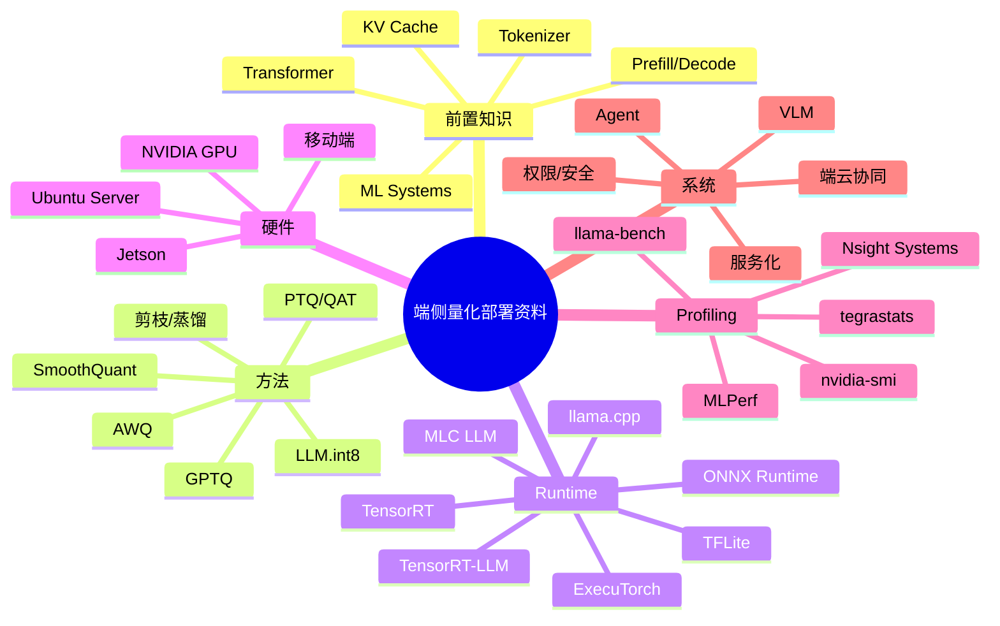

# 参考资料地图

## 建议学时

2 学时。

本页既是学习者的阅读导航，也是课程后续扩写时的资料池。课堂上不要求一次读完所有资料，而是训练学习者知道“遇到某类问题应该查哪一类来源”。

首次学习按 [Start Here](/docs/start-here) 走主线即可。本页主要用于教师备课、项目报告引用和扩展阅读。

## 学习目标

- 建立课程后续扩写的资料来源池。
- 区分基础论文、量化方法、runtime 框架、端侧部署、Jetson、VLM/Agent 和 profiling 工具。
- 优先阅读官方文档和一手论文，避免只依赖二手博客。
- 能根据项目问题选择 3 到 6 个核心来源，而不是堆砌链接。
- 能在最终报告中说明资料如何影响技术取舍。

## 资料怎么用

本页不是“参考链接仓库”。它的用途是把课程书扩写和项目实践需要的材料分层。

建议使用方式：

1. 先用课程章节建立问题框架。
2. 再从本页选择对应资料。
3. 只读和当前问题有关的章节或论文部分。
4. 把资料中的方法、指标或实验设计转化为自己的表格。
5. 不复制原文，不复制图表，不把资料结论直接套到自己的硬件上。

如果要参考完整课程或在线教材，优先看：[类似教材与教程参考](/docs/similar-courses)。

如果要理解为什么本课程这样取舍，优先看：[资料对比与课程取舍](/docs/source-comparison)。

## 课程内部导航

| 需求 | 先看 |
| --- | --- |
| 不知道怎么开始 | [Start Here：我该怎么学这门课](/docs/start-here) |
| 不确定设备能不能学 | [环境与版本矩阵](/docs/environment-matrix) |
| 看不懂指标和缩写 | [端侧部署术语表](/docs/glossary) |
| 公式符号混乱 | [公式与符号约定](/docs/math-conventions) |
| 不知道最终报告怎么写 | [最终报告模板](/docs/report-template) 和 [完成版报告样例](/docs/example-final-report) |
| 实验报错 | [排障索引](/docs/troubleshooting-index) |
| 教师备课和裁剪 | [教师使用指南](/docs/instructor-guide) |

## 资料地图



## 外部资料原图索引

下面这些图是本课程已经吸收进章节的代表性素材。阅读资料地图时，先看图对应哪类问题，再去读对应来源，不要从链接列表里随机跳。


| 原图 | 先读哪类资料 | 回到课程哪里 |
| --- | --- | --- |
| full NLP pipeline | Hugging Face LLM Course / Transformers | 前置知识、baseline、local API |
| quantization schemes | DeepLearning.AI / PyTorch / ONNX 量化 | 量化数学、PTQ/QAT、LLM 量化 |
| benchmarking lab | vLLM / MLPerf / llama-bench | 推理加速、样例日志、最终报告 |
| Jetson 设备族 | Jetson docs / Jetson AI Lab | 环境矩阵、Jetson 实验 |
| local-first agent | Microsoft EdgeAI / Agent 资料 | VLM/Agent、系统复盘 |

把外部资料直接吸收进章节时，先按问题选材料，不按来源一股脑搬运：

| 当前要补的内容 | 直接吸收什么 | 放进哪个页面 |
| --- | --- | --- |
| 学生看不懂输入链路 | pipeline、tokenization、chat template 图和字段 | 前置知识、baseline、local API |
| 量化解释太抽象 | bit-width、scale、calibration、outlier、quality tradeoff | 量化数学、PTQ/QAT、LLM 量化 |
| 实验记录太空 | benchmark 字段、workload、硬件、日志路径 | profiling、sample-logs、final-project |
| Jetson 讲得像设备介绍 | JetPack/L4T、功耗模式、温度、统一内存 | environment-matrix、jetson-deployment、lab-jetson |
| Agent 内容太概念 | tool schema、confirm、fallback、trace、policy check | VLM/Agent、案例复盘、最终报告风险 |

## 阅读优先级

资料很多，建议按课程阶段分层阅读。

| 阶段 | 必读 | 选读 |
| --- | --- | --- |
| 入门 | Hugging Face LLM Course、ML Systems Book 相关章节 | Attention 论文 |
| 量化 | PyTorch/ONNX Runtime/TFLite 量化文档 | GPTQ/AWQ/SmoothQuant/LLM.int8 论文 |
| LLM 实作 | Qwen llama.cpp、llama.cpp 文档 | Transformers quantization |
| 推理加速 | TensorRT、TensorRT-LLM、vLLM、MLC LLM 概览 | Nsight、MLPerf |
| Jetson | Jetson docs、JetPack、Jetson AI Lab | TensorRT 示例 |
| VLM/Agent | Transformers 多模态任务、函数调用/工具调用文档 | Agent 框架文档 |

课程讲义应该把资料“消化”成教学结构，而不是让学生在链接中迷路。

## 主参考来源

| 来源 | 放入资料地图的原因 | 主要对应章节 |
| --- | --- | --- |
| [MIT 6.5940 TinyML and Efficient Deep Learning Computing](https://hanlab.mit.edu/courses/2024-fall-65940) | 高效深度学习、压缩、量化和 LLM 部署的课程骨架 | 前置知识、量化压缩、压缩蒸馏 |
| [Coursera Deploying Deep Learning: Quantization, Serving, and Edge AI](https://www.coursera.org/learn/deploying-deep-learning-quantization-serving-and-edge-ai) | 把量化、serving、edge、benchmark、API 和项目串成完整链路 | 量化压缩、Runtime、最终项目 |
| [DeepLearning.AI vLLM](https://www.deeplearning.ai/courses/fast-and-efficient-llm-inference-with-vllm/) / [Efficiently Serving LLMs](https://www.deeplearning.ai/courses/efficiently-serving-llms/) | 推理服务、KV Cache、PagedAttention、batching、TTFT 和 throughput | Runtime 与推理加速、服务化 |
| [DeepLearning.AI Quantization Fundamentals](https://www.deeplearning.ai/courses/quantization-fundamentals/) / [Quantization in Depth](https://www.deeplearning.ai/courses/quantization-in-depth/) | 线性量化、粒度、对称/非对称、weight packing | 量化数学基础、PTQ/QAT |
| [NVIDIA TensorRT Edge-LLM](https://github.com/NVIDIA/TensorRT-Edge-LLM) / [Jetson AI Lab](https://www.jetson-ai-lab.com/) | Jetson/edge LLM/VLM、TensorRT、功耗和边缘约束 | Jetson 实作、VLM、端侧部署框架 |
| [MLC LLM](https://llm.mlc.ai/) / [LiteRT](https://developers.google.com/edge/litert) | 跨平台和移动端 on-device runtime 路线 | 移动端路线、Runtime 横向比较 |
| [Qwen llama.cpp](https://qwen.readthedocs.io/en/latest/run_locally/llama.cpp.html) | Qwen、GGUF、llama.cpp、量化和本地部署 | Qwen baseline、量化对比、服务化 |
| [LLM 后训练实践](https://posttrain.gaozhijun.me/docs/lecture-5/) / [大模型微调与部署指南](https://wuduoyi.com/llm-finetune/deploy.html) | 中文语境下的压缩、微调、部署参数和服务化细节 | 微调、压缩、VLM/Agent、部署服务 |
| [microsoft/edgeai-for-beginners](https://github.com/microsoft/edgeai-for-beginners) | SLM、EdgeAI 应用、多平台样例、agent/function calling | EdgeAI 叙事、VLM/Agent、系统案例 |
| [arm-education/Advanced-AI-Hardware-Software-Co-Design](https://github.com/arm-education/Advanced-AI-Hardware-Software-Co-Design) | 极端量化、QAT、逐层 bit-width 搜索、Android llama.cpp benchmark | 量化高级选做、移动端扩展 |

## 基础与 LLM

| 资料 | 用途 | 课程吸收方式 |
| --- | --- | --- |
| [Attention Is All You Need](https://arxiv.org/abs/1706.03762) | Transformer 基础 | 只保留 attention、sequence length、计算/内存直觉 |
| [Hugging Face Transformers documentation](https://huggingface.co/docs/transformers/index) | 模型、tokenizer、生成、chat template | 用作 tokenizer、生成参数、模型加载的术语来源 |
| [Hugging Face LLM Course](https://huggingface.co/learn/llm-course/chapter1/1) | LLM 基础课程 | 借鉴入门顺序，但不展开训练主线 |
| [Transformers chat templates](https://huggingface.co/docs/transformers/chat_templating) | Instruct 模型部署常见问题 | 用于解释本地模型对话格式错误 |
| [Transformers KV cache](https://huggingface.co/docs/transformers/kv_cache) | KV Cache 概念和生成优化 | 用于上下文长度、prefill/decode、内存实验 |
| [vLLM PagedAttention paper](https://arxiv.org/abs/2309.06180) | KV Cache 管理和服务化推理系统 | 作为服务化推理的扩展阅读 |
| [The Machine Learning Systems Book](https://www.mlsysbook.ai/) | ML 系统、部署、性能和可靠性 | 用于建立系统指标和工程复盘视角 |

## 量化方法

| 资料 | 用途 | 课程吸收方式 |
| --- | --- | --- |
| [PyTorch Quantization](https://pytorch.org/docs/stable/quantization.html) | PTQ/QAT 基础概念 | 解释 eager/graph、校准、量化感知训练 |
| [torchao documentation](https://docs.pytorch.org/ao/stable/) | PyTorch 新量化/低比特生态 | 作为 PyTorch 低比特路线补充 |
| [ONNX Runtime Quantization](https://onnxruntime.ai/docs/performance/model-optimizations/quantization.html) | ONNX PTQ、校准、静态/动态量化 | 构建传统模型 PTQ 流程图 |
| [TensorFlow Lite Model Optimization](https://www.tensorflow.org/model_optimization) | 移动端模型优化 | 对比移动端 PTQ/QAT 和端侧约束 |
| [OpenVINO Model Optimization Guide](https://docs.openvino.ai/2025/openvino-workflow/model-optimization.html) | Intel/OpenVINO 优化路径 | 对比厂商 runtime 的量化流程 |
| [GPTQ paper](https://arxiv.org/abs/2210.17323) | 大模型 weight-only PTQ | 解释二阶近似和逐层量化动机 |
| [AWQ paper](https://arxiv.org/abs/2306.00978) | Activation-aware weight quantization | 解释 activation-aware 和保护重要权重 |
| [SmoothQuant paper](https://arxiv.org/abs/2211.10438) | W8A8 和 activation outlier 平滑 | 解释 outlier 从 activation 迁移到 weight 的思路 |
| [LLM.int8 paper](https://arxiv.org/abs/2208.07339) | outlier-aware 8-bit LLM 推理 | 解释 outlier channel 对 LLM 量化的影响 |
| [Hugging Face Transformers quantization](https://huggingface.co/docs/transformers/quantization/overview) | Transformers 生态中的量化入口 | 作为工具生态地图，不作为 API 手册逐条讲 |

## 压缩与蒸馏

| 资料 | 用途 | 课程吸收方式 |
| --- | --- | --- |
| [EfficientML.ai](https://efficientml.ai/) | 高效模型、剪枝、量化、TinyML | 借鉴压缩方法分类和硬件感知视角 |
| [MIT 6.5940 TinyML and Efficient Deep Learning Computing](https://hanlab.mit.edu/courses/2024-fall-65940) | 体系化高效深度学习课程 | 借鉴课程组织，不展开硬件电路细节 |
| [Distilling the Knowledge in a Neural Network](https://arxiv.org/abs/1503.02531) | 知识蒸馏基础 | 用于解释 teacher/student 思路 |
| [DistilBERT paper](https://arxiv.org/abs/1910.01108) | Transformer 蒸馏案例 | 作为 NLP 蒸馏代表案例 |

压缩与蒸馏在本课程中作为端侧部署的“模型侧改造”模块，不把训练细节变成主线。

## Runtime 与端侧部署

| 资料 | 用途 | 课程吸收方式 |
| --- | --- | --- |
| [llama.cpp](https://github.com/ggml-org/llama.cpp) | GGUF、本地 LLM、CPU/GPU 推理、server | 课程 LLM 实作主线 |
| [Qwen llama.cpp 本地运行](https://qwen.readthedocs.io/en/v2.5/run_locally/llama.cpp.html) | Qwen 小模型本地实作 | Ubuntu/Qwen baseline 的主要参考 |
| [Qwen llama.cpp 量化](https://qwen.readthedocs.io/en/v2.5/quantization/llama.cpp.html) | Qwen GGUF 量化路线 | Q8/Q5/Q4 对比实验参考 |
| [TensorRT documentation](https://docs.nvidia.com/deeplearning/tensorrt/latest/) | NVIDIA 推理优化 | 解释 graph、kernel、precision 和 engine |
| [TensorRT-LLM documentation](https://nvidia.github.io/TensorRT-LLM/) | NVIDIA LLM 推理优化 | 作为 LLM 高性能推理扩展 |
| [ONNX Runtime](https://onnxruntime.ai/docs/) | 跨平台推理 runtime | 传统模型和跨平台部署路线 |
| [ExecuTorch documentation](https://pytorch.org/executorch/stable/) | PyTorch 端侧部署 | 移动端和嵌入式 PyTorch 路线 |
| [TensorFlow Lite](https://www.tensorflow.org/lite) | 移动端/嵌入式部署 | 传统移动端部署路线 |
| [Core ML Tools optimization](https://apple.github.io/coremltools/docs-guides/source/opt-overview.html) | Apple 设备优化 | Apple 端侧路线扩展 |
| [MLC LLM](https://llm.mlc.ai/docs/) | 跨平台 LLM 部署 | 跨平台编译和移动端 LLM 扩展 |

## 推理加速与服务化

| 资料 | 用途 | 课程吸收方式 |
| --- | --- | --- |
| [vLLM Documentation](https://docs.vllm.ai/) | LLM serving、PagedAttention、KV Cache 管理 | 解释服务化推理和 KV 管理，不作为主实验框架 |
| [TensorRT-LLM documentation](https://nvidia.github.io/TensorRT-LLM/) | NVIDIA LLM 推理优化 | 说明高性能 GPU 路线和课程主线差异 |
| [llama.cpp server](https://github.com/ggml-org/llama.cpp/tree/master/tools/server) | 本地 OpenAI-compatible API | 课程服务化实验入口 |
| [OpenAI API reference](https://platform.openai.com/docs/api-reference) | API 形态参考 | 用于理解 OpenAI-compatible 本地服务接口 |

推理加速资料要服务于“瓶颈定位”：prefill、decode、KV Cache、batch、kernel、memory bandwidth、GPU offload 和服务化。

## Ubuntu Server 与 NVIDIA GPU

| 资料 | 用途 | 课程吸收方式 |
| --- | --- | --- |
| [Ubuntu Server NVIDIA driver guide](https://ubuntu.com/server/docs/how-to/graphics/install-nvidia-drivers/) | Ubuntu 安装 NVIDIA 驱动 | Ubuntu 实验环境参考 |
| [NVIDIA CUDA Installation Guide for Linux](https://docs.nvidia.com/cuda/cuda-installation-guide-linux/) | CUDA Linux 安装 | 解释 driver/CUDA/runtime 匹配 |
| [NVIDIA Container Toolkit Install Guide](https://docs.nvidia.com/datacenter/cloud-native/container-toolkit/latest/install-guide.html) | 容器访问 GPU | 作为后续部署扩展 |
| [NVIDIA Nsight Systems](https://developer.nvidia.com/nsight-systems) | 系统级 profiling | 作为 GPU profiling 扩展 |

## Jetson 与边缘硬件

| 资料 | 用途 | 课程吸收方式 |
| --- | --- | --- |
| [NVIDIA Jetson documentation](https://docs.nvidia.com/jetson/) | Jetson 官方文档 | Jetson 软件栈和设备概念 |
| [NVIDIA JetPack SDK](https://developer.nvidia.com/embedded/jetpack) | JetPack、CUDA、TensorRT | Jetson 环境链路 |
| [Jetson AI Lab](https://www.jetson-ai-lab.com/) | Jetson AI 实作示例 | 借鉴边缘 AI demo 和部署方式 |
| [TensorRT documentation](https://docs.nvidia.com/deeplearning/tensorrt/latest/) | Jetson 上的 NVIDIA runtime | 视觉模型和加速路线 |

Jetson 资料在课程中主要用于强调功耗、温度、共享内存、迁移和稳定性，而不是型号百科。

## VLM 与 Agent

| 资料 | 用途 | 课程吸收方式 |
| --- | --- | --- |
| [Hugging Face image-text-to-text task](https://huggingface.co/tasks/image-text-to-text) | VLM 任务入口 | 解释 VLM 输入输出和模型形态 |
| [Hugging Face Transformers documentation](https://huggingface.co/docs/transformers/index) | 多模态模型生态 | 查模型加载和 processor 概念 |
| [OpenAI Function Calling guide](https://platform.openai.com/docs/guides/function-calling) | 工具调用接口思想 | 借鉴工具 schema 和调用边界 |
| [OpenAI Agents SDK documentation](https://openai.github.io/openai-agents-python/) | Agent 结构参考 | 借鉴 agent、tool、handoff、guardrail 概念 |
| [The Machine Learning Systems Book](https://www.mlsysbook.ai/) | 系统可靠性和部署视角 | 用于 Agent 系统复盘 |

本课程的 VLM/Agent 部分以架构判断为主，不把完整框架开发作为主线。

## Profiling 与评估

| 资料 | 用途 | 课程吸收方式 |
| --- | --- | --- |
| [llama.cpp llama-bench](https://github.com/ggml-org/llama.cpp/tree/master/tools/llama-bench) | LLM 本地 benchmark | 课程推理加速实验 |
| [NVIDIA Nsight Systems](https://developer.nvidia.com/nsight-systems) | GPU/系统级 profiling | 扩展分析工具 |
| [MLPerf Inference](https://mlcommons.org/benchmarks/inference/) | 标准化推理 benchmark 思路 | 借鉴指标定义和报告严谨性 |
| [ONNX Runtime performance](https://onnxruntime.ai/docs/performance/) | ONNX Runtime 性能优化 | 传统模型 runtime 优化参考 |

课程不追求 MLPerf 竞赛级流程，但吸收它“指标明确、条件明确、结果可复现”的报告习惯。

## 资料到章节的映射

| 课程章节 | 主要资料 | 使用方式 |
| --- | --- | --- |
| 前置知识 | Hugging Face LLM Course、Transformers docs、ML Systems Book | 建立 tokenizer、生成、KV Cache 和系统指标 |
| 端侧部署框架 | ML Systems Book、EfficientML、Jetson docs | 建立决策矩阵和端云协同图 |
| 量化基础 | PyTorch、ONNX Runtime、TFLite、OpenVINO | 组织 PTQ/QAT 和校准流程 |
| LLM 量化 | GPTQ、AWQ、SmoothQuant、LLM.int8、Qwen | 组织方法对比和实验假设 |
| 推理加速 | TensorRT、vLLM、TensorRT-LLM、llama.cpp | 解释 prefill/decode、KV、kernel、runtime |
| Ubuntu 实作 | Ubuntu、CUDA、Qwen、llama.cpp | 建立可运行 baseline |
| Jetson 实作 | Jetson docs、JetPack、Jetson AI Lab | 迁移验证和边缘约束记录 |
| VLM/Agent | HF VLM、OpenAI tool/agents docs、ML Systems Book | 系统设计和权限边界 |
| 案例复盘 | MLPerf、Nsight、llama-bench | 建立最终报告模板 |

## 来源吸收标记

后续扩写章节时，不只在末尾堆参考链接。每个核心章节应在“参考资料”前写清楚本章如何吸收外部资料：

| 标记 | 要回答的问题 | 不要做什么 |
| --- | --- | --- |
| 知识点 | 本章借鉴了哪些概念、边界或术语 | 不把外部教程改写成 API 手册 |
| 图解 | 哪些开放许可原图可直接贴入，哪些结构要重画成本课程图表 | 不贴来源或许可不清的第三方原图 |
| 实验 | 外部方法如何落到 Qwen、GGUF、llama.cpp、Jetson 或 profiling | 不引用别人的 benchmark 数字当作本课结论 |
| 取舍 | 哪些内容只作为扩展阅读 | 不把厂商路线写成唯一答案 |
| 素材状态 | 原图、截图或表格现在在正文、暂存页还是只保留链接 | 不让素材来源失去追踪 |

推荐格式：

```markdown
本章吸收方式：

- **知识点**：...
- **图解**：...
- **实验**：...
- **取舍**：...
- **素材状态**：...
```

如果某章只是路线阅读，可以只保留“知识点”和“取舍”；如果某章是实验章，必须写清楚“实验”如何进入日志、表格或最终报告。

## 学生阅读任务模板

```markdown
## 阅读资料

- 链接：
- 资料类型：论文 / 官方文档 / 课程 / 工具文档
- 对应课程章节：

## 读到的关键点

1. 待填
2. 待填
3. 待填

## 可以吸收到本项目的内容

| 内容 | 如何使用 | 风险 |
| --- | --- | --- |
| 待填 | 待填 | 待填 |

## 不适合直接采用的内容

- 待填：

## 对实验设计的影响

- 新增指标：
- 新增对比：
- 新增失败样例：
```

## 后续扩写建议

- 先从 [可吸收原始资料暂存](/docs/raw-reference-intake) 取图和要点：已确认开放许可的原图可以贴进对应章节，许可不清的只保留链接或重画。
- 量化基础章节吸收 PyTorch、ONNX Runtime、TFLite 文档，补完整 PTQ/QAT 流程。
- 大模型量化章节吸收 GPTQ、AWQ、SmoothQuant、LLM.int8 和 Transformers quantization 文档，补方法对比。
- Runtime 章节吸收 llama.cpp、TensorRT、TensorRT-LLM、ExecuTorch、MLC LLM，补框架选型表。
- Profiling 章节吸收 llama-bench、Nsight Systems、MLPerf，补实验方法和记录规范。
- Jetson 章节吸收 Jetson docs、JetPack 和 Jetson AI Lab，补功耗、温度和边缘设备约束。
- VLM/Agent 章节吸收多模态任务文档和工具调用文档，补端云协同和权限边界。

## 使用边界

- 不复制资料正文或课程作业。
- 配图按许可处理：明确开放许可的原图可直接嵌入并标注来源；许可不清的图只放链接或重画为 Mermaid、表格、原创示意图。
- 不把论文 benchmark 当成本课程实验结果。
- 不把官方文档改写成 API 手册。
- 不引用未验证的性能数字。
- 不把单一厂商路线写成唯一正确路线。
