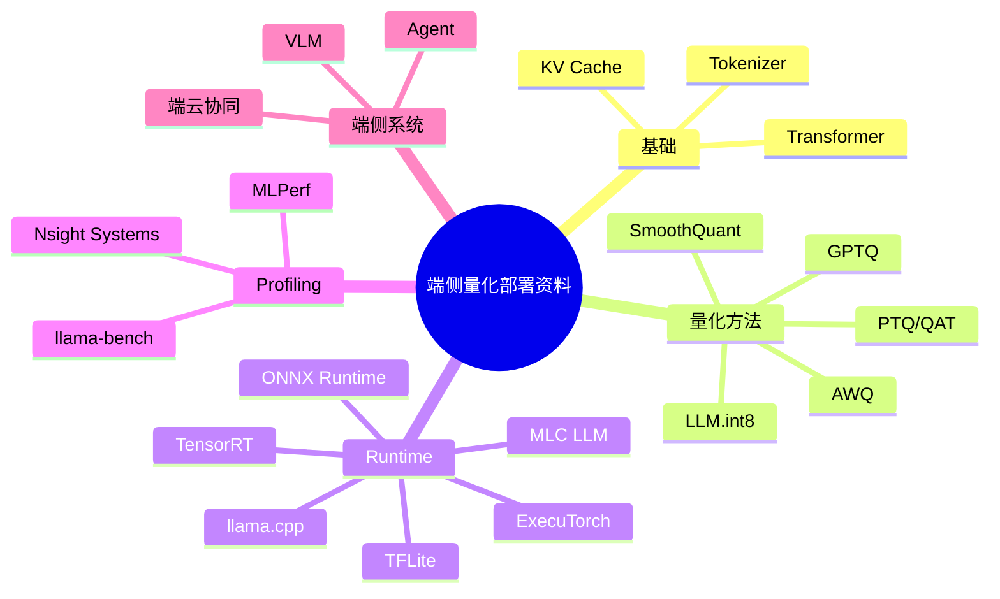

# 参考资料地图

## 学习目标

- 建立课程后续扩写的资料来源池。
- 区分基础论文、量化方法、runtime 框架、端侧部署和 profiling 工具。
- 优先阅读官方文档和一手论文，避免只依赖二手博客。

## 资料怎么用

本页不是让学习者一次读完所有资料，而是把课程书扩写时需要引用和吸收的材料分层。后续写正文时，每章可以从这里抽取最相关的 3 到 6 个来源。

如果要参考完整课程或在线教材，优先看：[类似教材与教程参考](/docs/similar-courses)。

## 资料地图

## 基础与 LLM

| 资料 | 用途 |
| --- | --- |
| [Attention Is All You Need](https://arxiv.org/abs/1706.03762) | Transformer 基础 |
| [Hugging Face Transformers documentation](https://huggingface.co/docs/transformers/index) | 模型、tokenizer、生成、chat template |
| [Transformers chat templates](https://huggingface.co/docs/transformers/chat_templating) | Instruct 模型部署常见问题 |
| [Transformers KV cache](https://huggingface.co/docs/transformers/kv_cache) | KV Cache 概念和生成优化 |
| [vLLM PagedAttention paper](https://arxiv.org/abs/2309.06180) | KV Cache 管理和服务化推理系统 |

## 量化方法

| 资料 | 用途 |
| --- | --- |
| [PyTorch Quantization](https://pytorch.org/docs/stable/quantization.html) | PTQ/QAT 基础概念 |
| [torchao documentation](https://docs.pytorch.org/ao/stable/) | PyTorch 新量化/低比特生态 |
| [ONNX Runtime Quantization](https://onnxruntime.ai/docs/performance/model-optimizations/quantization.html) | ONNX PTQ、校准、静态/动态量化 |
| [GPTQ paper](https://arxiv.org/abs/2210.17323) | 大模型 weight-only PTQ |
| [AWQ paper](https://arxiv.org/abs/2306.00978) | Activation-aware weight quantization |
| [SmoothQuant paper](https://arxiv.org/abs/2211.10438) | W8A8 和 activation outlier 平滑 |
| [LLM.int8 paper](https://arxiv.org/abs/2208.07339) | outlier-aware 8-bit LLM 推理 |
| [Hugging Face Transformers quantization](https://huggingface.co/docs/transformers/quantization/overview) | Transformers 生态中的量化入口 |

## Runtime 与端侧部署

| 资料 | 用途 |
| --- | --- |
| [llama.cpp](https://github.com/ggml-org/llama.cpp) | GGUF、本地 LLM、CPU/GPU 推理、server |
| [Qwen llama.cpp 本地运行](https://qwen.readthedocs.io/en/v2.5/run_locally/llama.cpp.html) | Qwen 小模型本地实作 |
| [Qwen llama.cpp 量化](https://qwen.readthedocs.io/en/v2.5/quantization/llama.cpp.html) | Qwen GGUF 量化路线 |
| [TensorRT documentation](https://docs.nvidia.com/deeplearning/tensorrt/latest/) | NVIDIA 推理优化 |
| [TensorRT-LLM documentation](https://nvidia.github.io/TensorRT-LLM/) | NVIDIA LLM 推理优化 |
| [ONNX Runtime](https://onnxruntime.ai/docs/) | 跨平台推理 runtime |
| [ExecuTorch documentation](https://pytorch.org/executorch/stable/) | PyTorch 端侧部署 |
| [TensorFlow Lite](https://www.tensorflow.org/lite) | 移动端/嵌入式部署 |
| [Core ML Tools optimization](https://apple.github.io/coremltools/docs-guides/source/opt-overview.html) | Apple 设备优化 |
| [MLC LLM](https://llm.mlc.ai/docs/) | 跨平台 LLM 部署 |

## Profiling 与评估

| 资料 | 用途 |
| --- | --- |
| [llama.cpp llama-bench](https://github.com/ggml-org/llama.cpp/tree/master/tools/llama-bench) | LLM 本地 benchmark |
| [NVIDIA Nsight Systems](https://developer.nvidia.com/nsight-systems) | GPU/系统级 profiling |
| [MLPerf Inference](https://mlcommons.org/benchmarks/inference/) | 标准化推理 benchmark 思路 |
| [ONNX Runtime performance](https://onnxruntime.ai/docs/performance/) | ONNX Runtime 性能优化 |

## 后续扩写建议

- 量化基础章节吸收 PyTorch、ONNX Runtime、TFLite 文档，补完整 PTQ/QAT 流程。
- 大模型量化章节吸收 GPTQ、AWQ、SmoothQuant、LLM.int8 和 Transformers quantization 文档，补方法对比。
- Runtime 章节吸收 llama.cpp、TensorRT、TensorRT-LLM、ExecuTorch、MLC LLM，补框架选型表。
- Profiling 章节吸收 llama-bench、Nsight Systems、MLPerf，补实验方法和记录规范。
