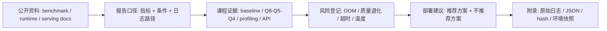

# 最终报告模板

每章实验结束后都应该把结果写入这份报告，而不是最后才整理。

## 实验产物放哪里

| 实验产物 | 正文位置 | 附录证据 |
| --- | --- | --- |
| 场景约束卡 | 第 1 节 | 需求说明或课堂题目 |
| 环境快照 | 第 2 节 | `results/env-check.txt` 或同等环境日志 |
| baseline log | 第 3 节 | `logs/qwen-baseline-*.txt` |
| Q8/Q5/Q4 对比 | 第 4 节 | `logs/qwen-*.txt`、对比表 |
| runtime/profiling 对比 | 第 5、7 节 | `llama-bench`、`nvidia-smi`、`tegrastats` 日志 |
| API smoke test | 第 6、7 节 | 请求记录、响应 JSON、HTTP 状态、elapsed/meta、是否超时、server 日志异常检查、模型 hash、server 参数 |
| 推荐和不推荐方案 | 第 8 节 | 支撑结论的日志和表格 |

## 公开资料怎么转成本报告

MLPerf、llama-bench、Nsight Systems、Qwen/llama.cpp 文档和服务化资料都能提供报告写法，但本课程不复制外部榜单数字。报告只吸收它们的证据习惯：实验条件要写清楚，指标要能追溯，失败和未测项要进入风险登记，最后推荐必须来自自己的 Qwen GGUF、量化、profiling 和 local API 记录。



| 外部资料中的经典内容 | 报告模板吸收什么 | 模板里的落点 |
| --- | --- | --- |
| MLPerf Inference | 指标、负载和运行条件一起报告 | 第 3-5 节每个数字都附日志路径和参数 |
| llama.cpp llama-bench | 区分 prompt processing 和 token generation | 第 5 节 `llama-bench` 行，不替代业务 prompt 质量判断 |
| Nsight Systems | 性能分析要回到时间线和资源证据 | 第 7 节风险登记，必要时说明下一轮深入 profiling |
| Qwen / llama.cpp 文档 | 模型来源、GGUF、runtime commit 和 server 参数 | 第 2、3、6 节的模型、hash、commit、API 字段 |
| OpenAI-compatible API 资料 | 请求、响应、HTTP 状态和端到端耗时要分开 | 第 6 节 API 服务测试 |
| 课程实跑记录 | 脱敏日志、失败记录和未测说明的写法 | 附录和“缺失和失败怎么写” |

底线：报告不能把“跑过一次”写成“可以部署”。推荐方案至少要同时有量化对比、runtime/API 记录和风险登记支撑。

```markdown
# 端侧模型量化部署评估报告

## 1. 场景与设备约束

- 应用场景：
- 目标用户：
- 为什么需要端侧：
- 延迟要求：
- 内存限制：
- 功耗/温度限制：
- 隐私、网络或成本约束：

场景约束卡：

| 约束 | 填写 |
| --- | --- |
| 目标设备 | 待填 |
| 固定 prompt / workload | 待填 |
| 最低可接受质量 | 待填 |
| 最大可接受延迟 | 待填 |
| 最大内存/显存预算 | 待填 |
| 是否必须离线 | 待填 |

## 2. 实验环境

| 项目 | 记录 |
| --- | --- |
| OS | 待填 |
| CPU | 待填 |
| RAM | 待填 |
| GPU / Jetson | 待填 |
| Driver / CUDA / JetPack | 待填 |
| Python | 待填 |
| llama.cpp commit | 待填 |
| 模型来源 | 待填 |
| 模型许可证 | 待填 |
| 模型 SHA256 | 待填 |
| 环境日志路径 | 待填 |

第 2 节字段从这里抄：

| 字段 | 来源 |
| --- | --- |
| OS、CPU、RAM、Python | `results/env-check.txt` 或 [Ubuntu Server 与 NVIDIA GPU 环境](/docs/lab-ubuntu-nvidia) 的结果记录表 |
| GPU / Jetson | `nvidia-smi`、Jetson 型号或环境矩阵；未使用 Jetson 时写“不适用（未测）” |
| Driver / CUDA / JetPack | Ubuntu 写 NVIDIA Driver、`nvidia-smi` CUDA、`nvcc` 是否存在；Jetson 写 JetPack/L4T |
| llama.cpp commit | `~/edge-ai-lab/src/llama.cpp` 中的 `git rev-parse --short HEAD`，不是课程仓库 commit |
| 模型来源、许可证、SHA256 | Qwen GGUF 模型信息表；查不到许可证写“未记录”，不要猜 |
| 环境日志路径 | `~/edge-ai-lab/results/env-check.txt`、`~/edge-ai-lab/env/ubuntu-env.txt` 或 `~/edge-ai-lab/env/jetson-env.txt` |

## 3. Baseline 结果

| 指标 | 结果 | 说明 |
| --- | --- | --- |
| 模型文件 | 待填 | 待填 |
| 量化格式 | 待填 | 待填 |
| prompt | 待填 | 待填 |
| `ctx-size` | 待填 | 待填 |
| `-ngl` | 待填 | 待填 |
| 首 token / prompt eval | 待填 | 日志路径 |
| tokens/s / eval | 待填 | 日志路径 |
| 峰值内存/显存 | 待填 | 监控方式 |
| 输出质量 | 待填 | prompt 编号 + 输出日志路径 + 一句话差异 |

日志字段映射：

| 日志字段 | 报告指标 | 说明 |
| --- | --- | --- |
| `prompt eval time` | prefill / prompt eval | 写入第 3、4、5 节的 TTFT 或 prefill 相关格子。 |
| `eval time` / `tokens per second` | tokens/s / eval | 写入速度格子，保持同一 prompt 和参数。 |
| `common_perf_print` | 本次 CLI baseline 性能摘要 | 抄 prompt eval、eval、total time，不要把采样时间当成模型速度。 |
| `llama-bench` 的 `pp` / `tg` 行 | 标准化 benchmark | `pp` 近似 prompt processing，`tg` 近似 token generation，写入第 5 节。 |
| `nvidia-smi` / `tegrastats` | 峰值内存/显存、温度/功耗 | 写入第 3、4、5、7 节，并附监控日志路径；Jetson 重点记录 RAM、GR3D、温度和 VDD_IN。 |
| curl 或 Python 客户端计时 | API 端到端延迟 | 写入第 6 节，不要和 CLI tokens/s 混为一谈。 |

## 4. 量化版本对比

| 版本 | 文件大小 | TTFT / prefill | tokens/s | 内存 | 输出质量 | 质量证据 | 判断 |
| --- | ---: | ---: | ---: | ---: | --- | --- | --- |
| Q8 | 待填 | 待填 | 待填 | 待填 | 待填 | prompt 编号 + 日志路径 + 一句话差异 | 待填 |
| Q5 | 待填 | 待填 | 待填 | 待填 | 待填 | prompt 编号 + 日志路径 + 一句话差异 | 待填 |
| Q4 | 待填 | 待填 | 待填 | 待填 | 待填 | prompt 编号 + 日志路径 + 一句话差异 | 待填 |

## 5. Runtime 参数与加速实验

| 参数变化 | TTFT / prefill | tokens/s | 内存 | 日志路径 | 现象 | 结论 |
| --- | ---: | ---: | ---: | --- | --- | --- |
| `-ngl` | 待填 | 待填 | 待填 | 待填 | 待填 | 待填 |
| `ctx-size` | 待填 | 待填 | 待填 | 待填 | 待填 | 待填 |
| threads | 待填 | 待填 | 待填 | 待填 | 待填 | 待填 |
| llama-bench | 待填 | 待填 | 待填 | 待填 | 待填 | 待填 |

## 6. API 服务测试

| 字段 | 要求 | 填写 |
| --- | --- | --- |
| 启动命令 | 最低必填 | 待填 |
| 绑定地址和端口 | 最低必填 | 待填 |
| 请求 JSON/curl 路径 | 最低必填 | 待填 |
| 响应摘要 | 最低必填 | 待填 |
| 响应 JSON 路径 | 最低必填 | 待填 |
| HTTP 状态 | 最低必填 | 待填 |
| HTTP 状态和 elapsed 来源 | 最低必填 | 待填 |
| 是否超时 | 最低必填 | 待填 |
| server 日志路径 | 最低必填 | 待填 |
| server 日志异常 | 最低必填 | 待填 |
| 模型文件/hash | 最低必填 | 待填 |
| server 参数 | 最低必填 | 待填 |
| CLI 和 API 的差异 | 建议补充 | 待填 |
| 客户端环境 | 建议补充 | 待填 |

## 7. 端侧部署风险

| 风险项 | 失败现象 | 证据日志 | 影响 | 缓解动作 | 是否进入最终建议 |
| --- | --- | --- | --- | --- | --- |
| 温度/功耗 | 待填 | 待填 | 待填 | 待填 | 是/否 |
| 内存/显存 | 待填 | 待填 | 待填 | 待填 | 是/否 |
| 长上下文 | 待填 | 待填 | 待填 | 待填 | 是/否 |
| 并发/超时 | 待填 | 待填 | 待填 | 待填 | 是/否 |
| 输出质量 | 待填 | 待填 | 待填 | 待填 | 是/否 |
| 许可证 | 待填 | 待填 | 待填 | 待填 | 是/否 |
| 安全和日志 | 待填 | 待填 | 待填 | 待填 | 是/否 |
| 端云 fallback | 待填 | 待填 | 待填 | 待填 | 是/否 |

常见写法：

| 失败现象 | 归入风险项 | 报告写法 |
| --- | --- | --- |
| `ctx-size 4096` OOM | 内存/显存 + 长上下文 | 当前设备不建议使用 4096 ctx，下一轮先验证 1024/2048。 |
| `-ngl 99` 失败或无提升 | Runtime/GPU offload，写入内存/显存或性能风险 | 记录 CUDA/offload 日志，建议回退 `-ngl 0` 或重建 CUDA 版本。 |
| API 首次请求慢或超时 | 并发/超时 | 本轮只通过单请求 smoke test，不能直接承诺并发服务。 |
| Q4 输出跑题、重复、乱码 | 输出质量 | 固定 prompt 下 Q4 不满足质量阈值，不作为默认部署版本。 |
| Jetson 越跑越慢 | 温度/功耗 | 使用 `tegrastats` 证明热/功耗限制，建议改善散热或降低功耗模式。 |
| 模型许可证未记录 | 许可证 | 上线前必须补模型卡或教师提供说明。 |
| 日志含敏感输入 | 安全和日志 | 报告中引用脱敏摘要，原始日志只放受控位置。 |
| 需要云端兜底但未验证 | 端云 fallback | 本轮未测端云切换，写为上线前必测项。 |

## 8. 最终部署建议

- 推荐模型：
- 推荐量化版本：
- 推荐 runtime：
- 推荐参数：
- 不推荐方案：
- 原因：
- 下一步验证：

推荐方案至少要由三类证据支撑：

| 证据类型 | 对应章节 | 结论中怎么用 |
| --- | --- | --- |
| 量化对比 | 第 4 节 | 说明为什么选 Q8/Q5/Q4 或同类变体。 |
| Runtime / API | 第 5、6 节 | 说明推荐参数和服务化成本。 |
| 风险登记 | 第 7 节 | 说明哪些风险已接受，哪些需要下一轮验证。 |

## 9. 附录

- 环境日志：
- baseline 日志：
- 量化对比日志：
- profiling 日志：
- API smoke test 日志：
- API 响应 JSON：
- 参考资料：
```

## 使用规则

- 没有采集到的字段写“未记录”，不要编造。
- 每个数字都要能追溯到日志、命令或监控记录。
- 最终结论必须包含“不推荐方案”和原因。
- 量化后必须说明如何进入 serving、benchmark 和 API 化链路。

## 缺失和失败怎么写

| 情况 | 写法 |
| --- | --- |
| 设备没有该能力 | 写“不适用”，并说明硬件限制，例如无 NVIDIA GPU 或无 Jetson。 |
| 本轮没有采集 | 写“未记录”，并说明下一轮如何补。 |
| 命令失败 | 写“失败”，附错误日志路径和初步判断。 |
| 模型文件缺失 | 写“缺失”，说明计划使用的模型族、量化格式和待确认问题。 |
| 只有两组量化结果 | 可作为阶段性草稿；最终报告必须补第三组或说明无法补齐的硬约束。 |
| 未测 Jetson | 40 学时 Ubuntu-only 项目写“Jetson 不适用（未测）”，说明目标设备选择和未测原因。 |
| 未做 60 学时扩展 | 写“未布置/未做”，说明 vLLM、移动端、LoRA smoke test 或双设备对照不属于本轮最低验收。 |
| 未做移动端路线 | 40 学时写“未做完整移动端实验”，说明课程范围或设备限制；如教师要求路线图，列候选模型格式、runtime、未实测原因和下一步。 |
| API 非 200 或非 JSON | 写“失败”，附 HTTP 状态、响应文件和 server 日志路径。 |

## 参考资料

本章吸收方式：

- **知识点**：从 benchmark、runtime 和 serving 文档吸收报告指标、条件记录、服务化证据和风险登记口径。
- **图解**：把外部评估方法重画为“资料口径 -> 课程证据 -> 风险登记 -> 部署建议 -> 附录”的报告链路。
- **实验**：要求所有 Qwen GGUF、Q8/Q5/Q4、profiling 和 local API 结论都回到日志、表格或 JSON。
- **取舍**：不引用外部榜单数字当作本课程结论，也不把报告模板扩成论文综述。

- [MLPerf Inference](https://mlcommons.org/benchmarks/inference/)
- [llama.cpp llama-bench documentation](https://www.mintlify.com/ggml-org/llama.cpp/api/tools/llama-bench)
- [NVIDIA Nsight Systems](https://developer.nvidia.com/nsight-systems)
- [Qwen llama.cpp 本地运行指南](https://qwen.readthedocs.io/en/v2.5/run_locally/llama.cpp.html)
- [llama.cpp server documentation](https://www.mintlify.com/ggml-org/llama.cpp/inference/server)
- [OpenAI API reference](https://platform.openai.com/docs/api-reference)
