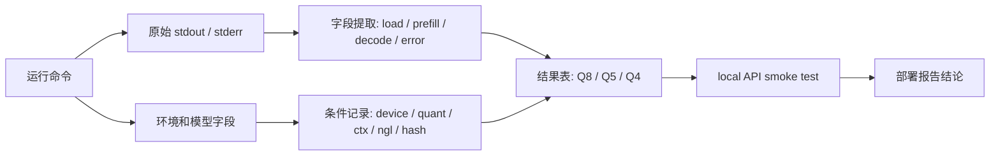

# 样例日志与结果表

本页只展示“怎么读日志”和“怎么填表”。这些片段不代表标准性能。

## 公开资料怎么转成本页样例

MLPerf、Nsight、llama-bench 和服务化文档都强调同一件事：数字必须和条件、日志、输入、版本一起出现。本页只吸收这种证据习惯，把它改写成课堂可填写的日志样例；不复制外部日志格式，也不引用外部 benchmark 数字。



| 外部资料中的记录习惯 | 本页改写成什么 | 报告落点 |
| --- | --- | --- |
| MLPerf 的“指标 + 条件 + 结果” | 每个数字都要带模型、量化、上下文、硬件和日志路径 | 第 3-5 节结果表 |
| llama-bench 区分 prompt processing 和 token generation | 分开读 `prompt eval time` 和 `eval time` | TTFT / prefill、tokens/s |
| Nsight 的时间线和资源证据 | 不只看单个速度数字，还要保留显存、功耗、fallback 或 OOM | 第 7 节风险 |
| llama.cpp server / OpenAI-compatible API | API 状态、elapsed、server log 和 CLI 指标分开记录 | 第 6 节 API 服务测试 |
| 课程实跑记录 | 失败和未测项也进入表格 | 附录和部署建议 |

这页的目标不是教自动解析脚本，而是让学习者在没有复杂工具时，也能把 Qwen GGUF、Q8/Q5/Q4、profiling 和 local API 证据写清楚。

## llama.cpp timings 样例

```text
llama_print_timings:        load time = 示例 ms
llama_print_timings: prompt eval time = 示例 ms / 示例 tokens
llama_print_timings:        eval time = 示例 ms / 示例 runs
llama_print_timings:       total time = 示例 ms / 示例 tokens
```

字段解释：

| 字段 | 对应阶段 | 报告中怎么写 |
| --- | --- | --- |
| `load time` | 模型加载和初始化 | 不要混入稳定 decode |
| `prompt eval time` | prefill | 可近似解释 TTFT 的主要部分 |
| `eval time` | decode | 用于记录 tokens/s |
| `total time` | CLI 总耗时 | 不等于 API 端到端延迟 |

如果日志字段名随 llama.cpp 版本变化，以实际输出为准。

## 日志字段写进哪里

| 日志字段 | 报告栏位 | 不要这样写 |
| --- | --- | --- |
| `load time` | 第 3 节说明或附录日志 | 不要当成稳定 decode 速度。 |
| `prompt eval time` | 第 3/4/5 节的 TTFT / prefill | 不要和 `eval time` 合并成一个速度。 |
| `eval time` | 第 3/4/5 节的 tokens/s / eval | 不要当成 API 端到端耗时。 |
| `total time` | 附录或备注 | 不要直接写成服务 API 延迟。 |
| API `elapsed` | 第 6 节 API 服务测试 | 不要拿它和 CLI tokens/s 直接比较。 |
| OOM、fallback、unsupported | 第 7 节端侧部署风险 | 不要只贴日志不解释影响。 |

## 量化对比样表

| model | quant | ctx | ngl | TTFT / prefill | tokens/s | peak memory | 质量观察 | 结论 |
| --- | --- | ---: | ---: | --- | --- | --- | --- | --- |
| Qwen 示例 | Q8 | 2048 | 99 | 示例 | 示例 | 示例 | 输出稳定 | 质量优先 |
| Qwen 示例 | Q5 | 2048 | 99 | 示例 | 示例 | 示例 | 轻微差异 | 推荐 |
| Qwen 示例 | Q4 | 2048 | 99 | 示例 | 示例 | 示例 | 有退化 | 内存受限时使用 |

## API smoke test 样例

```text
HTTP status: 200
elapsed: 示例 s
response json: ok
server log: no OOM, no fallback warning
```

API 记录要写明：

- `llama-server` 启动命令。
- 绑定地址和端口。
- 请求参数。
- HTTP 状态码。
- 是否超时。
- server 日志中是否有 OOM、fallback、unsupported。

最小记录块：

```text
server command: ./build/bin/llama-server -m ~/edge-ai-lab/models/qwen/xxx.gguf --host 127.0.0.1 --port 8080
bind: 127.0.0.1:8080
request command/json: logs/api-smoke-request.json
response summary: 待填
response json: logs/api-smoke-response.json
http status: 待填
elapsed/meta source: logs/api-smoke-meta.txt
timeout: 是/否
server log: logs/llama-server-smoke.txt
server log exception: 未见 OOM/fallback/unsupported，或写明异常
model file/hash: 待填
server params: ctx-size=待填, ngl=待填
CLI vs API: 待填
client: curl 或 Python 版本
```

## 三句话复盘样例

```text
我比较了 Q8/Q5/Q4 三个版本。
Q5 在当前设备上比 Q8 更省内存，质量退化不明显，速度提升有限。
因此后续 profiling 以 Q5 作为主版本，Q4 作为低内存备选。
```

## 参考资料

本章吸收方式：

- **知识点**：从 benchmark、profiling、llama.cpp 和 API 服务资料中吸收“指标必须可追溯”的记录口径。
- **图解**：重画为“命令 -> 原始日志 -> 字段提取 -> 结果表 -> API -> 报告”的 Mermaid 图。
- **实验**：把 Qwen GGUF、Q8/Q5/Q4、profiling 和 local API 的日志字段放进可填写样表。
- **取舍**：不复制外部原始日志，不引用外部 benchmark 数字，也不新增自动解析工具。

- [参考资料地图](/docs/reference-map)
- [Profiling 与结果记录](/docs/lab-profiling)
- [端侧部署评估报告模板](/docs/report-template)
- [MLPerf Inference](https://mlcommons.org/benchmarks/inference/)
- [llama.cpp llama-bench documentation](https://www.mintlify.com/ggml-org/llama.cpp/api/tools/llama-bench)
- [llama.cpp server](https://github.com/ggml-org/llama.cpp/tree/master/examples/server)
- [NVIDIA Nsight Systems](https://developer.nvidia.com/nsight-systems)
- [Qwen llama.cpp 本地运行指南](https://qwen.readthedocs.io/en/v2.5/run_locally/llama.cpp.html)
