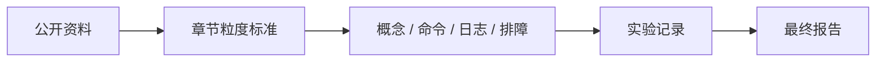

# 自学与实作粒度标准

## 本页目标

本课程书的目标不是让读者“知道有哪些方法”，而是让读者可以独立阅读、照着操作、记录结果，并在失败时知道下一步查什么。

对照 Hugging Face、Qwen、LLaMA-Factory、MIT EfficientML 和 ML systems 类课程后，本书采用更接近教材和 lab handout 的粒度：每个核心章节都要给出概念、命令、检查点、失败排查和验收产物。

课程的 Part 级写作也必须保持这个粒度。每个 Part 都要同时写清“技术点如何循序渐进”和“工程实作如何闭环”，不能只列工具名、论文名或实验名。总细纲见 [Part 技术递进与工程实作细纲](/docs/part-technical-outline)。

## 参考资料的粒度特征

| 资料类型 | 常见粒度 | 本课程吸收方式 |
| --- | --- | --- |
| 在线教材 | 先解释问题，再给概念、图示和术语 | 每章先讲“为什么要学”，再讲“怎么判断” |
| 官方教程 | 环境、数据、命令、参数、输出逐步展开 | 实作章节必须包含可复制命令和结果检查 |
| 课程 lab | 明确任务、提交物、评分或验收标准 | 每个实验要有记录表、失败记录和作业 |
| 工程文档 | 说明限制、版本、硬件和 fallback | 每条部署路线都要写边界条件 |
| 项目课 | 贯穿 proposal、实验、报告和展示 | 本课程用部署评估报告收束全部实验 |



这意味着课程书不能只写“安装依赖并运行训练”。

它应该写到：

- 依赖装在哪里。
- 数据放在哪里。
- 命令从哪个目录执行。
- 输出文件应该出现在哪里。
- 看到什么日志算通过。
- 失败时先查哪个信号。
- 结果如何填进最终报告。

## 统一项目工作区

课程建议所有实验都放在用户主目录下的工作区，不放进课程仓库：

```text
~/edge-ai-lab/
├── env/
│   └── system_info.md
├── models/
│   └── README.md
├── repos/
│   └── llama.cpp/
├── scripts/
├── logs/
│   ├── baseline.log
│   ├── q8.log
│   ├── q5.log
│   └── q4.log
├── results/
│   ├── baseline.csv
│   ├── quant_compare.csv
│   └── acceleration_compare.csv
└── report/
    └── final_report.md
```

规则：

- `models/` 放大模型文件，不提交 Git。
- `logs/` 保存原始日志，不改写。
- `results/` 放整理后的表格。
- `report/final_report.md` 按 [最终报告模板](/docs/report-template) 逐章填写。

## 每章最低结构

核心理论章节至少包含：

| 模块 | 要回答的问题 |
| --- | --- |
| 学习目标 | 学完后能做什么，不只是知道什么 |
| 章节定位 | 它和前后章节、最终项目的关系 |
| 问题背景 | 真实部署中为什么会遇到这个问题 |
| 概念图 | 用流程图或表格降低抽象难度 |
| 核心概念 | 定义、适用边界和常见误解 |
| 最小示例 | 一段能帮助理解的代码、命令或数据 |
| 工程判断 | 什么时候用，什么时候不用 |
| 配套实作 | 指向实验章节或课堂任务 |
| 验收标准 | 学生要交付什么，怎样算完成 |
| 常见问题 | 失败模式和排查顺序 |
| 参考资料 | 官方文档、公开课程或论文入口 |

## 每个 Part 的最低结构

Part 级页面或 Part 导读至少包含：

| 模块 | 要回答的问题 |
| --- | --- |
| 学习顺序 | 技术点从哪个基础概念开始，如何一步步走到工程判断 |
| 核心技术点 | 不只列名词，还要说明概念、边界、常见误解和前后依赖 |
| 工程实作 | 这些技术点落到哪个实验、命令、日志、记录表或案例 |
| 阶段产出 | 学完这一 Part 后能交付什么表格、报告片段或实验结果 |
| 容易误解的边界 | 哪些问题不属于这一 Part，什么时候应回退或换路线 |

推荐写法是：先概念，再边界，再工程判断，最后实验落点。

例如，模型微调 Part 不能只写 LoRA、QLoRA、LLaMA-Factory。它必须先说明什么时候不该微调，再解释数据和 chat template，然后才进入训练参数，最后回到 adapter、再量化和端侧 profiling。

## 每个实作章节最低结构

实作章节必须能让读者在没有教师实时带领时继续推进。

| 模块 | 要写到的粒度 |
| --- | --- |
| 实验边界 | 说明这是 smoke test、baseline 还是正式实验 |
| 推荐硬件 | 写清楚推荐环境和不推荐环境 |
| 目录结构 | 给出仓库内外文件放置方式 |
| 前置检查 | 命令、期望输出、失败记录方式 |
| Step-by-step | 每步只有一个目标，命令可复制 |
| 检查点 | 每步执行后看文件、日志或返回值 |
| 结果记录 | 表格字段固定，方便进入最终报告 |
| 失败排查 | 先查环境，再查数据，再查参数 |
| 继续判断 | 什么时候进入下一实验，什么时候回退 |
| 作业 | 让学生扩展而不是只复现一次 |

## 命令与代码写法

命令示例遵循四条规则：

- 先创建目录，再复制数据，再执行命令。
- 长命令要配合 `tee` 保存日志。
- 不把模型权重、adapter、checkpoint 和日志写入 Git 仓库。
- 不承诺固定性能数字，只要求记录真实设备结果。

示例格式：

```bash
mkdir -p ~/edge-ai-lab/finetune/{data,outputs,logs}

python labs/finetuning/train_lora_smoke.py \
  --model Qwen/Qwen2.5-0.5B-Instruct \
  --data ~/edge-ai-lab/finetune/data/sample_sft_data.jsonl \
  --output ~/edge-ai-lab/finetune/outputs/qwen-lora-smoke \
  --max-steps 5 \
  2>&1 | tee ~/edge-ai-lab/finetune/logs/qwen-lora-smoke.log
```

配套检查点：

```bash
test -d ~/edge-ai-lab/finetune/outputs/qwen-lora-smoke/adapter
tail -n 20 ~/edge-ai-lab/finetune/logs/qwen-lora-smoke.log
```

## 模型微调章节的粒度要求

模型微调尤其不能只讲 LoRA 概念。

本课程的微调章节和实验至少要写清：

1. 什么时候不应该先微调。
2. 如何准备 `messages` JSONL。
3. 如何检查 chat template。
4. 如何跑 5-step smoke test。
5. 如何保存 adapter 和日志。
6. 如何用固定 prompt 对比基座和 adapter。
7. 如何判断是否合并 LoRA。
8. 如何进入量化、GGUF 和端侧 profiling。

如果缺少第 6-8 步，读者只能完成“训练”，不能完成“端侧部署课程”需要的闭环。

## 学生自查清单

每学完一个实验，学生至少回答：

```markdown
## 实验自查

- 我从哪个目录执行命令：
- 我使用的模型和版本：
- 我使用的数据路径：
- 我保存的日志路径：
- 我看到的关键成功信号：
- 我遇到的失败和处理方式：
- 这次结果是否进入最终项目报告：
- 下一步应该做什么：
```

## 学生页和教师页分工

| 页面类型 | 写法 |
| --- | --- |
| 学生版 | 怎么学、怎么做实验、怎么交报告 |
| 教师版 | 为什么这样设计、如何裁剪 40h/60h、如何评分 |
| 参考资料页 | 每章给必读 1 个、选读 2 个，不把资料堆给学生 |

[教师使用指南](/docs/instructor-guide) 专门放教学裁剪和评分建议，避免学生第一次学习时被设计说明打断。

## 教师扩写检查表

后续继续扩写课程书时，每章先用这个检查表过一遍：

| 问题 | 通过标准 |
| --- | --- |
| 读者是否知道本章为什么重要？ | 开头能连接真实部署问题 |
| 读者是否能跟做？ | 至少有一个命令、数据或记录表 |
| 读者是否知道如何验收？ | 有明确产物和检查方法 |
| 读者失败后是否知道查哪里？ | 有常见失败和排查顺序 |
| 结果是否能进入最终报告？ | 表格字段和报告结构能对应 |

## 参考资料

本章吸收方式：

- **知识点**：把公开教材、官方教程和项目课的粒度差异，整理成课程章节、实验章节和教师检查表的最低要求。
- **图解**：重画为“公开资料 -> 章节粒度标准 -> 实验记录 -> 最终报告”的 Mermaid 流程。
- **实验**：要求每个实验都能留下命令、日志、结果表和排障记录，并最终进入部署报告。
- **取舍**：不把本页扩成写作规范大全，只保留能约束 Qwen GGUF、llama.cpp、量化、profiling、local API 和报告闭环的规则。

- [资料对比与课程取舍](/docs/source-comparison)
- [类似教材与教程参考](/docs/similar-courses)
- [模型微调与 LoRA/QLoRA](/docs/finetuning-lora)
- [Qwen LoRA 微调实验](/docs/lab-qwen-lora-finetuning)
- [Hugging Face Transformers Chat templates](https://huggingface.co/docs/transformers/chat_templating)
- [Hugging Face TRL SFTTrainer](https://huggingface.co/docs/trl/sft_trainer)
- [Qwen LLaMA-Factory fine-tuning guide](https://qwen.readthedocs.io/en/v3.0/training/llama_factory.html)
- [MIT 6.5940 TinyML and Efficient Deep Learning Computing](https://hanlab.mit.edu/courses/2024-fall-65940)
