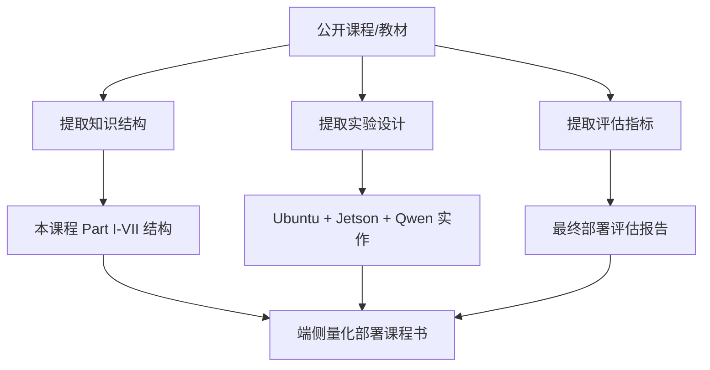
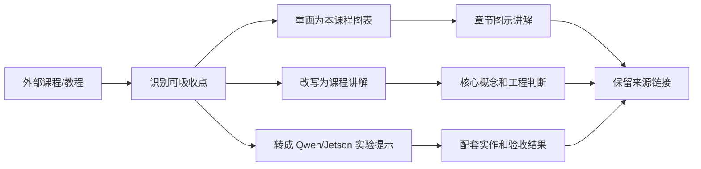

# 类似教材与教程参考

## 建议学时

2 学时。

本页用于教师备课和学生扩展阅读。它不是普通链接列表，而是帮助课程回答三个问题：

1. 已有公开课程和教程各自强在哪里。
2. 哪些内容值得吸收到本课程。
3. 哪些内容不适合直接照搬。

## 学习目标

- 收集可参考的公开课程、在线教材和体系化教程。
- 明确每份资料适合借鉴什么，而不是简单照搬目录。
- 为后续扩写课程书提供更大的内容池。
- 能把外部资料转化为本课程自己的章节、实验和项目要求。
- 能判断当前 40+ 学时课程体量是否足够支撑学习目标。

## 选材原则

本页优先收录英文公开资料，因为端侧推理、量化、LLM serving 和 ML systems 的一手资料大多来自英文课程、论文和官方教程。中文资料可作为实作补充，但不作为唯一依据。

筛选时看五个标准：

| 标准 | 说明 |
| --- | --- |
| 体系化 | 课程、book、notebook series 或官方 tutorial 优先 |
| 主题相关 | 量化、模型压缩、边缘部署、推理系统、LLM serving 优先 |
| 可实作 | 有代码、notebook、实验或部署流程更有价值 |
| 可迁移 | 能转化为 Ubuntu、Jetson、Qwen 或课程项目 |
| 不过度偏厂商 | 官方资料可用，但不能把单一路线写成唯一答案 |

## 与本课程的关系

本课程不是把已有课程拼接起来。它的定位更窄，也更工程化：

外部课程通常覆盖范围更宽，本课程要做的是把它们收束到“端侧模型量化、压缩、推理加速和部署评估”这一条主线。

## 主参考资料表

本课程采用组合参考体系，而不是照搬单一课程。每类资料只吸收它最强的部分，再落到 Qwen、GGUF、llama.cpp、Ubuntu/Jetson、profiling 和最终报告这条主线。

| 类别 | 资料 | 适合借鉴 | 课程化处理 |
| --- | --- | --- | --- |
| 课程骨架 | [MIT 6.5940 TinyML and Efficient Deep Learning Computing](https://hanlab.mit.edu/courses/2024-fall-65940) | 高效深度学习、剪枝、量化、LLM 部署和实验结构 | 做理论骨架，本课程改成更偏端侧工程和真实设备评估 |
| 链路结构 | [Coursera Deploying Deep Learning: Quantization, Serving, and Edge AI](https://www.coursera.org/learn/deploying-deep-learning-quantization-serving-and-edge-ai) | 压缩/量化、serving、edge、benchmark、API 和 final project 的链路 | 借鉴“量化后还要 serving、benchmark、API 化”的项目结构，不照搬云端或容器部分 |
| Serving/量化 | [DeepLearning.AI Fast & Efficient LLM Inference with vLLM](https://www.deeplearning.ai/courses/fast-and-efficient-llm-inference-with-vllm/) | PagedAttention、KV Cache、TTFT、throughput、Qwen benchmark 和评估 | 补强 Runtime 与推理加速章节，作为 vLLM 扩展路线 |
| Serving/量化 | [DeepLearning.AI Efficiently Serving LLMs](https://www.deeplearning.ai/courses/efficiently-serving-llms/) | KV caching、continuous batching、量化、LoRA adapter serving | 用于解释服务化吞吐、延迟和 adapter 部署边界 |
| Serving/量化 | [DeepLearning.AI Quantization Fundamentals](https://www.deeplearning.ai/courses/quantization-fundamentals/) / [Quantization in Depth](https://www.deeplearning.ai/courses/quantization-in-depth/) | 线性量化、symmetric/asymmetric、per-tensor/per-channel/per-group、weight packing | 补到量化数学基础、PTQ/QAT 和 INT8/INT4 对比 |
| 端侧实作 | [NVIDIA TensorRT Edge-LLM](https://github.com/NVIDIA/TensorRT-Edge-LLM) / [Jetson AI Lab](https://www.jetson-ai-lab.com/) | Jetson/edge LLM/VLM、ONNX、TensorRT engine、功耗和边缘约束 | 用于 Ubuntu/Jetson/Qwen 部署模块和边缘设备取舍 |
| 端侧实作 | [MLC LLM](https://llm.mlc.ai/) | 跨平台本地 LLM、编译、REST/Python/JavaScript/iOS/Android 路线 | 放入移动端路线和跨平台 runtime 横向比较 |
| 端侧实作 | [Qwen llama.cpp 本地运行](https://qwen.readthedocs.io/en/latest/run_locally/llama.cpp.html) | Qwen、GGUF、llama.cpp、量化和本地部署 | 作为课程实作主线：原模型到 Q8/Q5/Q4，再到服务化和 profiling |
| 端侧实作 | [Google LiteRT](https://developers.google.com/edge/litert) | on-device ML/GenAI、Android/iOS、低延迟和隐私 | 作为移动端和传统端侧 AI 路线补充 |
| 中文补充 | [LLM 后训练实践：模型压缩、部署优化与能力扩展](https://posttrain.gaozhijun.me/docs/lecture-5/) | PTQ/QAT、GPTQ/AWQ、蒸馏、VLM、function calling、部署评估 | 补模型压缩、VLM/Agent 和中文教学表达 |
| 中文补充 | [大模型微调与部署指南](https://wuduoyi.com/llm-finetune/deploy.html) | VRAM、KV Cache、vLLM/SGLang/TensorRT-LLM/LMDeploy/TGI、LoRA、chat template | 补微调与数据适配、部署服务化和工程参数解释 |
| 额外重点 | [microsoft/edgeai-for-beginners](https://github.com/microsoft/edgeai-for-beginners) | SLM、Edge AI 入门、多平台样例、Foundry Local、agent/function calling | 借鉴广义 EdgeAI 叙事和应用样例，不替换课程主线 |
| 额外重点 | [arm-education/Advanced-AI-Hardware-Software-Co-Design](https://github.com/arm-education/Advanced-AI-Hardware-Software-Co-Design) | 极端量化、QAT、逐层 bit-width 搜索、Android llama.cpp benchmark | 作为高级选做或教师演示，不作为第一轮必做实验 |

## 资料吸收工作表

外部资料进入本课程时，先过这张表。它把“可以参考的配图、知识点、实验细节”转成课程自己的图、表和任务，不复制原图和原文。

| 课程部分 | 可吸收资料 | 重画/改写成什么 | 落地位置 |
| --- | --- | --- | --- |
| 前置知识 | Hugging Face LLM Course、Transformers、ML Systems Book | LLM 输入链路、prefill/decode、KV Cache、系统指标 | tokenizer、推理基础、量化数学 |
| 部署框架 | MIT/EfficientML、ML Systems Book、Jetson docs | 端侧约束闭环、端云协同、风险清单 | 部署问题框架、Jetson 部署 |
| 量化压缩 | DeepLearning.AI Quantization、PyTorch、ONNX、TFLite、OpenVINO、GPTQ/AWQ/SmoothQuant | PTQ/QAT 流程、误差来源、outlier、量化粒度 | PTQ/QAT、LLM 量化、质量修复、压缩蒸馏 |
| 微调适配 | Hugging Face、TRL/PEFT、Qwen/LLaMA-Factory、中文后训练资料 | chat template、一致性检查、adapter 到部署回归 | LoRA/QLoRA、Qwen 微调实验 |
| Runtime/Serving | llama.cpp、Qwen、vLLM、TensorRT-LLM、MLC LLM | runtime 选型图、KV 管理、server/API、benchmark 指标 | Runtime、推理加速、Profiling、本地服务 |
| Ubuntu/Jetson/移动端 | Ubuntu/CUDA、Jetson AI Lab、LiteRT、ExecuTorch、Core ML | 环境栈、功耗温度记录、移动端路线图 | Ubuntu、Jetson、Qwen baseline、量化实验 |
| VLM/Agent/复盘 | HF VLM、OpenAI tools/agents、MLPerf、Nsight | 组件拆解、权限边界、失败恢复、评估报告 | VLM/Agent、案例复盘、最终项目 |

每个核心章节的“参考资料”前应有一段“本章吸收方式”，说明三件事：

- **知识点**：本章从哪些外部资料吸收概念和边界。
- **图解**：本章把外部图示思路重画成哪类课程图、表或流程。
- **实验**：本章把资料中的方法转成哪个 Qwen、GGUF、llama.cpp、Jetson 或 profiling 任务。

## 主参考课程与教材

| 资料 | 类型 | 适合借鉴 | 不直接照搬 |
| --- | --- | --- | --- |
| [MIT 6.5940 TinyML and Efficient Deep Learning Computing](https://hanlab.mit.edu/courses/2024-fall-65940) | 课程 | 高效深度学习、剪枝、量化、TinyML、硬件感知优化的课程结构 | 电路级和硬件设计细节不作为主线 |
| [EfficientML.ai](https://efficientml.ai/) | 课程/资料站 | 模型压缩、神经网络部署、TinyML 与系统优化的整体框架 | 不把 TinyML 作为唯一端侧形态 |
| [The Machine Learning Systems Book](https://www.mlsysbook.ai/) | 在线教材 | ML 系统、部署、可靠性、性能评估和生产化视角 | 泛 MLOps、组织流程和平台治理不展开 |
| [Hugging Face LLM Course](https://huggingface.co/learn/llm-course/chapter1/1) | 在线课程 | Transformer、tokenizer、生成模型和生态基础 | 不展开完整 LLM 训练长线 |
| [Hugging Face Transformers Chat templates](https://huggingface.co/docs/transformers/chat_templating) | 官方教程 | `messages`、role、chat template、生成提示 | 不复制每个模型家族的模板差异 |
| [Hugging Face TRL SFTTrainer](https://huggingface.co/docs/trl/sft_trainer) | 官方教程 | SFT 数据、训练入口、PEFT adapter、assistant-only loss 概念 | 不把课程变成 TRL API 手册 |
| [Full Stack Deep Learning](https://fullstackdeeplearning.com/) | 课程 | 从模型到产品和工程系统的完整视角 | 本课程不变成通用 AI 产品课 |

## 对 MIT 6.5940 / EfficientML 的吸收

这类课程最值得借鉴的是“算法、模型结构、硬件约束、系统效率放在一起讲”的组织方式。

可吸收内容：

- 用硬件约束反推模型设计和优化策略。
- 把剪枝、量化、蒸馏、NAS、TinyML 放在同一个高效 AI 框架里理解。
- 通过实验让学生理解压缩不是只看模型文件大小。
- 强调 memory、compute、latency 和 energy 的综合权衡。

本课程的取舍：

| 吸收 | 调整 |
| --- | --- |
| 高效 AI 的整体视角 | 收束到端侧部署和 Qwen/Jetson 实作 |
| 硬件感知优化 | 用 Ubuntu Server 和 Jetson 观察硬件差异 |
| 量化/剪枝/蒸馏方法 | 不展开所有数学推导和硬件电路 |
| TinyML 思路 | 扩展到 LLM、VLM、Agent 和端云协同 |

## 对 ML Systems Book 的吸收

ML Systems Book 的价值在于把模型部署看成系统工程，而不是单一算法问题。

可吸收内容：

- 指标定义要服务于真实系统。
- 部署环境、数据分布、可靠性和监控会影响模型价值。
- 性能评估需要说明硬件、输入、负载和约束。
- 系统上线需要考虑失败恢复、维护和演进。

本课程的取舍：

| 吸收 | 调整 |
| --- | --- |
| 系统指标和可靠性视角 | 落到端侧 latency、tokens/s、内存、功耗和温度 |
| 部署生命周期 | 简化为课程项目报告和复盘流程 |
| 生产化视角 | 不展开完整 MLOps 平台建设 |
| Benchmark 严谨性 | 转化为课堂可执行的实验记录模板 |

## 对 Hugging Face LLM Course 的吸收

Hugging Face LLM Course 适合补足学习者的 LLM 生态基础。

可吸收内容：

- Transformer 和 tokenizer 的入门解释。
- 模型加载、pipeline、generation 的基本概念。
- chat template 和 instruct 模型的输入格式。
- Hugging Face 生态中的模型、数据集和工具概念。

本课程的取舍：

| 吸收 | 调整 |
| --- | --- |
| tokenizer、生成和模型生态基础 | 作为前置知识，不占用过多主课时 |
| Transformers 工具链 | 用于理解模型格式，不作为唯一 runtime |
| LLM 入门顺序 | 服务于本地部署实验 |
| 训练/微调内容 | 40 学时保留 LoRA smoke test，60 学时展开数据、日志、评估和部署回归 |

Hugging Face 资料的一个关键粒度经验是：chat 模型不是直接拼接字符串，而是通过 `messages`、role 和 chat template 变成模型实际看到的 token 序列。本课程因此要求微调数据、训练脚本和部署 prompt 使用同一套 chat template 检查。

## 量化与压缩教程

| 资料 | 类型 | 适合借鉴 | 课程化处理 |
| --- | --- | --- | --- |
| [PyTorch Quantization](https://pytorch.org/docs/stable/quantization.html) | 官方教程 | PTQ/QAT、量化 API 和 PyTorch 术语体系 | 提炼概念和流程，不逐 API 讲 |
| [torchao](https://docs.pytorch.org/ao/stable/) | 官方文档 | PyTorch 新低比特/量化生态 | 作为现代 PyTorch 路线补充 |
| [ONNX Runtime Quantization](https://onnxruntime.ai/docs/performance/model-optimizations/quantization.html) | 官方教程 | 静态/动态量化、校准、ONNX 部署链路 | 用于传统模型流程图 |
| [TensorFlow Lite Model Optimization](https://www.tensorflow.org/model_optimization) | 官方教程 | 移动端模型优化、TFLite PTQ/QAT | 用于移动端对比 |
| [OpenVINO NNCF](https://docs.openvino.ai/2024/openvino-workflow/model-optimization-guide/quantizing-models-post-training.html) | 官方教程 | PTQ、NNCF、Intel/OpenVINO 部署路径 | 用于多 runtime 对比 |
| [Intel Neural Compressor](https://github.com/intel/neural-compressor) | 工具/教程 | 跨框架量化和压缩实践 | 作为工具生态补充 |

这些资料容易让课程变成 API 手册。本课程只保留概念、流程、失败模式和实验设计。

## LLM 部署与服务化教程

| 资料 | 类型 | 适合借鉴 | 课程化处理 |
| --- | --- | --- | --- |
| [llama.cpp](https://github.com/ggml-org/llama.cpp) | 项目文档 | GGUF、本地 LLM、量化模型、server 和 benchmark | 作为课程主实验框架 |
| [Qwen llama.cpp 本地运行](https://qwen.readthedocs.io/en/v2.5/run_locally/llama.cpp.html) | 官方教程 | Qwen 小模型本地部署实作 | 作为 Ubuntu/Qwen baseline |
| [Qwen llama.cpp 量化](https://qwen.readthedocs.io/en/v2.5/quantization/llama.cpp.html) | 官方教程 | Qwen GGUF 量化实作路线 | 作为 Q8/Q5/Q4 对比参考 |
| [Qwen LLaMA-Factory fine-tuning guide](https://qwen.readthedocs.io/en/v3.0/training/llama_factory.html) | 官方教程 | Qwen 微调的模型、数据、配置和训练流程 | 本课程只取教学 smoke test 和部署回归思路 |
| [vLLM Documentation](https://docs.vllm.ai/) | 官方文档 | LLM serving、PagedAttention、KV Cache 管理 | 作为服务化扩展，不作为主实验 |
| [TensorRT-LLM](https://nvidia.github.io/TensorRT-LLM/) | 官方文档 | NVIDIA GPU 上的 LLM 推理优化 | 讲推理加速路径，不要求全员实作 |
| [MLC LLM](https://llm.mlc.ai/docs/) | 官方教程 | 跨平台 LLM 编译、部署和移动端方向 | 用于跨平台视野扩展 |

LLM 服务化资料要帮助学习者理解本地 API、首 token、tokens/s、KV Cache 和服务稳定性，而不是追求大型集群部署。

## 边缘/端侧部署教程

| 资料 | 类型 | 适合借鉴 | 课程化处理 |
| --- | --- | --- | --- |
| [ExecuTorch](https://pytorch.org/executorch/stable/) | 官方文档 | PyTorch 端侧部署路线 | 作为移动端/嵌入式路线参考 |
| [TensorFlow Lite](https://www.tensorflow.org/lite) | 官方教程 | 移动端和嵌入式部署 | 用于传统端侧部署对比 |
| [Core ML Tools optimization](https://apple.github.io/coremltools/docs-guides/source/opt-overview.html) | 官方文档 | Apple 设备模型优化 | 作为 Apple 端侧路线补充 |
| [ONNX Runtime Mobile](https://onnxruntime.ai/docs/tutorials/mobile/) | 官方教程 | 移动端 ONNX Runtime 部署 | 用于跨平台 runtime 对比 |
| [NVIDIA TensorRT](https://docs.nvidia.com/deeplearning/tensorrt/latest/) | 官方文档 | NVIDIA GPU 推理优化 | 用于 Ubuntu/Jetson 加速路线 |
| [NVIDIA Jetson documentation](https://docs.nvidia.com/jetson/) | 官方文档 | Jetson 硬件和软件栈 | 用于 Jetson 部署章节 |
| [Jetson AI Lab](https://www.jetson-ai-lab.com/) | 教程/示例 | Jetson AI 应用实践 | 用于边缘 AI 案例参考 |

本课程会强调 Jetson，但不把课程限制为 Jetson。Jetson 是观察边缘约束的一条主路径。

## Profiling 与 Benchmark 参考

| 资料 | 类型 | 适合借鉴 | 课程化处理 |
| --- | --- | --- | --- |
| [MLPerf Inference](https://mlcommons.org/benchmarks/inference/) | Benchmark | 标准化推理评估的指标和报告方式 | 借鉴严谨性，不做竞赛级流程 |
| [NVIDIA Nsight Systems](https://developer.nvidia.com/nsight-systems) | 工具文档 | GPU/CPU 系统级 profiling | 作为高级 profiling 扩展 |
| [llama.cpp llama-bench](https://github.com/ggml-org/llama.cpp/tree/master/tools/llama-bench) | 工具文档 | LLM 本地 benchmark 记录 | 作为课程可执行实验 |
| [ONNX Runtime performance](https://onnxruntime.ai/docs/performance/) | 官方文档 | runtime 性能优化和 profiling 思路 | 用于传统模型 runtime 优化 |

Benchmark 资料的主要价值是“如何报告”，不是“复制别人的数字”。

## VLM/Agent 参考

| 资料 | 类型 | 适合借鉴 | 课程化处理 |
| --- | --- | --- | --- |
| [Hugging Face image-text-to-text task](https://huggingface.co/tasks/image-text-to-text) | 任务页 | VLM 输入输出和模型形态 | 用于 VLM 组件拆解 |
| [Transformers documentation](https://huggingface.co/docs/transformers/index) | 官方文档 | 多模态模型、processor、generation | 用于 VLM 生态入门 |
| [OpenAI Function Calling guide](https://platform.openai.com/docs/guides/function-calling) | 官方文档 | 工具调用 schema 和边界 | 用于 Agent 权限和工具设计 |
| [OpenAI Agents SDK documentation](https://openai.github.io/openai-agents-python/) | 官方文档 | Agent、tool、handoff、guardrail 概念 | 作为系统架构参考 |

VLM/Agent 资料更新很快，所以课程只吸收稳定的系统概念：组件拆解、权限边界、端云协同和失败恢复。

## 本课程如何吸收这些资料

| 本课程章节 | 建议吸收来源 | 扩写方向 |
| --- | --- | --- |
| 前置知识 | Hugging Face LLM Course、ML Systems Book | 增加 tokenizer、生成、系统指标和部署可靠性基础 |
| 端侧部署框架 | ML Systems Book、EfficientML、Jetson docs | 增加决策矩阵、端云协同和硬件路径选择 |
| 量化基础 | PyTorch、ONNX Runtime、TFLite、OpenVINO NNCF | 扩写 PTQ/QAT 流程、校准数据、误差分析 |
| 大模型量化 | Qwen、llama.cpp、GPTQ/AWQ/SmoothQuant | 扩写 GGUF、KV Cache、低比特格式和质量风险 |
| 推理框架 | ExecuTorch、TFLite、ONNX Runtime、TensorRT、MLC LLM | 增加框架选型矩阵和设备适配路线 |
| 推理加速 | vLLM、TensorRT-LLM、llama.cpp、MLPerf | 增加 prefill/decode、KV 管理、benchmark 和服务化 |
| Jetson 实作 | Jetson docs、JetPack、Jetson AI Lab | 增加功耗、温度、共享内存和迁移风险 |
| Profiling | MLPerf、Nsight Systems、llama-bench | 增加指标定义、实验设计和报告模板 |
| VLM/Agent | HF VLM、OpenAI tools/agents、ML Systems Book | 增加权限边界、端云协同和失败恢复 |

## 40+ 学时体量判断

对照这些公开课程，本课程做成 40 学时是合理的，但必须控制边界。

| 模块 | 建议学时 | 体量判断 |
| --- | --- | --- |
| 前置知识 | 6-8 | 足够建立共同语言，不足以完整讲 LLM 训练 |
| 端侧部署框架 | 4-6 | 足够讲决策矩阵和端云协同 |
| 量化压缩 | 10-12 | 可覆盖 PTQ/QAT、LLM 量化、压缩蒸馏 |
| 推理加速 | 6-8 | 可覆盖 runtime、KV、GPU offload、服务化基础 |
| Ubuntu/Jetson 实作 | 8-10 | 足够完成 Qwen baseline、量化对比和 Jetson 迁移 |
| 案例复盘 | 4-6 | 足够完成项目报告和答辩 |

如果课程要做成 60 学时，可以增加：

- 更多论文精读。
- Jetson 现场实验时间。
- 模型微调数据检查、LoRA/QLoRA smoke test、adapter 输出对比和部署回归。
- VLM/Agent 小项目。
- TensorRT 或 ONNX Runtime 视觉模型实作。
- 学生项目中期评审。

如果压缩到 40 学时，应保留 Qwen/llama.cpp/Jetson/profiling 主线和微调 smoke test，减少论文证明、多 runtime API 展开和长训练。

## 使用边界

- 不直接复制任何课程内容或图表，只吸收结构、概念组织和实验设计思路。
- 论文和官方文档用于定义概念，课程本身仍围绕 Ubuntu/Qwen/Jetson 实作展开。
- 如果后续需要完整教材式正文，每章应从本页选 3 到 6 个核心来源深入消化，再写成本课程自己的讲义。
- 不把任何外部 benchmark 数字写成本课程实验结论。
- 不把某个厂商的部署路径当成端侧部署唯一答案。
